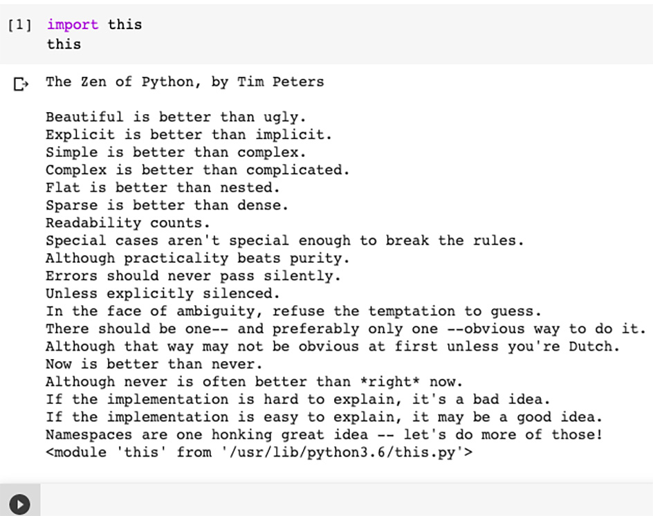
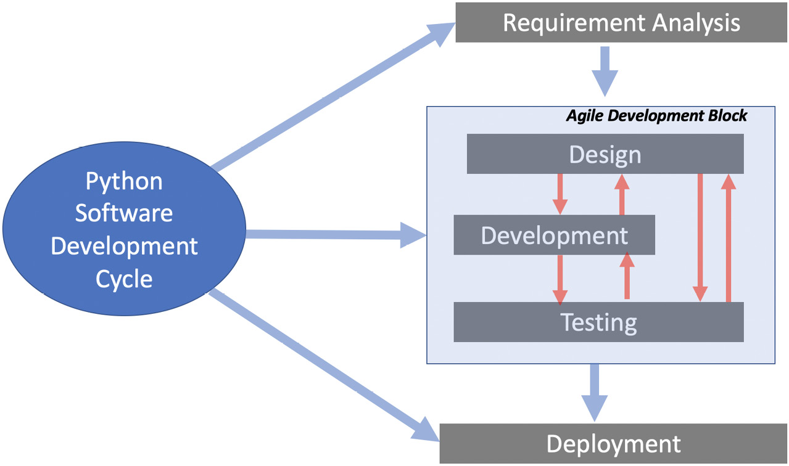
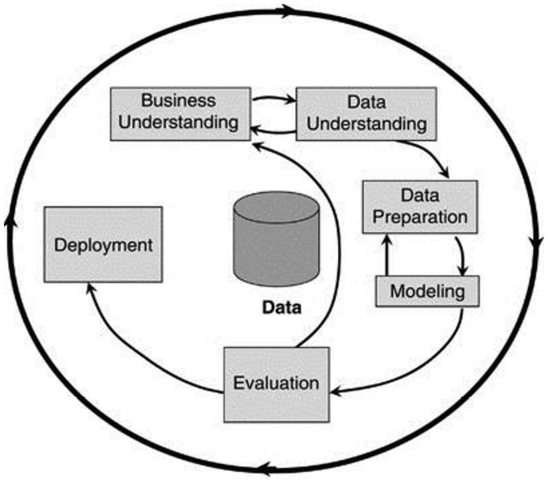
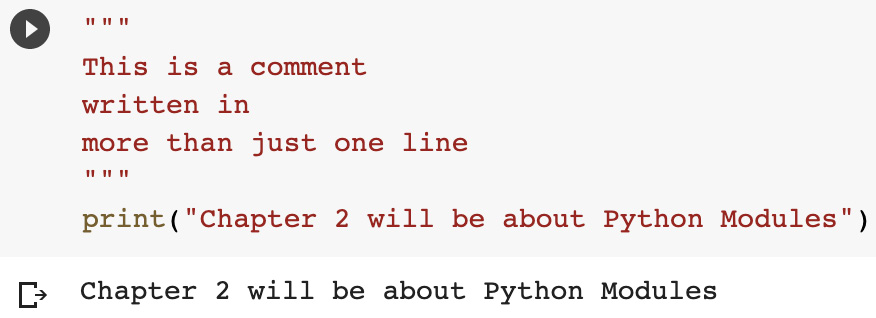
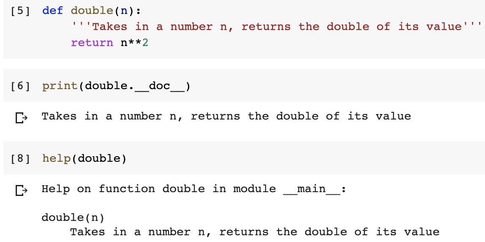
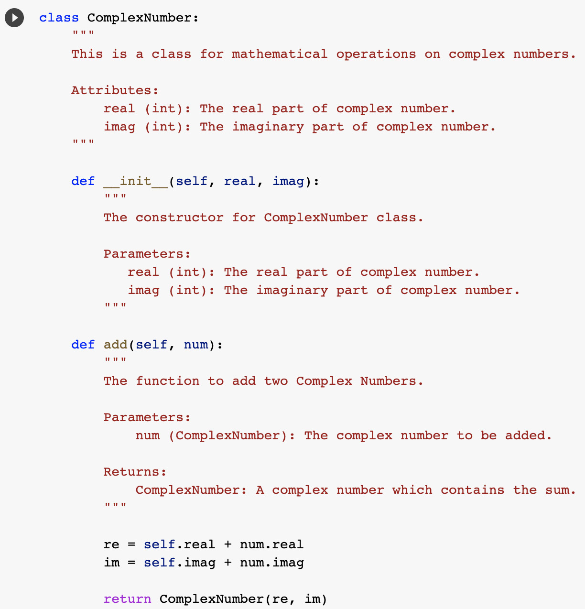

记住您之前使用 Python 的经验，我们在本章中跳过了 Python 语言的介绍性细节。首先，我们将对更广泛的开源 Python 社区及其特定文化进行简短讨论。这种介绍很重要，因为这种文化反映在 Python 社区编写和共享的代码中。然后，我们将介绍典型 Python 项目的不同阶段。接下来，我们将研究制定典型 Python 项目开发战略的不同方法。
接下来，我们将探索记录 Python 代码的不同方式。稍后，我们将研究开发有效命名方案的各种选项，这可以极大地帮助改进代码的维护。我们还将研究为 Python 项目使用源代码控制的各种选项，包括开发人员主要使用 Jupyter notebook 进行开发的情况。最后，我们探索部署代码以供使用的最佳实践，一旦它被开发和测试。
我们将在本章中讨论以下主题：

- Python 文化和社区
- Python 项目的不同阶段
- 制定开发过程的策略
- 有效地记录 Python 代码
- 制定有效的命名方案
- 探索源代码控制的选择
- 了解部署代码的策略
- Python开发环境

本章将帮助您了解典型 Python 项目的生命周期及其阶段，以便您可以充分利用 Python 的强大功能。

## Python 文化和社区

Python 是一种解释型高级语言，最初由 Guido van Rossum 于 1991 年开发。 Python 社区的特殊之处在于它密切关注代码的编写方式。为此，从 Python 的早期开始，Python 社区就在其设计理念中创造并保持了一种特殊的风格。今天，Python 被广泛用于从教育到医学的各个行业。但无论使用它的行业如何，充满活力的 Python 社区的特殊文化通常被视为 Python 项目的重要组成部分。
特别是，Python 社区希望我们编写简单的代码并尽可能避免复杂性。事实上，有一个形容词，Pythonic，这意味着有多种方法可以完成某个任务，但根据 Python 社区约定和语言的创始哲学，有一种首选方法。 Python 书呆子尽最大努力创建尽可能 Pythonic 的工件。显然，unpythonic 的代码意味着在这些书呆子眼中我们不是优秀的程序员。在本书中，我们将在我们的代码和设计中尽可能地使用 Pythonic。
还有一些官方的关于 Pythonic 的东西。 Tim Peters 在一个简短的文档 The Zen of Python 中简洁地描述了 Python 的哲学。我们知道 Python 据说是最容易阅读的语言之一，Python 之禅希望保持这种状态。它希望 Python 通过良好的文档变得明确，并且尽可能干净和清晰。我们可以自己阅读 Python 之禅，如下所述。
为了阅读 Python 之禅，打开 Python 控制台并运行 import this 命令，如下图所示：



Python 之禅似乎是在埃及古墓中发现的神秘文字。虽然是故意用这种随意神秘的方式写的，但每一行文字都有更深的含义。实际上，仔细观察 - 它可以用作 Python 编码的指南。我们将在整本书中引用《Python 之禅》中的不同行。我们先来看看其中的一些摘录，如下：

- 美丽胜于丑陋：编写良好的、可读的和不言自明的代码很重要。它不仅应该有效——还应该写得漂亮。在编码时，我们应该避免使用快捷方式，而应采用不言自明的风格。
- 简单胜于复杂：我们不应该把事情不必要地复杂化。每当面临选择时，我们应该选择更简单的解决方案。不鼓励使用书呆子、不必要和复杂的代码编写方式。即使它在源代码中添加了更多行，更简单的方法仍然比复杂的替代方案更好。
- 应该有一种——最好只有一种——明显的方法来做到这一点：从更广泛的意义上说，对于给定的问题，应该有一个可能的最佳解决方案。我们应该努力去发现这一点。当我们迭代设计以改进它时，无论我们采用何种方法，我们的解决方案都有望发展并趋向于更好的解决方案。
- 现在总比没有好：与其等待完美，让我们开始使用我们拥有的信息、假设、技能、工具和基础设施来解决给定的问题。通过迭代的过程，我们将不断改进解决方案。让我们保持动态而不是空转。在等待最佳时机时不要懈怠。机会是完美的时间永远不会到来。
- 显式优于隐式：代码应尽可能不言自明。这应该体现在变量名称的选择、类和功能设计上，以及整个端到端（E2E）架构中。最好还是谨慎一点。每当面临选择时，始终使其更加明确。
- 扁平优于嵌套：嵌套结构简洁但也会造成混乱。尽可能选择扁平结构。

## Python 项目的不同阶段
在讨论最佳开发生命周期之前，让我们首先确定 Python 项目的不同阶段。 每个阶段都可以被认为是一组性质相似的活动，如下图所示：



此处概述了典型 Python 项目的各个阶段：

- 需求分析：这个阶段是关于从所有关键利益相关者那里收集需求，然后分析它们以了解需要做什么，然后再考虑如何做。利益相关者可以是我们软件的实际用户或企业主。尽可能详细地收集需求非常重要。在可能的情况下，在开始设计和开发之前，应与最终用户和利益相关者充分阐述、理解和讨论需求。
    一个重要的点是确保需求分析阶段应该保持在设计、开发和测试阶段的迭代循环之外。在进入下一阶段之前，应全面进行需求分析并完成。需求应包括功能需求 (FR) 和非功能需求 (NFR)。 FR 应分组为模块。在每个模块中，应该对需求进行编号，以便尽可能将它们与代码模块映射。
- 设计：设计是我们对需求阶段提出的需求的技术响应。在设计阶段，我们弄清楚等式的部分。这是一个创造性的过程，我们利用我们的经验和技能以最有效和最佳的方式提出正确的模块集和结构以及它们之间的交互。
    请注意，提出正确的设计是 Python 项目的重要组成部分。设计阶段的任何失误都比后期阶段的失误要昂贵得多。从某种意义上说，与在编码阶段发生的类似程度的变化相比，在后续阶段（例如，编码阶段）更改设计和实施设计更改需要花费 20 倍的努力——例如，与实现功能时的错误相比，无法正确识别类或找出正确的数据并计算项目的维度将产生重大影响。此外，由于提出正确的设计是一个概念过程，因此错误可能并不明显，也无法通过测试发现。另一方面，编码中的错误将被深思熟虑的异常处理系统捕获。
    在设计阶段，我们执行以下活动：
    a) 我们设计代码的结构并识别代码中的模块。
    b) 我们决定基本方法并决定我们是否应该使用函数式编程、OOP 或混合方法。
    c) 我们还识别类和函数并选择这些更高级别组件的名称。
    我们还制作更高级别的文档。
- 编码：这是我们将使用 Python 实现设计的阶段。我们首先实现设计所识别的更高级别的抽象、组件和模块，然后是详细的编码。我们将在本节中尽量减少对编码阶段的讨论，因为我们将在整本书中对其进行广泛的讨论。
- 测试：测试是验证我们代码的过程。
- 部署：经过彻底测试后，我们需要将解决方案交给最终用户。最终用户不应看到我们设计、编码或测试的细节。部署是向最终用户提供可用于解决需求中详述的问题的解决方案的过程。例如，如果我们正在开发一个机器学习 (ML) 项目来预测渥太华的降雨量，那么部署就是要弄清楚如何为最终用户提供可用的解决方案。

了解了项目的不同阶段后，我们将继续了解如何制定整体流程的战略。

## 制定开发过程的策略
制定开发流程的战略就是规划每个阶段并研究从一个阶段到另一个阶段的流程。为了制定开发过程的战略，我们需要首先回答以下问题：

1. 我们是否正在寻找一种最小的设计方法并直接进入编码阶段，而设计很少？
2. 我们是否需要测试驱动开发 (TDD)，即我们首先使用需求创建测试，然后对它们进行编码？
3. 我们是否想先创建一个最小可行产品 (MVP) 并迭代地改进解决方案？
4. 验证安全性和性能等 NFR 的策略是什么？
5. 我们是在寻找单节点开发，还是要在集群上或云端进行开发和部署？
6. 我们的输入和输出 (I/O) 数据的数量、速度和种类是多少？它是基于 Hadoop 分布式文件系统 (HDFS) 或简单存储服务 (S3) 文件的结构，还是结构化查询语言 (SQL) 或 NoSQL 数据库？数据是在本地还是在云端？
7. 我们是否正在研究具有特定要求的特殊用例，例如 ML，以创建数据管道、测试模型以及部署和维护它们？

基于对这些问题的回答，我们可以为我们的开发过程制定步骤。最近，总是倾向于以一种或另一种形式使用迭代开发过程。 MVP 作为起始目标的概念也很流行。我们将在接下来的小节中讨论这些以及域的特定开发需求。

### 迭代阶段

现代软件开发理念基于设计、开发和测试的短迭代周期。用于代码开发的传统瀑布模型早已不复存在。选择这些阶段的正确粒度、重点和频率取决于项目的性质和我们选择的代码开发策略。如果我们想选择一个设计最少的代码开发策略，并想直接进行编码，那么设计阶段很薄。但是，即使是立即开始编写代码，也需要在最终实现的模块设计方面进行一些思考。
无论我们选择何种策略，设计、开发和测试阶段之间都存在固有的迭代关系。我们最初从设计阶段开始，在编码阶段实现它，然后通过测试来验证它。一旦我们标记了缺陷，我们需要通过重新审视设计阶段来回到绘图板。

### 首先瞄准MVP

有时，我们会选择最重要的需求中的一个小主题来首先实现 MVP，目的是对其进行迭代改进。在迭代过程中，我们进行设计、编码和测试，直到我们创建出可以部署和使用的最终产品。
现在，让我们谈谈我们将如何在 Python 中实现一些专门领域的解决方案。

### 为专业领域制定发展战略

Python 目前被用于各种各样的场景。 让我们看看以下五个重要用例，看看我们如何根据他们的特定需求为每个用例制定开发过程策略：

- 机器学习
- 云计算和集群计算
- 系统编程
- 网络编程
- 无服务器计算

我们将在以下各节中讨论它们中的每一个。

**机器学习**
多年来，Python 已成为用于实现 ML 算法的最常用语言。 ML 项目需要有一个结构良好的环境。 Python 拥有大量可用于机器学习的高质量库。
对于典型的 ML 项目，有一个跨行业数据挖掘标准流程 (CRISP-DM) 生命周期，用于指定 ML 项目的各个阶段。 CRISP-DM 生命周期如下所示：



对于 机器学习 项目，设计和实施数据管道估计几乎占开发工作的 70%。在设计数据处理管道时，我们应该记住，管道最好具有以下特征：

- 它们应该是可扩展的。
- 它们应该尽可能地可重复使用。
- 它们应该通过符合 Apache Beam 标准来处理流数据和批处理数据。
- 它们应该主要是 fit 和 transform 函数的串联，我们将在第 6 章 Python 中的高级技巧和窍门中讨论。

此外，ML 项目测试阶段的一个重要部分是模型评估。我们需要根据问题的要求、数据的性质和正在实施的算法类型，找出哪个性能指标是量化模型性能的最佳指标。我们是在关注准确率、准确率、召回率、F1 分数还是这些性能指标的组合？模型评估是测试过程的重要组成部分，需要在其他软件项目中进行的标准测试之外进行。

#### 云计算和集群计算

云计算和集群计算给底层基础设施增加了额外的复杂性。云服务提供商提供需要专门图书馆的服务。 Python 的架构从最低限度的核心包开始，并且能够导入任何其他包，使其非常适合云计算。 Python 环境提供的平台独立性对于云计算和集群计算至关重要。 Python 是 Amazon Web Services (AWS)、Windows Azure 和 Google Cloud Platform (GCP) 的首选语言。
云计算和集群计算项目具有独立的开发、测试和生产环境。保持开发和生产环境同步很重要。
在使用基础设施即服务 (IaaS) 时，Docker 容器可以提供很多帮助，建议使用它们。一旦我们使用了 Docker 容器，我们在哪里运行代码并不重要，因为代码将具有完全相同的环境和依赖项。

#### 系统编程

Python 具有操作系统服务的接口。其核心库具有可移植操作系统接口 (POSIX) 绑定，允许开发人员创建所谓的 shell 工具，这些工具可用于系统管理和各种实用程序。用 Python 编写的 Shell 工具可跨各种平台兼容。相同的工具可以在 Linux、Windows 和 macOS 中使用而无需任何更改，这使得它们非常强大且易于维护。
例如，在 Linux 中开发和测试的复制完整目录的 shell 工具可以在 Windows 中不变地运行。 Python 对系统编程的支持包括以下内容：

- 定义环境变量
- 支持文件、套接字、管道、进程和多线程
- 能够为模式匹配指定正则表达式（regex）
- 能够提供命令行参数
- 支持标准流接口、shell 命令启动器和文件名扩展
- 能够压缩文件实用程序
- 能够解析可扩展标记语言 (XML) 和 JavaScript 对象表示法 (JSON) 文件

使用 Python 进行系统开发时，部署阶段最少，可能就像将代码打包为可执行文件一样简单。值得一提的是，Python 不打算用于开发系统级驱动程序或操作系统库。

#### 网络编程

在信息技术 (IT) 系统快速走向自动化的数字化转型时代，网络被认为是全栈自动化的主要瓶颈。造成这种情况的原因是来自不同供应商的专有网络操作系统和缺乏开放性，但数字化转型的先决条件正在改变这一趋势，并且正在进行大量工作以使网络可编程和可消费即服务（网络-即服务或 NaaS）。真正的问题是：我们可以使用 Python 进行网络编程吗？答案是肯定的。事实上，它是用于网络自动化的最流行的语言之一。
Python 对网络编程的支持包括以下内容：

- 套接字编程，包括传输控制协议 (TCP) 和用户数据报协议 (UDP) 套接字
- 支持客户端和服务器通信
- 支持端口监听和处理数据
- 在远程安全外壳 (SSH) 系统上执行命令
- 使用安全复制协议 (SCP)/文件传输协议 (FTP) 上传和下载文件
- 支持简单网络管理协议 (SNMP) 库
- 支持 REpresentational State Transfer (RESTCONF) 和 Network Configuration (NETCONF) 协议，用于检索和更新配置

#### 无服务器计算

无服务器计算是一种基于云的应用程序执行模型，其中云服务提供商 (CSP) 提供计算机资源和应用程序服务器，以允许开发人员部署和执行应用程序，而无需自行管理计算资源和服务器。所有主要的公共云供应商（Microsoft Azure Serverless Functions、AWS Lambda 和 Google Cloud Platform 或 GCP）都支持 Python 的无服务器计算。
我们需要了解在无服务器环境中仍有服务器，但这些服务器由 CSP 管理。作为应用程序开发人员，我们不负责安装和维护服务器，也不直接负责服务器的可扩展性和性能。
有一些流行的无服务器库和框架可用于 Python。下面对这些进行描述：

- 无服务器：无服务器框架是用于无服务器功能或 AWS Lambda 服务的开源框架，使用 Node.js 编写。 Serverless 是第一个为在 AWS Lambda 上构建应用程序而开发的框架。
- Chalice：这是一个由 AWS 开发的 Python 无服务器微框架。对于想要使用 AWS Lambda Services 快速启动和部署 Python 应用程序的开发人员来说，这是默认选择，因为这使您能够使用 AWS 快速启动和部署可根据需要自行扩展和缩减的工作无服务器应用程序拉姆达。 Chalice 的另一个关键特性是它提供了一个实用程序，可以在将应用程序推送到云之前在本地模拟您的应用程序。
- Zappa：这更像是 Python 内置的部署工具，可以轻松部署 Web 服务器网关接口 (WSGI) 应用程序。

现在，让我们看看开发 Python 代码的有效方法。

## 有效地记录 Python 代码

找到一种有效的方式来记录代码总是很重要的。 挑战在于开发一种全面而简单的方法来开发 Python 代码。 让我们先看看 Python 注释，然后是文档字符串。

### Python 注释

与 docstring 相比，Python 注释对运行时编译器不可见。 它们用作解释代码的注释。 注释在 Python 中以 # 符号开头，如下面的屏幕截图所示：


### 文档字符串

记录代码的主要工具是称为文档字符串的多行注释块。 Python 语言的特性之一是 DocStrings 与对象相关联并可用于检查。 DocStrings 的指南在 Python Enhancement Proposal (PEP) 257 中进行了描述。根据这些指南，它们的目的是为读者提供一个概述。他们应该在简洁和详尽之间取得良好的平衡。 DocStrings 使用三重双引号字符串格式：(""")。
以下是创建文档字符串时的一些一般准则：
文档字符串应该紧跟在函数或类定义之后。
文档字符串应该给出一行摘要，然后是更详细的描述。
应该有策略地使用空格来组织评论，但不应过度使用它们。您可以使用空行来组织代码，但不要过度使用它们。
在下面的部分中，让我们来看看 docStrings 的更详细的概念。

#### 文档字符串样式

Python 文档字符串具有以下略有不同的样式：

- Google
- NumPy/SciPy
- Epytext
- Restructured

#### 文档字符串类型

在开发代码时，需要制作各种类型的文档，包括以下内容：

- 逐行评论
- 功能或类级文档
- 算法细节

让我们一一讨论它们。

#### 逐行评论

文档字符串的一个简单用法是使用它来创建多行注释，如下所示：



### 功能或类级文档

文档字符串的一个强大用途是用于功能或类级别的文档。 如果我们将文档字符串放在函数或类的定义之后，Python 会将文档字符串与函数或类相关联。 这被放置在该特定函数或类的 \_\_doc\_\_ 属性中。 我们可以通过使用 \_\_doc\_\_ 属性或使用 help 函数在运行时打印出来，如下例所示：



使用文档字符串记录类时，推荐的结构如下：

- 总结：通常是单行
- 第一个空行
- 关于文档字符串的任何进一步解释
- 第二个空行

在类级别使用文档字符串的示例如下所示：



#### 算法细节
Python 项目越来越多地使用描述性或预测性分析以及其他复杂的逻辑。 所使用的算法的细节需要清楚地说明所有所做的假设。 如果一个算法是作为一个函数来实现的，那么写算法逻辑摘要的最佳位置是在函数的签名之前。

## 制定有效的命名方案
如果在代码中开发和实现正确的逻辑是科学，那么让它变得漂亮和可读是一门艺术。 Python 开发人员以特别关注命名方案并将 Python 之禅融入其中而闻名。 Python 是为数不多的对 Guido van Rossum 编写的命名方案有全面指导的语言之一。它们写在 PEP 8 文档中，该文档有一个完整的命名约定部分，后面是许多代码库。 PEP 8 具有建议的命名和样式指南。您可以在 https://www.Python.org/dev/peps/pep-0008/ 阅读更多相关信息。
PEP 8 中建议的命名方案可以总结如下：

- 通常，所有模块名称都应为 all_lower_case。
- 所有的类名和异常名都应该是驼峰式的。
- 所有全局和局部变量都应该是 all_lower_case。
- 所有函数和方法名称都应该是 all_lower_case。
- 所有常量都应该是 ALL_UPPER_CASE。

此处给出了有关 PEP 8 代码结构的一些指南：

- 缩进在 Python 中很重要。不要使用 Tab 进行缩进。相反，使用四个空格。
    将嵌套限制为四层。
- 请记住将行数限制为 79 个字符。使用 \ 符号来断开长行。
- 为了使代码可读，插入两个空行来分隔函数。
- 在不同的逻辑部分之间插入一条黑线。
- 请记住，PEP 指南只是可能由不同团队定制的建议。任何自定义命名方案仍应使用 PEP 8 作为基本准则。

现在，让我们更详细地了解各种 Python 语言结构上下文中的命名方案。

### 方法

方法名称应使用小写。 名称应由一个或多个单词组成，并用下划线分隔。 你可以在这里看到一个例子：
calculate_sum
为了使代码可读，方法最好是动词，与方法应该执行的处理相关。
如果一个方法是非公开的，它应该有一个前导下划线。 这是一个例子：
_my_calculate_sum
Dunder 或魔术方法是具有前导和尾随下划线的方法。 Dunder 或魔术方法的示例如下所示：

- \_\_init\_\_
- \_\_add\_\_

使用两个前导和尾随下划线来命名方法绝不是一个好主意，并且不鼓励开发人员使用这些下划线。 这样的命名方案是为 Python 方法设计的。

### 变量

使用一个或多个由下划线分隔的小写单词来表示变量。变量应该是与其所代表的实体相对应的名词。
变量示例如下：

- X
- my_var

私有变量的名称应以下划线开头。一个例子是_my_secret_variable。

#### 布尔变量

以 is 或 has 开头的布尔变量使其更具可读性。你可以在这里看到几个这样的例子：

```python
class Patient:
    is_admitted = False
    has_heartbeat = False
```

#### 集合变量

由于集合是变量桶，最好以复数格式命名它们，如下所示：

```python
class Patient:
    admitted_patients = ['John','Peter']
```

#### 字典变量

建议字典的名称尽可能明确。例如，如果我们有一个人的字典映射到他们所居住的城市，那么可以按如下方式创建字典：

```python
persons_cities = {'Imran': 'Ottawa', 'Steven': 'Los Angeles'}
```

### 常量

Python 没有不可变的变量。例如，在C++中，我们可以指定一个const关键字来指定该变量是不可变的，并且是一个常量。 Python 依赖命名约定来指定常量。如果代码试图将常量视为常规变量，Python 不会给出错误。
对于常量，建议使用大写单词或下划线分隔的单词。这里给出了一个常量的例子：
CONVERSION_FACTOR

### 类

类应该遵循 CamelCase 风格——换句话说，它们应该以大写字母开头。如果我们需要使用多个单词，单词之间不应该用下划线分隔，但附加的每个单词都应该有一个首字母大写。类应该使用名词，并且应该以最能代表类对应的实体的方式命名。使代码可读的一种方法是使用带有与其类型或性质有关的后缀的类，例如：

- HadoopEngine
- ParquetType
- TextboxWidget

以下是一些需要牢记的要点：

- 有处理错误的异常类。他们的名字应该总是有错误作为尾随词。这是一个例子：
    FileNotFoundError
- Python 的一些内置类不遵循此命名指南。
- 为了使其更具可读性，对于基类或抽象类，可以使用 Base 或 Abstract 前缀。一个例子可能是这样的：AbstractCar
    BaseClass

### 包

命名包时不鼓励使用下划线。 名称应简短且全部小写。 如果需要使用多个单词，附加的一个或多个单词也应该是小写的。 这是一个例子：
mypackage

### 模块

命名模块时，应使用简短的名称和直截了当的名称。 它们需要是小写的，并且一个以上的单词会被下划线连接起来。 下面是一个例子：
main_module.py

### 导入约定

多年来，Python 社区已经为常用包的别名制定了一个约定。 你可以在这里看到一个例子：

```python
import numpy as np
import pandas as pd
import seaborn as sns
import statsmodels as sm
import matplotlib.pyplot as plt
```

### 参数

建议参数具有类似于变量的命名约定，因为函数的参数实际上是临时变量。

### 有用的工具

有几个工具可用于测试您的代码与 PEP 8 指南的一致性。让我们一一研究它们。
**Pylint**
可以通过运行以下命令来安装 Pylint：

```bash
$ pip install pylint
```

Pylint 是一个源代码分析器，它检查与 PEP 89 相关的代码命名约定。然后，它打印一份报告。可以自定义它以用于其他命名约定。
**PEP 8**
可以通过运行以下命令来安装 PEP 8：

```bash
$ pip install pep8
```

pep8 检查与 PEP 8 相关的代码。
到目前为止，我们已经了解了 Python 中的各种命名约定。接下来，我们将探索使用 Python 源代码控制的不同选择。

## 探索源代码控制的选择

首先，我们将看到源代码控制系统的简要历史以提供上下文。现代源代码控制系统非常强大。源代码控制系统的演变经历了以下阶段：

- 阶段 1：源代码最初由存储在硬盘驱动器上的本地源控制系统启动。这个本地代码集合称为本地存储库。
- 阶段 2：但是在本地使用源代码控制不适合较大的团队。该解决方案最终演变成一个基于服务器的中央存储库，由从事特定项目的团队成员共享。它解决了团队成员之间的代码共享问题，但也为多用户环境带来了锁定文件的额外挑战。
- 第 3 阶段：现代版本控制存储库（例如 Git）进一步改进了该模型。团队的所有成员现在都拥有存储的存储库的完整副本。团队成员现在可以离线处理代码。只有在需要共享代码时，他们才需要连接到存储库。

### 什么不属于源控制存储库？

让我们看看哪些内容不应签入源代码控制存储库。
首先，不应签入源代码文件以外的任何内容。不应将计算机生成的文件签入源代码管理。例如，假设我们有一个名为 main.py 的 Python 源文件。如果我们编译它，生成的代码不属于存储库。编译后的代码是派生文件，不应签入源代码管理。造成这种情况的原因有以下三个：
一旦我们拥有源代码，任何团队成员都可以生成派生文件。
在许多情况下，编译后的代码比源代码大得多，将其添加到存储库中会使其变得缓慢和呆滞。另外，请记住，如果团队中有 16 名成员，那么所有成员都会不必要地获得该生成文件的副本，这会不必要地降低整个系统的速度。
源代码控制系统旨在存储自上次提交以来对源文件所做的增量或更改。源代码文件以外的文件通常是二进制文件。源代码控制系统很可能无法为此提供 diff 工具，并且每次提交时都需要存储整个文件。它会对源代码控制框架的性能产生负面影响。
其次，任何机密内容都不属于源代码控制。这包括 API 密钥和密码。
对于源代码库，GitHub 是 Python 社区的首选。许多著名的 Python 包的源代码控制也驻留在 GitHub 上。如果要跨团队使用 Python 代码，则需要开发和维护正确的协议和程序。

## 了解部署代码的策略
对于开发团队不是最终用户的项目，提出一种为最终用户部署代码的策略很重要。 对于规模较大的项目，当有明确定义的 DEV 和 PROD 环境时，部署代码和制定策略就变得很重要。
Python 也是云和集群计算环境的首选语言。
与部署代码相关的问题列出如下：

- 在 DEV、TEST 和 PROD 环境中需要发生完全相同的转换。
- 随着代码在 DEV 环境中不断更新，如何将更改同步到 PROD 环境？
- 您计划在 DEV 和 PROD 环境中进行什么类型的测试？

让我们看看部署代码的两种主要策略。

### 批量开发

这是传统的开发过程。我们开发代码，编译它，然后测试它。这个过程反复重复，直到满足所有要求。然后，部署开发的代码。
采用持续集成和持续交付
Python上下文中的持续集成/持续交付（CI/CD）是指持续集成和部署，而不是将其作为批处理进行。它通过弥合开发和运营之间的差距来帮助创建开发运营 (DevOps) 环境。
CI 是指在更新时不断集成、构建和测试代码的各种模块。对于团队而言，这意味着由每个团队成员单独开发的代码被集成、构建和测试，通常一天多次。一旦它们经过测试，源代码管理中的存储库就会更新。
CI 的一个优点是问题或错误在一开始就被修复。在创建当天修复的典型错误需要更少的时间立即解决，而不是在几天、几周或几个月后解决它，因为它已经渗透到其他模块并且受影响的那些可能已经创建了多级依赖关系。
与 Java 或 C++ 不同，Python 是一种解释型语言，这意味着构建的代码可以在任何带有解释器的目标机器上执行。相比之下，编译后的代码通常是为一种类型的目标机器构建的，并且可能由团队的不同成员开发。一旦我们弄清楚每次进行更改时需要遵循哪些步骤，我们就可以将其自动化。
由于 Python 代码依赖于外部包，因此跟踪它们的名称和版本是自动化构建过程的一部分。一个好的做法是在名为 requirements.txt 的文件中列出所有这些包。该名称可以是任何名称，但 Python 社区通常倾向于将其称为 requirements.txt。
要安装软件包，我们将执行以下命令：

```bash
$pip install -r requirements.txt
```

要创建代表我们代码中使用的包的需求文件，我们可以使用以下命令：

```bash
$pip freeze > requirements.txt
```

集成的目标是及早发现错误和缺陷，但它有可能使开发过程不稳定。如果其他团队成员可能不得不等到该错误得到解决，有时团队成员会引入一个主要错误，从而破坏代码。团队成员进行稳健的自我测试并选择正确的集成频率将有助于解决问题。对于健壮的测试，应该在每次进行更改时运行测试。这个测试过程最终应该是完全自动化的。在出现错误的情况下，构建应该失败，并且应该通知负责有缺陷模块的团队成员。团队成员可以选择先提供快速修复，然后再花时间解决并全面测试问题，以确保其他团队成员不会被阻止。
一旦代码被构建和测试，我们也可以选择更新部署的代码。这将实现 CD 部分。如果我们选择拥有完整的 CI/CD 流程，则意味着每次进行更改时，都会对其进行构建和测试，并将更改反映在部署的代码中。如果管理得当，最终用户将受益于不断发展的解决方案。在某些用例中，每个 CI/CD 周期可能是从 MVP 到完整解决方案的迭代移动。在其他用例中，我们试图捕捉和制定一个快速变化的现实世界问题，丢弃过时的假设，并结合新信息。一个例子是对 COVID-19 情况的模式分析，它每小时都在变化。此外，新信息正在快速涌现，任何与之相关的用例都可以从 CI/CD 中受益，开发人员将根据新出现的事实和信息不断更新他们的解决方案。
接下来，我们将讨论 Python 的常用开发环境。

## Python开发环境
文本编辑器是编辑 Python 代码的诱人选择。但是对于任何中大型项目，我们都必须认真考虑 Python 集成开发环境 (IDE)，它对于使用版本控制编写、调试和排除代码故障以及简化部署非常有帮助。市场上有许多可用的 IDE，大部分是免费的。在本节中，我们将回顾其中的一些。请注意，我们不会尝试按任何顺序排列它们，而是会强调它们各自带来的价值，读者可以根据他们过去的经验、项目要求和项目的复杂性做出最佳选择。

### IDLE

集成开发和学习环境 (IDLE) 是 Python 附带的默认编辑器，可用于所有主要平台（Windows、macOS 和 Linux）。它是免费的，是适合初学者学习的不错的 IDE。不推荐用于高级编程。

### Sublime Text

Sublime Text 是另一种流行的代码编辑器，可用于多种语言。它仅用于评估目的是免费的。它也适用于所有主要平台（Windows、macOS 和 Linux）。它带有基本的 Python 支持，但凭借其强大的扩展框架，我们可以对其进行自定义以构建需要额外技能和时间的完整开发环境。可以通过插件与版本控制系统（例如 Git 或 Subversion (SVN)）集成，但可能不会公开完整的版本控制功能。
Atom 是另一个流行的编辑器，它也与 Sublime Text 属于同一类别。这是免费的。

### PyCharm

PyCharm 是可用于 Python 编程的最佳 Python IDE 编辑器之一，可用于 Windows、macOS 和 Linux。它是为 Python 编程量身定制的完整 IDE，可帮助程序员完成代码补全、调试、重构、智能搜索、访问流行的数据库服务器、与版本控制系统的集成以及更多功能。 IDE 为开发人员提供了一个插件平台，可以根据需要扩展基本功能。 PyCharm 有以下几种格式：
社区版，免费，用于纯 Python 开发
专业版，它不是免费的，并且支持 Web 开发，例如超文本标记语言 (HTML)、JavaScript 和 SQL

### Visual Studio Code

Visual Studio Code（VS Code）是微软开发的开源环境。对于 Windows，VS Code 是最好的 Python IDE。默认情况下，它不附带 Python 开发环境。 VS Code 的 Python 扩展可以使其成为 Python 开发环境。
它轻巧且功能强大。它是免费的，也可用于 macOS 和 Linux。它具有强大的功能，例如代码完成、调试、重构、搜索、访问数据库服务器、版本控制系统集成等等。

### PyDev

如果您正在使用或已经使用过 Eclipse，您可能会考虑 PyDev，它是 Eclipse 的第三方编辑器。它属于最好的 Python IDE 之一，也可用于 Jython 和 IronPython。这是免费的。由于 PyDev 只是 Eclipse 之上的一个插件，它适用于所有主要平台，例如 Eclipse。此 IDE 具有 Eclipse 的所有功能，最重要的是，它简化了与 Django、单元测试和 Google App Engine (GAE) 的集成。

### Spyder

如果您计划将 Python 用于数据科学和机器学习，您可能需要考虑将 Spyder 作为您的 IDE。 Spyder 是用 Python 编写的。此 IDE 提供用于完全编辑、调试、交互式执行、深度检查和高级可视化功能的工具。此外，它还支持与 Matplotlib、SciPy、NumPy、Pandas、Cython、IPython 和 SymPy 的集成，使其成为数据科学家的默认 IDE。

基于本节对不同 IDE 的回顾，我们可以向专业应用程序开发人员推荐 PyCharm 和 PyDev。但如果你更喜欢数据科学和机器学习，Spyder 肯定值得探索。

## 概括

在本章中，我们为本书后面章节中讨论的高级 Python 概念奠定了基础。我们首先介绍了 Python 项目的风格、指导和氛围。我们首先确定 Python 项目的不同阶段，然后根据我们正在处理的用例探索优化它的不同方法，从而开始了技术讨论。对于像 Python 这样的简洁语言，高质量的文档对于使代码具有可读性和明确性大有帮助。
我们还研究了记录 Python 代码的各种方法。接下来，我们研究了在 Python 中创建文档的推荐方法。我们还研究了可以帮助我们提高代码可读性的命名方案。接下来，我们研究了使用源代码控制的不同方式。我们还找出了部署 Python 代码的不同方式。最后，我们回顾了一些 Python 开发环境，以帮助您根据它们的背景和您将要从事的项目类型来选择开发环境。
我们在本章中涵盖的主题对于任何开始涉及 Python 的新项目的人都是有益的。这些讨论有助于迅速有效地制定新项目的战略和设计决策。在下一章中，我们将研究如何模块化 Python 项目的代码。

## 问题

什么是 Python 之禅？
在 Python 中，运行时可以使用哪些类型的文档？
什么是 CRISP-DM 生命周期？

## 进一步阅读

Modern Python Cookbook – 第二版，作者：Steven F. Lott
Python 编程蓝图，作者 Daniel Furtado
Python忍者的秘密食谱，科迪杰克逊

## 答案

由 Tim Peters 编写的适用于 Python 项目设计的 19 条准则的集合。
与常规注释相反，编译器可以在运行时使用文档字符串。
CRISP-DM 代表数据挖掘的跨行业标准流程。它适用于 ML 领域的 Python 项目生命周期，并标识项目的不同阶段。
