当您开始使用 Python 编程时，很容易将所有程序代码放在一个文件中。在主程序所在的同一文件中定义函数和类没有问题。此选项对初学者很有吸引力，因为它易于执行程序并避免在多个文件中管理代码。但是，单文件程序方法对于大中型项目是不可扩展的。跟踪您定义的所有各种函数和类变得具有挑战性。
为了克服这种情况，模块化编程是大中型项目的必经之路。模块化是降低项目复杂性的关键工具。模块化还有助于高效编程、轻松调试和管理、协作和可重用性。在本章中，我们将讨论如何在 Python 中构建和使用模块和包。
我们将在本章中讨论以下主题：

- 模块和包介绍
- 导入模块
- 加载和初始化模块
- 编写可重用模块
- 构建包
- 从任何位置访问包
- 共享一个包

本章将帮助您理解 Python 中模块和包的概念。

## 技术要求

以下是本章的技术要求：
您需要在计算机上安装 Python 3.7 或更高版本。
您需要在 Test PyPI 中注册一个帐户并在您的帐户下创建一个 API 令牌。
本章的示例代码可以在 https://github.com/PacktPublishing/Python-for-Geeks/tree/master/Chapter02 找到。

## 模块和包介绍

Python 中的模块是带有 .py 扩展名的 Python 文件。实际上，它们是一种使用一个或多个 Python 文件组织函数、类和变量的方法，以便它们易于管理、跨不同模块重用，并随着程序变得复杂而扩展。
Python 包是模块化编程的下一个级别。一个包就像一个文件夹，用于组织多个模块或子包，这是共享模块以实现可重用性的基础。
仅使用标准库的 Python 源文件易于共享，也易于使用电子邮件、GitHub 和共享驱动器分发，唯一需要注意的是应该具有 Python 版本兼容性。但是这种共享方法不适用于具有大量文件并且依赖第三方库并且可能是为特定版本的 Python 开发的项目。为了挽救这种情况，构建和共享包是 Python 程序高效共享和可重用性的必要条件。
接下来，我们将讨论如何导入模块以及 Python 支持的不同类型的导入技术。

## 导入模块
一个模块中的 Python 代码可以通过称为导入模块的过程访问另一个模块中的 Python 代码。
为了详细说明不同的模块和包概念，我们将构建两个模块和一个使用这两个模块的主脚本。 本章将更新或重用这两个模块。
要创建一个新模块，我们将创建一个带有模块名称的 .py 文件。 我们将创建一个带有两个函数的 mycalculator.py 文件：加法和减法。 add 函数计算作为参数提供给函数的两个数字的总和并返回计算值。 减法函数计算作为参数提供给函数的两个数字之间的差，并返回计算值。
mycalculator.py 的代码片段如下所示：

```python
# mycalculator.py with add and subtract functions
def add(x, y):
    """This function adds two numbers"""
    return x + y
def subtract(x, y):
    """This function subtracts two numbers"""
    return x - y
```

请注意，模块的名称是文件的名称。
我们将通过添加一个名为 myrandom.py 的新文件来创建第二个模块。 该模块有两个函数：random_1d 和 random_2d。 random_1d 函数用于生成 1 到 9 之间的随机数，random_2d 函数用于生成 10 到 99 之间的随机数。请注意，该模块还使用了 random 库，它是 Python 的内置模块。
myrandom.py 的代码片段如下所示：

```python
# myrandom.py with default and custom random functions
import random
def random_1d():
    """This function generates a random number between 0 and 9"""
    return random.randint (0,9)
def random_2d():
    """This function generates a random number between 10 and 99"""
    return random.randint (10,99)
```

为了使用这两个模块，我们还创建了主要的 Python 脚本（calcmain1.py），它导入了这两个模块并使用它们来实现这两个计算器功能。 import 语句是导入内置或自定义模块的最常用方法。
calcmain1.py 的代码片段如下所示：

```python
# calcmain1.py with a main function
import mycalculator
import myrandom
def my_main( ):
    """ This is a main function which generates two random numbers and then apply calculator functions on them """
    x = myrandom.random_2d( )
    y = myrandom.random_1d( )
    sum = mycalculator.add(x, y)
    diff = mycalculator.subtract(x, y)
    print("x = {}, y = {}".format(x, y))
    print("sum is {}".format(sum))
    print("diff is {}".format(diff))
""" This is executed only if the special variable '__name__' is set as main"""
if __name__ == "__main__":
    my_main()
```

在这个主脚本（另一个模块）中，我们使用 import 语句导入两个模块。我们定义了 main 函数（my_main），只有当这个脚本或 calcmain1 模块作为主程序执行时才会执行。从主程序执行主函数的细节将在后面的设置特殊变量部分中介绍。在 my_main 函数中，我们使用 myrandom 模块生成两个随机数，然后使用 mycalculator 模块计算两个随机数的和和差。最后，我们使用打印语句将结果发送到控制台。

> 重要的提示
> 一个模块只加载一次。如果一个模块是由另一个模块或主 Python 脚本导入的，则该模块将通过执行模块中的代码进行初始化。如果程序中的另一个模块再次导入同一个模块，它不会被加载两次，而只会加载一次。这意味着如果模块内有任何局部变量，它们将充当单例（仅初始化一次）。

还有其他选项可用于导入模块，例如 importlib.import_module() 和内置的 \_\_import\_\_() 函数。让我们讨论导入和其他替代选项的工作原理。

### 使用导入语句

如前所述，import 语句是导入模块的常用方法。 下一个代码片段是使用导入语句的示例：

```python
import math
```

import 语句负责两个操作：首先，它搜索 import 关键字后给出的模块，然后将搜索结果绑定到本地范围内的变量名（与模块名相同） 执行。 在接下来的两个小节中，我们将讨论导入的工作原理以及如何从模块或包中导入特定元素。

#### 了解导入的工作原理

接下来，我们需要了解 import 语句是如何工作的。 首先，我们需要提醒自己，所有全局变量和函数都是在执行开始时由 Python 解释器添加到全局命名空间中的。 为了说明这个概念，我们可以编写一个小的 Python 程序来吐出 globals 命名空间的内容，如下所示：

```python
# globalmain.py with globals() function
def print_globals():
    print (globals())
def hello():
    print ("Hello")
if __name__ == "__main__":
    print_globals()
```

这个程序有两个函数：print_globals 和 hello。 print_globals 函数将打印全局命名空间的内容。 hello 函数将不会被执行，并在此处添加以在全局命名空间的控制台输出中显示其引用。 执行此 Python 代码后的控制台输出将类似于以下内容：

```python
{
   "__name__":"__main__",
   "__doc__":"None",
   "__package__":"None",
   "__loader__":"<_frozen_importlib_external.\
    SourceFileLoader object at 0x101670208>",
   "__spec__":"None",
   "__annotations__":{
   },
   "__builtins__":"<module 'builtins' (built-in)>",
   "__file__":"/ PythonForGeeks/source_code/chapter2/\
     modules/globalmain.py",
   "__cached__":"None",
   "print_globals":"<function print_globals at \
     0x1016c4378>",
   "hello":"<function hello at 0x1016c4400>"
}
```

这个控制台输出中需要注意的关键点如下：

- \_\_name\_\_ 变量设置为 \_\_main\_\_ 值。 这将在加载和初始化模块部分更详细地讨论。
- \_\_file\_\_ 变量在这里设置为主模块的文件路径。
- 最后添加了对每个函数的引用。

如果我们将 print(globals()) 添加到我们的 calcmain1.py 脚本中，添加此语句后的控制台输出将类似于以下内容：

```python
{
   "__name__":"__main__",
   "__doc__":"None",
   "__package__":"None",
   "__loader__":"<_frozen_importlib_external.\
    SourceFileLoader object at 0x100de1208>",
   "__spec__":"None",
   "__annotations__":{},
   "__builtins__":"<module 'builtins' (built-in)>",
   "__file__":"/PythonForGeeks/source_code/chapter2/module1/     main.py",
   "__cached__":"None",
   "mycalculator":"<module 'mycalculator' from \
    '/PythonForGeeks/source_code/chapter2/modules/\
    mycalculator.py'>",
   "myrandom":"<module 'myrandom' from '/PythonForGeeks/source_     code/chapter2/modules/myrandom.py'>",
   "my_main":"<function my_main at 0x100e351e0>"
}
```

需要注意的重要一点是，在与用于导入这些模块的每个导入语句相对应的全局命名空间中添加了两个额外的变量（mycalculator 和 myrandom）。每次我们导入一个库时，都会创建一个同名的变量，它保存对模块的引用，就像全局函数（在本例中为 my_main）的变量一样。
我们将看到，在导入模块的其他方法中，我们可以为每个模块显式定义其中的一些变量。 import 语句会自动为我们执行此操作。

#### 指定导入

我们还可以从一个模块中导入一些特定的东西（变量或函数或类），而不是导入整个模块。这是使用 from 语句实现的，例如：

```python
from math import pi
```

另一个最佳实践是为方便起见或有时在两个不同库中的不同资源使用相同名称时为导入的模块使用不同的名称。为了说明这个想法，我们将分别使用 mycalculator 和 myrandom 模块的 calc 和 rand 别名来更新前面示例中的 calcmain1.py 文件（更新后的程序是 calcmain2.py）。此更改将使主脚本中模块的使用更加简单，如下所示：

```python
# calcmain2.py with alias for modules
import mycalculator as calc
import myrandom as rand
def my_main():
    """ This is a main function which generates two random\
     numbers and then apply calculator functions on them """
    x = rand.random_2d()
    y = rand.random_1d()
    sum = calc.add(x,y)
    diff = calc.subtract(x,y)
    print("x = {}, y = {}".format(x,y))
    print("sum is {}".format(sum))
    print("diff is {}".format(diff))
""" This is executed only if the special variable '__name__' is set as main"""
if __name__ == "__main__":
    my_main()
```

作为下一步，我们将在 calcmain1.py 程序（更新后的程序是 calcmain3.py）的下一次迭代中结合前面讨论的两个概念。 在此更新中，我们将使用带有模块名称的 from 语句，然后从每个模块导入各个函数。 在加减函数的情况下，我们使用 as 语句来定义模块资源的不同本地定义以进行说明。
calcmain3.py 的一段代码如下：

```python
# calcmain3.py with from and alias combined
from mycalculator import add as my_add
from mycalculator import subtract as my_subtract
from myrandom import random_2d, random_1d
def my_main():
    """ This is a main function which generates two random
     numbers and then apply calculator functions on them """
    x = random_2d()
    y = random_1d()
    sum =  my_add(x,y)
    diff = my_subtract(x,y)
    print("x = {}, y = {}".format(x,y))
    print("sum is {}".format(sum))
    print("diff is {}".format(diff))
    print (globals())
""" This is executed only if the special variable '__name__' is set as main"""
if __name__ == "__main__":
    my_main()
```

由于我们在该程序中使用了 print (globals()) 语句，因此该程序的控制台输出将显示对应于每个函数的变量是根据我们的别名创建的。 示例控制台输出如下：

```python
{
   "__name__":"__main__",
   "__doc__":"None",
   "__package__":"None",
   "__loader__":"<_frozen_importlib_external.\
    SourceFileLoader object at 0x1095f1208>",
   "__spec__":"None",
   "__annotations__":{},
   "__builtins__":"<module 'builtins' (built-in)>", "__    file__":"/PythonForGeeks/source_code/chapter2/module1/     main_2.py",
   "__cached__":"None",
   "my_add":"<function add at 0x109645400>",
   "my_subtract":"<function subtract at 0x109645598>",
   "random_2d":"<function random_2d at 0x10967a840>",
   "random_1d":"<function random_1d at 0x1096456a8>",
   "my_main":"<function my_main at 0x109645378>"
}
```

请注意，粗体的变量对应于我们在 calcmain3.py 文件中的 import 语句中所做的更改。

### 使用 \_\_import\_\_ 语句

\_\_import\_\_ 语句是 Python 中的一个低级函数，它将字符串作为输入并触发实际的导入操作。 低级函数是核心 Python 语言的一部分，通常用于库开发或访问操作系统资源，通常不用于应用程序开发。 我们可以使用这个关键字在 myrandom.py 模块中导入随机库，如下所示：

```python
#import random
random = __import__('random')
```

myrandom.py 中的其余代码可以按原样使用，无需任何更改。
我们举例说明了出于学术原因使用 \_\_import\_\_ 方法的简单案例，对于那些有兴趣进一步阅读的人，我们将跳过高级细节。 这样做的原因是 \_\_import\_\_ 方法不建议用于用户应用程序； 它更多地是为口译员设计的。
importlib.import_module 语句是用于高级功能的常规导入之外的语句。

### 使用 importlib.import_module 语句

我们可以使用 importlib 库导入任何模块。 importlib 库提供了多种函数，包括 \_\_import\_\_，以更灵活的方式与导入模块相关。 这是一个如何使用 importlib 在 myrandom.py 模块中导入随机模块的简单示例：

```python
import importlib
random = importlib.import_module('random')
```

myrandom.py 中的其余代码可以按原样使用，无需任何更改。
importlib 模块以动态导入模块而闻名，在模块名称未知且我们需要在运行时导入模块的情况下非常有用。这是开发插件和扩展的常见要求。
importlib 模块中可用的常用函数如下：

- \_\_import\_\_：正如已经讨论过的，这是 \_\_import\_\_ 函数的实现。
- import_module：用于导入模块，最常用于动态加载模块。在此方法中，您可以指定是要使用绝对路径还是相对路径导入模块。 import_module 函数是 importlib.\_\_import\_\_ 的包装器。请注意，前一个函数带回函数指定的包或模块（例如，packageA.module1），而后一个函数始终返回顶级包或模块（例如，packageA）。
- importlib.util.find_spec：这是 find_loader 方法的替代方法，自 Python 3.4 版起已弃用。该方法可用于验证模块是否存在以及是否有效。
- invalidate_caches：此方法可用于使存储在 sys.meta_path 中的查找器的内部缓存无效。内部缓存有助于更快地加载模块，而无需再次触发 finder 方法。但是如果我们动态导入一个模块，尤其是在解释器开始执行之后创建的，最好调用 invalidate_caches 方法。此函数将从缓存中清除所有模块或库，以确保导入系统从系统路径加载请求的模块。
- reload：顾名思义，该函数用于重新加载之前导入的模块。我们需要提供模块对象作为这个函数的输入参数。这意味着导入功能必须成功完成。当需要编辑或更改模块源代码并且您希望在不重新启动程序的情况下加载新版本时，此功能非常有用。

### 绝对导入与相对导入

我们对如何使用导入语句有相当好的了解。 现在是了解绝对导入和相对导入的时候了，尤其是当我们导入自定义或项目特定模块时。 为了说明这两个概念，我们以一个包含不同包、子包和模块的项目为例，如下所示：

```
project
  ├── pkg1
  │   ├── module1.py
  │   └── module2.py (contains a function called func1 ())
  └── pkg2
      ├── __init__.py
      ├── module3.py
      └── sub_pkg1
          └── module6.py (contains a function called func2 ())
  ├── pkg3
  │   ├── module4.py
  │   ├── module5.py
      └── sub_pkg2
          └── module7.py
```

使用这个项目结构，我们将讨论如何使用绝对导入和相对导入。
绝对进口
我们可以使用从顶级包开始并深入到子包和模块级别的绝对路径。此处显示了导入不同模块的几个示例：
from pkg1 import module1
from pkg1.module2 import func1
from pkg2 import module3
from pkg2.sub_pkg1.module6 import func2
from pkg3 import module4, module5
from pkg3.sub_pkg2 import module7
对于绝对导入语句，我们必须从顶级包文件夹中给出每个包或文件的详细路径，类似于文件路径。
推荐使用绝对导入，因为它们易于阅读且易于跟踪导入资源的确切位置。绝对导入受项目共享和导入语句当前位置变化的影响最小。事实上，PEP 8 明确推荐使用绝对导入。
然而，有时绝对导入是很长的语句，具体取决于项目文件夹结构的大小，不便于维护。

#### 相对导入

相对导入指定要导入的资源相对于当前位置，主要是使用import语句的Python代码文件的当前位置。
对于前面讨论的项目示例，这里有几个相对导入的场景。等效的相对导入语句如下：

- 场景一：在module1.py中导入funct1：
    from .module2 import func1
    我们使用一个点 (.) 只是因为 module2.py 与 module1.py 位于同一文件夹中。
- 场景二：在module1.py中导入module4：
    from ..pkg3 import module4
    在本例中，我们使用了两个点 (..)，因为 module4.py 位于 module1.py 的同级文件夹中。
- 场景三：在module1.py中导入Func2：
    from ..pkg2.sub_pkg_1.module2 import Func2
    对于这种情况，我们使用了两个点 (..)，因为目标模块 (module2.py) 位于 module1.py 的同级文件夹中的文件夹中。我们使用一个点访问 sub_pkg_1 包，使用另一个点访问 module2。

相对导入的优点之一是它们很简单，并且可以显着减少冗长的导入语句。但是当项目在团队和组织之间共享时，相对导入语句可能会很混乱并且难以维护。相对导入不容易阅读和管理。

## 加载和初始化模块
每当 Python 解释器与 import 或等效语句交互时，它都会执行三个操作，这将在下一节中进行描述。

#### 加载模块

Python 解释器在 sys.path 上搜索指定的模块（将在从任何位置访问包部分讨论）并加载源代码。 这已在了解导入的工作原理部分进行了解释。

#### 设置特殊变量

在这一步中，Python 解释器定义了一些特殊的变量，比如 \_\_name\_\_，它基本上定义了 Python 模块运行所在的命名空间。 \_\_name\_\_ 变量是最重要的变量之一。
在我们的 calcmain1.py、mycalculator.py 和 myrandom.py 模块示例中，将为每个模块设置 \_\_name\_\_ 变量，如下所示：

| Module Name    | \_\_name\_\_= |
| -------------- | ------------- |
| main.py        | \_\_main\_\_  |
| myrandom.py    | myrandom      |
| mycaculator.py | mycaculator   |

设置 \_\_name\_\_ 变量有两种情况，下面分别介绍。

- 情况A——模块作为主程序
    如果您将模块作为主程序运行，无论 Python 文件或模块的名称是什么，\_\_name\_\_ 变量都将设置为 \_\_main\_\_ 值。例如，当执行 calcmain1.py 时，解释器会将硬编码的 \_\_main\_\_ 字符串分配给 \_\_name\_\_ 变量。如果我们运行 myrandom.py 或 mycalculator.py 作为主程序，\_\_\name\_\_ 变量会自动获取 \_\_main\_\_ 的值。
    因此，我们在所有主脚本中添加了 if \_\_name\_\_ == '\_\_main\_\_' 行来检查这是否是主执行程序。
- 情况 B - 模块被另一个模块导入
    在这种情况下，您的模块不是主程序，而是由另一个模块导入的。在我们的示例中，myrandom 和 mycalculator 被导入到 calcmain1.py 中。一旦 Python 解释器找到 myrandom.py 和 mycalculator.py 文件，它就会将 import 语句中的 myrandom 和 mycalculator 名称分配给每个模块的 \_\_name\_\_ 变量。此分配是在执行这些模块内的代码之前完成的。这反映在表 2.1 中。

其他一些值得注意的特殊变量如下：
\_\_file\_\_：此变量包含当前正在导入的模块的路径。
\_\_doc\_\_：该变量将输出在类或方法中添加的文档字符串。如第 1 章“最佳 Python 开发生命周期”所述，文档字符串是在类或方法定义之后添加的注释行。
\_\_package\_\_：用于指示模块是否为包。它的值可以是包名、空字符串或无。
\_\_dict\_\_：这会将类实例的所有属性作为字典返回。
dir：这实际上是一个方法，它将每个关联的方法或属性作为列表返回。
局部变量和全局变量：这些也用作将局部变量和全局变量显示为字典条目的方法。

#### 执行代码

设置特殊变量后，Python 解释器会逐行执行文件中的代码。重要的是要知道函数（以及类下的代码）不会被执行，除非它们不被其他代码行调用。下面从运行calcmain1.py时的执行角度快速分析一下这三个模块：
mycalculator.py：设置特殊变量后，在初始化时本模块中没有代码需要执行。
myrandom.py：设置特殊变量和import语句后，在初始化的时候这个模块中没有进一步的代码需要执行。
calcmain1.py：设置特殊变量并执行import语句后，执行如下if语句：if \_\_name\_\_ == "\_\_main\_\_":。这将返回 true，因为我们启动了 calcmain1.py 文件。在 if 语句中，将调用 my_main() 函数，该函数实际上会调用来自 myrandom.py 和 mycalculator.py 模块的方法。
我们可以向任何模块添加 if \_\_name\_\_ == "\_\_main\_\_" 语句，无论它是否是主程序。使用这种方法的优点是模块既可以用作模块也可以用作主程序。使用这种方法还有另一个应用，那就是在模块中添加单元测试。

### 标准模块

Python 附带了一个包含 200 多个标准模块的库。确切的数字因一种分布而异。这些模块可以导入到您的程序中。这些模块的列表非常广泛，但这里仅提及几个常用模块作为标准模块的示例：

- math：该模块为算术运算提供数学函数。
- random：此模块有助于使用不同类型的分布生成伪随机数。
- statistics：该模块提供平均值、中位数和方差等统计功能。
- base64：该模块提供对数据进行编码和解码的功能。
- calendar：该模块提供与日历相关的功能，有助于基于日历的计算。
- collections：该模块包含除通用内置容器（例如 dict、list 或 set）之外的专用容器数据类型。这些专用数据类型包括 deque、Counter 和 ChainMap。
- csv：此模块有助于读取和写入基于逗号的分隔文件。
- datetime：该模块提供通用数据和时间函数。
- decimal：此模块特定于基于十进制的算术运算。
- logging：此模块用于方便登录到您的应用程序。
- os 和 os.path：这些模块用于访问操作系统相关的功能。
- socket：该模块为基于套接字的网络通信提供低级功能。
- sys：此模块提供对低级变量和函数的 Python 解释器的访问。
- time：该模块提供与时间相关的功能，例如转换为不同的时间单位。

## 编写可重用模块
对于要声明为可重用的模块，它必须具有以下特征：

- 独立功能
- 通用功能
- 常规编码风格
- 定义明确的文档

如果一个模块或包没有这些特性，那么在其他程序中重用它是非常困难的，如果不是不可能的话。 我们将一一讨论每个特性。

### 独立功能

模块中的函数应该提供独立于其他模块并且独立于任何局部或全局变量的功能。 功能越独立，模块的可重用性就越高。 如果它必须使用其他模块，它必须是最小的。
在我们的 mycalculator.py 示例中，这两个函数是完全独立的，可以被其他程序重用：

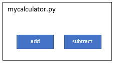

在 myrandom.py 的情况下，我们使用随机系统库来提供生成随机数的功能。 这仍然是一个非常可重用的模块，因为 random 库是 Python 中的内置模块之一：

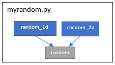

在我们必须在我们的模块中使用第三方库的情况下，如果目标环境没有安装第三方库，我们可能会在与其他人共享我们的模块时遇到问题。
为了进一步阐述这个问题，我们将引入一个新模块 mypandas.py，它将利用著名的 Pandas 库的基本功能。 为简单起见，我们只向其添加了一个函数，即根据作为函数输入变量提供的字典打印 DataFrame。
mypandas.py 的代码片段如下：

```python
#mypandas.py
import pandas
def print_dataframe(dict):
   """This function output a dictionary as a data frame """
   brics = pandas.DataFrame(dict)
   print(brics)
```

我们的 mypandas.py 模块将使用 pandas 库从字典中创建一个数据框对象。 这种依赖性也显示在下一个框图中：

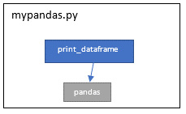

请注意，pandas 库不是内置或系统库。当我们尝试与其他人共享此模块而不定义对第三方库（在本例中为熊猫）的明确依赖时，将尝试使用此模块的程序将给出以下错误消息：
导入错误：没有名为 Pandas 的模块
这就是为什么模块尽可能独立很重要的原因。如果必须使用第三方库，则需要定义明确的依赖项并使用适当的打包方式。这将在共享包部分讨论。

#### 泛化功能

理想的可重用模块应该专注于解决一般问题而不是非常具体的问题。例如，我们有一个将英寸转换为厘米的要求。我们可以通过应用转换公式轻松编写一个将英寸转换为厘米的函数。编写一个函数将英制中的任何值转换为公制中的值怎么样？我们可以有一个函数用于不同的转换，可以处理英寸到厘米、英尺到米或英里到公里，或者为这些转换的每种类型使用单独的函数。反向函数（厘米到英寸）怎么样？这现在可能不需要，但以后可能需要，或者被重用这个模块的人需要。这种概括将使模块功能不仅全面，而且无需扩展即可重用。
为了说明泛化概念，我们将修改 myrandom 模块的设计，使其更通用，因此更可重用。在当前的设计中，我们为一位数和两位数定义了单独的函数。如果我们需要生成一个三位数的随机数或者生成一个 20 到 30 之间的随机数怎么办？为了概括这个要求，我们在同一个模块中引入了一个新函数 get_random，它接受用户输入的随机数的下限和上限。这个新添加的函数是我们已经定义的两个随机函数的推广。通过模块中的这个新功能，可以将现有的两个功能去掉，也可以保留在模块中，以方便使用。请注意，新添加的功能也是开箱即用的随机库提供的；在我们的模块中提供函数的原因纯粹是为了说明广义函数（在这种情况下为 get_random）与特定函数（在这种情况下为 random_1d 和 random_2d）。
myrandom.py 模块（myrandomv2.py）的更新版本如下：

```python
# myrandomv2.py with default and custom random functions
import random
def random_1d():
    """This function get a random number between 0 and 9"""
    return random.randint(0,9)
def random_2d():
    """This function get a random number between 10 and 99"""
    return random.randint(10,99)
def get_random(lower, upper):
    """This function get a random number between lower and upper"""
    return random.randint(lower,upper)
```

#### 常规编码风格
这主要关注我们如何编写函数名、变量名和模块名。 Python 有一个编码系统和命名约定，这在本书的前一章中讨论过。遵循编码和命名约定很重要，尤其是在构建可重用模块和包时。否则，我们将讨论这些模块作为可重用模块的坏例子。
为了说明这一点，我们将使用驼峰式大小写显示以下带有函数和参数名称的代码片段：

```python
def addNumbers(numParam1, numParam2)
    #function code is omitted
def featureCount(moduleName)
    #function code is omitted
```

如果您有 Java 背景，这种代码风格看起来不错。但它在 Python 中被认为是不好的做法。使用非 Pythonic 风格的编码使得此类模块的可重用性变得非常困难。
这是具有适当的函数名称编码风格的模块的另一个片段：

```python
def add_numbers(num_param1, num_param2)
    #function code is omitted
def feature_count(module_name)
    #function code is omitted
```

下一个屏幕截图展示了另一个良好的可重用编码风格的示例，该屏幕截图取自 PyCharm IDE 的 Pandas 库：

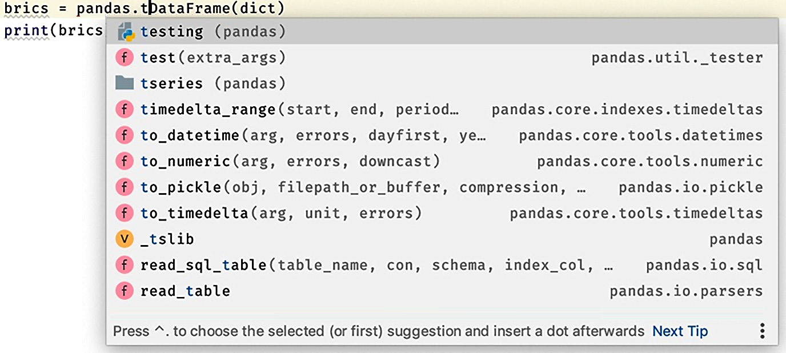

即使不阅读任何文档，函数和变量名称也很容易理解。 遵循标准的编码风格使得可重用性更加方便。

#### 定义明确的文档

定义明确且清晰的文档与使用 Python 编码指南编写通用且独立的模块一样重要。 没有明确的文档，模块不会增加开发人员的兴趣，方便地重用。 但作为程序员，我们更关注代码而不是文档。 编写几行文档可以使我们的 100 行代码更易于使用和维护。
我们将使用我们的 mycalculator.py 模块示例从模块的角度提供几个很好的文档示例：

```python
"""mycalculator.py
This module provides functions for add and subtract of two   numbers"""
def add(x,  y):
    """ This function adds two numbers. usage: add (3, 4) """
    return x + y
def subtract(x, y):
    """ This function subtracts two numbers
    usage: subtract (17, 8) """
    return x - y
```

在 Python 中，重要的是要记住以下几点：

- 我们可以使用三个引号字符来标记跨越 Python 源文件多行的字符串。
- 在模块的开头使用三引号字符串，然后将该字符串用作整个模块的文档。
- 如果任何函数以三引号字符串开头，则该字符串将用作该函数的文档。

一般情况，我们可以通过编写数百行代码来制作任意数量的模块，但是制作可重用的模块需要的不仅仅是编写代码，包括泛化、编码风格，以及最重要的文档。

## 构建包
有许多技术和工具可用于创建和分发包。事实是，Python 并没有标准化打包过程的悠久历史。在 21 世纪的第一个十年开始了多个项目来简化这一过程，但并没有取得很大的成功。在过去的十年中，由于 Python Packaging Authority (PyPA) 的倡议，我们取得了一些成功。
在本节中，我们将介绍构建包、访问我们程序中的包以及根据 PyPA 提供的指南发布和共享包的技术。
我们将从包名称开始，然后使用初始化文件，然后跳转到构建示例包。

### 命名

包名应遵循与模块相同的命名规则，即小写且不带下划线。包就像结构化模块。

### 包初始化文件

一个包可以有一个名为 \_\_init\_\_.py 的可选源文件（或简单的 init 文件）。建议使用 init 文件（甚至是空白文件）将文件夹标记为包。从 Python 3.3 或更高版本开始，init 文件的使用是可选的（PEP 420：隐式命名空间包）。使用这个 init 文件可以有多种用途，并且总是存在关于什么可以进入 init 文件和什么不能进入的争论。这里讨论了 init 文件的一些用途：

- 空的 \_\_init\_\_.py：这将迫使开发人员使用显式导入并根据需要管理命名空间。正如预期的那样，开发人员必须导入单独的模块，这对于大包来说可能很乏味。
- 在 \_\_init\_\_.py 中完全导入：在这种情况下，开发人员可以导入包，然后使用包名称或其别名直接在其代码中引用模块。这提供了更多便利，但代价是维护 \_\_init\_\_ 文件中的所有导入列表。
- 有限导入：这是另一种方法，模块开发人员可以从不同的模块中只导入 init 文件中的关键函数，并在包命名空间下对其进行管理。这提供了一个额外的好处，即为底层模块的功能提供一个包装器。如果我们必须重构底层模块，我们可以选择保持命名空间相同，尤其是对于 API 使用者。这种方法的唯一缺点是需要额外的努力来管理和维护此类 init 文件。

有时，开发人员会在从包中导入模块时执行的 init 文件中添加代码。此类代码的一个示例是为远程系统（例如数据库或远程 SSH 服务器）创建会话。

### 构建包

现在我们将讨论如何使用一个示例包示例来构建一个包。我们将使用以下模块和子包构建一个 masifutil 包：

- mycalculator.py 模块：我们已经为导入模块部分构建了这个模块。
- myrandom.py 模块：该模块也是为导入模块部分构建的。
- advcalc 子包：这将是一个子包，其中将包含一个模块 (advcalculator.py)。我们将为这个子包定义一个 init 文件，但它将是空的。

advcalculator.py 模块具有使用基数 10 和基数 2 计算平方根和对数的附加功能。该模块的源代码如下所示：

```python
# advcalculator.py with sqrt, log and ln functions
import math
def sqrt(x):
   """This function takes square root of a number"""
   return math.sqrt(x)
def log(x):
   """This function returns log of base 10"""
   return math.log(x,10)
def ln(x):
   """This function returns log of base 2"""
   return math.log(x,2)
```

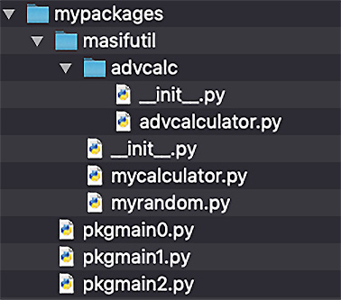

下一步，我们将构建一个新的主脚本 (pkgmain1.py) 来使用包或 masifutil 子文件夹中的模块。 在这个脚本中，我们将使用文件夹结构从主包和子包中导入模块，然后使用模块函数计算两个随机数，两个数的和和差，以及平方根和对数值 第一个随机数。 pkgmain1.py 的源代码如下：

```python
# pkgmain0.py with direct import
import masifutil.mycalculator as calc
import masifutil.myrandom as rand
import masifutil.advcalc.advcalculator as acalc
def my_main():
    """ This is a main function which generates two random\
     numbers and then apply calculator functions on them """
    x = rand.random_2d()
    y = rand.random_1d()
    sum = calc.add(x,y)
    diff = calc.subtract(x,y)
    sroot = acalc.sqrt(x)
    log10x = acalc.log(x)
    log2x = acalc.ln(x)
    print("x = {}, y = {}".format(x, y))
    print("sum is {}".format(sum))
    print("diff is {}".format(diff))
    print("square root is {}".format(sroot))
    print("log base of 10 is {}".format(log10x))
    print("log base of 2 is {}".format(log2x))
""" This is executed only if the special variable '__name__' is set as main"""
if __name__ == "__main__":
    my_main()
```

在这里，我们将使用包名和模块名来导入模块，这很麻烦，尤其是当我们需要导入子包时。我们还可以使用以下语句获得相同的结果：

```python
# mypkgmain1.py with from statements
from masifutil import mycalculator as calc
from masifutil import myrandom as rand
from masifutil.advcalc import advcalculator as acalc
#rest of the code is the same as in mypkgmain1.py
```

如前所述，空的 \_\_init\_\_.py 文件的使用是可选的。但是为了说明目的，我们在这种情况下添加了它。
接下来，我们将探索如何在 init 文件中添加一些导入语句。让我们从导入 init 文件中的模块开始。在这个顶级 init 文件中，我们将导入所有函数，如下所示：

```python
#__init__ file for package 'masifutil'
from .mycalculator import add, subtract
from .myrandom import random_1d, random_2d
from .advcalc.advcalculator import sqrt, log, ln
```

注意使用 .在模块名称之前。这是 Python 严格使用相对导入所必需的。
由于 init 文件中的这三行，新的主脚本将变得简单，示例代码如下所示：

```python
# pkgmain2.py with main function
import masifutil
def my_main():
    """ This is a main function which generates two random\
     numbers and then apply calculator functions on them """
    x = masifutil.random_2d()
    y = masifutil.random_1d()
    sum = masifutil.add(x,y)
    diff = masifutil.subtract(x,y)
    sroot = masifutil.sqrt(x)
    log10x = masifutil.log(x)
    log2x = masifutil.ln(x)
    print("x = {}, y = {}".format(x, y))
    print("sum is {}".format(sum))
    print("diff is {}".format(diff))
    print("square root is {}".format(sroot))
    print("log base of 10 is {}".format(log10x))
    print("log base of 2 is {}".format(log2x))
""" This is executed only if the special variable '__name__' is set as main"""
if __name__ == "__main__":
    my_main()
```

两个主模块和子包模块的功能在主包级别可用，开发人员不需要知道包内模块的底层层次结构和结构。这是我们之前讨论的在 init 文件中使用 import 语句的便利性。
我们通过将包源代码保存在主程序或脚本所在的同一文件夹中来构建包。这仅适用于共享项目中的模块。接下来，我们将讨论如何从其他项目和从任何地方的任何程序访问包。

## 从任意位置访问包

我们在上一小节中构建的包只有在调用模块的程序与包位置处于同一级别时才能访问。这个要求对于代码可重用性和代码共享是不切实际的。
在本节中，我们将讨论一些技术，使软件包可以从我们系统中任何位置的任何程序中获得和使用。

### 附加 sys.path

这是动态设置 sys.path 的有用选项。请注意， sys.path 是 Python 解释器每次在源程序中执行 import 语句时搜索的目录列表。通过使用这种方法，我们将包含我们的包的目录或文件夹的路径附加（添加）到 sys.path。
对于 masifutil 包，我们将构建一个新程序 pkgmain3.py，它是 pkgmain2.py（稍后更新）的副本，但保存在 masifutil 包所在的文件夹之外。 pkgmain3.py 可以位于 mypackages 文件夹以外的任何文件夹中。这是包含新主脚本 (pkgmain3.py) 和 masifutil 包的文件夹结构以供参考：

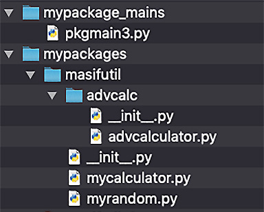

当我们执行 pkgmain3.py 程序时，它返回一个错误：ModuleNotFoundError: No module named 'masifutil'。 这是预期的，因为 masifutil 包的路径未添加到 sys.path。 要将包文件夹添加到 sys.path，我们将更新主程序； 让我们将其命名为 pkgmain4.py，并带有用于附加 sys.path 的附加语句，如下所示：

```python
# pkgmain4.py with sys.path append code
import sys
sys.path.append('/Users/muasif/Google Drive/PythonForGeeks/source_code/chapter2/mypackages')
import masifutil
def my_main():
    """ This is a main function which generates two random\
     numbers and then apply calculator functions on them """
    x = masifutil.random_2d()
    y = masifutil.random_1d()
    sum = masifutil.add(x,y)
    diff = masifutil.subtract(x,y)
    sroot = masifutil.sqrt(x)
    log10x = masifutil.log(x)
    log2x = masifutil.ln(x)
    print("x = {}, y = {}".format(x, y))
    print("sum is {}".format(sum))
    print("diff is {}".format(diff))
    print("square root is {}".format(sroot))
    print("log base of 10 is {}".format(log10x))
    print("log base of 2 is {}".format(log2x))
""" This is executed only if the special variable '__name__' is set as main"""
if __name__ == "__main__":
    my_main()
```

添加附加 sys.path 的附加行后，我们执行主脚本没有任何错误，并具有预期的控制台输出。 这是因为我们的 masifutil 包现在位于一个路径上，当我们在主脚本中导入它时，Python 解释器可以加载它。
除了附加 sys.path，我们还可以使用 site 模块中的 site.addsitedir 函数。 使用这种方法的唯一优点是该函数还会在包含的文件夹中查找 .pth 文件，这有助于添加其他文件夹，例如子包。 下面显示了带有 addsitedir 函数的示例主脚本 (pktpamin5.py) 的片段：

```python
# pkgmain5.py
import site
site.addsitedir('/Users/muasif/Google Drive/PythonForGeeks/source_code/chapter2/mypackages')
import masifutil
#rest of the code is the same as in pkymain4.py
```

请注意，我们使用这种方法追加或添加的目录仅在程序执行期间可用。要永久设置 sys.path（在会话或系统级别），我们接下来将讨论的方法更有帮助。

### 使用 PYTHONPATH 环境变量

这是将我们的包文件夹添加到 sys.path 的便捷方法，如果内置库中不存在，Python 解释器将使用它来搜索包和模块。根据我们使用的操作系统，我们可以如下定义这个变量。
在 Windows 中，可以使用以下任一选项定义环境变量：
命令行：设置 PYTHONPATH = "C:\pythonpath1;C:\pythonpath2"。这对一个活动会话有好处。
图形用户界面：转到我的电脑 |属性 |高级系统设置 |环境变量。这是一个永久的设置。
在 Linux 和 macOS 中，可以使用 export PYTHONPATH= `/some/path/` 进行设置。如果使用 Bash 或等效终端进行设置，则环境变量将仅对终端会话有效。要永久设置，建议在配置文件末尾添加环境变量，例如~/bash_profile。
如果我们在没有设置 PYTHONPATH 的情况下执行 pkgmain3.py 程序，它会返回一个错误：ModuleNotFoundError: No module named 'masifutil'。由于 masifutil 包的路径未添加到 PYTHONPATH，因此再次出现这种情况。
在下一步中，我们将包含 masifutil 的文件夹路径添加到 PYTHONPATH 变量并重新运行 pkgmain3 程序。这一次，它没有任何错误并且具有预期的控制台输出。

### 使用Python站点包下的.pth文件

这是将包添加到 sys.path 的另一种便捷方式。这是通过在 Python 站点包下定义 .pth 文件来实现的。该文件可以包含我们要添加到 sys.path 的所有文件夹。
出于说明目的，我们在 venv/lib/Python3.7/site-packages 下创建了一个 my.pth 文件。正如我们在图 2.7 中看到的，我们添加了一个包含 masifutil 包的文件夹。使用这个简单的 .pth 文件，我们的主脚本 pkymain3.py 程序运行良好，没有任何错误，并且具有预期的控制台输出：

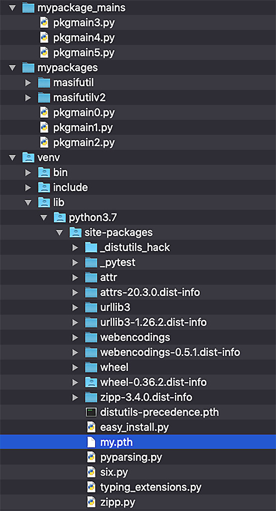

我们讨论的访问自定义包的方法可以有效地在任何程序的同一系统上重用包和模块。在下一节中，我们将探讨如何与其他开发人员和社区共享包。

## 共享包

要跨社区分发 Python 包和项目，有许多可用的工具。我们将只关注根据 PyPA 提供的指南推荐的工具。
在本节中，我们将介绍安装和分发打包技术。我们将在本节中使用或至少值得一提作为参考的一些工具如下：

- distutils：这是 Python 附带的基本功能。对于复杂和自定义的包分发进行扩展并不容易。
- setuputils：这是一个第三方工具，是 distutils 的扩展，推荐用于构建包。
- wheel：这是针对 Python 打包格式的，与它的前辈相比，它使安装更快更容易。
- pip：pip 是 Python 包和模块的包管理器，如果您安装 Python 3.4 或更高版本，它会作为 Python 的一部分出现。通过使用诸如 pip install <module name> 之类的命令，可以轻松使用 pip 安装新模块。
- Python Package Index (PyPI)：这是 Python 编程语言的软件存储库。 PyPI 用于查找和安装 Python 社区开发和共享的软件。
- Twine：这是一个用于将 Python 包发布到 PyPI 的实用程序。

在接下来的小节中，我们将根据 PyPA 提供的指南更新 masifutil 包以包含其他组件。接下来将使用 pip 在系统范围内安装更新的 masifutil 包。最后，我们将更新后的 masifutil 包发布到 Test PyPI 并从 Test PyPI 安装它。

### 根据 PyPA 指南构建包

PyPA 建议使用示例项目来构建可重用的包，它可以在 https://github.com/pypa/sampleproject 上找到。来自 GitHub 位置的示例项目的片段如下所示：

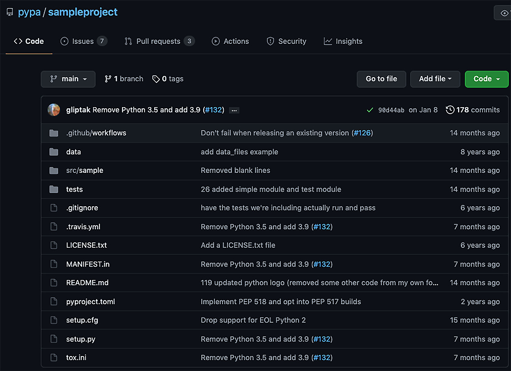

我们将介绍关键文件和文件夹，在我们使用它们更新我们的 masifutil 包之前，了解这些文件和文件夹很重要：

- setup.py：这是最重要的文件，必须存在于项目或包的根目录下。它是用于构建和安装包的脚本。该文件包含一个全局 setup() 函数。安装文件还提供了用于运行各种命令的命令行界面。
- setup.cfg：这是一个可以被 setup.py 用来定义默认值的 ini 文件。
- setup() args：可以传递给setup函数的关键参数如下：
    - a)名字
    - b) 版本
    - c) 说明
    - d) 网址
    - e) 作者
    - f) 执照
- README.rst/README.md：此文件（reStructured 或 Markdown 格式）可以包含有关包或项目的信息。
- license.txt：license.txt 文件应包含在每个包中，其中包含分发条款和条件的详细信息。许可证文件很重要，尤其是在没有适当许可证分发软件包是非法的国家/地区。
- MANIFEST.in：此文件可用于指定要包含在包中的附加文件列表。此文件列表不包括源代码文件（自动包括在内）。
- <package>：这是包含所有模块和包的顶级包。它不是强制使用的，但它是一种推荐的方法。
- data：如果需要，这是一个添加数据文件的地方。
- tests：这是为模块添加单元测试的占位符。

下一步，我们将根据 PyPA 指南更新我们之前的 masifutil 包。这是更新后的 masifutilv2 包的新文件夹和文件结构：

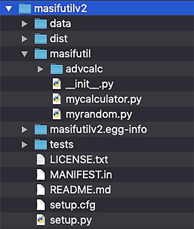

我们添加了 data 和 tests 目录，但现在它们实际上是空的。 我们将在后面的章节中评估单元测试以完成本主题。
大多数附加文件的内容都包含在示例项目中，因此除了 setup.py 文件外，这里不再讨论。
我们根据我们的包项目使用基本参数更新了 setup.py。 PyPA 随示例项目提供的示例 setup.py 文件中提供了其余参数的详细信息。 这是我们的 setup.py 文件的片段：

```python
from setuptools import setup
setup(
    name='masifutilv2',
    version='0.1.0',
    author='Muhammad Asif',
    author_email='ma@example.com',
    packages=['masifutil', 'masifutil/advcalc'],
    python_requires='>=3.5, <4',
    url='http://pypi.python.org/pypi/PackageName/',
    license='LICENSE.txt',
    description='A sample package for illustration purposes',
    long_description=open('README.md').read(),
    install_requires=[],
)
```

有了这个 setup.py 文件，我们就可以在本地和远程共享我们的 masifutilv2 包，我们将在下一小节中讨论。

### 使用 pip 从本地源代码安装

一旦我们用新文件更新了包，我们就可以使用 pip 实用程序安装它了。 安装它的最简单方法是使用 masifutilv2 文件夹的路径执行以下命令：

```bash
pip install <masifutilv2 的路径>
```

以下是不安装wheel包运行时命令的控制台输出：

```bash
Processing ./masifutilv2
```

对 masifutilv2 使用旧版“setup.py install”，因为未安装包“wheel”。
安装收集的软件包：masifutilv2
为 masifutilv2 运行 setup.py install ... 完成
成功安装masifutilv2-0.1.0
pip 实用程序成功安装了该软件包，但由于未安装 wheel 软件包，因此使用了 egg 格式。 这是安装后我们的虚拟环境的视图：

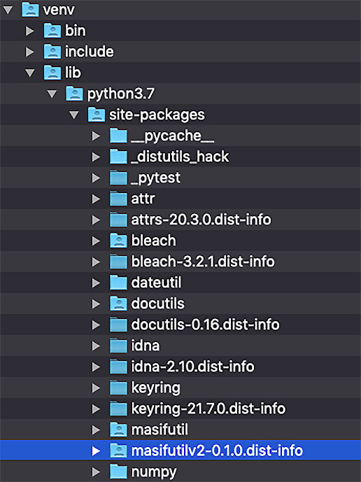

在虚拟环境下安装包后，我们用我们的 pkgmain3.py 程序对其进行了测试，它按预期工作。
提示
要卸载软件包，我们可以使用 pip uninstall masifutilv2。
作为下一步，我们将安装轮包，然后再次重新安装相同的包。下面是安装命令：

pip install <masifutilv2 的路径>
控制台输出将类似于以下内容：
处理 ./masifutilv2
为收集的包构建轮子：masifutilv2
为 masifutilv2 (setup.py) 构建轮子……完成
为 masifutilv2 创建轮子：filename=masi futilv2-0.1.0-py3-none-any.whl size=3497 sha256=038712975b7d7eb1f3fefa799da9e294b34 e79caea24abb444dd81b64cc
存储在文件夹中：/private/var/folders/xp/g88fvmgs0k90w0rc_qq4xkzxpsx11v/T/pip-ephem-wheel-cache-l2eyp_wq/wheels/de/14/12/71b4d696301fd1052adf28064dfc9075c977fc975c78dc
成功构建masifutilv2
安装收集的软件包：masifutilv2
成功安装masifutilv2-0.1.0
这次使用wheel成功安装了包，我们可以看到它出现在我们的虚拟环境中，如下所示：

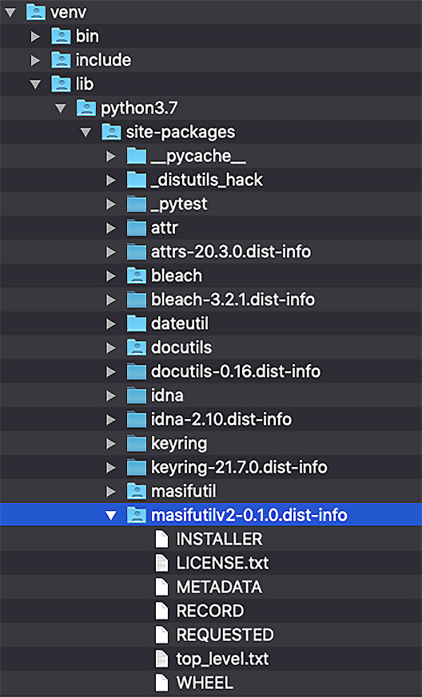

在本节中，我们使用来自本地源代码的 pip 实用程序安装了一个包。在下一节中，我们将把包发布到一个集中的存储库（Test PyPI）。

### 将包发布到 Test PyPI

作为下一步，我们将我们的示例包添加到 PyPI 存储库。在执行发布包的任何命令之前，我们需要在 Test PyPI 上创建一个帐户。请注意，Test PyPI 是专门用于测试的包索引的单独实例。除了带有 Test PyPI 的账户，我们还需要为账户添加一个 API 令牌。我们将按照 Test PyPI 网站 (https://test.pypi.org/) 上提供的说明，为您留下创建帐户和向帐户添加 API 令牌的详细信息。
要将包推送到 Test PyPI，我们将需要 Twine 实用程序。我们假设 Twine 是使用 pip 实用程序安装的。要上传 masifutilv2 包，我们将执行以下步骤：
使用以下命令创建分发。这个 sdist 实用程序将在 dist 文件夹下创建一个 TAR ZIP 文件：

python setup.py sdist
将分发文件上传到 Test PyPI。当提示输入用户名和密码时，提供 __token__ 作为用户名和 API 令牌作为密码：
麻线上传 --repository testpypi dist/masifutilv2-0.1.0.tar.gz
此命令会将包 TAR ZIP 文件推送到测试 PyPI 存储库，控制台输出将类似于以下内容：
将分发上传到 https://test.pypi.org/legacy/
输入您的用户名：__token__
输入您的密码：
正在上传 masifutilv2-0.1.0.tar.gz
100%|█████████████████████|
5.15k/5.15k [00:02<00:00, 2.21kB/s]
上传成功后我们可以在https://test.pypi.org/project/masifutilv2/0.1.0/查看上传的文件。

### 从 PyPI 安装包

从 Test PyPI 安装包与从常规存储库安装相同，除了我们需要使用 index-url 参数提供存储库 URL。命令和控制台输出将类似于以下内容：

pip install --index-url https://test.pypi.org/simple/ --no-deps masifutilv2
此命令将显示类似于以下内容的控制台输出：
查看索引：https://test.pypi.org/simple/
收集 masifutilv2
下载 https://test-files.pythonhosted.org/packages/b7/e9/7afe390b4ec1e5842e8e62a6084505cbc6b9 f6adf0e37ac695cd23156844/masifutilv2-0.1.03.tar.gz
为收集的包构建轮子：masifutilv2
为 masifutilv2 (setup.py) 构建轮子……完成
为 masifutilv2 创建轮子：filename=masifutilv2- 0.1.0-py3-none-any.whl size=3497 sha256=a3db8f04b118e16ae291bad9642483874 f5c9f447dbee50bf905
存储在文件夹中：/Users/muasif/Library/Caches/pip/wheels/1c/47/29/95b9edfe28f02a605757c1 f1735660a6f79807ece430f5b836
成功构建masifutilv2
安装收集的软件包：masifutilv2
成功安装masifutilv2-0.1.0
正如我们在控制台输出中看到的，pip 正在 Test PyPI 中搜索模块。一旦找到名为 masifutilv2 的包，它就会开始下载，然后将其安装在虚拟环境中。
简而言之，我们观察到，一旦我们使用推荐的格式和样式创建了一个包，那么发布和访问该包只需使用 Python 实用程序并遵循标准步骤即可。

## 总结

在本章中，我们介绍了 Python 中模块和包的概念。我们讨论了如何构建可重用模块以及它们如何被其他模块和程序导入。我们还介绍了其他程序（通过导入过程）包含的模块的加载和初始化。在本章的后面部分，我们讨论了构建简单和高级的包。我们还提供了大量代码示例来访问包，以及安装和发布包以实现高效的可重用性。
阅读本章后，您学习了如何构建模块和包以及如何共享和发布包（和模块）。如果您作为组织中的团队从事项目工作，或者您正在为更大的社区构建 Python 库，那么这些技能非常重要。
在下一章中，我们将讨论在 Python 中使用面向对象编程的下一级别模块化。这将包括封装、继承、多态和抽象，它们是在现实世界中构建和管理复杂项目的关键工具。

## 问题

模块和包有什么区别？
Python 中的绝对导入和相对导入是什么？
什么是 PyPA？
什么是 Test PyPI，我们为什么需要它？
init 文件是构建包的必要条件吗？

## 进一步阅读

Erik Westra 的 Python 模块化编程
Michał Jaworski 和 Tarek Ziadé 的 Python 编程专家
Python 打包用户指南 (https://packaging.python.org/)
PEP 420：隐式命名空间包 (https://www.python.org/dev/peps/pep-0420/)

## 答案

模块旨在将函数、变量和类组织到单独的 Python 代码文件中。一个 Python 包就像一个文件夹来组织多个模块或子包。
绝对导入需要使用从顶层开始的包的绝对路径，而相对导入基于包的相对路径，根据要使用导入语句的程序的当前位置。
Python Packaging Authority (PyPA) 是一个工作组，负责维护 Python 打包中使用的一组核心软件项目。
Test PyPI 是用于测试目的的 Python 编程语言的软件存储库。
自 Python 3.3 版起，init 文件是可选的。
