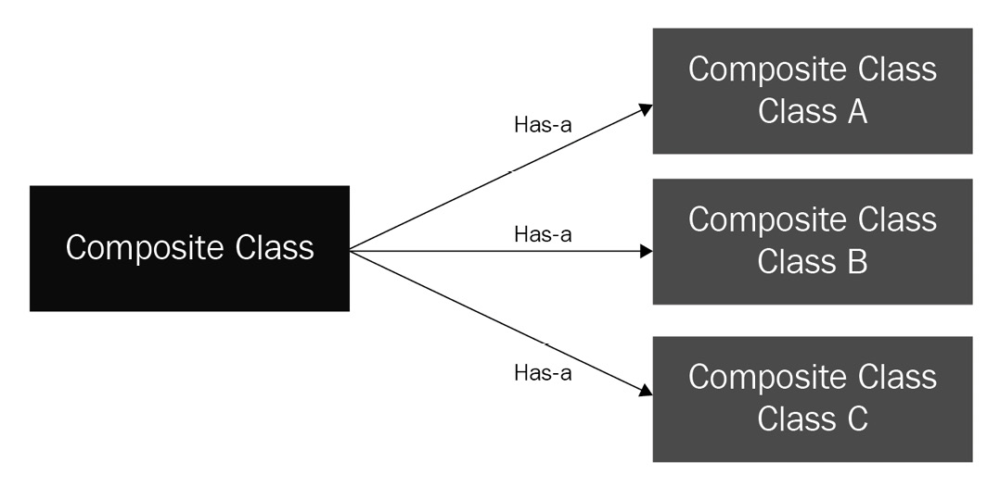

Python 可用作声明性模块化编程语言，例如 C，也可用于使用 Java 等编程语言进行命令式编程或完全面向对象编程 (OOP)。声明式编程是一种范式，我们专注于我们想要实现的东西，而命令式编程是我们描述如何实现我们想要的东西的确切步骤的地方。 Python 适用于两种类型的编程范式。 OOP 是一种命令式编程形式，我们将现实世界对象的属性和行为捆绑到程序中。此外，OOP 还解决了不同类型的现实世界对象之间的关系。
在本章中，我们将探讨如何使用 Python 实现 OOP 的高级概念。我们假设您熟悉类、对象和实例等一般概念，并且具有对象间继承的基本知识。
我们将在本章中讨论以下主题：

- 介绍类和对象
- 理解面向对象的原则
- 使用组合作为替代设计方法
- 在 Python 中介绍鸭子类型
- 学习何时不要在 Python 中使用 OOP

## 技术要求

这些是本章的技术要求：

- 您需要在计算机上安装 Python 3.7 或更高版本。
- 本章的示例代码可以在 https://github.com/PacktPublishing/Python-for-Geeks/tree/master/Chapter03 找到。

## 介绍类和对象

类是应该如何定义某物的蓝图。它实际上不包含任何数据——它是一个模板，用于根据模板或蓝图中定义的规范创建实例。
类的对象是从类构建的实例，这就是为什么它也被称为类的实例。在本章和本书的其余部分，我们将对象和实例同义。 OOP 中的对象有时由物理对象表示，例如桌子、椅子或书籍。在大多数情况下，软件程序中的对象代表可能不是物理的抽象实体，例如帐户、姓名、地址和付款。
为了让我们了解类和对象的基本概念，我们将通过代码示例定义这些术语。

### 区分类属性和实例属性

类属性被定义为类定义的一部分，它们的值在从该类创建的所有实例中都是相同的。可以使用类名或实例名访问类属性，但建议使用类名来访问这些属性（用于读取或更新）。对象的状态或数据由实例属性提供。
在 Python 中定义一个类只需使用 class 关键字即可完成。如第 1 章“最佳 Python 开发生命周期”所述，类的名称应为 CamelCase。以下代码片段创建一个 Car 类：

```python
#carexample1.py
class Car:
    pass
```

这个类没有属性和方法。 它是一个空类，在我们向它添加更多组件之前，您可能认为这个类没有用。 不完全是！ 在 Python 中，您可以动态添加属性，而无需在类中定义它们。 以下代码段是我们在运行时向类实例添加属性的有效代码示例：

```python
#carexample1.py
class Car:
    pass
if __name__ == "__main__":
    car = Car ()
    car.color = "blue"
    car.miles = 1000
    print (car.color)
    print (car.miles)
```

在这个扩展示例中，我们创建了 Car 类的实例（汽车），然后向该实例添加了两个属性：颜色和英里。 请注意，使用此方法添加的属性是实例属性。
接下来，我们将使用构造函数方法（\_\_init\_\_）添加类属性和实例属性，该方法在对象创建时加载。 具有两个实例属性（颜色和英里）和 init 方法的代码片段如下所示：

```python
#carexample2.py
class Car:
    c_mileage_units = "Mi"
    def __init__(self, color, miles):
        self.i_color = color
        self.i_mileage = miles
if __name__ == "__main__":
    car1 = Car ("blue", 1000)
    print (car.i_color)
    print (car.i_mileage)
    print (car.c_mileage_units)
    print (Car.c_mileage_units)
```

在这个程序中，我们做了以下事情：

1. 我们创建了一个带有 c_mileage_units 类属性和两个实例变量 i_color 和 i_mileage 的 Car 类。
2. 我们创建了 Car 类的实例（汽车）。
3. 我们使用汽车实例变量打印出实例属性。
4. 我们使用 car 实例变量和 Car 类名打印出类属性。两种情况的控制台输出相同。

> **提示**
> self 是对正在创建的实例的引用。在 Python 中经常使用 self 来访问实例方法中的实例属性和方法，包括 init 方法。 self 不是关键字，也不是强制使用 self 一词。它可以是诸如 this 或 blah 之类的任何东西，只是它必须是实例方法的第一个参数，但是使用 self 作为参数名称的约定太强了。

我们可以使用实例变量或类名更新类属性，但结果可能不同。当我们使用类名更新类属性时，该类的所有实例都会更新它。但是，如果我们使用实例变量更新类属性，它将仅针对该特定实例进行更新。下面的代码片段演示了这一点，它使用了 Car 类：

```python
#carexample3.py
#class definition of Class Car is same as in carexample2.py
if __name__ == "__main__":
    car1 = Car ("blue", 1000)
    car2 = Car("red", 2000)
    print("using car1: " + car1.c_mileage_units)
    print("using car2: " + car2.c_mileage_units)
    print("using Class: " + Car.c_mileage_units)
    car1.c_mileage_units = "km"
    print("using car1: " + car1.c_mileage_units)
    print("using car2: " + car2.c_mileage_units)
    print("using Class: " + Car.c_mileage_units)
    Car.c_mileage_units = "NP"
    print("using car1: " + car1.c_mileage_units)
    print("using car2: " + car2.c_mileage_units)
    print("using Class: " + Car.c_mileage_units)
```

这个程序的控制台输出可以分析如下：
第一组打印语句将输出类属性的默认值，即 Mi。
执行 car1.c_mileage_units = "km" 语句后，car2 实例和类级别属性的类属性值将相同（Mi）。
执行 Car.c_mileage_units = "NP" 语句后，car2 的 class 属性值和 class level 将更改为 NP，但 car1 的值将保持不变 (km)，因为它是我们明确设置的。

> **提示**
> 属性名称以 c 和 i 开头，分别表示它们是类变量和实例变量，而不是常规的局部或全局变量。 非公共实例属性的名称必须以单下划线或双下划线开头，以使它们成为受保护或私有的。 这将在本章后面讨论。

### 在类中使用构造函数和析构函数

与任何其他 OOP 语言一样，Python 也有构造函数和析构函数，但命名约定不同。在类中使用构造函数的目的是在创建类的实例时对类或实例级属性（主要是实例属性）进行初始化或赋值。在 Python 中，\_\_init\_\_ 方法被称为构造函数，并且总是在创建新实例时执行。 Python中支持三种构造函数，列举如下：
1 默认构造函数：当我们在类中不包含任何构造函数（\_\_init\_\_）或忘记声明它时，该类将使用一个空的默认构造函数。构造函数除了初始化一个类的实例之外什么都不做。
2 非参数化构造函数：这种类型的构造函数除了对正在创建的实例的引用之外不接受任何参数。以下代码示例显示了 Name: 类的非参数化构造函数：

```python
class Name:
    #non-parameterized constructor
    def __init__(self):
        print("A new instance of Name class is \
         created")
```

由于此构造函数没有传递任何参数，因此我们添加到它的功能有限。 例如，在我们的示例代码中，我们向控制台发送了一条消息，表明已为 Name 类创建了一个新实例
3 参数化构造函数：参数化构造函数可以接受一个或多个参数，并且可以根据通过构造函数方法提供的输入参数来设置实例的状态。 Name 类将使用参数化构造函数进行更新，如下所示：

```python
class Name:   
    #parameterized constructor
    def __init__(self, first, last):
        self.i_first = first    
        self.i_last = last
```

析构函数与构造函数相反——它们在实例被删除或销毁时执行。 在 Python 中，几乎不使用析构函数，因为 Python 有一个垃圾收集器，可以处理删除不再被任何其他实例或程序引用的实例。 如果我们需要在析构函数中添加逻辑，我们可以使用一个特殊的 \_\_del\_\_ 方法来实现它。 当一个实例的所有引用都被删除时，它会自动调用。 以下是如何在 Python 中定义析构函数方法的语法：

```python
def __del__(self):
    print("Object is deleted.")
```

### 区分类方法和实例方法

在 Python 中，我们可以在一个类中定义三种类型的方法，如下所述：
实例方法：它们与一个实例相关联，在执行它们之前需要先创建一个实例。它们接受第一个属性作为对实例（自身）的引用，并且可以读取和更新实例的状态。 \_\_init\_\_ 是一个构造方法，是实例方法的一个例子。
类方法：这些方法是用@classmethod 装饰器声明的。这些方法不需要类实例来执行。对于此方法，类引用（cls 用作约定）将自动作为第一个参数发送。
静态方法：这些方法是用@staticmethod 装饰器声明的。他们无权访问 cls 或 self 对象。静态方法就像实用函数，它接受某些参数并根据参数的值提供输出——例如，如果我们需要评估某些输入数据或解析数据进行处理，我们可以编写静态方法来实现这些目标。静态方法就像我们在模块中定义的常规函数一样工作，但在类的命名空间的上下文中可用。
为了说明如何定义这些方法然后在 Python 中使用，我们创建了一个简单的程序，如下所示：

```python
#methodsexample1.py
class Car:
    c_mileage_units = "Mi"
    def __init__(self, color, miles):
        self.i_color = color
        self.i_mileage = miles
    def print_color (self):
        print (f"Color of the car is {self.i_color}")
    @classmethod
    def print_units(cls):
        print (f"mileage unit are {cls.c_mileage_unit}")
        print(f"class name is {cls.__name__}")
    @staticmethod
    def print_hello():
        print ("Hello from a static method")
if __name__ == "__main__":
    car = Car ("blue", 1000)
    car.print_color()
    car.print_units()
    car.print_hello()
    Car.print_color(car);
    Car.print_units();
    Car.print_hello()
```

在这个程序中，我们做了以下事情：
我们创建了一个具有类属性 (c_mileage_units)、类方法 (print_units)、静态方法 (print_hello)、实例属性 (i_color 和 i_mileage)、实例方法 (print_color) 和构造函数方法 (__init__) 的 Car 类。
我们使用其构造函数作为汽车创建了 Car 类的实例。
使用实例变量（本例中为 car），我们调用了实例方法、类方法和静态方法。
使用类名（本例中为 Car），我们再次触发了实例方法、类方法和静态方法。请注意，我们可以使用类名触发实例方法，但是我们需要将实例变量作为第一个参数传递（这也解释了为什么我们需要为每个实例方法提供 self 参数）。
该程序的控制台输出如下所示以供参考：
车的颜色是蓝色
里程单位是 Mi
类名是 Car
你好来自静态方法
车的颜色是蓝色
里程单位是 Mi
类名是 Car
你好来自静态方法

### 特殊方法

当我们在 Python 中定义一个类并尝试使用 print 语句打印它的一个实例时，我们将得到一个字符串，其中包含类名和对象实例的引用，即对象的内存地址。 实例或对象没有可用的字符串功能的默认实现。 显示此行为的代码片段如下所示：

```python
#carexampl4.py
class Car:
    def __init__(self, color, miles):
        self.i_color = color
        self.i_mileage = miles
if __name__ == "__main__":
    car = Car ("blue", 1000)
    print (car)
```

我们将得到类似于以下的控制台输出，这不是打印语句所期望的：

```python
<__main__.Car object at 0x100caae80>
```

为了从打印语句中获得一些有意义的信息，我们需要实现一个特殊的 __str__ 方法，该方法将返回一个包含有关实例信息的字符串，并且可以根据需要对其进行自定义。 这是一个代码片段，显示了带有 __str__ 方法的 carexample4.py 文件：

```python
#carexample4.py
class Car:
    c_mileage_units = "Mi"
    def __init__(self, color, miles):
        self.i_color = color
        self.i_mileage = miles
    def __str__(self):
        return f"car with color {self.i_color} and \
         mileage {self.i_mileage}"
if __name__ == "__main__":
    car = Car ("blue", 1000)
    print (car)
```

打印语句的控制台输出如下所示：
蓝色和里程1000的汽车
通过适当的 \_\_str\_\_ 实现，我们可以使用打印语句而无需实现诸如 to_string() 之类的特殊函数。这是控制字符串转换的 Pythonic 方式。出于类似原因使用的另一种流行方法是 \_\_repr\_\_，Python 解释器使用它来检查对象。 \_\_repr\_\_ 方法更多用于调试目的。
这些方法（以及更多方法）被称为特殊方法或 dunders，因为它们总是以双下划线开头和结尾。普通方法不应该使用这个约定。这些方法在某些文献中也称为魔术方法，但并不是官方术语。有几十种特殊方法可用于类的实现。在 https://docs.python.org/3/reference/datamodel.html#specialnames 的官方 Python 3 文档中提供了特殊方法的完整列表。
在本节中，我们通过代码示例查看了类和对象。在下一节中，我们将研究 Python 中可用的不同面向对象原则。

## 理解面向对象的原则

OOP 是一种将属性和行为捆绑到单个实体中的方法，我们称之为对象。为了使这种捆绑更加高效和模块化，Python 中有几个可用的原则，概述如下：

- 数据封装
- 继承
- 多态
- 抽象

在接下来的小节中，我们将逐个详细研究这些原则。

### 数据封装

封装是 OOP 中的一个基本概念，有时也称为抽象。但实际上，封装不仅仅是抽象。在 OOP 中，将数据和与数据相关的操作捆绑到一个单元中称为封装。封装实际上不仅仅是捆绑数据和相关的操作。在这里我们可以列举出封装的三个主要目标，如下：

- 将数据和相关操作包含在一个单元中。
- 隐藏对象的内部结构和实现细节。
- 限制对对象的某些组件（属性或方法）的访问。

封装简化了对象的使用，而无需了解其实现方式的内部细节，它还有助于控制对象状态的更新。
在接下来的小节中，我们将详细讨论这些目标。

### 包含数据和行动

为了在一个 init 中包含数据和操作，我们在一个类中定义了属性和方法。 Python 中的类可以具有以下类型的元素：

- 构造函数和析构函数
- 类方法和属性
- 实例方法和属性
- 嵌套类

我们已经在上一节中讨论了这些类元素，嵌套类或内部类除外。我们已经提供了 Python 代码示例来说明构造函数和析构函数的实现。我们已经使用实例属性将数据封装在我们的实例或对象中。我们还在上一节中通过代码示例讨论了类方法、静态方法和类属性。
为了完成本主题，我们将讨论以下带有嵌套类的 Python 代码片段。让我们以 Car 类和其中的 Engine 内部类为例。每辆车都需要一个引擎，所以让它成为嵌套类或内部类是有意义的：

```python
#carwithinnerexample1.py
class Car:
    """outer class"""
    c_mileage_units = "Mi"
    def __init__(self, color, miles, eng_size):
        self.i_color = color
        self.i_mileage = miles
        self.i_engine = self.Engine(eng_size)
    def __str__(self):
        return f"car with color {self.i_color}, mileage \
        {self.i_mileage} and engine of {self.i_engine}"
    class Engine:
        """inner class"""
        def __init__(self, size):
            self.i_size = size
        def __str__(self):
            return self.i_size
if __name__ == "__main__":
    car = Car ("blue", 1000, "2.5L")
    print(car)
    print(car.i_engine.i_size)
```

在这个例子中，我们在常规 Car 类中定义了一个 Engine 内部类。 Engine 类只有一个属性 — i_size、构造函数方法 (__init__) 和 __str__ 方法。对于 Car 类，与之前的示例相比，我们更新了以下内容：
__init__ 方法包括一个关于引擎大小的新属性，并添加了一个新行来创建与 Car 实例关联的 Engine 的新实例。
Car 类的 __str__ 方法在其中包含 i_size 内部类属性。
主程序在 Car 实例上使用了一个打印语句，还有一行打印 Engine 类的 i_size 属性的值。该程序的控制台输出将类似于此处显示的内容：
蓝色轿车，里程1000，发动机2.5L
2.5L
主程序的控制台输出显示我们可以从类实现内部访问内部类，并且可以从外部访问内部类属性。
在下一小节中，我们将讨论如何隐藏一些属性和方法，使其在类外部无法访问或可见。

### 隐藏信息

我们在之前的代码示例中已经看到，我们可以不受任何限制地访问所有类级别和实例级别的属性。这种方法导致我们采用扁平化设计，类将简单地成为变量和方法的包装器。更好的面向对象设计方法是隐藏一些实例属性，只让外部世界看到必要的属性。为了讨论如何在 Python 中实现这一点，我们引入了两个术语：私有和受保护。

#### 私有变量和方法

私有变量或属性可以通过在变量名前使用双下划线作为前缀来定义。在 Python 中，没有像在其他编程语言中那样的关键字 private。类和实例变量都可以标记为私有。
私有方法也可以通过在方法名称前使用双下划线来定义。私有方法只能在类内调用，不能在类外使用。
每当我们将属性或方法定义为私有时，Python 解释器都不允许在类定义之外访问此类属性或方法。该限制也适用于子类；因此，只有类中的代码才能访问这些属性和方法。

#### 受保护的变量和方法

可以通过在属性名称或方法名称前添加单个下划线来标记受保护的变量或方法。在类定义和子类中编写的代码应该访问或使用受保护的变量或方法——例如，如果我们想将 i_color 属性从公共属性转换为受保护属性，我们只需要将其名称更改为 _i_color . Python 解释器不会强制使用类或子类中的受保护元素。更多的是遵守命名约定，并根据受保护变量和方法的定义使用或访问属性或方法。
通过使用私有和受保护的变量和方法，我们可以隐藏对象实现的一些细节。这很有帮助，使我们能够在大型类中拥有紧凑而干净的源代码，而无需将所有内容暴露给外部世界。隐藏属性的另一个原因是控制访问或更新它们的方式。这是下一小节的主题。为了结束本节，我们将讨论 Car 类的更新版本，其中包含私有变量和受保护变量以及私有方法，如下所示：

```python
#carexample5.py
class Car:
    c_mileage_units = "Mi"
    __max_speed = 200
    def __init__(self, color, miles, model):
        self.i_color = color
        self.i_mileage = miles
        self.__no_doors = 4
        self._model = model
    def __str__(self):
        return f"car with color {self.i_color}, mileage {self.i_mileage}, model {self._model} and doors {self.__doors()}"
    def __doors(self):
        return self.__no_doors
if __name__ == "__main__":
    car = Car ("blue", 1000, "Camry")
    print (car)
```

在这个更新的 Car 类中，我们根据前面的示例更新或添加了以下内容：
具有默认值的私有 \_\_max_speed 类变量
在 \_\_init\_\_ 构造函数方法中具有默认值的私有 \_\_no_doors 实例变量
_model 受保护的实例变量，添加仅用于说明目的
一个 \_\_doors() 私有实例方法来获取门的数量
\_\_str\_\_ 方法更新为使用 \_\_doors() 私有方法获取门
该程序的控制台输出按预期工作，但是如果我们尝试从主程序访问任何私有方法或私有变量，则它不可用，并且 Python 解释器将抛出错误。这是根据设计，因为这些私有变量和私有方法的预期目的是仅在类中可用。

> **提示**
> Python 并没有真正将变量和方法设为私有，而是假装将它们设为私有。 Python 实际上将变量名与类名混为一谈，以便在包含它们的类之外不容易看到它们。

对于 Car 类示例，我们可以访问私有变量和私有方法。 Python 提供对类定义之外的这些属性和方法的访问，使用不同的属性名称，该名称由前导下划线、类名称和私有属性名称组成。同样，我们也可以访问私有方法。
以下代码行是有效的，但不鼓励使用，并且违反了私有和受保护的定义：

```python
print (Car._Car__max_speed)    
print (car._Car__doors())
print (car._model)
```

正如我们所见，_Car 附加在实际的私有变量名称之前。这样做也是为了尽量减少与内部类中变量的冲突。

#### 保护数据

我们在之前的代码示例中已经看到，我们可以不受任何限制地访问实例属性。我们还实现了实例方法，我们对这些方法的使用没有限制。我们模拟将它们定义为私有的或受保护的，这可以对外部世界隐藏数据和操作。
但在实际问题中，我们需要以可控且易于维护的方式提供对变量的访问。这在许多面向对象的语言中是通过访问修饰符（例如 getter 和 setter）来实现的，它们的定义如下：
Getters：这些是用于从类或其实例访问私有属性的方法
Setters：这些是用于设置类或其实例的私有属性的方法。
也可以使用 getter 和 setter 方法来实现访问或设置属性的附加逻辑，在一个地方维护这样的附加逻辑很方便。 getter 和 setter 方法有两种实现方式：传统方式和装饰方式。

#### 使用传统的 getter 和 setter

传统上，我们使用 get 和 set 前缀编写实例方法，后跟下划线和变量名称。我们可以将 Car 类转换为对实例属性使用 getter 和 setter 方法，如下所示：

```python
#carexample6.py
class Car:
    __mileage_units = "Mi"
    def __init__(self, col, mil):
        self.__color = col
        self.__mileage = mil
    def __str__(self):
        return f"car with color {self.get_color()} and \
         mileage {self.get_mileage()}"
    def get_color(self):
        return self.__color
    def get_mileage(self):
        return self.__mileage
    def set_mileage (self, new_mil):
            self.__mileage = new_mil
if __name__ == "__main__":
    car = Car ("blue", 1000)
    print (car)
    print (car.get_color())
    print(car.get_mileage())
    car.set_mileage(2000)
    print (car.get_color())
    print(car.get_mileage())
```

在这个更新的 Car 类中，我们添加了以下内容：
颜色和里程实例属性被添加为私有变量。
颜色和里程实例属性的获取方法。
仅用于 mileage 属性的 setter 方法，因为在创建对象时设置颜色通常不会更改。
在主程序中，我们使用 getter 方法获取新创建的类实例的数据。接下来，我们使用 setter 方法更新里程，然后我们再次获取颜色和里程属性的数据。
此示例中每个语句的控制台输出都是微不足道的，并且符合预期。如前所述，我们没有为每个属性定义一个 setter，而是只为那些有意义和设计要求的属性定义。使用 getter 和 setter 是 OOP 中的最佳实践，但它们在 Python 中并不是很流行。 Python 开发人员的文化（也称为 Pythonic 方式）仍然是直接访问属性。

#### 使用属性装饰器

使用装饰器来定义 getter 和 setter 是一种有助于实现 Python 编程方式的现代方法。
如果您喜欢使用装饰器，那么我们在 Python 中有一个 @property 装饰器，可以使代码更简单、更清晰。带有传统 getter 和 setter 的 Car 类使用装饰器进行了更新，下面是一段代码片段，显示了这一点：

```python
carexample7.py
class Car:
    __mileage_units = "Mi"
    def __init__(self, col, mil):
        self.__color = col
        self.__mileage = mil
    def __str__(self):
        return f"car with color {self.color} and mileage \
         {self.mileage}"
    @property
    def color(self):
        return self.__color
    @property
    def mileage(self):
        return self.__mileage
    @mileage.setter
    def mileage (self, new_mil):
            self.__mileage = new_mil
if __name__ == "__main__":
    car = Car ("blue", 1000)
    print (car)
    print (car.color)
    print(car.mileage)
    car.mileage = 2000
    print (car.color)
    print(car.mileage)
```

在这个更新的类定义中，我们更新或添加了以下内容：

#### 实例属性作为私有变量

通过使用属性名称作为方法名称并使用@property 获取颜色和里程的获取方法
使用@mileage.setter 装饰器的里程设置方法，为方法赋予与属性名称相同的名称
在主脚本中，我们通过使用实例名称后跟一个点和属性名称（Pythonic 方式）来访问颜色和里程属性。这使得代码语法简洁易读。装饰器的使用还使方法的名称更简单。
总之，我们讨论了 Python 中封装的所有方面，使用类来捆绑数据和操作，向类的外部世界隐藏不必要的信息，以及如何使用类的 getter、setter 和属性特性来保护类中的数据。 Python。在下一节中，我们将讨论如何在 Python 中实现继承。

#### 使用继承扩展类

OOP中的继承概念类似于现实世界中的继承概念，孩子在自己的特征之上继承了父母的一些特征。
同样，一个类可以从另一个类继承元素。这些元素包括属性和方法。我们从其继承另一个类的类通常称为父类、超类或基类。我们从另一个类继承的类称为派生类、子类或子类。以下屏幕截图显示了父类和子类之间的简单关系：


在 Python 中，当一个类从另一个类继承时，它通常会继承组成父类的所有元素，但这可以通过使用命名约定（例如双下划线）和访问修饰符来控制。
继承可以有两种类型：简单的或多重的。 我们将在接下来的部分中讨论这些。

#### 简单继承

在简单或基本继承中，类是从单个父级派生的。 这是OOP中常用的一种继承形式，更接近人类的家谱。 使用简单继承的父类和子类的语法如下所示：

```python
class BaseClass:
    <attributes and methods of the base class >
class ChildClass (BaseClass):
    <attributes and methods of the child class >
```

对于这个简单的继承，我们将修改 Car 类的示例，使其派生自 Vehicle 父类。 我们还将添加一个 Truck 子类来详细说明继承的概念。 这是经过修改的代码：

```python
#inheritance1.py
class Vehicle:
    def __init__(self, color):
        self.i_color = color
    def print_vehicle_info(self):
        print(f"This is vehicle and I know my color is \
         {self.i_color}")
class Car (Vehicle):
    def __init__(self, color, seats):
        self.i_color = color
        self.i_seats = seats
    def print_me(self):
        print( f"Car with color {self.i_color} and no of \
         seats {self.i_seats}")
class Truck (Vehicle):
    def __init__(self, color, capacity):
        self.i_color = color
        self.i_capacity = capacity
    def print_me(self):
        print( f"Truck with color {self.i_color} and \
         loading capacity {self.i_capacity} tons")
if __name__ == "__main__":
    car = Car ("blue", 5)
    car.print_vehicle_info()
    car.print_me()
    truck = Truck("white", 1000)
    truck.print_vehicle_info()
    truck.print_me()
```

在这个例子中，我们创建了一个带有一个 i_color 属性和一个 print_vehicle_info 方法的 Vehicle 父类。这两个元素都是继承的候选者。接下来，我们创建了两个子类 Car 和 Truck。每个子类都有一个附加属性（i_seats 和 i_capacity）和一个附加方法（print_me）。在每个子类的 print_me 方法中，我们访问父类实例属性以及子类实例属性。
这种设计是有意的，以阐述从父类继承一些元素并在子类中添加一些自己的元素的想法。本示例中使用了两个子类来演示继承对可重用性的作用。
在我们的主程序中，我们创建了 Car 和 Truck 实例，并尝试访问父方法和实例方法。该程序的控制台输出符合预期，如下所示：
这是车辆，我知道我的颜色是蓝色
汽车颜色为蓝色，没有座位 5
这是车辆，我知道我的颜色是白色
白色载重1000吨货车

#### 多重继承

在多重继承中，一个子类可以从多个父类派生。多重继承的概念适用于高级的面向对象设计，其中对象与多个对象有关系，但是从多个类继承时我们必须小心，特别是如果这些类是从一个共同的超类继承的。这可能会导致我们遇到诸如钻石问题之类的问题。菱形问题是当我们通过继承Y和Z两个类创建X类，而Y和Z类继承自一个公共类A时的情况。X类会对A的公共代码产生歧义类，它继承自 Y 和 Z 类。不鼓励多重继承，因为它可能带来问题。
为了说明这个概念，我们将修改我们的 Vehicle 和 Car 类，我们将添加一个 Engine 类作为父类之一。具有多个类继承的完整代码显示在以下代码段中：

```python
#inheritance2.py
class Vehicle:
    def __init__(self, color):
        self.i_color = color
    def print_vehicle_info(self):
        print( f"This is vehicle and I know my color is \
         {self.i_color}")
class Engine:
    def __init__(self, size):
        self.i_size = size
    def print_engine_info(self):
        print(f"This is Engine and I know my size is \
         {self.i_size}")
class Car (Vehicle, Engine):
    def __init__(self, color, size, seat):
        self.i_color = color
        self.i_size = size
        self.i_seat = seat
    def print_car_info(self):
        print(f"This car of color {self.i_color} with \
         seats {self.i_seat} with engine of size \
         {self.i_size}")
if __name__ == "__main__":
    car = Car ("blue", "2.5L", 5 )
    car.print_vehicle_info()
    car.print_engine_info()
    car.print_car_info()
```

在这个多重继承示例中，我们创建了两个父类作为父类：Vehicle 和 Engine。 Vehicle 父类与上一个示例中的相同。 Engine 类有一个属性 (i_size) 和一个方法 (print_engine_info)。 Car 类派生自 Vehicle 和 Engine，并添加了一个附加属性 (i_seats) 和一个附加方法 (print_car_info)。在实例方法中，我们可以访问两个父类的实例属性。
在主程序中，我们创建了 Car 类的实例。通过这个实例，我们可以访问父类和子类的实例方法。主程序的控制台输出显示在此处，并符合预期：
这是车辆，我知道我的颜色是蓝色
汽车颜色为蓝色，没有座位 5
这是车辆，我知道我的颜色是白色
白色载重1000吨货车
在本节中，我们介绍了继承及其简单和多重类型。接下来，我们将研究 Python 中多态的概念。

## 多态

从字面上看，具有多种形式的过程称为多态性。在 OOP 中，多态性是实例以多种方式运行的能力，以及使用具有相同名称和相同参数的相同方法的一种方式，根据它所属的类以不同方式运行。
多态可以通过两种方式实现：方法重载和方法覆盖。我们将在接下来的小节中讨论每一个。

### 方法重载

方法重载是一种通过具有多个具有相同名称但具有不同类型或数量的参数的方法来实现多态性的方法。在 Python 中没有干净的方法来实现方法重载。 Python 中两个方法不能同名。在 Python 中，一切都是对象，包括类和方法。当我们为类编写方法时，从命名空间的角度来看，它们实际上是类的属性，因此不能具有相同的名称。如果我们写两个同名的方法，就不会出现语法错误，第二个只会简单地替换第一个。
在类中，可以通过为参数设置默认值来重载方法。这不是实现方法重载的完美方式，但它有效。以下是 Python 中类中方法重载的示例：

```python
#methodoverloading1.py
class Car:
    def __init__(self, color, seats):
        self.i_color = color
        self.i_seat = seats
    def print_me(self, i='basic'):
        if(i =='basic'):
            print(f"This car is of color {self.i_color}")
        else:
            print(f"This car is of color {self.i_color} \
             with seats {self.i_seat}")
        
if __name__ == "__main__":
    car = Car("blue", 5 )
    car.print_me()
    car.print_me('blah')
    car.print_me('detail')
```

在这个例子中，我们添加了一个带有默认值参数的 print_me 方法。当不传递参数时将使用默认值。当没有参数传递给 print_me 方法时，控制台输出将只提供 Car 实例的颜色。当一个参数传递给这个方法时（不管它的值是多少），我们有这个方法的不同行为，它提供 Car 实例的颜色和座位数。这是该程序的控制台输出以供参考：
这辆车是蓝色的
这辆车是蓝色的，有5个座位
这辆车是蓝色的，有5个座位

> **提示**
> 有可用的第三方库（例如，重载）可用于以更简洁的方式实现方法重载。

### 方法覆盖

在子类中具有与父类中相同的方法名称被称为方法覆盖。父类和子类中方法的实现预计是不同的。当我们对子类的实例调用覆盖方法时，Python 解释器会在子类定义中查找该方法，即被覆盖的方法。解释器执行子类级别的方法。如果解释器在子实例级别没有找到方法，它会在父类中寻找它。如果我们必须在使用子类实例覆盖子类中的父类中专门执行一个方法，我们可以使用 super() 方法来访问父类级别的方法。这是 Python 中更流行的多态概念，因为它与继承密切相关，并且是实现继承的强大方法之一。
为了说明如何实现方法覆盖，我们将通过将 print_vehicle_info 方法名称重命名为 print_me 来更新 inhertance1.py 片段。正如我们所知，print_me 方法已经存在于两个具有不同实现的子类中。以下是突出显示更改的更新代码：

```python
#methodoverriding1.py
class Vehicle:
    def __init__(self, color):
        self.i_color = color
    def print_me(self):
        print(f"This is vehicle and I know my color is \
         {self.i_color}")
class Car (Vehicle):
    def __init__(self, color, seats):
        self.i_color = color
        self.i_seats = seats
    def print_me(self):
        print( f"Car with color {self.i_color} and no of \
         seats {self.i_seats}")
class Truck (Vehicle):
    def __init__(self, color, capacity):
        self.i_color = color
        self.i_capacity = capacity
    def print_me(self):
        print( f"Truck with color {self.i_color} and \
         loading capacity {self.i_capacity} tons")
if __name__ == "__main__":
    vehicle = Vehicle("red")
    vehicle.print_me()
    car = Car ("blue", 5)
    car.print_me()
    truck = Truck("white", 1000)
    truck.print_me()
```

在这个例子中，我们覆盖了子类中的 print_me 方法。当我们创建 Vehicle、Car 和 Truck 类的三个不同实例并执行相同的方法时，我们会得到不同的行为。这是控制台输出作为参考：
这是车辆，我知道我的颜色是红色
汽车颜色为蓝色，没有座位 5
白色载重1000吨货车
方法覆盖在现实世界的问题中有很多实际应用——例如，我们可以继承内置的列表类，并可以覆盖它的方法来添加我们的功能。引入自定义排序方法是列表对象的方法覆盖示例。我们将在接下来的章节中介绍一些方法覆盖的例子。

## 抽象

抽象是 OOP 的另一个强大功能，主要与隐藏实现的细节有关，只显示对象的基本或高级特征。一个真实世界的例子是我们推导出我们作为驾驶员可用的主要功能的汽车，但不知道该功能如何工作以及涉及哪些其他对象来提供这些功能的真实细节。
抽象是一个与封装和继承相关的概念，所以我们把这个话题一直讲到最后，先了解封装和继承。将此作为单独主题的另一个原因是强调在 Python 中使用抽象类。

### Python中的抽象类
抽象类就像其他类的蓝图。抽象类允许您创建一组将由子类实现的抽象方法（空）。简单来说，包含一个或多个抽象方法的类称为抽象类。另一方面，抽象方法是只有声明但没有实现的方法。
抽象类中可以有已经实现的方法，并且可以由使用继承的子类（按原样）利用。抽象类的概念对于实现通用接口（例如应用程序编程接口 (API)）以及在一个地方定义可由子类重用的通用代码库非常有用。

> **提示**
> 抽象类不能被实例化。

抽象类可以使用 abc 包中称为抽象基类 (ABC) 的 Python 内置模块来实现。 abc 包还包括 Abstractmethod 模块，它利用装饰器来声明抽象方法。下面是一个使用 ABC 模块和 abstractmethod 装饰器的简单 Python 示例：

```python
#abstraction1.py
from abc import ABC, abstractmethod
class Vehicle(ABC):
    def hello(self):
        print(f"Hello from abstract class")
    @abstractmethod
    def print_me(self):
       pass
class Car (Vehicle):
    def __init__(self, color, seats):
        self.i_color = color
        self.i_seats = seats
    
    """It is must to implemented this method"""
    def print_me(self):
        print( f"Car with color {self.i_color} and no of \
         seats {self.i_seats}")
if __name__ == "__main__":
   # vehicle = Vehicle()    #not possible
   # vehicle.hello()
    car = Car ("blue", 5)
    car.print_me()
    car.hello()
```

在此示例中，我们执行了以下操作：
我们通过继承 ABC 类并将其中一个方法 (print_me) 声明为抽象方法来使 Vehicle 类抽象。我们使用@abstractmethod 装饰器来声明一个抽象方法。
接下来，我们通过在其中实现 print_me 方法来更新我们著名的 Car 类，并保持其余代码与前一个示例中的相同。
在程序的主要部分，我们尝试创建 Vehicle 类的实例（插图中注释的代码）。我们创建了 Car 类的实例并执行了 print_me 和 hello 方法。
当我们尝试创建 Vehicle 类的实例时，它给了我们这样的错误：
无法使用抽象方法print_me实例化抽象类Vehicle
此外，如果我们尝试不在 Car 子类中实现 print_me 方法，则会出现错误。对于 Car 类的实例，我们从 print_me 和 hello 方法获得预期的控制台输出。
### 使用组合作为替代设计方法
组合是 OOP 中另一个流行的概念，它也与封装有些相关。简单来说，合成意味着在一个对象中包含一个或多个对象，以形成一个真实世界的对象。包含其他类对象的类称为复合类，其对象包含在复合类中的类称为组件类。在下面的屏幕截图中，我们展示了一个复合类的示例，该类具有三个组件类对象，A、B 和 C：



组合被认为是一种替代的继承方法。这两种设计方法都旨在建立对象之间的关系。在继承的情况下，对象是紧密耦合的，因为父类中的任何更改都可能破坏子类中的代码。另一方面，在组合的情况下，对象是松散耦合的，这有助于在一个类中进行更改，而不会破坏另一个类中的代码。由于灵活性，组合方法非常流行，但这并不意味着它是每个问题的正确选择。那么，我们如何才能确定针对哪个问题使用哪个呢？对此有一个经验法则。当我们有对象之间的关系时，继承是正确的选择——例如，汽车是交通工具，猫是动物。在继承的情况下，子类是父类的扩展，具有附加功能和重用父类功能的能力。如果物体之间的关系是一个物体有另一个物体，那么最好使用合成——例如，一辆汽车有一个电池。
我们将采用之前的 Car 类和 Engine 类示例。在多重继承的示例代码中，我们将 Car 类实现为 Engine 类的子类，这并不是一个很好的继承用例。是时候通过使用 Car 类中的 Engine 对象实现 Car 类来使用组合了。我们可以为 Seat 设置另一个类，我们也可以将它包含在 Car 类中。
我们将在下面的示例中进一步说明这个概念，在该示例中，我们通过在其中包含 Engine 和 Seat 类来构建 Car 类：

```python
#composition1.py
class Seat:
    def __init__(self, type):
        self.i_type = type
    def __str__(self):
        return f"Seat type: {self.i_type}"
class Engine:
    def __init__(self, size):
        self.i_size = size
    def __str__(self):
        return f"Engine: {self.i_size}"
class Car:
    def __init__(self, color, eng_size, seat_type):
        self.i_color = color
        self.engine = Engine(eng_size)
        self.seat = Seat(seat_type)
    def print_me(self):
        print(f"This car of color {self.i_color} with \
         {self.engine} and {self.seat}")
if __name__ == "__main__":
    car = Car ("blue", "2.5L", "leather" )
    car.print_me()
    print(car.engine)
    print(car.seat)
    print(car.i_color)
    print(car.engine.i_size)
    print(car.seat.i_type)
```

我们可以分析这个示例代码如下：
我们定义了 Engine 和 Seat 类，每个类中都有一个属性：i_size 用于 Engine 类，i_type 用于 Seat 类。
后来，我们通过在其中添加 i_color 属性、一个 Engine 实例和一个 Seat 实例来定义一个 Car 类。 Engine 和 Seat 实例是在创建 Car 实例时创建的。
在这个主程序中，我们创建了一个 Car 实例并执行了以下操作：
a) car.print_me：访问 Car 实例上的 print_me 方法。
b) print(car.engine)：这将执行 Engine 类的 __str__ 方法。
c) print(car.seat)：这将执行 Seat 类的 __str__ 方法。
d) print(car.i_color)：访问 Car 实例的 i_color 属性。
e) print(car.engine.i_size)：这会访问 Car 实例中 Engine 实例的 i_size 属性。
f) print(car.seat.i_type)：这会访问 Car 实例内的 Seat 实例的 i_type 属性
该程序的控制台输出如下所示：
这辆蓝色的汽车引擎：2.5L 座椅类型：皮革
发动机：2.5L
座椅类型：真皮
蓝色
2.5L
皮革
接下来，我们将讨论鸭子类型，它是多态的一种替代方法。

## Python 中的鸭子类型

鸭子类型，有时也称为动态类型，主要用于支持动态类型的编程语言，例如 Python 和 JavaScript。鸭子打字这个名字是根据以下引用借用的：
“如果它长得像鸭子，游泳像鸭子，叫起来像鸭子，那它很可能就是鸭子。”
这意味着如果一只鸟表现得像一只鸭子，它很可能是一只鸭子。提到这句话的重点是可以通过行为来识别对象，这是 Python 中鸭子类型的核心原则。
在鸭子类型中，对象的类的类型不如它定义的方法（行为）重要。使用鸭子类型，不会检查对象的类型，但会执行预期的方法。
为了说明这个概念，我们举一个简单的例子，其中包含三个类，Car、Cycle 和 Horse，我们尝试在每个类中实现一个 start 方法。在 Horse 类中，我们不将方法命名为 start，而是将其命名为 push。这是包含所有三个类和最后的主程序的代码片段：

```python
#ducttype1.py
class Car:
    def start(self):
        print ("start engine by ignition /battery")
class Cycle:
    def start(self):
        print ("start by pushing paddles")
class Horse:
    def push(self):
        print ("start by pulling/releasing the reins")
if __name__ == "__main__":
    for obj in Car(), Cycle(), Horse():
        obj.start()
```

在主程序中，我们尝试动态迭代这些类的实例并调用 start 方法。正如预期的那样，Horse 对象的 obj.start() 行失败，因为该类没有任何此类方法。正如我们在这个例子中看到的，我们可以将不同的类或实例类型放在一个语句中，并在它们之间执行方法。
如果我们将名为 push 的方法更改为在 Horse 类中启动，则主程序将毫无错误地执行。鸭子类型有许多用例，它简化了解决方案。在许多对象中使用 len 方法和使用迭代器是许多示例中的几个。我们将在下一章详细探讨迭代器。
到目前为止，我们已经回顾了不同的面向对象的概念和原则以及它们的好处。在下一节中，我们还将简要讨论何时使用 OOP 不是很有好处。

## 何时不要在 Python 中使用 OOP

Python 可以灵活地使用 Java 等 OOP 语言或 C 等声明式编程来开发程序。 OOP 总是对开发人员有吸引力，因为它提供了强大的工具，例如封装、抽象、继承和多态性，但这些工具可能不适合每个场景和用例。这些工具在用于构建大型复杂应用程序时更有用，尤其是涉及用户界面 (UI) 和用户交互的应用程序。
如果你的程序更像是一个必须执行某些任务的脚本，并且不需要保持对象的状态，那么使用 OOP 就有点过头了。数据科学应用程序和密集数据处理是使用 OOP 不太重要但更重要的是定义如何以特定顺序执行任务以实现目标的示例。一个真实的例子是编写客户端程序以在节点集群上执行数据密集型作业，例如用于并行处理的 Apache Spark。我们将在后面的章节中介绍这些类型的应用程序。以下是一些不需要使用 OOP 的场景：

- 读取文件、应用逻辑并写回新文件是一种使用模块中的函数比使用 OOP 更容易实现的程序。
- 使用 Python 配置设备非常流行，它是使用常规函数完成的另一种候选方法。
- 将数据从一种格式解析和转换为另一种格式也是一种用例，可以使用声明式编程而不是 OOP 进行编程。
- 使用 OOP 将旧代码库移植到新代码库并不是一个好主意。我们需要记住，旧代码可能不是使用 OOP 设计模式构建的，我们最终可能会使用封装在难以维护和扩展的类和对象中的非 OOP 函数。

总之，在选择是否使用OOP之前，先分析问题陈述和需求很重要。它还取决于您将在程序中使用哪些第三方库。如果您需要从第三方库扩展类，那么在这种情况下您将不得不使用 OOP。

## 总结

在本章中，我们学习了 Python 中类和对象的概念，还讨论了如何构建类并使用它们来创建对象和实例。后来，我们深入研究了OOP的四大支柱：封装、继承、多态和抽象。我们还通过简单明了的代码示例，让读者更容易掌握 OOP 的概念。这四个支柱是在 Python 中使用 OOP 的基础。
在后面的部分中，我们还介绍了鸭子类型，这对于澄清其对类的非依赖性很重要，然后通过回顾使用 OOP 没有显着好处来结束本章。
通过阅读本章，您不仅刷新了对 OOP 主要概念的了解，还学习了如何使用 Python 语法应用这些概念。我们将在下一章中回顾一些用于高级编程的 Python 库。

## 问题

什么是类和对象？
什么是笨蛋？
Python 是否支持从多个类继承一个类？
我们可以创建抽象类的实例吗？
类的类型在管道类型中很重要：真还是假？

## 进一步阅读

使用 Python 进行模块化编程，作者 Erik Westra
Python 3 面向对象编程，作者 Dusty Phillips
学习面向对象编程，作者：Gaston C. Hillar
Python for Everyone – 第三版，Cay Horstmann 和 Rance Necaise

## 答案

类是一个蓝图或模板，用于告诉 Python 解释器如何定义某些内容。对象是根据类中定义的内容从类构建的实例。
Dunders 是特殊的方法，总是以双下划线开头和结尾。每个类都有几十个特殊方法可以实现。
是——Python 支持从多个类继承一个类。
不——我们不能创建抽象类的实例。
错误的。方法比类更重要。
