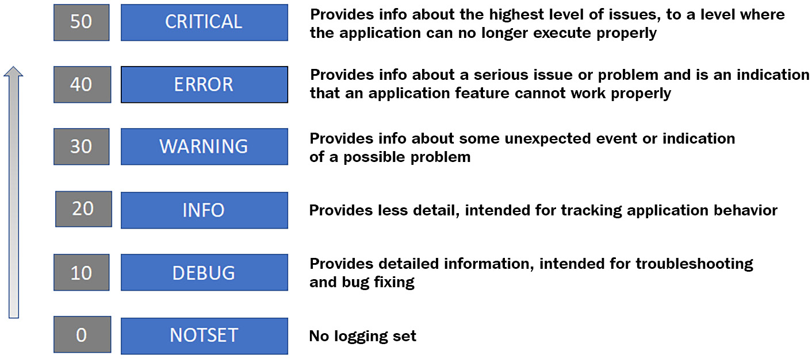

在前面的章节中，我们讨论了在 Python 中构建模块化和可重用程序的不同方法。在本章中，我们将研究 Python 编程语言的一些高级概念，例如迭代器、生成器、日志记录和错误处理。这些概念对于编写高效且可重用的代码很重要。对于本章，我们假设您熟悉 Python 语言语法并知道如何编写控制和循环结构。
在本章中，我们将学习 Python 中的循环是如何工作的，文件是如何处理的，打开和访问文件的最佳实践是什么，以及如何处理可能预期或意外的错误情况。我们还将研究 Python 中的日志支持以及配置日志系统的不同方式。本章还将帮助您学习如何使用 Python 中的高级库来构建复杂的项目。
我们将在本章中讨论以下主题：
介绍 Python 数据容器
使用迭代器和生成器进行数据处理
在 Python 中处理文件
处理错误和异常
使用 Python 日志记录模块
在本章结束时，您将学习如何构建迭代器和生成器，如何处理程序中的错误和异常，以及如何以有效的方式为 Python 项目实现日志记录。

## 技术要求

本章的技术要求是您需要在您的计算机上安装 Python 3.7 或更高版本。本章的示例代码可以在 https://github.com/PacktPublishing/Python-for-Geeks/tree/master/Chapter04 找到。
让我们首先更新我们关于 Python 中可用数据容器的知识，这将对本章的后续主题有所帮助。

## 介绍 Python 数据容器

Python 支持多种数据类型，包括数字和集合。定义数字数据类型（如整数和浮点数）是基于为变量赋值。我们分配给变量的值决定了数字数据类型的类型。请注意，特定构造函数（例如，int() 和 float()）也可用于创建特定数据类型的变量。容器数据类型也可以通过以适当的格式分配值或为每个集合数据类型使用特定的构造函数来定义。在本节中，我们将研究五种不同的容器数据类型：字符串、列表、元组、字典和集合。

### 字符串

字符串不是直接的容器数据类型。但讨论字符串数据类型很重要，因为它在 Python 编程中的广泛使用，而且字符串数据类型是使用不可变的 Unicode 代码点序列实现的。它使用序列（集合类型）这一事实使其成为本节讨论的候选对象。
字符串对象是 Python 中的不可变对象。由于具有不变性，字符串对象为并发程序提供了一个安全的解决方案，其中多个函数可以访问同一个字符串对象并返回相同的结果。对于可变对象，这种安全性是不可能的。作为不可变对象，字符串对象通常用作字典数据类型的键或集合数据类型的数据元素。不变性的缺点是，即使对现有字符串实例进行小的更改，也需要创建新实例。
可变对象与不可变对象
可变对象在创建后可以更改，但无法更改不可变对象。
可以使用匹配的单引号（例如 'blah'）、双引号（例如 "blah blah"）或三重单引号或双引号（例如 """none""" 或 ' ''没有任何'''）。还值得一提的是，字符串对象在 Python 3 和 Python 2 中的处理方式不同。在 Python 3 中，字符串对象只能保存 Unicode 数据点形式的文本序列，但在 Python 2 中，它们可以保存文本和字节数据.在 Python 3 中，字节数据由字节数据类型处理。
在 Python 3 中将文本与字节分开使其干净高效，但以数据可移植性为代价。字符串中的 Unicode 文本不能在不将其转换为二进制格式的情况下保存到磁盘或发送到网络上的远程位置。这种转换需要将字符串数据编码成字节序列，可以通过以下方式之一实现：

- 使用 str.encode (encoding, errors) 方法：此方法可用于字符串对象，它可以接受两个参数。用户可以提供要使用的编解码器类型（默认为 UTF-8）以及如何处理错误。
- 转换为字节数据类型：通过将字符串实例与编码方案和错误处理方案一起传递给字节构造函数，可以将字符串对象转换为字节数据类型。

根据 Python 版本，可以在官方 Python 文档中找到任何字符串对象可用的方法和属性的详细信息。

### 列表

列表是 Python 中的基本集合类型之一，用于使用单个变量存储多个对象。列表是动态且可变的，这意味着列表中的对象可以更改，列表可以增长或缩小。
Python 中的列表对象不是使用任何链表概念实现的，而是使用变长数组实现的。该数组包含对其正在存储的对象的引用。该数组的指针及其长度存储在列表头结构中，当对象从列表中添加或删除时，该结构保持最新。这种数组的行为看起来像一个列表，但实际上，它不是一个真正的列表。这就是为什么 Python 列表上的某些操作没有优化的原因。例如，向列表中插入一个新对象并从列表中删除对象的复杂度为 n。
为了挽救这种情况，Python 在集合内置模块中提供了一个 deque 数据类型。 deque 数据类型提供堆栈和队列的功能，对于问题陈述需要类似链表的行为的情况，它是一个很好的替代选项。
列表可以创建为空或使用方括号使用初始值。接下来，我们提供一个代码片段，演示如何仅使用方括号或使用列表对象构造函数创建空或非空列表对象：
```python
e1 = []                  #an empty list
e2 = list()              #an empty list via constructor
g1 = ['a', 'b']          #a list with 2 elements
g2 = list(['a', 'b'])    #a list with 2 elements using a \
                          constructor
g3 = list(g1)            #a list created from a list
```
可以在官方 Python 文档中查看列表对象可用操作的详细信息，例如添加、插入、追加和删除。我们将在下一节介绍元组。
### 元组

元组是一个不可变的列表，这意味着它在创建后不能被修改。元组通常用于少量条目，并且当集合中条目的位置和顺序很重要时。为了保持条目的顺序，元组被设计为不可变的，这就是元组与列表的区别。元组上的操作通常比常规列表数据类型快。在集合中的值需要以特定顺序保持不变的情况下，使用元组是首选选项，因为它们具有卓越的性能。
元组通常用值初始化，因为它们是不可变的。可以使用括号创建一个简单的元组。下一个代码片段显示了创建元组实例的几种方法：
```python
w = ()                     #an empty tuple
x = (2, 3)                 #tuple with two elements
y = ("Hello World")        #not a tuple, Comma is required for single entry tuple
z = ("Hello World",)       #A comma will make it a tuple
```

在此代码片段中，我们创建了一个空元组 (w)、一个带有数字的元组 (x) 和一个带有文本 Hello World 的元组，即 z。变量 y 不是元组，因为对于 1 元组（单对象元组），我们需要一个尾随逗号来表示它是一个元组。
介绍完列表和元组，我们再简单介绍一下字典。

### 字典

字典是 Python 中最常用和最通用的数据类型之一。字典是一个集合，用于以键：值格式存储数据值。字典是可变的无序数据类型。在其他编程语言中，它们被称为关联数组或哈希表。
可以使用带有键值对列表的大括号创建字典。键与值之间用冒号“:”分隔，键值对用逗号“,”分隔。字典定义的代码片段如下：

```python
mydict = {
  "brand": "BMW",
  "model": "330i",
  "color": "Blue"
}
```


字典中不允许有重复的键。键必须是不可变的对象类型，例如字符串、元组或数字。字典中的值可以是任何数据类型，甚至包括列表、集合、自定义对象，甚至另一个字典本身。
在处理字典时，三个对象或列表很重要：
键：字典中的键列表用于遍历字典项。可以使用 keys() 方法获取密钥列表：

```python
dict_object.keys()
```

值：值是针对不同键存储的对象。可以使用 values() 方法获取值对象列表：

```python
dict_object.values()
```

项目：项目是存储在字典中的键值对。可以使用 items() 方法获取项目列表：

```python
dict_object.items()
```

接下来，我们将讨论集合，它也是 Python 中的关键数据结构。

### 集合

集合是对象的唯一集合。集合是可变且无序的集合。集合中不允许重复对象。 Python 使用哈希表数据结构来实现集合中的唯一性，这与用于确保字典中键的唯一性的方法相同。 Python 中集合的行为与数学中的集合非常相似。这种数据类型在对象的顺序不重要但它们的唯一性很重要的情况下找到了它的应用。这有助于测试某个集合是否包含某个对象。

> 提示
> 如果需要集合的行为作为不可变数据类型，Python 有一个称为frozenset 的集合的变体实现。

可以使用大括号或使用 set 构造函数 (set()) 创建新的 set 对象。下一个代码片段显示了一些创建集合的示例：

```python
s1 = set()            # empty set
s2 = {}               # an empty set using curly
s3 = set(['a', 'b'])  # a set created from a list with                       # const.
s3 = {1,2}            # a set created using curly bracket
s4 = {1, 2, 1}        # a set will be created with only 1 and 2 objects. Duplicate object will be ignored
```

使用索引方法无法访问集合对象。我们需要像列表一样从集合中弹出一个对象，或者我们可以迭代一个集合来一个一个地获取对象。与数学集合一样，Python 中的集合也支持并、交、差等运算。
在本节中，我们回顾了 Python 3 中字符串和集合数据类型的关键概念，它们对于理解即将到来的主题——迭代器和生成器很重要。

### 使用迭代器和生成器进行数据处理

迭代是用于数据处理和数据转换的关键工具之一。当处理大型数据集以及将整个数据集放入内存是不可能或高效的时，迭代特别有用。迭代器提供了一种将数据一次一项地放入内存的方法。
可以通过使用单独的类定义迭代器并实现诸如 \_\_iter\_\_ 和 \_\_next\_\_ 之类的特殊方法来创建迭代器。但是还有一种使用 yield 操作创建迭代器的新方法，称为生成器。在接下来的小节中，我们将研究迭代器和生成器。

### 迭代器

迭代器是用于迭代其他对象的对象。迭代器可以迭代的对象称为可迭代对象。理论上，这两个对象是不同的，但是可以在 iterable 对象类中实现迭代器。这不是推荐的，但在技术上是可行的，我们将通过一个例子讨论为什么这种方法不是一个好的设计方法。在下一个代码片段中，我们提供了几个在 Python 中使用 for 循环进行迭代的示例：

```python
#iterator1.py
#example 1: iterating on a list
for x in [1,2,3]:
    print(x)
#example 2: iterating on a string
for x in "Python for Geeks":
    print(x, end="")
print('')
#example 3: iterating on a dictionary
week_days = {1:'Mon', 2:'Tue',
             3:'Wed', 4:'Thu',
             5:'Fri', 6:'Sat', 7:'Sun'}
for k in week_days:
   print(k, week_days[k])
#example 4: iterating on a file
for row in open('abc.txt'):
    print(row, end="")
```

在这些代码示例中，我们使用了不同的 for 循环来迭代列表、字符串、字典和文件。所有这些数据类型都是可迭代的，因此我们将使用带有 for 循环的简单语法来遍历这些集合或序列中的项目。接下来，我们将研究哪些成分使对象可迭代，也称为迭代器协议。

> 重要的提示
> 默认情况下，Python 中的每个集合都是可迭代的。

在 Python 中，迭代器对象必须实现两个特殊方法：\_\_iter\_\_ 和 \_\_next\_\_。要迭代一个对象，该对象必须至少实现 \_\_iter\_\_ 方法。一旦对象实现了 \_\_iter\_\_ 方法，我们就可以调用该对象可迭代。这些方法描述如下：

- \_\_iter\_\_：该方法返回迭代器对象。在循环开始时调用此方法以获取迭代器对象。
- \_\_next\_\_：在循环的每次迭代中调用此方法，并返回可迭代对象中的下一项。

为了解释如何构建可迭代的自定义对象，我们将实现 Week 类，该类将所有工作日的数字和名称存储在字典中。默认情况下，此类将不可迭代。为了使其可迭代，我们将添加 \_\_iter\_\_。为了保持示例简单，我们还将在同一个类中添加 \_\_next\_\_ 方法。这是带有 Week 类和主程序的代码片段，它通过迭代获取工作日的名称：

```python
#iterator2.py
class Week:
    def __init__(self):
        self.days = {1:'Monday', 2: "Tuesday",
                     3:"Wednesday", 4: "Thursday",
                     5:"Friday", 6:"Saturday", 7:"Sunday"}
        self._index = 1
    def __iter__(self):
        self._index = 1
        return self
    def __next__(self):
        if self._index < 1 | self._index > 7 :
            raise StopIteration
        else:
            ret_value =  self.days[self._index]
            self._index +=1
        return ret_value
if(__name__ == "__main__"):
    wk = Week()
    for day in wk:
        print(day)
```

我们共享此代码示例只是为了演示如何在同一对象类中实现 \_\_iter\_\_ 和 \_\_next\_\_ 方法。 这种实现迭代器的风格在互联网上很常见，但它不是推荐的方法，被认为是一种糟糕的设计。 原因是当我们在 for 循环中使用它时，我们将主对象作为迭代器返回，因为我们在同一个类中实现了 \_\_iter\_\_ 和 \_\_next\_\_。 这可能会产生不可预测的结果。 我们可以通过为同一类 Week 执行以下代码片段来证明这一点：

```python
#iterator3.py
class Week:
#class definition is the same as shown in the previous \
code example
if(__name__ == "__main__"):
    wk = Week()
    iter1 = iter(wk)
    iter2 = iter(wk)
    print(iter1.__next__())
    print(iter2.__next__())
    print(next(iter1))
    print(next(iter2))
```

在这个新的主程序中，我们使用两个不同的迭代器对同一个对象进行迭代。这个主程序的结果并不像预期的那样。这是由于两个迭代器共享一个公共 _index 属性。这是一个控制台输出作为参考：
周一
周二
周三
周四
请注意，在这个新的主程序中，我们故意没有使用 for 循环。我们使用 iter 函数为 Week 类的同一个对象创建了两个迭代器对象。 iter 函数是一个 Python 标准函数，它调用 \_\_iter\_\_ 方法。为了获取可迭代对象中的下一项，我们直接使用了 \_\_next\_\_ 方法以及 next 函数。 next函数也是通用函数，和iter函数一样。这种使用可迭代对象作为迭代器的方法也不被认为是线程安全的。
最好的方法是始终使用单独的迭代器类，并始终通过 \_\_iter\_\_ 方法创建迭代器的新实例。每个迭代器实例都必须管理自己的内部状态。下面显示了 Week 类的相同代码示例的修订版本，其中包含一个单独的迭代器类：

```python
#iterator4.py
class Week:
    def __init__(self):
        self.days = {1: 'Monday', 2: "Tuesday",
                     3: "Wednesday", 4: "Thursday",
                     5: "Friday", 6: "Saturday", 7: "Sunday"}
        
    def __iter__(self):
        return WeekIterator(self.days)
class WeekIterator:
    def __init__(self, dayss):
        self.days_ref = dayss
        self._index = 1
    def __next__(self):
        if self._index < 1 | self._index > 8:
            raise StopIteration
        else:
            ret_value =  self.days_ref[self._index]
            self._index +=1
        return ret_valu
if(__name__ == "__main__"):
    wk = Week()
    iter1 = iter(wk)
    iter2 = iter(wk)
    print(iter1.__next__())
    print(iter2.__next__())
    print(next(iter1))
    print(next(iter2))
```

在这个修改后的代码示例中，我们有一个带有 \_\_next\_\_ 方法的单独迭代器类，它有自己的 _index 属性来管理迭代器状态。迭代器实例将引用容器对象（字典）。修改后的示例的控制台输出给出了预期的结果：每个迭代器分别在 Week 类的同一实例上进行迭代。控制台输出如下所示作为参考：
周一
周一
周二
周二
简而言之，要创建迭代器，我们需要实现 \_\_iter\_\_ 和 \_\_next\_\_ 方法，管理内部状态，并在没有可用值时引发 StopIteration 异常。接下来，我们将研究生成器，这将简化我们返回迭代器的方式。

### 生成器

生成器是一种返回可用于迭代的迭代器实例的简单方法，它通过仅实现生成器函数来实现。生成器函数类似于普通函数，但其中包含一个 yield 语句而不是 return 语句。生成器函数中仍然允许使用 return 语句，但不会用于返回可迭代对象中的下一项。
根据定义，如果一个函数中至少有一个 yield 语句，那么它就是一个生成器函数。使用yield语句的主要区别在于它暂停函数并保存其内部状态，并且下次调用该函数时，它从上次产生的行开始。这种设计模式使迭代器功能简单而高效。
在内部，诸如 \_\_iter\_\_ 和 \_\_next\_\_ 之类的方法是自动实现的，并且也会自动引发 StopIteration 异常。本地属性及其值在连续调用之间保留，开发人员无需实现额外的逻辑。 Python 解释器在识别生成器函数（其中包含 yield 语句的函数）时提供所有这些功能。
为了理解生成器的工作原理，我们将从一个简单的生成器示例开始，该示例用于生成字母表的前三个字母的序列：

```python
#generators1.py
def my_gen():
    yield 'A'
    yield 'B'
    yield 'C'
if(__name__ == "__main__"):
    iter1 = my_gen()
    print(iter1.__next__())
    print(next(iter1))
    print(iter1.__next__())
```

在这个代码示例中，我们使用三个没有 return 语句的 yield 语句实现了一个简单的生成器函数。在程序的主要部分，我们做了以下事情：
我们调用了生成器函数，它返回一个迭代器实例。在这个阶段，没有执行 my_gen() 生成器函数中的任何行。
使用迭代器实例，我们调用了 \_\_next\_\_ 方法，该方法开始执行 my_gen() 函数，在执行第一个 yield 语句后暂停，并返回 A。
接下来，我们在迭代器实例上调用 next() 函数。结果与我们使用 \_\_next\_\_ 方法得到的结果相同。但这一次， my_gen() 函数从上次暂停的下一行开始执行，因为 yield 语句。下一行是另一个 yield 语句，它导致在返回字母 B 后又一次暂停。
下一个 \_\_next\_\_ 方法将导致执行下一个 yield 语句，该语句将返回字母 C。
接下来，我们将重新审视 Week 类及其迭代器实现，并将使用生成器而不是迭代器类。示例代码如下所示：

```python
#generator2.py
class Week:
    def __init__(self):
        self.days = {1:'Monday', 2: "Tuesday",
                     3:"Wednesday", 4: "Thursday",
                     5:"Friday", 6:"Saturday", 7:"Sunday"}
    def week_gen(self):
        for x in self.days:
            yield self.days[x]
if(__name__ == "__main__"):
    wk = Week()
    iter1 = wk.week_gen()
    iter2 = iter(wk.week_gen())
    print(iter1.__next__())
    print(iter2.__next__())
    print(next(iter1))
    print(next(iter2))
```

与 iterator4.py 相比，使用生成器实现 Week 类更简单、更清晰，我们可以达到相同的结果。 这就是生成器的强大之处，这就是它们在 Python 中非常流行的原因。 在结束本主题之前，重要的是要强调生成器的其他一些关键特性：

**生成器表达式**：生成器表达式可用于动态创建简单的生成器（也称为匿名函数），而无需编写特殊方法。 语法类似于列表推导式，只是我们使用圆括号而不是方括号。 下一个代码示例（我们为列表推导引入的示例的扩展）展示了如何使用生成器表达式来创建生成器、其用法以及与列表推导的比较：

```python
#generator3.py
L = [1, 2, 3, 4, 5, 6, 7, 8, 9, 0]
f1 = [x+1 for x in L]
g1 = (x+1 for x in L)
print(g1.__next__())
print(g1.__next__())
```

**无限流**：生成器也可用于实现无限数据流。 将无限流带入内存始终是一个挑战，使用生成器很容易解决这个问题，因为它们一次只返回一个数据项。
**流水线生成器**：在处理复杂问题时，可以使用多个生成器作为流水线来实现任何目标。 流水线多个生成器的概念可以用一个例子来解释。 我们遇到一个问题，就是求素数的平方和。 这个问题可以用传统的 for 循环来解决，但我们将尝试使用两个生成器来解决它：prime_gen 生成器用于生成素数，x2_gen 生成器用于获取由 prime_gen 生成器提供给该生成器的素数的平方。 我们将两个生成器通过管道输入 sum 函数以获得所需的结果。 以下是此问题解决方案的代码片段：

```python
#generator4.py
def prime_gen(num):
    for cand in range(2, num+1):
        for i in range (2, cand):
            if (cand % i) == 0:
                break
        else:
            yield cand
def x2_gen(list2):
    for num in list2:
        yield num*num
print(sum(x2_gen(prime_gen(5))))
```

生成器在按需运行的基础上运行，这不仅使它们具有内存效率，而且还提供了一种在需要时生成值的方法。这有助于避免不必要的数据生成，这些数据可能根本不会被使用。生成器非常适合用于大量数据处理，将数据从一个函数传送到另一个函数，以及模拟并发性。
在下一节中，我们将研究如何在 Python 中处理文件。

### 在 Python 中处理文件

从文件读取数据或将数据写入文件是任何编程语言都支持的基本操作之一。 Python 为处理文件操作提供了广泛的支持，这些操作主要在其标准库中可用。在本节中，我们将讨论核心文件操作，例如打开文件、关闭文件、读取文件、写入文件、使用上下文管理器管理文件以及使用 Python 标准库使用一个句柄打开多个文件。我们将在下一小节开始讨论文件操作。

#### 文件操作

文件操作通常从打开文件开始，然后读取或更新该文件中的内容。核心文件操作如下：
打开和关闭文件
要将任何读取或更新操作应用于文件，我们需要一个指向该文件的指针或引用。可以通过使用内置的 open 函数打开文件来获得文件引用。该函数返回对文件对象的引用，在某些文献中也称为文件句柄。 open 函数的最低要求是具有绝对或相对路径的文件名。一个可选参数是访问模式，用于指示打开文件的模式。访问模式可以是读、写、追加或其他。访问模式选项的完整列表如下：

- r：此选项用于以只读模式打开文件。如果未提供访问模式选项，则这是默认选项：

    ```python
    f = open ('abc.txt')
    ```

    

- a：此选项用于打开文件以在文件末尾追加新行：

    ```python
    f = open ('abc.txt', 'a')
    ```

    

- w：此选项用于打开文件进行写入。如果文件不存在，它将创建一个新文件。如果文件存在，此选项将覆盖它，并且该文件中的任何现有内容都将被销毁：

    ```python
    f = open ('abc.txt', 'w')
    ```

    

- x：此选项用于打开文件进行独占写入。如果文件已经存在，则会抛出错误：

    ```python
    f = open ('abc.txt', 'x')
    ```

    

- t：此选项用于以文本模式打开文件。这是默认选项。

- b: 此选项用于以二进制模式打开文件。

- +：此选项用于打开文件进行读写：

    ```python
    f = open ('abc.txt', 'r+')
    ```

可以组合模式选项以获得多个选项。除了文件名和访问模式选项，我们还可以传递编码类型，尤其是对于文本文件。以下是使用 utf-8 打开文件的示例：

```python
f = open("abc.txt", mode='r', encoding='utf-8')
```

当我们对一个文件完成我们的操作时，必须关闭该文件以释放资源供其他进程使用该文件。可以使用文件实例或文件句柄上的 close 方法关闭文件。下面是一段代码片段，展示了 close 方法的使用：

```python
file = open("abc.txt", 'r+w')
```

#文件操作
文件.close()
一旦文件被关闭，与文件实例和锁（如果有）相关联的资源将被操作系统释放，这是任何编程语言的最佳实践。
读取和写入文件
可以通过以访问模式 r 打开文件然后使用其中一种读取方法来读取文件。接下来，我们总结了可用于读取操作的不同方法：

- read(n)：此方法从文件中读取 n 个字符。
- readline()：此方法从文件中返回一行。
    r
- eadlines()：此方法将文件中的所有行作为列表返回。

同样，一旦以适当的访问模式打开文件，我们就可以追加或写入文件。与附加文件相关的方法如下：

- write (x)：此方法将字符串或字节序列写入文件，并返回添加到文件中的字符数。
- writelines（行）：此方法将行列表写入文件。

在下一个代码示例中，我们将创建一个新文件，向其中添加几行文本，然后使用前面讨论的读取操作读取文本数据：

```python
#writereadfile.py: write to a file and then read from it
f1 = open("myfile.txt",'w')
f1.write("This is a sample file\n")
lines =["This is a test data\n", "in two lines\n"]
f1.writelines(lines)
f1.close()
f2 = open("myfile.txt",'r')
print(f2.read(4))
print(f2.readline())
print(f2.readline())
f2.seek(0)
for line in f2.readlines():
    print(line)
f2.close()
```

在此代码示例中，我们首先将三行写入文件。在读取操作中，我们首先读取四个字符，然后使用 readline 方法读取两行。最后，我们使用 seek 方法将指针移回文件顶部，并使用 readlines 方法访问文件中的所有行。
在下一节中，我们将看到上下文管理器的使用如何使文件处理变得方便。

### 使用上下文管理器

在任何编程语言中，正确和公平地使用资源都是至关重要的。文件处理程序和数据库连接是许多示例，其中在处理对象后不按时释放资源是一种常见做法。如果资源根本不释放，就会导致内存泄漏，影响系统性能，最终导致系统崩溃。
为了解决内存泄漏和资源及时释放的问题，Python 提出了上下文管理器的概念。上下文管理器旨在根据设计精确地保留和释放资源。当上下文管理器与 with 关键字一起使用时，with 关键字之后的语句应该返回一个必须实现上下文管理协议的对象。这个协议需要两个特殊的方法来由返回的对象实现。这些特殊方法如下：

- .\_\_enter\_\_()：这个方法是用with关键字调用的，用于根据with关键字后面的语句保留所需的资源。
- .\_\_exit\_\_()：该方法在with块执行后调用，用于释放.\_\_enter\_\_()方法中保留的资源。

例如，当使用带有语句（块）的上下文管理器打开文件时，不需要关闭文件。文件打开语句将返回文件处理程序对象，该对象已经实现了上下文管理协议，一旦 with 块的执行完成，文件将自动关闭。使用上下文管理器写入和读取文件的代码示例的修订版本如下：

```python
#contextmgr1.py
with open("myfile.txt",'w') as f1:
    f1.write("This is a sample file\n")
    lines = ["This is a test data\n", "in two lines\n"]
    f1.writelines(lines)
with open("myfile.txt",'r') as f2:
    for line in f2.readlines():
        print(line)
```

带有上下文管理器的代码简单易读。 使用上下文管理器是打开和处理文件的推荐方法。

### 操作多个文件

Python 支持同时打开和操作多个文件。 我们可以用不同的方式打开这些文件并对其进行操作。 文件数量没有限制。 我们可以使用以下示例代码以读取模式打开两个文件，并以任意顺序访问这些文件：

> 1.txt
> 这是一个示例文件 1
> 这是测试数据 1

> 2.txt
> 这是一个示例文件 2
> 这是测试数据 2

```python
#multifilesread1.py
with open("1.txt") as file1, open("2.txt") as file2:
    print(file2.readline())
    print(file1.readline())
```

我们还可以使用此多文件操作选项从一个文件读取并写入另一个文件。 将内容从一个文件传输到另一个文件的示例代码如下：

```python
#multifilesread2.py
with open("1.txt",'r') as file1, open("3.txt",'w') as file2:
   for line in file1.readlines():
     file2.write(line)
```

Python 还有一个更优雅的解决方案来使用 fileinput 模块对多个文件进行操作。 该模块的输入函数可以获取多个文件的列表，然后将所有此类文件视为单个输入。 下面展示了包含两个输入文件 1.txt 和 2.txt 以及使用 fileinput 模块的示例代码：

```python
#multifilesread1.py
import fileinput
with fileinput.input(files = ("1.txt",'2.txt')) as f:
    for line in f:
        print(f.filename())
        print(line)
```

通过这种方法，我们得到了一个文件句柄，它可以按顺序对多个文件进行操作。接下来，我们将讨论 Python 中的错误和异常处理。

### 处理错误和异常

Python 中可能存在多种类型的错误。最常见的一种与程序的语法有关，通常称为语法错误。在许多情况下，程序执行期间会报告错误。此类错误称为运行时错误。可以在我们的程序中处理的运行时错误称为异常。本节将重点介绍如何处理运行时错误或异常。在进入错误处理之前，我们将简要介绍最常见的运行时错误，如下所示：

- IndexError：当程序尝试访问无效索引（内存中的位置）处的项目时，会发生此错误。
- ModuleNotFoundError：当在系统路径中找不到指定的模块时会抛出此错误。
- ZeroDivisionError：当程序尝试将数字除以零时会引发此错误。
- KeyError：当程序尝试使用无效键从字典中获取值时，会发生此错误。
- StopIteration：当 \_\_next\_\_ 方法在容器中找不到任何其他项目时，会抛出此错误。
- TypeError：当程序尝试对不适当类型的对象应用操作时会发生此错误。

完整的错误列表可在 Python 的官方文档中找到。在以下小节中，我们将讨论如何使用 Python 中的适当构造处理错误，有时也称为异常。

#### 在 Python 中处理异常

当出现运行时错误时，程序可能会突然终止，并可能导致系统资源损坏，例如损坏文件和数据库表。这就是为什么错误或异常处理是用任何语言编写健壮程序的关键因素之一。这个想法是预测可能会发生运行时错误，如果发生这样的错误，我们的程序的行为将如何作为对特定错误的响应。
像许多其他语言一样，Python 使用 try 和 except 关键字。这两个关键字后面是要执行的单独代码块。 try 块是一组常规语句，我们预计可能会发生错误。只有当 try 块中出现错误时，才会执行 except 块。接下来是使用 try 和 except 块编写 Python 代码的语法：

```python
try:
    #a series of statements
except:
    #statements to be executed if there is an error in \
     try block
```

如果我们预计一个特定的错误类型或多个错误类型，我们可以定义一个带有错误名称的 except 块，并可以根据需要添加任意数量的 except 块。 仅当在 try 块中引发命名异常时，才会执行此类命名的 except 块。 使用 except 块语句，我们还可以添加 as 语句将异常对象存储为在 try 块期间引发的变量。 下一个代码示例中的 try 块有许多可能的运行时错误，这就是为什么它有多个 except 块的原因：

```python
#exception1.py
try:
    print (x)
    x = 5
    y = 0
    z = x /y
    print('x'+ y)
except NameError as e:
    print(e)
except ZeroDivisionError:
    print("Division by 0 is not allowed")
except Exception as e:
    print("An error occured")
    print(e)
```

为了更好地说明except块的使用，我们添加了多个except块，接下来解释：

- NameError 块：当 try 块中的语句尝试访问未定义的变量时，将执行该块。在我们的代码示例中，当解释器尝试执行 print(x) 语句时，将执行此块。此外，我们将异常对象命名为 e 并将其与打印语句一起使用以获取与此错误类型关联的官方错误详细信息。
- ZeroDivisionError 块：当我们尝试执行 z = x/y 和 y = 0 时将执行此块。要执行此块，我们需要先修复 NameError 块。
- 默认的except块：这是一个包罗万象的except块，这意味着如果没有找到与前两个except块匹配的块，就会执行这个块。最后一条语句 print('x'+ y) 也将引发 TypeError 类型的错误，并将由该块处理。由于我们在这个块中没有收到任何一种特定类型的异常，我们可以使用 Exception 关键字将异常对象存储在一个变量中。

请注意，一旦在 try 块中的任何语句中发生错误，其余语句将被忽略，并且控制转到一个 except 块。在我们的代码示例中，我们需要先修复 NameError 错误以查看下一级异常等等。我们在示例中添加了三种不同类型的错误来演示如何为同一个 try 块定义多个 except 块。 except 块的顺序很重要，因为必须首先定义具有错误名称的更具体的 except 块，而没有指定错误名称的 except 块必须始终放在最后。
下图显示了所有异常处理块：


如上图所示，除了 try 和 except 块之外，Python 还支持 else 和 finally 块以增强错误处理功能。如果在 try 块期间没有出现错误，则执行 else 块。此块中的代码将正常执行，如果此块中发生任何错误，则不会抛出异常。如果需要，可以在 else 块中添加嵌套的 try 和 except 块。请注意，此块是可选的。
无论 try 块中是否存在错误，都会执行 finally 块。 finally 块中的代码在没有任何异常处理机制的情况下执行。该块主要用于通过关闭连接或打开文件来释放资源。虽然它是一个可选块，但强烈建议实现这个块。
接下来，我们将通过代码示例来了解这些块的使用。在这个例子中，我们将打开一个新文件用于在 try 块中写入。如果在打开文件时发生错误，则会抛出异常，我们将使用 except 块中的 print 语句将错误详细信息发送到控制台。如果没有发生错误，我们将执行 else 块中的代码，该代码将一些文本写入文件。在这两种情况下（错误或无错误），我们将在 finally 块中关闭文件。完整的示例代码如下：

```python
#exception2.py
try:
    f = open("abc.txt", "w")
except Exception as e:
    print("Error:" + e)
else:
    f.write("Hello World")
    f.write("End")
finally:
    f.close()
```

我们已经广泛地介绍了如何在 Python 中处理异常。 接下来，我们将讨论如何从 Python 代码中引发异常。

### 引发异常

当发生错误时，Python 解释器会在运行时引发异常或错误。 如果出现可能导致错误输出或程序崩溃的情况，我们也可以自己引发错误或异常。 引发错误或异常将提供程序的优雅退出。
可以使用 raise 关键字向调用者抛出异常（对象）。 异常可以是以下类型之一：

- 内置异常
- 自定义异常
- 一个通用的 Exception 对象

在下一个代码示例中，我们将调用一个简单的函数来计算平方根，并将实现它以在输入参数不是有效正数时抛出异常：

```python
#exception3.py
import math
def sqrt(num):
    if not isinstance(num, (int, float)) :
        raise TypeError("only numbers are allowed")
    if num < 0:
        raise Exception ("Negative number not supported")
    return math.sqrt(num)
if __name__ == "__main__":
    try:
        print(sqrt(9))
        print(sqrt('a'))
        print (sqrt(-9))
    except Exception as e:
        print(e)
```

在此代码示例中，当传递给 sqrt 函数的数字不是数字时，我们通过创建 TypeError 类的新实例来引发内置异常。 当传递的数字小于 0 时，我们还引发了一个通用异常。在这两种情况下，我们都将自定义文本传递给了它的构造函数。 在下一节中，我们将研究如何定义我们自己的自定义异常，然后将其抛出给调用者。

### 自定义异常

在 Python 中，我们可以通过创建一个必须从内置 Exception 类或其子类派生的新类来定义我们自己的自定义异常。 为了说明这个概念，我们将通过定义两个自定义异常类来替换内置的 TypeError 和 Exception 错误类型来修改我们之前的示例。 新的自定义异常类将从 TypeError 和 Exception 类派生。 以下是自定义异常的示例代码供参考：

```python
#exception4.py
import math
class NumTypeError(TypeError):
    pass
class NegativeNumError(Exception):
    def __init__(self):
        super().__init__("Negative number not supported")
def sqrt(num):
    if not isinstance(num, (int, float)) :
        raise NumTypeError("only numbers are allowed")
    if num < 0:
        raise NegativeNumError
    return math.sqrt(num)
if __name__ == "__main__":
    try:
        print(sqrt(9))
        print(sqrt('a'))
        print (sqrt(-9))
    except NumTypeError as e:
        print(e)
    except NegativeNumError as e:
        print(e)
```

在这个代码示例中，NumTypeError 类是从 TypeError 类派生的，我们没有在这个类中添加任何东西。 NegativeNumError 类继承自 Exception 类，我们覆盖其构造函数并为此异常添加自定义消息作为构造函数的一部分。当我们在 sqrt() 函数中引发这些自定义异常时，我们不会通过 NegativeNumError 异常类传递任何文本。当我们使用主程序时，我们使用 print (e) 语句获取消息，因为我们已将其设置为类定义的一部分。
在本节中，我们介绍了如何使用 try 和 except 块处理内置错误类型、如何定义自定义异常以及如何以声明方式引发异常。在下一节中，我们将介绍 Python 中的日志记录。

### 使用 Python 日志记录模块

日志记录是任何大小合理的应用程序的基本要求。日志记录不仅有助于调试和故障排除，还有助于深入了解应用程序内部问题的详细信息。日志记录的一些优点如下：
调试代码，尤其是诊断应用程序失败或崩溃的原因和时间
诊断异常的应用程序行为
为监管或法律合规事宜提供审计数据
识别用户行为和恶意尝试访问未经授权的资源
在讨论任何日志的实际示例之前，我们将首先讨论 Python 中日志系统的关键组件。

#### 核心日志组件介绍

以下组件是在 Python 中为应用程序设置日志记录的基础：

- Logger
- Logging levels
- Logging formatter
- Logging handler

Python 日志系统的高级架构可以在这里总结：


以下小节将详细讨论这些组件中的每一个。
记录器
记录器是 Python 日志系统的入口点。它是应用程序程序员的接口。 Python 中可用的 Logger 类提供了多种方法来记录具有不同优先级的消息。我们将在本节后面的代码示例中研究 Logger 类方法。
应用程序与 Logger 实例交互，该实例使用日志记录配置（例如日志记录级别）进行设置。在接收日志事件时，Logger 实例选择一个或多个合适的日志处理程序并将事件委托给这些处理程序。每个处理程序通常是为特定的输出目标而设计的。处理程序在将过滤器和格式应用于预期的输出目标后发送消息。
日志级别
日志系统的所有事件和消息的优先级不同。例如，有关错误的消息比警告消息更紧急。日志级别是一种为不同的日志事件设置不同优先级的方法。 Python 中定义了六个级别。每个级别都与一个表示严重性的整数值相关联。这些级别是 NOTSET、DEBUG、INFO、WARNING、ERROR 和 CRITICAL。这些总结如下：



#### 日志格式化

日志格式化程序组件有助于改进消息的格式，这对于一致性以及人类和机器可读性很重要。日志格式化程序还为消息添加了额外的上下文，例如时间、模块名称、行号、线程和进程，这对于调试目的非常有用。示例格式化程序表达式如下：
"%(asctime)s — %(name)s — %(levelname)s — %(funcName)s:%(lineno)d — %(message)s"
使用此类格式化程序表达式时，将显示类似于以下控制台输出的日志消息 hello Geeks of INFO 级别：
2021-06-10 19:20:10,864 - a.b.c - INFO - <模块名称>:10 - 你好极客
日志处理程序
日志处理程序的作用是将日志数据写入适当的目的地，可以是控制台、文件，甚至是电子邮件。 Python 中有许多类型的内置日志处理程序可用。这里介绍了一些流行的处理程序：

- StreamHandler 用于在控制台上显示日志
- FileHandler 用于将日志写入文件
- SMTPHandler 用于将日志发送到电子邮件
- SocketHandler 用于将日志发送到网络套接字
- SyslogHandler 用于将日志发送到本地或远程 Unix 系统日志服务器
- HTTPHandler 用于使用 GET 或 POST 方法将日志发送到 Web 服务器

日志处理程序使用日志格式化程序向日志添加更多上下文信息，并使用日志级别来过滤日志数据。

#### 使用日志记录模块

在本节中，我们将通过代码示例讨论如何使用日志记录模块。我们将从基本的日志记录选项开始，并逐步将它们提升到高级水平。
使用默认记录器
无需创建任何记录器类的实例，Python 中已经有一个默认记录器可用。默认记录器，也称为根记录器，可以通过导入日志记录模块并使用其方法来分派日志记录事件来使用。下一个代码片段显示了使用根记录器来捕获日志事件：

```python
#logging1.py
import logging
logging.debug("This is a debug message")
logging.warning("This is a warning message")
logging.info("This is an info message")
```

debug、warning 和 info 方法用于根据其严重性将日志记录事件分派给记录器。此记录器的默认日志级别设置为 WARNING，默认输出设置为 stderr，这意味着所有消息将仅发送到控制台或终端。此设置将阻止 DEBUG 和 INFO 消息显示在控制台输出上，如下所示：
警告：root：这是一条警告消息
可以通过在 import 语句后添加以下行来更改根记录器的级别：
logging.basicConfig(level=logging.DEBUG)
将日志级别更改为 DEBUG 后，控制台输出现在将显示所有日志消息：
DEBUG:root:这是一条调试信息
警告：root：这是一条警告消息
INFO:root:这是一条信息消息
尽管我们在本小节中讨论了默认记录器或根记录器，但不建议将其用于基本记录目的以外的用途。作为最佳实践，我们应该创建一个带有名称的新记录器，我们将在接下来的代码示例中讨论。

##### 使用命名记录器

我们可以用自己的名字创建一个单独的记录器，可能还有自己的日志级别、处理程序和格式化程序。下一个代码片段是使用自定义名称创建记录器并使用与根记录器不同的日志记录级别的示例：

```python
#logging2.py
import logging
logger1 = logging.getLogger("my_logger")
logging.basicConfig()
logger1.setLevel(logging.INFO)
logger1.warning("This is a warning message")
logger1.info("This is a info message")
logger1.debug("This is a debug message")
logging.info("This is an info message")
```

当我们使用带有字符串名称的 getLogger 方法或使用模块名称（通过使用 __name__ 全局变量）创建记录器实例时，那么只有一个实例被一个名称管理。这意味着如果我们尝试在应用程序的任何部分使用同名的 getLogger 方法，Python 解释器将检查是否已经为该名称创建了一个实例。如果已经创建了一个，它将返回相同的实例。
创建记录器实例后，我们需要调用根记录器（basicConfig()）为我们的记录器提供处理程序和格式化程序。如果没有任何处理程序配置，我们将获得一个内部处理程序作为最后的手段，它只会输出没有任何格式的消息，并且无论我们为记录器设置的日志记录级别如何，日志记录级别都将是 WARNING。此代码片段的控制台输出如下所示，正如预期的那样：
警告：my_logger：这是一条警告消息
INFO:my_logger:这是一条信息消息
还需要注意以下几点：
我们将记录器的日志级别设置为 INFO，我们能够记录警告和信息消息，但不能记录调试消息。
当我们使用根记录器（通过使用日志记录实例）时，我们无法发送信息消息。这是因为根记录器仍在使用默认的日志记录级别，即警告。

##### 使用带有内置处理程序和自定义格式化程序的记录器

我们可以使用内置处理程序但使用自定义格式化程序创建记录器对象。在这种情况下，处理程序对象可以使用自定义格式化程序对象，并且可以在我们开始将记录器用于任何日志事件之前将处理程序对象添加到记录器对象作为其处理程序。下面是一段代码片段，用于说明如何以编程方式创建处理程序和格式化程序，然后将处理程序添加到记录器：

```python
#logging3.py
import logging
logger = logging.getLogger('my_logger')
my_handler = logging.StreamHandler()
my_formatter = logging.Formatter('%(asctime)s - '\
                  '%(name)s - %(levelname)s - %(message)s')
my_handler.setFormatter(my_formatter)
logger.addHandler(my_handler)
logger.setLevel(logging.INFO)
logger.warning("This is a warning message")
logger.info("This is an info message")
logger.debug("This is a debug message")
```

我们可以使用 basicConfig 方法以及适当的参数创建具有相同设置的记录器。 下一个代码片段是带有 basicConfig 设置的 logging3.py 的修订版：

```python
#logging3A.py
import logging
logger = logging.getLogger('my_logger')
logging.basicConfig(handlers=[logging.StreamHandler()],
                    format="%(asctime)s - %(name)s - "
                           "%(levelname)s - %(message)s",
                    level=logging.INFO)
logger.warning("This is a warning message")
logger.info("This is an info message")
logger.debug("This is a debug message")
```
到目前为止，我们已经介绍了使用内置类和对象来设置记录器的情况。 接下来，我们将设置一个带有自定义处理程序和格式化程序的记录器。
##### 使用带有文件处理程序的记录器

日志处理程序将日志消息发送到它们的最终目的地。 默认情况下，每个记录器都设置为将日志消息发送到与正在运行的程序关联的控制台或终端。 但这可以通过使用具有不同目的地的新处理程序配置记录器来改变。 可以使用我们在上一小节中讨论过的两种方法之一来创建文件处理程序。 在本节中，我们将使用第三种方法，通过提供文件名作为此方法的属性，使用 basicConfig 方法自动创建文件处理程序。 这显示在下一个代码片段中：
```python
#logging4.py
import logging
logging.basicConfig(filename='logs/logging4.log'
                    ,level=logging.DEBUG)
logger = logging.getLogger('my_logger')
logger.setLevel(logging.INFO)
logger.warning("This is a warning message")
logger.info("This is a info message")
logger.debug("This is a debug message")
```
这将向我们使用 basicConfig 方法指定的文件生成日志消息，并根据设置为 INFO 的日志记录级别。

##### 以编程方式使用具有多个处理程序的记录器

创建具有多个处理程序的记录器非常简单，可以通过使用 basicConfig 方法或通过手动将处理程序附加到记录器来实现。 出于说明目的，我们将修改我们的代码示例 logging3.py 以执行以下操作：
我们将创建两个处理程序（一个用于控制台输出，一个用于文件输出），它们是 streamHandler 和 fileHandler 类的实例。
我们将创建两个单独的格式化程序，每个处理程序一个。 我们不会包括控制台处理程序的格式化程序的时间信息。
我们将为两个处理程序设置单独的日志记录级别。 重要的是要了解处理程序级别的日志记录级别不能覆盖根级别处理程序。
这是完整的代码示例：
```python
                  #logging5.py
import logging
logger = logging.getLogger('my_logger')
logger.setLevel(logging.DEBUG)
console_handler = logging.StreamHandler()
file_handler = logging.FileHandler("logs/logging5.log")
#setting logging levels at the handler level
console_handler.setLevel(logging.DEBUG)
file_handler.setLevel(logging.INFO)
#creating separate formatter for two handlers
console_formatter = logging.Formatter(
                  '%(name)s - %(levelname)s - %(message)s')
file_formatter = logging.Formatter('%(asctime)s - '
                  '%(name)s - %(levelname)s - %(message)s')
#adding formatters to the handler
console_handler.setFormatter(console_formatter)
file_handler.setFormatter(file_formatter)
#adding handlers to the logger
logger.addHandler(console_handler)
logger.addHandler(file_handler)
logger.error("This is an error message")
logger.warning("This is a warning message")
logger.info("This is an info message")
logger.debug("This is a debug message")
```
尽管我们为两个处理程序设置了不同的日志级别，即 INFO 和 DEBUG，但只有在 logger 的日志级别处于较低值（默认为 WARNING）时它们才会有效。这就是为什么我们必须在程序开始时将记录器的日志记录级别设置为 DEBUG。处理程序级别的日志记录级别可以是 DEBUG 或任何更高级别。每当为您的应用程序设计日志记录策略时，这是一个非常重要的考虑点。
在本节分享的代码示例中，我们基本上以编程方式配置了记录器。在下一节中，我们将研究如何通过配置文件配置记录器。

##### 使用配置文件配置具有多个处理程序的记录器

以编程方式设置记录器很有吸引力，但在生产环境中并不实用。在生产环境中，与开发设置相比，我们必须以不同的方式设置记录器配置，有时我们必须增强日志记录级别以解决仅在实时环境中遇到的问题。这就是为什么我们可以选择通过一个易于根据目标环境更改的文件来提供记录器配置。记录器的配置文件可以使用 JSON（JavaScript 对象表示法）或 YAML（另一种标记语言）或作为 .conf 文件中的键值对列表编写。出于说明目的，我们将使用 YAML 文件演示记录器配置，这与我们在上一节中以编程方式实现的完全相同。完整的YAML文件和Python代码如下：

```yaml
version: 1
formatters:
  console_formatter:
    format: '%(name)s - %(levelname)s - %(message)s'
  file_formatter:
      format: '%(asctime)s - %(name)s - %(levelname)s - %(message)s'
handlers:
  console_handler:
    class: logging.StreamHandler
    level: DEBUG
    formatter: console_formatter
    stream: ext://sys.stdout
  file_handler:
    class: logging.FileHandler
    level: INFO
    formatter: file_formatter
    filename: logs/logging6.log
loggers:
  my_logger:
    level: DEBUG
    handlers: [console_handler, file_handler]
    propagate: no
root:
  level: ERROR
  handlers: [console_handler]
```
以下是使用 YAML 文件配置记录器的 Python 程序：
```python
#logging6.py
import logging
import logging.config
import yaml
with open('logging6.conf.yaml', 'r') as f:
    config = yaml.safe_load(f.read())
    logging.config.dictConfig(config)
logger = logging.getLogger('my_logger')
logger.error("This is an error message")
logger.warning("This is a warning message")
logger.info("This is a info message")
logger.debug("This is a debug message")
```
为了从文件加载配置，我们使用了 dictConfig 方法而不是 basicConfig 方法。基于 YAML 的记录器配置的结果与我们使用 Python 语句实现的结果完全相同。对于全功能记录器，还有其他附加配置选项可用。
在本节中，我们介绍了为应用程序配置一个或多个记录器实例的不同场景。接下来，我们将讨论要记录什么类型的事件以及不记录什么类型的事件。
### 记录什么和不记录什么

关于我们应该记录哪些信息以及不记录哪些信息，一直存在争论。作为最佳实践，以下信息对于日志记录很重要：
应用程序应记录所有错误和异常，最合适的方法是在源模块中记录这些事件。
使用替代代码流处理的异常可以记录为警告。
出于调试目的，函数的进入和退出是用于记录的有用信息。
在代码中记录决策点也很有用，因为它有助于故障排除。
用户的活动和操作，尤其是与应用程序中某些资源和功能的访问相关的活动和操作，对于出于安全和审计目的进行日志记录很重要。
记录消息时，上下文信息也很重要，包括时间、记录器名称、模块名称、函数名称、行号、记录级别等。此信息对于识别路由原因分析至关重要。
关于此主题的后续讨论是不应该为日志记录的内容。我们不应记录任何敏感信息，例如用户 ID、电子邮件地址、密码以及任何私人和敏感数据。我们还应避免记录任何个人和业务记录数据，例如健康记录、政府签发的文件详细信息和组织详细信息。
## 概括

在本章中，我们讨论了需要使用高级 Python 模块和库的各种主题。我们首先更新了有关 Python 中数据容器的知识。接下来，我们学习了如何为可迭代对象使用和构建迭代器。我们还介绍了生成器，它比迭代器更高效、更易于构建和使用。我们讨论了如何打开和读取文件以及如何写入文件，然后讨论了如何对文件使用上下文管理器。在下一个主题中，我们讨论了如何在 Python 中处理错误和异常，如何通过编程引发异常，以及如何定义自定义异常。异常处理是任何体面的 Python 应用程序的基础。在上一节中，我们介绍了如何使用处理程序和格式化程序的不同选项在 Python 中配置日志记录框架。
完成本章后，您现在知道如何构建自己的迭代器和设计生成器函数来迭代任何可迭代对象，以及如何在 Python 中处理文件、错误和异常。您还学习了如何使用一个或多个处理程序设置记录器，以使用不同的日志记录级别来管理应用程序的日志记录。您在本章中学到的技能是构建任何开源或商业应用程序的关键。
在下一章中，我们将把重点转向如何构建和自动化单元测试和集成测试。
## 问题

列表和元组有什么区别？
使用上下文管理器时将始终使用哪个 Python 语句？
else 语句与 try-except 块有什么用？
生成器比迭代器更好用。为什么？
使用多个处理程序进行日志记录有什么用？
## 进一步阅读

Luciano Ramalho 的 Fluent Python
John Hunt 的 Python 3 编程高级指南
Doug Hellmann 的 Python 3 标准库示例
Python 3.7.10 文档 (https://docs.python.org/3.7/)
要了解有关可用于配置记录器的其他选项的更多信息，您可以参考 https://docs.python.org/3/library/logging.config.html 上的官方 Python 文档
## 答案

列表是可变对象，而元组是不可变的。这意味着我们可以在创建列表后更新它。对于元组，情况并非如此。
with 语句与上下文管理器一起使用。
只有当 try 块中的代码执行没有任何错误时，才会执行 else 块。一旦在 try 块中执行了核心功能而没有任何问题，就可以在 else 块中对后续操作进行编码。
与迭代器相比，生成器在内存中是高效的，并且也易于编程。生成器函数会自动提供一个迭代器实例和开箱即用的下一个函数实现。
多个处理程序的使用很常见，因为一个处理程序通常专注于一种类型的目的地。如果我们需要将日志事件发送到多个目的地并且可能具有不同的优先级，我们将需要多个处理程序。此外，如果我们需要将消息记录到具有不同日志级别的多个文件中，我们可以创建不同的文件处理程序来协调多个文件。