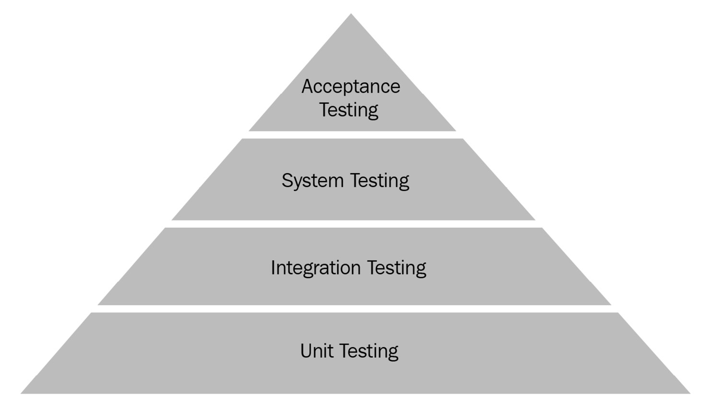
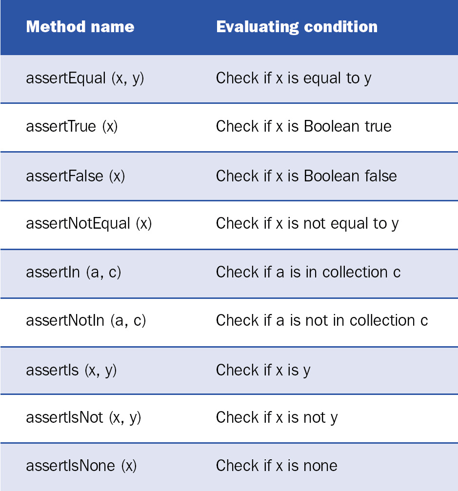
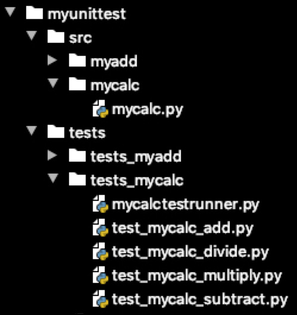
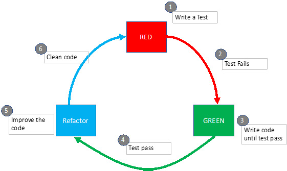
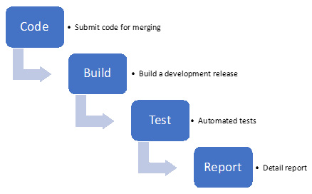

软件测试是根据用户要求或所需规范验证应用程序或程序并评估软件的可扩展性和优化目标的过程。将软件验证为真正的用户需要很长时间，而且不是对人力资源的有效利用。此外，测试不是只执行一两次，而是作为软件开发的一部分的一个连续过程。为了挽救这种情况，建议将测试自动化用于各种测试。测试自动化是一组为验证应用程序行为而编写的程序，这些程序使用不同的场景作为这些程序的输入。对于专业的软件开发环境，每次将源代码更新（也称为提交操作）到中央存储库时，都必须执行自动化测试。
在本章中，我们将研究不同的自动化测试方法，然后查看可用于 Python 应用程序的不同类型的测试框架和库。然后，我们将专注于单元测试，并将研究在 Python 中实现单元测试的不同方法。接下来，我们将研究测试驱动开发 (TDD) 的用处以及实现它的正确方法。最后，我们将专注于自动化持续集成 (CI)，并将研究稳健高效地实施它所面临的挑战。本章将帮助您从各个层面了解 Python 中自动化测试的概念。
我们将在本章中讨论以下主题：

- 了解不同级别的测试
- 使用 Python 测试框架
- 执行TDD
- 引入自动化 CI

在本章结束时，您不仅将了解不同类型的测试自动化，还将能够使用两种流行的测试框架之一编写单元测试。

## 技术要求

这些是本章的技术要求：

- 您需要在您的计算机上安装 Python 3.7 或更高版本。
- 您需要在 Test PyPI 中注册一个帐户并在您的帐户下创建一个应用程序编程接口 (API) 令牌。

本章的示例代码可以在 https://github.com/PacktPublishing/Python-for-Geeks/tree/master/Chapter05 找到。

## 了解不同级别的测试

根据应用程序类型、复杂性级别以及处理应用程序的团队的角色，在不同级别执行测试。不同级别的测试包括：

- 单元测试
- 集成测试
- 系统测试
- 验收测试

这些不同级别的测试按此处显示的顺序应用：



这些测试级别将在下一小节中描述。

## 单元测试

单元测试是一种专注于最小可能单元级别的测试。一个单元对应于一个代码单元，它可以是模块中的函数或类中的方法，也可以是应用程序中的模块。单元测试单独执行单个代码单元并验证代码是否按预期工作。单元测试是开发人员用来在代码开发的早期阶段识别错误并在开发过程的第一次迭代中修复它们的一种技术。在 Python 中，单元测试主要针对特定的类或模块，而不涉及依赖项。
单元测试由应用程序开发人员开发，可以随时执行。单元测试是一种白盒测试。 Python 中可用于单元测试的库和工具有 pyunit (unittest)、pytest、doctest、nose 和其他一些。

## 集成测试

集成测试是关于以组的形式集体测试程序的各个单元。这种类型的测试背后的想法是测试应用程序的不同功能或模块的组合，以验证组件之间的接口以及它们之间的数据交换。
集成测试通常由测试人员而不是开发人员完成。这种类型的测试在单元测试过程之后开始，这种测试的重点是识别不同模块或功能一起使用时的集成问题。在某些情况下，集成测试需要在开发环境中可能无法提供的外部资源或数据。可以通过使用模拟测试来管理此限制，它为外部或内部依赖项提供替换模拟对象。模拟对象模拟真实依赖项的行为。模拟测试的示例可以是发送电子邮件或使用信用卡付款。
集成测试是一种黑盒测试。用于集成测试的库和工具与用于单元测试的库和工具几乎相同，不同之处在于测试的边界被进一步扩展以在单个测试中包含多个单元。

## 系统测试

系统测试的边界被进一步推到系统级别，它可能是一个成熟的模块或一个应用程序。这种类型的测试从端到端 (E2E) 的角度验证应用程序功能。
系统测试也由测试人员开发，但在完成集成测试过程之后。可以说集成测试是系统测试的前提；否则，在执行系统测试时会重复很多工作。系统测试可以识别潜在问题，但不能确定问题的位置。问题的确切根本原因通常是通过集成测试甚至通过添加更多单元测试来确定的。
系统测试也是一种黑盒测试，可以利用可用于集成测试的相同库。

## 验收测试

验收测试是最终用户在接受软件进行日常使用之前的测试。验收测试通常不是自动化测试的候选者，但在应用程序用户必须使用 API 与产品交互的情况下，使用自动化进行验收测试是值得的。此测试也称为用户验收测试 (UAT)。这种类型的测试很容易与系统测试混淆，但它的不同之处在于它从真实用户的角度确保了应用程序的可用性。还有另外两种类型的验收测试：工厂验收测试 (FAT) 和操作验收测试 (OAT)。前者从硬件的角度来看更受欢迎，后者由运营团队执行，负责在生产环境中使用产品。
此外，我们还听说了 alpha 和 beta 测试。这些也是用户级别的测试方法，并不适用于测试自动化。 Alpha 测试由开发人员和内部员工执行以模拟实际用户行为。 Beta 测试由客户或实际用户在宣布软件通用可用性 (GA) 之前进行早期反馈。
我们还在软件开发中使用术语回归测试。这基本上是每次我们对源代码进行更改或任何内部或外部依赖项更改时执行测试。这种做法可确保我们的产品以与更改前相同的方式运行。由于回归测试会重复多次，因此此类测试必须自动化测试。
在下一节中，我们将研究如何使用 Python 中的测试框架构建测试用例。

## 使用 Python 测试框架
Python 带有用于测试自动化的标准库和第三方库。这里列出了最流行的框架：

- pytest
- unittest
- doctest
- nose

这些框架可用于单元测试以及集成和系统测试。在本节中，我们将评估其中两个框架：unittest，它是 Python 标准库的一部分，以及 pytest，它作为外部库提供。本次评估的重点将是使用这两个框架构建测试用例（主要是单元测试），尽管集成和系统测试也可以使用相同的库和设计模式构建。
在我们开始编写任何测试用例之前，了解什么是测试用例很重要。在本章和本书的上下文中，我们可以将测试用例定义为一种根据预期结果验证编程代码特定行为结果的方法。测试用例的开发可以分为以下四个阶段：

- 安排：这是我们为测试用例准备环境的阶段。这不包括任何操作或验证步骤。在测试自动化社区，这个阶段通常被称为准备测试装置。
- 行动：这是触发我们要测试的系统的行动阶段。这个动作阶段会导致系统行为发生变化，而系统状态的变化是我们为了验证目的想要评估的东西。请注意，我们在此阶段不验证任何内容。
- 断言：在此阶段，我们评估行为阶段的结果并根据预期结果验证结果。基于此验证，测试自动化工具将测试用例标记为失败或通过。在大多数工具中，这种验证是使用内置的断言函数或语句来实现的。
- 清理：在此阶段清理环境以确保其他测试不受由行为阶段引起的状态更改的影响。

测试用例的核心阶段是行为和断言。安排和清理阶段是可选的，但强烈推荐。这两个阶段主要提供软件测试夹具。测试夹具是一种设备、设备或软件，它提供了一个环境来一致地测试设备或机器或软件。术语测试装置用于单元测试和集成测试的相同上下文中。
测试框架或库提供了辅助方法或语句来方便地实现这些阶段。在接下来的部分中，我们将针对以下主题评估 unittest 和 pytest 框架：

- 如何为行为和断言阶段构建基础级别的测试用例
- 如何使用测试装置构建测试用例
- 如何为异常和错误验证构建测试用例
- 如何批量运行测试用例
- 如何在执行中包含和排除测试用例

这些主题不仅涵盖了各种测试用例的开发，还包括执行它们的不同方式。我们将使用 unittest 框架开始我们的评估。

## 使用unittest框架

在开始讨论单元测试框架或库的实际示例之前，重要的是介绍一些与单元测试相关的术语和传统方法名称，尤其是单元测试库。所有测试框架或多或少都使用此术语，并在此处概述：

- Test case：测试或测试用例或测试方法是一组代码指令，这些指令基于执行一个应用程序代码单元后的当前条件与执行后条件的比较。
- Test suite：测试套件是一组测试用例，这些用例可能具有共同的前提条件、初始化步骤和可能相同的清理步骤。这促进了测试自动化代码的可重用性并减少了执行时间。
- Test runner：这是一个 Python 应用程序，它执行测试（单元测试），验证代码中定义的所有断言，并将结果作为成功或失败返回给我们。
- Setup：这是测试套件中的一种特殊方法，将在每个测试用例之前执行。
- setupClass：这是测试套件中的一个特殊方法，它只会在测试套件中的测试开始执行时执行一次。
- teardown：这是测试套件中的另一种特殊方法，它在每次测试完成后执行，无论测试通过还是失败。
- teardownClass：这是测试套件中的另一个特殊方法，当套件中的所有测试都完成时，它只执行一次。

要使用 unittest 库编写测试用例，我们需要将测试用例实现为必须从 TestCase 基类继承的类的实例方法。 TestCase 类带有多种方法来方便编写和执行测试用例。这些方法分为三类，接下来讨论：

- **执行相关方法**：该类包含的方法有setUp、tearDown、setupClass、teardownClass、run、skipTest、skipTestIf、subTest、debug。测试运行器使用这些测试在测试用例之前或之后执行一段代码，或者运行一组测试用例、运行测试、跳过测试或将任何代码块作为子测试运行。在我们的测试用例实现类中，我们可以覆盖这些方法。 https://docs.python.org/3/library/unittest.html 上 Python 文档的一部分提供了这些方法的确切详细信息。
- **验证方法（断言方法）**：这些方法用于实现测试用例以检查成功或失败条件并自动报告测试用例的成功或失败。这些方法的名称通常以 assert 前缀开头。断言方法列表很长。我们在此提供常用的 assert 方法作为示例：

- 附加信息相关的方法和属性：这些方法和属性提供与要执行或已经执行的测试用例相关的附加信息。下面总结了该类别中的一些关键方法和属性：
  - a) failureException：该属性提供了由测试方法引发的异常。此异常可用作超类来定义带有附加信息的自定义失败异常。
  - b) longMessage：这个属性决定了如何处理作为参数传递给 assert 方法的自定义消息。如果此属性的值设置为 True，则消息将附加到标准失败消息。如果此属性设置为 false，则自定义消息将替换标准消息。
  - c) countTestCases()：此方法返回附加到测试对象的测试数量。
  - d) shortDescription()：如果添加了任何描述，此方法将使用文档字符串返回测试方法的描述。

我们已经在本节中回顾了 TestCase 类的主要方法。在下一节中，我们将探索如何使用 unittest 为示例模块或应用程序构建单元测试。
使用基础 TestCase 类构建测试用例
unittest 库是一个标准的 Python 测试框架，它受到 Java 社区中流行的测试框架 JUnit 框架的高度启发。单元测试写在单独的 Python 文件中，建议将这些文件作为主项目的一部分。正如我们在第 2 章使用模块化处理复杂项目中讨论的那样，在构建包部分，Python Packaging Authority (PyPA) 指南建议在为项目或库构建包时使用单独的文件夹进行测试。在本节的代码示例中，我们将遵循与此处显示的结构类似的结构：

```
Project-name
|-- src
|   -- __init__.py
|   -- myadd/myadd.py
|-- tests
|   -- __init__.py
|   -- tests_myadd/test_myadd1.py
|   -- tests_myadd/test_myadd2.py
|-- README.md
```

在我们的第一个代码示例中，我们将为 myadd.py 模块中的 add 函数构建一个测试套件，如下所示：

```python
# myadd.py with add two numbers
def add(x, y):
    """This function adds two numbers"""
    return x + y
```

重要的是要了解同一段代码可能有多个测试用例（在我们的例子中是一个 add 函数）。 对于 add 函数，我们通过改变输入参数的值实现了四个测试用例。 接下来是添加函数的四个测试用例的代码示例，如下：

```python
#test_myadd1.py test suite for myadd function
import unittest
from myunittest.src.myadd.myadd import add
class MyAddTestSuite(unittest.TestCase):
def test_add1(self):
    """ test case to validate two positive numbers"""
    self.assertEqual(15, add(10 , 5), "should be 15")
def test_add2(self):
    """ test case to validate positive and negative \
     numbers"""
    self.assertEqual(5, add(10 , -5), "should be 5")
def test_add3(self):
    """ test case to validate positive and negative \
     numbers"""
    self.assertEqual(-5, add(-10 , 5), "should be -5")
def test_add4(self):
    """ test case to validate two negative numbers"""
    self.assertEqual(-15, add(-10 , -5), "should be -15")
if __name__ == '__main__':
    unittest.main()
```

接下来讨论前面测试套件的所有关键点，如下：

- 要使用 unittest 框架实现单元测试，我们需要导入一个同名的标准库，unittest。
- 我们需要在我们的测试套件中导入我们想要测试的模块。在本例中，我们使用相对导入方法从 myadd.py 模块中导入了 add 函数（有关详细信息，请参阅第 2 章，使用模块化处理复杂项目的导入模块部分）
- 我们将实现一个从 unittest.Testcase 基类继承的测试套件类。测试用例在子类中实现，在本例中为 MyAddTestSuite 类。 unittest.Testcase 类构造函数可以将方法名称作为可用于运行测试用例的输入。默认情况下，已经实现了一个 runTest 方法，测试运行程序使用它来执行测试。在大多数情况下，我们不需要提供自己的方法或重新实现 runTest 方法。
- 要实现测试用例，我们需要编写一个以 test 前缀开头并后跟下划线的方法。这有助于测试运行者寻找要执行的测试用例。使用此命名约定，我们向测试套件添加了四种方法。
- 在每个测试用例方法中，我们使用了一个特殊的 assertEqual 方法，该方法可从基类获得。此方法代表测试用例的断言阶段，用于决定我们的测试是否被声明为通过或失败。该方法的第一个参数是单元测试的预期结果，第二个参数是我们执行被测代码后得到的值，第三个参数（可选）是报告中要提供的消息，以防万一测试失败。
- 在测试套件的最后，我们添加了 unittest.main 方法来触发测试运行器运行 runTest 方法，这使得在不使用控制台命令的情况下可以轻松执行测试。这个主要方法（引擎盖下的 TestProgram 类）将首先发现所有要执行的测试，然后执行测试。

> 重要的提示
> 单元测试可以使用 Python -m unittest <test suite or module> 之类的命令运行，但我们在本章中提供的代码示例将假设我们使用 PyCharm 集成开发环境 (IDE) 运行测试用例。

接下来，我们将使用测试装置构建下一个级别的测试用例。

### 使用测试装置构建测试用例

我们已经讨论了在执行测试用例之前和之后由测试运行器自动运行的 setUp 和 tearDown 方法。这些方法（连同 setUpClass 和 tearDownClass 方法）提供了测试装置，并且对于有效地实现单元测试很有用。
首先，我们将修改 add 函数的实现。在新的实现中，我们将使这个代码单元成为 MyAdd 类的一部分。我们还通过抛出 TypeError 异常来处理这种情况，以防输入参数无效。接下来是带有新 add 方法的完整代码片段：

```python
# myadd2.py is a class with add two numbers method
class MyAdd:
    def add(self, x, y):
        """This function adds two numbers"""
        if (not isinstance(x, (int, float))) | \
                (not isinstance(y, (int, float))) :
            raise TypeError("only numbers are allowed")
        return x + y
```

在上一节中，我们仅使用 act 阶段和 assert 阶段构建了测试用例。 在本节中，我们将通过添加 setUp 和 tearDown 方法来修改前面的代码示例。 接下来是这个 myAdd 类的测试套件，如下：

```python
#test_myadd2.py test suite for myadd2 class method
import unittest
from myunittest.src.myadd.myadd2 import MyAdd
class MyAddTestSuite(unittest.TestCase):
    def setUp(self):
        self.myadd = MyAdd()
    def tearDown(self):
        del (self.myadd)
    def test_add1(self):
       """ test case to validate two positive numbers"""
       self.assertEqual(15, self.myadd.add(10 , 5), "should be 15")
    def test_add2(self):
        """ test case to validate positive and negative           numbers"""
        self.assertEqual(5, self.myadd.add(10 , -5), "should be 5")
# test_add3 and test_add4 are skipped as they are very same as test_add1 and test_add2
```

在此测试套件中，我们添加或更改了以下内容：

- 我们添加了一个 setUp 方法，在该方法中我们创建了 MyAdd 类的新实例并将其引用保存为实例属性。这意味着我们将在执行任何测试用例之前创建 MyAdd 类的新实例。这对于此测试套件可能并不理想，因为更好的方法可能是使用 setUpClass 方法并为整个测试套件创建 MyAdd 类的单个实例，但为了说明目的，我们已通过这种方式实现它。
- 我们还添加了一个tearDown 方法。为了演示如何实现它，我们简单地调用了我们在 setUp 方法中创建的 MyAdd 实例上的析构函数（使用 del 函数）。与 setUp 方法一样，tearDown 方法在每个测试用例之后执行。如果我们打算使用 setUpClass 方法，则有一个等效的拆卸方法，即tearDownClass。

在下一节中，我们将展示将构建测试用例以处理 TypeError 异常的代码示例。

### 使用错误处理构建测试用例

在前面的代码示例中，我们仅将测试用例结果与预期结果进行了比较。我们没有考虑任何异常处理，例如如果将错误类型的参数作为输入传递给我们的 add 函数，我们的程序的行为会是什么。单元测试也必须涵盖编程的这些方面。
在下一个代码示例中，我们将构建测试用例来处理代码单元所预期的错误或异常。对于这个例子，我们将使用相同的 add 函数，如果参数不是数字，它会抛出一个 TypeError 异常。测试用例将通过将非数字参数传递给 add 函数来构建。下一个代码片段显示了测试用例：

```python
#test_myadd3.py test suite for myadd2 class method to validate errors
import unittest
from myunittest.src.myadd.myadd2 import MyAdd
class MyAddTestSuite(unittest.TestCase):
    def setUp(self):
        self.myadd = MyAdd()
    def test_typeerror1(self):
        """ test case to check if we can handle non number input"""
        self.assertRaises(TypeError, self.myadd.add, 'a' , -5)
    def test_typeerror2(self):
        """ test case to check if we can handle non number input"""
        self.assertRaises(TypeError, self.myadd.add, 'a' , 'b')
```

在前面的代码片段中，我们向 test_add3.py 模块添加了两个额外的测试用例。这些测试用例使用 assertRaises 方法来验证是否抛出特定类型的异常。在我们的测试用例中，我们使用单个字母 (a) 或两个字母 (a 和 b) 作为两个测试用例的参数。在这两种情况下，我们都希望抛出预期的异常 (TypeError)。请务必注意 assertRaises 方法的参数。此方法只需要方法或函数名称作为第二个参数。方法或函数的参数必须作为 assertRaises 函数的参数单独传递。
到目前为止，我们已经在一个测试套件下执行了多个测试用例。在下一节中，我们将讨论如何使用命令行和编程方式同时运行多个测试套件。

### 执行多个测试套件

当我们为每个代码单元构建测试用例时，测试用例（单元测试用例）的数量增长非常快。使用测试套件的想法是将模块化引入测试用例开发中。随着我们向应用程序添加更多功能，测试套件还可以更轻松地维护和扩展测试用例。我们想到的下一个方面是如何通过主脚本或工作流执行多个测试套件。 Jenkins 等 CI 工具提供了这种开箱即用的功能。 unittest、nose 或 pytest 等测试框架也提供了类似的功能。
在本节中，我们将构建一个简单的计算器应用程序（一个 MyCalc 类），其中包含加、减、乘和除方法。稍后，我们将为此类中的每个方法添加一个测试套件。这样，我们将为这个计算器应用程序添加四个测试套件。目录结构对于实现测试套件和测试用例很重要。对于此应用程序，我们将使用以下目录结构：



Python 代码编写在 mycalc.py 模块中，接下来显示了测试套件文件 (test_mycalc*.py)。 请注意，在接下来显示的代码示例中，我们仅在每个测试套件中显示一个测试用例。 实际上，每个测试套件中都会有多个测试用例。 我们将从 mycalc.py 文件中的计算器函数开始，如下所示：

```python
# mycalc.py with add, subtract, multiply and divide functions
class MyCalc:
    def add(self, x, y):
        """This function adds two numbers"""
        return x + y
    def subtract(self, x, y):
        """This function subtracts two numbers"""
        return x - y
    def multiply(self, x, y):
        """This function subtracts two numbers"""
        return x * y
    def divide(self, x, y):
        """This function subtracts two numbers"""
        return x / y
```

接下来，我们有一个测试套件来测试 test_mycalc_add.py 文件中的 add 函数，如以下代码片段所示：

```python
# test_mycalc_add.py test suite for add class method
import unittest
from myunittest.src.mycalc.mycalc import MyCalc
class MyCalcAddTestSuite(unittest.TestCase):
    def setUp(self):
        self.calc = MyCalc()
    def test_add(self):
        """ test case to validate two positive numbers"""
        self.assertEqual(15, self.calc.add(10, 5), \
         "should be 15")
```

接下来，我们有一个测试套件来测试 test_mycalc_subtract.py 文件中的减法函数，如以下代码片段所示：

```python
#test_mycalc_subtract.py test suite for subtract class method
import unittest
from myunittest.src.mycalc.mycalc import MyCalc
class MyCalcSubtractTestSuite(unittest.TestCase):
    def setUp(self):
        self.calc = MyCalc()
    def test_subtract(self):
        """ test case to validate two positive numbers"""
        self.assertEqual(5, self.calc.subtract(10,5), "should be 5")
```

接下来，我们有一个测试套件来测试 test_mycalc_multiply.py 文件中的乘法函数，如以下代码片段所示：

```python
#test_mycalc_multiply.py test suite for multiply class method
import unittest
from myunittest.src.mycalc.mycalc import MyCalc
class MyCalcMultiplyTestSuite(unittest.TestCase):
    def setUp(self):
        self.calc = MyCalc()
    def test_multiply(self):
        """ test case to validate two positive numbers"""
        self.assertEqual(50, self.calc.multiply(10, 5), "should be 50")
```

接下来，我们有一个测试套件来测试 test_mycalc_divide.py 文件中的除法函数，如以下代码片段所示：

```python
#test_mycalc_divide.py test suite for divide class method
import unittest
from myunittest.src.mycalc.mycalc import MyCalc
class MyCalcDivideTestSuite(unittest.TestCase):
    def setUp(self):
        self.calc = MyCalc()
    def test_divide(self):
        """ test case to validate two positive numbers"""
        self.assertEqual(2, self.calc.divide(10 , 5), "should be 2")
```

我们有示例应用程序代码和所有四个测试套件的代码。下一个方面是如何一次性执行所有测试套件。一种简单的方法是使用带有发现关键字的命令行界面 (CLI)。在我们的示例案例中，我们将从项目顶部运行以下命令，以发现并执行 tests_mycalc 目录中可用的所有四个测试套件中的所有测试用例：

```bash
python -m unittest discover myunittest/tests/tests_mycalc
```

该命令将递归执行，这意味着它也可以发现子目录中的测试用例。其他（可选）参数可用于选择一组测试用例进行执行，它们的描述如下：

- -v：使输出变得冗长。
- -s：发现测试用例的起始目录。
- -p：用于搜索测试文件的模式。默认为 test*.py，但可以通过此参数更改。
- -t：这是项目的顶级目录。如果未指定，则起始目录为顶级目录

尽管运行多个测试套件的命令行选项既简单又强大，但我们有时需要控制从可能位于不同位置的不同测试套件中运行所选测试的方式。这是通过 Python 代码加载和执行测试用例的方便之处。下一个代码片段是一个示例，说明如何从类名加载测试套件，在每个套件中找到测试用例，然后使用 unittest 测试运行器运行它们：

```python
import unittest
from test_mycalc_add import MyCalcAddTestSuite
from test_mycalc_subtract import MyCalcSubtractTestSuite
from test_mycalc_multiply import MyCalcMultiplyTestSuite
from test_mycalc_divide import MyCalcDivideTestSuite
def run_mytests():
    test_classes = [MyCalcAddTestSuite, \
      MyCalcSubtractTestSuite,\
      MyCalcMultiplyTestSuite,MyCalcDivideTestSuite ]
    loader = unittest.TestLoader()
    test_suites = []
    for t_class in test_classes:
        suite = loader.loadTestsFromTestCase(t_class)
        test_suites.append(suite)
    final_suite = unittest.TestSuite(test_suites)
    runner = unittest.TextTestRunner()
    results = runner.run(final_suite)
    
if __name__ == '__main__':
    run_mytests()
```

在本节中，我们介绍了使用 unittest 库构建测试用例。在下一节中，我们将使用 pytest 库。

## 使用 pytest 框架

使用 unittest 库编写的测试用例更易于阅读和管理，尤其是当您有使用 JUnit 或其他类似框架的背景时。但是对于大型 Python 应用程序，pytest 库作为最受欢迎的框架之一脱颖而出，主要是因为它在实现中易于使用，并且能够针对复杂的测试需求进行扩展。对于 pytest 库，不需要从任何基类扩展单元测试类；事实上，我们甚至可以在不实现任何类的情况下编写测试用例。
pytest 是一个开源框架。 pytest 测试框架可以自动发现测试，就像 unittest 框架一样，如果文件名有测试前缀，并且这种发现格式是可配置的。 pytest 框架包含的功能级别与 unittest 框架提供的用于编写单元测试的功能级别相同。在本节中，我们将重点讨论 pytest 框架中不同或附加的功能。
在没有基类的情况下构建测试用例
为了演示如何使用 pytest 库编写单元测试用例，我们将通过在没有类的情况下实现 add 函数来修改 myadd2.py 模块。这个新的 add 函数将把两个数字相加，如果这些数字没有作为参数传递，则会抛出一个异常。使用 pytest 框架的测试用例代码显示在以下代码段中：

```python
# myadd3.py is a class with add two numbers method
def add(self, x, y):
    """This function adds two numbers"""
    if (not isinstance(x, (int, float))) | (not isinstance(y, (int, float))):
        raise TypeError("only numbers are allowed")
    return x + y
```

测试用例的模块如下所示：

```python
#test_myadd3.py test suite for myadd function
import pytest
from mypytest.src.myadd3 import add
def test_add1():
    """ test case to validate two positive numbers"""
    assert add(10, 5) == 15"
def test_add2():
    """ test case to validate two positive numbers"""
    assert add(10, -5) == 5, "should be 5"
```

我们只展示了 test_myadd3.py 模块的两个测试用例，因为其他测试用例将类似于前两个测试用例。这些额外的测试用例在 GitHub 目录下的本章源代码中可用。此处概述了测试用例实现中的几个关键差异：

- 不需要在类下实现测试用例，我们可以将测试用例实现为类方法，而无需从任何基类继承它们。与 unittest 库相比，这是一个关键的区别。
- assert 语句可作为关键字用于验证任何条件以声明测试是通过还是失败。将断言关键字与条件语句分开使测试用例中的断言非常灵活和可定制。

同样重要的是，控制台输出和报告使用 pytest 框架更强大。例如，使用 test_myadd3.py 模块执行测试用例的控制台输出如下所示：

```
test_myadd3.py::test_add1 PASSED                         [25%]
test_myadd3.py::test_add2 PASSED                         [50%]
test_myadd3.py::test_add3 PASSED                         [75%]
test_myadd3.py::test_add4 PASSED                         [100%]
===================== 4 passed in 0.03s =======================
```

接下来，我们将研究如何使用 pytest 库验证预期错误。

### 使用错误处理构建测试用例

与在 unittest 框架中编写此类测试用例相比，在 pytest 框架中编写测试用例来验证预期异常或错误的抛出是不同的。 pytest 框架利用上下文管理器进行异常验证。在我们的 test_myadd3.py 测试模块中，我们已经添加了两个用于异常验证的测试用例。下面显示了 test_myadd3.py 模块中带有两个测试用例的代码的摘录，如下所示：

```python
def test_typeerror1():
    """ test case to check if we can handle non number \
     input"""
    with pytest.raises(TypeError):
        add('a', 5)
def test_typeerror2():
    """ test case to check if we can handle non number \
      input"""
    with pytest.raises(TypeError, match="only numbers are \
     allowed"):
        add('a', 'b')
```

为了验证异常，我们使用 pytest 库的 raises 函数通过运行特定代码单元（在我们的第一个测试用例中为 add('a', 5) ）来指示预期的异常类型。在第二个测试用例中，我们使用 match 参数来验证抛出异常时设置的消息。
接下来，我们将讨论如何在 pytest 框架中使用标记。

### 使用 pytest 标记构建测试用例

pytest 框架配备了标记，允许我们附加元数据或为我们的测试用例定义不同的类别。此元数据可用于多种用途，例如包括或排除某些测试用例。标记是使用 @pytest.mark 装饰器实现的。

- pytest 框架提供了一些内置标记，接下来将介绍最流行的标记：
- skip：当使用此标记时，测试运行器将无条件地跳过测试用例。
- skipif：此标记用于根据作为参数传递给此标记的条件表达式跳过测试。
- xfail：此标记用于忽略测试用例中的预期失败。它在特定条件下使用。
- parametrize：此标记用于以不同的值作为参数对测试用例执行多次调用。

为了演示前三个标记的使用，我们通过添加带有测试用例函数的标记来重写我们的 test_add3.py 模块。修改后的测试用例模块（test_add4.py）如下所示：

```python
@pytest.mark.skip
def test_add1():
    """ test case to validate two positive numbers"""
    assert add(10, 5) == 15
@pytest.mark.skipif(sys.version_info > (3,6),\
reason=" skipped for release > than Python 3.6")
def test_add2():
    """ test case to validate two positive numbers"""
    assert add(10, -5) == 5, "should be 5"
@pytest.mark.xfail(sys.platform == "win32", \
reason="ignore exception for windows")
def test_add3():
    """ test case to validate two positive numbers"""
    assert add(-10, 5) == -5
    raise Exception()
```

我们在第一个测试用例中无条件地使用了跳过标记。这将忽略测试用例。对于第二个测试用例，我们使用了 Python 版本大于 3.6 的条件的 skipif 标记。对于最后一个测试用例，我们特意抛出了一个异常，如果系统平台是 Windows，我们使用 xfail 标记来忽略这种类型的异常。这种类型的标记有助于忽略测试用例中的错误，如果它们在特定条件下是预期的，例如在这种情况下是操作系统。
执行测试用例的控制台输出如下所示：

```bash
test_myadd4.py::test_add1 SKIPPED (unconditional skip)   [33%]
Skipped: unconditional skip
test_myadd4.py::test_add2 SKIPPED ( skipped for release > than Pytho...)                                                [66%]
Skipped:  skipped for release > than Python 3.6
test_myadd4.py::test_add3 XFAIL (ignore exception for mac)                                                    [100%]
@pytest.mark.xfail(sys.platform == "win32",
                       reason="ignore exception for mac")
============== 2 skipped, 1 xfailed in 0.06s =================
```

接下来，我们将讨论参数化标记与 pytest 库的使用。

### 使用参数化构建测试用例

在之前的所有代码示例中，我们构建了测试用例函数或方法，而没有向它们传递任何参数。但是对于许多测试场景，我们需要通过改变输入数据来运行相同的测试用例。在经典方法中，我们运行多个测试用例，这些用例仅在我们用于它们的输入数据方面有所不同。我们之前的 test_myadd3.py 示例展示了如何使用这种经典方法实现测试用例。此类测试的推荐方法是使用数据驱动测试 (DDT)。 DDT 是一种测试形式，其中测试数据通过表格、字典或电子表格提供给单个测试用例。这种类型的测试也称为表驱动测试或参数化测试。通过表或字典提供的数据用于使用测试源代码的通用实现来执行测试。当我们必须使用输入参数的排列来测试功能时，DDT 很有用。我们可以在表格或字典格式中提供排列，并将其用作我们单个测试用例的输入，而不是为输入参数的每个排列编写测试用例。 pytest 等框架将执行我们的测试用例，次数与表或字典中的排列数量一样多。 DDT 的一个真实示例是通过使用具有有效和无效凭据的各种用户来验证应用程序登录功能的行为。
在 pytest 框架中，可以使用带有 pytest 标记的参数化来实现 DDT。通过使用参数化标记，我们可以定义需要传递的输入参数以及需要使用的测试数据集。 pytest 框架将根据参数化标记提供的测试数据中的条目数自动多次执行测试用例函数。
为了说明如何使用 DDT 的参数化标记，我们将针对 add 函数的测试用例修改 myadd4.py 模块。在修改后的代码中，我们将只有一个测试用例函数，但输入参数将使用不同的测试数据，如下面的代码片段所示：

```python
# test_myadd5.py test suite using parameterize marker
import sys
import pytest
from mypytest.src.myadd3 import add
@pytest.mark.parametrize("x,y,ans",
                         [(10,5,15),(10,-5,5),
                          (-10,5,-5),(-10,-5,-15)],
                         ids=["pos-pos","pos-neg",
                              "neg-pos", "neg-neg"])
def test_add(x, y, ans):
    """ test case to validate two positive numbers"""
    assert add(x, y) == ans
```

对于参数化标记，我们使用了三个参数，描述如下：

- 测试用例参数：我们提供了一个参数列表，这些参数按照与测试用例函数定义相同的顺序传递给我们的测试函数。此外，我们需要在下一个参数中提供的测试数据将遵循相同的顺序。
- 数据：要传递的测试数据将是不同输入参数集的列表。测试数据中的条目数将决定测试用例将被执行的次数。
- ids：这是一个可选参数，主要是为我们在上一个参数中提供的不同测试数据集附加一个友好的标签。这些标识符 (ID) 标记将在输出报告中用于标识同一测试用例的不同执行。

此测试用例执行的控制台输出如下所示：

```
test_myadd5.py::test_add[pos-pos] PASSED                 [ 25%]
test_myadd5.py::test_add[pos-neg] PASSED                 [ 50%]
test_myadd5.py::test_add[neg-pos] PASSED                 [ 75%]
test_myadd5.py::test_add[neg-neg] PASSED                 [100%]
=============== 4 passed in 0.04s =================
```

这个控制台输出向我们展示了测试用例执行了多少次以及使用了哪些测试数据。使用 pytest 标记构建的测试用例简洁且易于实现。这节省了大量时间，并使我们能够在短时间内编写更多测试用例（仅通过改变数据）。
接下来，我们将讨论 pytest 库的另一个重要特性：fixtures。

### 使用 pytest fixtures构建测试用例

在 pytest 框架中，测试装置是使用 Python 装饰器 (@pytest.fixture) 实现的。与其他框架相比，pytest 框架中测试装置的实现非常强大，原因如下：

- pytest 框架中的 Fixtures 提供了高可扩展性。我们可以定义可以跨函数、类、模块和包重用的通用设置或装置（方法）。
- pytest 框架的夹具实现本质上是模块化的。我们可以在一个测试用例中使用一个或多个夹具。一个fixture 也可以使用一个或多个其他fixture，就像我们使用函数来调用其他函数一样。
- 测试套件中的每个测试用例都可以灵活地使用相同或不同的固定装置。
- 我们可以在 pytest 框架中创建设备，并为其设置范围。默认范围是函数，这意味着fixture将在每个函数（测试用例）之前执行。其他范围选项是模块、类、包或会话。下面简要定义这些：
    - a) Function：在执行一个测试用例后，fixture 被销毁。
    - b) Module：在模块中执行最后一个测试用例后，夹具被销毁。
    - c) Class：在执行完类中的最后一个测试用例后，fixture 被销毁。
    - d) Package：执行包中的最后一个测试用例后，夹具被销毁。
    - e) Session：在测试会话中执行最后一个测试用例后，夹具被销毁。

pytest 框架有一些有用的内置fixtures，可以开箱即用，例如 capfd 将输出捕获到文件描述符，capsys 将输出捕获到 stdout 和 stderr，请求提供有关请求测试函数的信息，和 testdir 为测试执行提供临时测试目录。

pytest 框架中的 Fixtures 也可用于在测试用例结束时重置或拆除。我们将在本节稍后讨论这一点。
在下一个代码示例中，我们将使用自定义fixtures为 MyCalc 类构建测试用例。 MyCalc 的示例代码已在执行多个测试套件部分中共享。测试fixtures和测试用例的实现如下所示：

```python
# test_mycalc1.py test calc functions using test fixture
import sys
import pytest
from mypytest.src.myadd3 import add
from mypytest.src.mycalc import MyCalc
@pytest.fixture(scope="module")
def my_calc():
    return MyCalc()
@pytest.fixture
def test_data ():
    return {'x':10, 'y':5}
def test_add(my_calc, test_data):
    """ test case to add two numbers"""
    assert my_calc.add(test_data.get('x'), test_data.get('y')) == 15
def test_subtract(my_calc, test_data):
    """ test case to subtract two numbers"""
    assert my_calc.subtract(test_data.get('x'), test_data.get('y'))== 5
```

在这个测试套件示例中，以下是讨论的关键点：
我们创建了两个fixture：my_calc 和 test_data。 my_calc 固定fixture的范围设置为模块，因为我们希望它只执行一次以提供 MyCalc 类的实例。 test_data fixture使用默认范围（函数），这意味着它将在每个方法之前执行。
对于测试用例（test_add 和 test_subtract），我们使用fixture作为输入参数。参数的名称必须与fixture函数名称相匹配。 pytest 框架会自动查找名称作为测试用例参数的fixture。
我们讨论的代码示例使用fixture作为设置函数。我们可能想问的一个问题是：我们如何使用 pytest fixture实现拆卸功能？有两种方法可用于实现拆卸功能，接下来将讨论这些方法。

### 使用 yield 而不是 return 语句

使用这种方法，我们编写一些主要用于设置目的的代码，使用 yield 语句而不是 return，然后在 yield 语句之后编写用于拆卸目的的代码。如果我们的测试套件或模块中使用了许多fixture，则 pytest 测试运行器将执行每个fixture（按照评估的执行顺序），直到遇到 yield 语句。一旦测试用例执行完成，pytest 测试运行器就会触发所有被 yield 的fixture 的执行，并执行在 yield 语句之后编写的代码。使用基于产量的方法是干净的，因为代码易于遵循和维护。因此，这是一种推荐的方法。

### 使用请求fixture添加终结器方法

使用这种方法，我们必须考虑三个步骤来编写一个拆卸方法，概述如下：

- 我们必须在我们的fixture中使用请求对象。可以使用具有相同名称的内置fixture提供请求对象。
- 我们将定义一个拆卸方法，单独或作为fixture实现的一部分。
- 我们将使用 addfinalizer 方法将拆卸方法作为可调用方法提供给请求对象。

为了用代码示例说明这两种方法，我们将修改我们之前的fixture实现。在修改后的代码中，我们将使用 yield 方法实现 my_calc 夹具，使用 addfinalizer 方法实现 data_set 夹具。这是修改后的代码示例：

```python
# test_mycalc2.py test calc functions using test fixture
<import statements>
@pytest.fixture(scope="module")
def my_calc():
    my_calc = MyCalc()
    yield my_calc
    del my_calc
@pytest.fixture
def data_set(request):
    dict = {'x':10, 'y':5}
    def delete_dict(obj):
        del obj
    request.addfinalizer(lambda: delete_dict(dict))
    return dict
<rest of the test cases>
```

请注意，这些示例装置并不真正需要拆卸功能，但我们添加它们是为了说明目的。

> 提示
> 使用nose 和doctest 进行自动化测试类似于使用unittest 和pytest 框架。

在下一节中，我们将讨论软件开发的 TDD 方法。

## 执行TDD

TDD 是软件工程中众所周知的实践。这是一种软件开发方法，在这种方法中，先编写测试用例，然后再为应用程序中的所需功能编写任何代码。以下是 TDD 的三个简单规则：

- 不要编写任何功能代码，除非你编写了一个失败的单元测试。
- 不要在同一个测试中编写任何超过使测试失败所需的额外代码。
- 不要编写超过通过失败测试所需的任何功能代码。

这些 TDD 规则也促使我们遵循著名的软件开发三阶段方法，称为 Red、Green、Refactor。对于 TDD，这些阶段会不断重复。这三个阶段如图 5.4 所示，并在下面进行描述。

### 红色的

在这个阶段，第一步是在没有任何代码进行测试的情况下编写一个测试。在这种情况下，测试显然会失败。我们不会尝试编写完整的测试用例，而只会编写足够的代码来使测试失败。

### 绿色的

在这个阶段，第一步是编写代码，直到已经编写的测试通过。同样，我们只会编写足够的代码来通过测试。我们将运行所有测试以确保之前编写的测试也通过。

### 重构

在这个阶段，我们应该考虑提高代码的质量，这意味着使代码易于阅读和使用优化——例如，必须删除任何硬编码的值。还建议在每个重构周期后运行测试。重构阶段的结果是干净的代码。我们可以通过添加更多的测试场景和添加代码来重复这个循环，使新的测试通过，这个循环必须重复，直到开发出一个特性。
重要的是要了解 TDD 既不是测试也不是设计方法。它是一种根据首先编写测试用例定义的规范来开发软件的方法。
下图显示了 TDD 的三个阶段：



在下一节中，我们将介绍测试自动化在 CI 过程中的作用。

## 引入自动化 CI

CI 是一个过程，它结合了自动化测试和版本控制系统的优点，以实现完全自动化的集成环境。 通过 CI 开发方法，我们经常将代码集成到共享存储库中。 每次我们将代码添加到存储库时，预计会启动以下两个过程：
自动构建过程开始验证新添加的代码从编译或语法的角度来看没有破坏任何东西。
自动化测试执行开始验证现有功能和新功能是否符合定义的测试用例。
下图描述了 CI 过程的不同步骤和阶段。 虽然我们在这个流程图中展示了构建阶段，但它不是基于 Python 的项目的必需阶段，因为我们可以在没有编译代码的情况下执行集成测试：



要构建一个 CI 系统，我们需要有一个稳定的分布式版本控制和一个工具，可以用来通过一系列测试套件来实现测试整个应用程序的工作流。有多种商业和开源软件工具可提供 CI 和持续交付 (CD) 功能。这些工具旨在与源代码控制系统和测试自动化框架轻松集成。一些可用于 CI 的流行工具是 Jenkins、Bamboo、Buildbot、GitLab CI、CircleCI 和 Buddy。这些工具的详细信息出现在进一步阅读部分，供有兴趣了解更多信息的人使用。
这种自动化 CI 的明显好处是可以快速检测错误并在开始时更方便地修复它们。重要的是要了解 CI 与错误修复无关，但它确实有助于轻松识别错误并及时修复它们。

## 概括

在本章中，我们介绍了软件应用程序的不同级别的测试。我们还评估了两个可用于 Python 测试自动化的测试框架（unittest 和 pytest）。我们学习了如何使用这两个框架构建基本和高级测试用例。在本章的后面，我们介绍了 TDD 方法及其对软件开发的明显好处。最后，我们触及了 CI 主题，这是使用敏捷和开发运营 (devops) 模型交付软件的关键步骤。
本章对于想要开始为他们的 Python 应用程序编写单元测试的任何人都很有用。提供的代码示例为我们使用任何测试框架编写测试用例提供了一个很好的起点。
在下一章中，我们将探索在 Python 中开发应用程序的不同技巧和技巧。

## 问题

单元测试是一种白盒测试还是黑盒测试？
我们什么时候应该使用模拟对象？
使用 unittest 框架使用哪些方法来实现测试装置？
TDD 与 CI 有何不同？
我们什么时候应该使用滴滴涕？

## 进一步阅读

学习 Python 测试，作者 Daniel Arbuckle
使用 Python 进行测试驱动开发，Harry J.W.珀西瓦尔
Python 编程专家，作者：Michał Jaworski 和 Tarek Ziadé
unittest 框架详细信息可在 https://docs.python.org/3/library/unittest.html 上的 Python 文档中获得。

## 答案

白盒测试
Mock 对象有助于模拟外部或内部依赖项的行为。通过使用模拟对象，我们可以专注于编写验证功能行为的测试。
setUp、tearDown、setUpClass、tearDownClass
TDD 是一种通过首先编写测试用例来开发软件的方法。 CI 是一个过程，在这个过程中，我们每次构建新版本时都会执行所有测试。 TDD 和 CI 之间没有直接关系。
当我们必须对输入参数的多个排列进行功能测试时，会使用 DDT。例如，如果我们需要使用不同的参数组合来测试 API 端点，我们可以利用 DDT。
