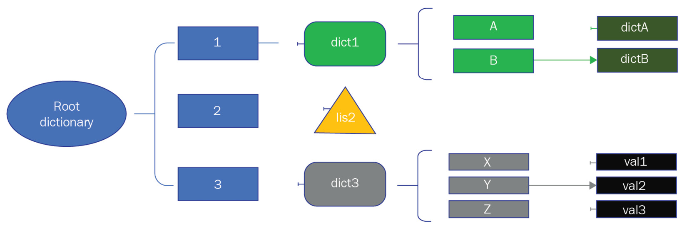
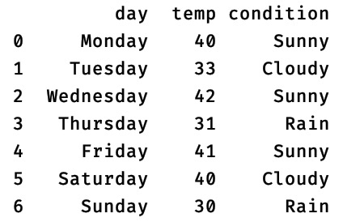
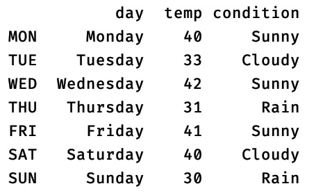

在本章中，我们将介绍一些高级技巧和窍门，它们可以在用 Python 编写代码时用作强大的编程技术。其中包括 Python 函数的高级使用，例如嵌套函数、lambda 函数和带有函数的构建装饰器。此外，我们将使用过滤器、映射器和化简器函数介绍数据转换。接下来会介绍一些可用于数据结构的技巧，例如嵌套字典的使用和对不同集合类型的理解。最后，我们将研究用于 DataFrame 对象的 pandas 库的高级功能。这些高级技巧和窍门不仅将展示 Python 在用更少的代码实现高级功能方面的能力，而且还将帮助您更快、更高效地编写代码。
在本章中，我们将涵盖以下主题：

- 学习使用函数的高级技巧
- 了解数据结构的高级概念
- 使用 Pandas DataFrame 引入高级技巧

在本章结束时，您将了解如何将 Python 函数用于高级功能，例如数据转换和建筑装饰器。此外，您将学习如何将数据结构（包括 Pandas DataFrame）用于基于分析的应用程序。

## 技术要求

本章技术要求如下：

- 您需要在计算机上安装 Python 3.7 或更高版本。
- 您需要使用 TestPyPI 注册一个帐户并在您的帐户下创建一个 API 令牌。

本章的示例代码可以在 https://github.com/PacktPublishing/Python-for-Geeks/tree/master/Chapter06 找到。
我们将从在 Python 中使用函数的高级概念开始我们的讨论。

## 学习使用函数的高级技巧

在 Python 和其他编程语言中使用函数是可重用性和模块化的关键。然而，随着现代编程语言的新进步，函数的作用已经超出了可重用性，包括编写简单、简短和简洁的代码，而不使用复杂的循环和条件语句。
我们将从 counter、zip 和 itertools 函数的使用开始，我们将在接下来讨论这些函数。

### 为迭代任务引入 counter/itertools 和 zip 函数

对于任何数据处理任务，开发人员都广泛使用迭代器。我们在第 4 章“高级编程 Python 库”中详细介绍了迭代器。在本节中，我们将学习下一级别的实用程序函数，以帮助您方便地使用迭代器和可迭代对象。其中包括 counter 模块、zip 函数和 itertools 模块。我们将在以下小节中讨论其中的每一个。

#### counter

计数器是一种容器，它跟踪容器中存在的每个元素的计数。容器中元素的数量对于查找数据频率很有用，这是许多数据分析应用程序的先决条件。为了说明 Counter 类的概念和使用，我们将给出一个简单的代码示例，如下所示：

```python
#counter.py
from collections import Counter
#applying counter on a string object
print(Counter("people"))
#applying counter on a list object
my_counter = Counter([1,2,1,2,3,4,1,3])
print(my_counter.most_common(1))
print(list(my_counter.elements()))
#applying counter on a dict object
print(Counter({'A': 2, 'B': 2, 'C': 2, 'C': 3}))
```

在前面的代码示例中，我们使用一个 String 对象、一个列表对象和一个字典对象创建了多个 Counter 实例。 Counter 类具有 most_common 和 elements 等方法。 我们使用了值为 1 的 most_common 方法，它为我们提供了在 my-counter 容器中出现次数最多的元素。 此外，我们使用元素方法从 Counter 实例返回原始列表。 该程序的控制台输出应如下所示：

```python
Counter({'p': 2, 'e': 2, 'o': 1, 'l': 1})
[(1, 3)]
[1, 1, 1, 2, 2, 3, 3, 4]
Counter({'C': 4, 'A': 2, 'B': 2})
```

需要注意的是，在字典对象的情况下，我们故意使用了重复的键，但是在 Counter 实例中，我们只得到了一个键值对，也就是字典中的最后一个。 此外， Counter 实例中的元素根据每个元素的值进行排序。 请注意，Counter 类将字典对象转换为哈希表对象。

#### zip

zip 函数用于创建基于两个或多个单独迭代器的聚合迭代器。 当我们需要并行迭代多个迭代时，zip 函数很有用。 例如，我们可以在实现涉及插值或模式识别的数学算法时使用 zip 函数。 这在我们将多个信号（数据源）组合成单个信号的数字信号处理中也很有帮助。 这是一个使用 zip 函数的简单代码示例：

```python
#zip.py
num_list = [1, 2, 3, 4, 5]
lett_list = ['alpha', 'bravo', 'charlie']
zipped_iter = zip(num_list,lett_list)
print(next(zipped_iter))
print(next(zipped_iter))
print(list(zipped_iter))
```

在前面的代码示例中，我们使用 zip 函数组合了两个列表以进行迭代。 请注意，就元素数量而言，一个列表大于另一个列表。 该程序的控制台输出应如下所示：

```python
(1, 'alpha')
(2, 'bravo')
[(3, 'charlie'), (4, 'delta')]
```

正如预期的那样，我们使用 next 函数获得前两个元组，该函数是每个列表中相应元素的组合。 最后，我们使用列表构造函数来迭代来自 zip 迭代器的其余元组。 这以列表格式为我们提供了剩余元组的列表。

#### itertools

Python 提供了一个名为 itertools 的模块，它提供了使用迭代器的有用函数。 在处理大量数据时，必须使用迭代器，这就是 itertool 模块提供的实用函数被证明非常有用的地方。 itertools 模块有许多可用的功能。 这里我们简单介绍几个关键功能：
**count**：此函数用于创建一个计数数字的迭代器。 我们可以提供一个起始数字（默认值 = 0），并且可以选择为增量设置计数步长的大小。 以下代码示例将返回一个迭代器，该迭代器提供计数数字，例如 10、12 和 14：

```python
#itertools_count.py
import itertools
iter = itertools.count(10, 2)
print(next(iter))
print(next(iter))
```

**cycle**：此函数允许您无休止地循环迭代器。以下代码片段说明了如何将此函数用于字母列表：

```python
letters = {'A','B','C'}
for letter in itertools.cycle(letters):
    print(letter)
```

**Repeat**：这个函数为我们提供了一个迭代器，它一遍又一遍地返回一个对象，除非有一个时间参数设置了它。以下代码片段将重复 Python 字符串对象五次：

```python
for x in itertools.repeat('Python', times=5):
    print(x)
```

**accumulate**：此函数将返回一个迭代器，该迭代器根据作为参数传递给此累积函数的聚合函数为我们提供累积总和或其他累积结果。用一个代码示例更容易理解这个函数的使用，如下：

```python
#itertools_accumulate.py
import itertools, operator
list1 = [1, 3, 5]
res = itertools.accumulate(list1)
print("default:")
for x in res:
    print(x)
res = itertools.accumulate(list1, operator.mul)
print("Multiply:" )
for x in res:
    print(x)
```

在此代码示例中，首先，我们使用了累加函数，但没有为任何累加结果提供聚合器函数。默认情况下，accumulate 函数将从原始列表中添加两个数字（1 和 3）。对所有数字重复此过程，并将结果存储在可迭代对象中（在我们的示例中，这是 res）。在此代码示例的第二部分中，我们提供了 operator 模块中的 mul（乘法）函数，这一次，累加结果基于两个数字的乘法。

**chain**：此函数组合两个或多个可迭代对象并返回组合的可迭代对象。查看以下示例代码，其中显示了两个可迭代对象（列表）以及链函数：

```python
list1 = ['A','B','C']
list2 = ['W','X','Y','Z']
chained_iter = itertools.chain(list1, list2)
for x in chained_iter:
    print(x)
```

请注意，此函数将以串行方式组合可迭代对象。这意味着将首先访问 list1 中的项目，然后是 list2 中的项目。
**compress**：此函数可用于根据另一个可迭代对象从一个可迭代对象中过滤元素。在示例代码片段中，我们根据可迭代的选择器从列表中选择了字母：

```python
letters = ['A','B','C']
selector = [True, 0, 1]
for x in itertools.compress(letters, selector):
    print (x)
```

对于可迭代选择器，我们可以使用 True/False 或 1/0。该程序的输出将是字母 A 和 C。
**groupby**：此函数标识可迭代对象中每个项目的键，并根据标识的键对项目进行分组。此函数需要另一个函数（称为 key_func）来标识可迭代对象的每个元素中的键。以下示例代码解释了此函数的使用以及如何实现 key_func 函数：

```python
#itertools_groupby.py
import itertools
mylist = [("A", 100), ("A", 200), ("B", 30), \
("B", 10)]
def get_key(group):
    return group[0]
for key, grp in itertools.groupby(mylist, get_key):
    print(key + "-->", list(grp))
```

**tee**：这是另一个有用的函数，可用于从单个迭代器复制迭代器。这是一个示例代码，它从一个可迭代的列表中复制两个迭代器：

```python
letters = ['A','B','C']
iter1, iter2 = itertools.tee(letters)
for x in iter1:
    print(x)
for x in iter2:
    print(x)
```

接下来，我们将讨论另一类广泛用于数据转换的函数。

### 使用filters, mappers 和 reducers 进行数据转换

map、filter 和 reduce 是 Python 中可用的三个函数，用于简化和编写简洁的代码。这三个函数在不使用迭代语句的情况下一次性应用于可迭代对象。 map 和 filter 函数可作为内置函数使用，而 reduce 函数需要您导入 functtools 模块。这些函数被数据科学家广泛用于数据处理。 map 函数和 filter 函数用于转换或过滤数据，而 reduce 函数用于数据分析以从大型数据集中获得有意义的结果。
在以下小节中，我们将评估每个函数及其应用和代码示例。

#### map
Python 中的 map 函数使用以下语法定义：

```python
map(func, iter, ...)
```

func 参数是将应用于 iter 对象的每个项目的函数的名称。三个点表示可以传递多个可迭代对象。但是，重要的是要了解函数 (func) 的参数数量必须与可迭代对象的数量相匹配。 map函数的输出是一个map对象，它是一个生成器对象。通过将映射对象传递给列表构造函数，可以将返回值转换为列表。

> 重要的提示
> 在 Python 2 中，map 函数返回一个列表。此行为已在 Python 3 中更改。

在讨论 map 函数的使用之前，首先，我们将实现一个简单的转换函数，将数字列表转换为其平方值。接下来提供代码示例：

```python
#map1.py to get square of each item in a list
mylist = [1, 2, 3, 4, 5]
new_list = []
for item in mylist:
    square = item*item
    new_list.append(square)
print(new_list)
```

此处，代码示例使用 for 循环结构遍历列表，计算列表中每个条目的平方，然后将其添加到新列表中。 这种编写代码的方式很常见，但绝对不是 Pythonic 的代码编写方式。 该程序的控制台输出如下：

```python
[1, 4, 9, 16, 25]
```

通过使用map函数，可以简化和缩短这段代码，如下：

```python
# map2.py to get square of each item in a list
def square(num):
    return num * num
mylist = [1, 2, 3, 4, 5]
new_list = list(map(square, mylist))
print(new_list)
```

通过使用 map 函数，我们提供了函数名称（在本例中为 square）和列表的引用（在本例中为 mylist）。 map函数返回的map对象通过list构造函数转换为list对象。 此代码示例的控制台输出与前面的代码示例相同。
在下面的代码示例中，我们将提供两个列表作为 map 函数的输入：

```python
# map3.py to get product of each item in two lists
def product(num1, num2):
    return num1 * num2
mylist1 = [1, 2, 3, 4, 5]
mylist2 = [6, 7, 8, 9]
new_list = list(map(product, mylist1, mylist2))
print(new_list)
```

这一次，已经实现的地图功能的目标是使用产品功能。 product 函数从两个列表中获取每个项目，并将每个列表中的相应项目相乘，然后将其返回给 map 函数。
此代码示例的控制台输出如下：

```python
[6, 14, 24, 36]
```

对此控制台输出的分析告诉我们，map 函数仅使用每个列表中的前四项。当 map 函数用完任何可迭代对象（在我们的例子中，这是两个列表）中的项目时，它会自动停止。这意味着即使我们提供不同大小的可迭代对象，map 函数也不会引发任何异常，但会处理使用提供的函数跨可迭代对象映射的项目数量。在我们的代码示例中，mylist2 列表中的项目数量较少，为 4。这就是为什么我们在输出列表中只有四个项目（在我们的例子中，这是 new_list）。接下来，我们将通过一些代码示例讨论过滤器功能。

#### filter

filter 函数也对可迭代对象进行操作，但只对一个可迭代对象进行操作。顾名思义，它为可迭代对象提供了过滤功能。过滤标准是通过函数定义提供的。过滤函数的语法如下：
过滤器（功能，迭代器）
func 函数提供过滤条件，它必须返回 True 或 False。由于过滤器函数旁边只允许一个可迭代对象，因此 func 函数只允许一个参数。下面的代码示例使用过滤器函数来选择值为偶数的项。为了实现选择标准，函数 is_even 被实现来评估提供给它的数字是否是偶数。示例代码如下：

```python
# filter1.py to get even numbers from a list
def is_even(num):
    return (num % 2 == 0)
mylist = [1, 2, 3, 4, 5,6,7,8,9]
new_list = list(filter(is_even, mylist))
print(new_list)
```

上述代码示例的控制台输出如下：

```python
[2, 4, 6, 8]
```

接下来，我们将讨论reduce函数。

#### reduce

reduce 函数用于对序列的每个元素应用累积处理函数，该函数作为参数传递给它。此累积处理功能不用于转换或过滤目的。顾名思义，累积处理函数用于根据序列中的所有元素在最后获得单个结果。使用reduce函数的语法如下：

```python
reduce (func, iter[,initial])
```

func 函数是用于对可迭代的每个元素应用累积处理的函数。此外，initial 是一个可选值，可以传递给 func 函数以用作累积处理的初始值。重要的是要理解，对于 reduce 函数的情况，func 函数总是有两个参数：第一个参数将是初始值（如果提供）或序列的第一个元素，第二个参数将是序列中的下一个元素。
在下面的代码示例中，我们将使用前五个数字的简单列表。我们将实现一个自定义方法来将两个数字相加，然后使用 reduce 方法对列表中的所有元素求和。代码示例如下所示：

```python
# reduce1.py to get sum of numbers from a list
from functools import reduce
def seq_sum(num1, num2):
    return num1+num2
mylist = [1, 2, 3, 4, 5]
result = reduce(seq_sum, mylist)
print(result)
```

该程序的输出是 15，它是列表中所有元素的数字总和（在我们的示例中，这称为 mylist）。 如果我们为reduce 函数提供初始值，结果将按照初始值附加。 例如，具有以下语句的同一程序的输出将是 25：

```python
result = reduce(seq_sum, mylist, 10)
```

如前所述，reduce 函数的结果或返回值是单个值，这与 func 函数相同。在这个例子中，它将是一个整数。
在本节中，我们讨论了 Python 中可用的 map、filter 和 reduce 函数。这些函数被数据科学家广泛用于数据转换和数据细化。使用 map 和 filter 等函数的一个问题是它们返回的是 map 或 filter 类型的对象，我们必须将结果显式转换为列表数据类型以供进一步处理。推导式和生成器没有这样的限制，但提供了类似的功能，并且相对更容易使用。这就是为什么它们比 map、filter 和 reduce 函数更受关注的原因。我们将在使用数据结构理解高级概念部分讨论理解和生成器。接下来，我们将研究 lambda 函数的使用。

### 学习如何构建 lambda 函数

Lambda 函数是基于单行表达式的匿名函数。正如 def 关键字用于定义常规函数一样，lambda 关键字用于定义匿名函数。 Lambda 函数仅限于一行。这意味着它们不能使用多个语句，也不能使用 return 语句。单行表达式求值后自动返回返回值。
可以在任何使用常规函数的地方使用 lambda 函数。 lambda 函数最简单、最方便的用法是与 map、reduce 和 filter 函数一起使用。当您希望使代码更简洁时，Lambda 函数会很有帮助。
为了说明 lambda 函数，我们将重用之前讨论过的映射和过滤器代码示例。在这些代码示例中，我们将 func 替换为 lambda 函数，如以下代码片段中突出显示的：

```python
# lambda1.py to get square of each item in a list
mylist = [1, 2, 3, 4, 5]
new_list = list(map(lambda x: x*x, mylist))
print(new_list)
# lambda2.py to get even numbers from a list
mylist = [1, 2, 3, 4, 5, 6, 7, 8, 9]
new_list = list(filter(lambda x: x % 2 == 0, mylist))
print(new_list)
# lambda3.py to get product of corresponding item in the\
two lists
mylist1 = [1, 2, 3, 4, 5]
mylist2 = [6, 7, 8, 9]
new_list = list(map(lambda x,y: x*y, mylist1, mylist2))
print(new_list)
```

虽然代码变得更加简洁，但我们在使用 lambda 函数时还是要小心。这些功能不可重用，也不容易维护。在将 lambda 函数引入我们的程序之前，我们需要重新考虑这一点。添加任何更改或附加功能都不容易。经验法则是，当编写单独的函数会带来开销时，仅将 lambda 函数用于简单表达式。

### 在另一个函数中嵌入一个函数

当我们在现有函数中添加一个函数时，它被称为内部函数或嵌套函数。拥有内部函数的优点是它们可以直接访问在外部函数范围内定义或可用的变量。创建内部函数与使用 def 关键字和适当的缩进定义常规函数相同。内部函数不能被外部程序执行或调用。但是，如果外部函数返回内部函数的引用，则调用者可以使用它来执行内部函数。我们将在以下小节中查看为许多用例返回内部函数引用的示例。
内部函数有很多优点和应用。我们接下来将描述其中的一些。

#### 封装

内部函数的一个常见用例是能够对外部世界隐藏其功能。内部函数只在外部函数作用域内可用，对全局作用域不可见。以下代码示例显示了一个隐藏内部函数的外部函数：

```python
#inner1.py
def outer_hello():
    print ("Hello from outer function")
    def inner_hello():
        print("Hello from inner function")
    inner_hello()
outer_hello()
```

从外层函数的外部，我们只能调用外层函数。 内部函数只能从外部函数的主体中调用。

#### 辅助函数

在某些情况下，我们会发现函数代码中的代码是可重用的。 我们可以将这种可重用的代码变成一个单独的函数； 否则，如果代码只能在函数范围内重用，则属于构建内部函数的情况。 这种类型的内部函数也称为辅助函数。 下面的代码片段说明了这个概念：

```python
def outer_fn(x, y):
    def get_prefix(s):
        return s[:2]
    x2 = get_prefix(x)
    y2 = get_prefix(y)
    #process x2 and y2 further
```

在前面的示例代码中，我们在外部函数内部定义了一个名为 get_prefix（辅助函数）的内部函数，用于过滤参数值的前两个字母。由于我们必须对所有参数重复此过滤过程，因此我们在此函数的范围内添加了一个可重用的辅助函数，因为它特定于此函数。

#### 闭包和工厂函数

这是一种内部函数闪耀的用例。闭包是一个内部函数及其封闭环境。闭包是一个动态创建的函数，可以由另一个函数返回。闭包的真正魔力在于返回的函数可以完全访问创建它的变量和命名空间。即使封闭函数（在此上下文中，它是外部函数）已完成执行，也是如此。
闭包概念可以通过代码示例来说明。下面的代码示例展示了一个用例，我们实现了一个闭包工厂来创建一个函数来计算基值的幂，基值由闭包保留：

```python
# inner2.py
def power_calc_factory(base):
    def power_calc(exponent):
        return base**exponent
    return power_calc
power_calc_2 = power_gen_factory(2)
power_calc_3 = power_gen_factory(3)
print(power_calc_2(2))
print(power_calc_2(3))
print(power_calc_3(2))
print(power_calc_3(4))
```

在前面的代码示例中，外部函数（即 power_calc_factory）充当闭包工厂函数，因为它每次被调用时都会创建一个新的闭包，然后将闭包返回给调用者。此外，power_calc 是一个内部函数，它从闭包命名空间中获取一个变量（即基数），然后获取第二个变量（即指数），该变量作为参数传递给它。请注意，最重要的语句是 return power_calc。此语句将内部函数作为带有外壳的对象返回。
当我们第一次调用 power_calc_factory 函数和 base 参数时，会创建一个带有命名空间的闭包，包括传递给它的参数，然后闭包返回给调用者。当我们再次调用同一个函数时，我们会得到一个带有内部函数对象的新闭包。在这个代码示例中，我们创建了 2 个闭包：一个基值为 2，另一个基值为 3。当我们通过为指数变量传递不同的值来调用内部函数时，内部函数内部的代码（在在这种情况下，power_calc 函数）也可以访问已经传递给外部函数的基值。
这些代码示例说明了使用外部函数和内部函数来动态创建函数。传统上，内部函数用于隐藏或封装函数内部的功能。但是当它们与作为创建动态函数的工厂的外部函数一起使用时，它成为内部函数最强大的应用。内部函数也用于实现装饰器。我们将在下一节中更详细地讨论这一点。

### 使用装饰器修改函数行为

Python 中装饰器的概念基于装饰器设计模式，它是一种结构设计模式。此模式允许您向对象添加新行为，而无需更改对象实现中的任何内容。这个新行为被添加到特殊的包装器对象中。
在 Python 中，装饰器是特殊的高阶函数，它使开发人员能够向现有函数（或方法）添加新功能，而无需在函数内添加或更改任何内容。通常，这些装饰器是在函数定义之前添加的。装饰器用于实现应用程序的许多功能，但它们在数据验证、日志记录、缓存、调试、加密和事务管理中特别受欢迎。
要创建装饰器，我们必须定义一个接受函数作为参数的可调用实体（即函数、方法或类）。可调用实体将返回另一个具有装饰器定义行为的函数对象。被装饰的函数（我们将在本节的其余部分称为装饰函数）作为参数传递给实现装饰器的函数（在本节的其余部分将被称为装饰器函数）。除了作为装饰器函数的一部分添加的附加行为之外，装饰器函数还执行传递给它的函数。
以下代码示例展示了一个简单的装饰器示例，其中我们定义了一个装饰器来在函数执行前后添加时间戳：

```python
# decorator1.py
from datetime import datetime
def add_timestamps(myfunc):
    def _add_timestamps():
        print(datetime.now())
        myfunc()
        print(datetime.now())
    return _add_timestamps
@add_timestamps
def hello_world():
    print("hello world")
hello_world()
```

在这个代码示例中，我们定义了一个 add_timestamps 装饰器函数，它接受任何函数作为参数。在内部函数 (_add_timestamps) 中，我们获取函数执行前后的当前时间，然后将其作为参数传递。装饰器函数返回带有闭包的内部函数对象。正如我们在上一节中讨论的那样，装饰器只是巧妙地使用内部函数。使用@符号来装饰一个函数相当于下面这几行代码：

```python
hello = add_timestamps(hello_world)
hello()
```

在这种情况下，我们通过将函数名称作为参数传递来显式调用装饰器函数。换句话说，装饰函数等于内部函数，内部函数定义在装饰器函数内部。这正是 Python 在函数定义之前看到带有 @ 符号的装饰器时解释和调用装饰器函数的方式。
但是，当我们必须获得有关函数调用的其他详细信息时就会出现问题，这对于调试很重要。当我们将内置帮助函数与 hello_world 函数一起使用时，我们只会收到内部函数的帮助。如果我们使用 docstring 也会发生同样的情况，它也适用于内部函数但不适用于装饰函数。此外，序列化代码对于修饰函数来说将是一个挑战。 Python 中有一个简单的解决方案可以解决所有这些问题；该解决方案是使用 functools 库中的 wraps 装饰器。我们将修改之前的代码示例以包含 wraps 装饰器。完整的代码示例如下：

```python
# decorator2.py
from datetime import datetime
from functools import wraps
def add_timestamps(myfunc):
    @wraps(myfunc)
    def _add_timestamps():
        print(datetime.now())
        myfunc()
        print(datetime.now())
    return _add_timestamps
@add_timestamps
def hello_world():
    print("hello world")
hello_world()
help(hello_world)
print(hello_world)
```

wraps 装饰器的使用将提供有关嵌套函数执行的其他详细信息，如果我们运行已提供的示例代码，我们可以在控制台输出中查看这些信息。
到目前为止，我们已经查看了一个简单的装饰器示例来解释这个概念。 在本节的其余部分，我们将学习如何将带有函数的参数传递给装饰器，如何从装饰器返回值，以及如何链接多个装饰器。 首先，我们将学习如何使用装饰器传递属性并返回值。

#### 使用带有返回值和参数的装饰函数

当我们的装饰函数接受参数时，装饰这样的函数需要一些额外的技巧。 一种技巧是在内部包装函数中使用 *args 和 **kwargs。 这将使内部函数接受任意数量的位置和关键字参数。 这是一个带有参数和返回值的装饰函数的简单示例：

```python
# decorator3.py
from functools import wraps
def power(func):
    @wraps(func)
    def inner_calc(*args, **kwargs):
        print("Decorating power func")
        n = func(*args, **kwargs)
        return n
    return inner_calc
@power
def power_base2(n):
    return 2**n
print(power_base2(3))
```

在前面的例子中，inner_calc 的内部函数采用了 *args 和 **kwargs 的泛型参数。要从内部函数（在我们的代码示例中，inner_calc）返回一个值，我们可以保存在我们的内部函数中执行的函数（在我们的代码示例中，这是 func 或 power_base2(n)）的返回值，并且从inner_calc的内部函数返回最终的返回值。

#### 使用自己的参数构建装饰器

在前面的例子中，我们使用了我们所说的标准装饰器。标准装饰器是一个函数，它以被装饰的函数名作为参数，并返回一个作为装饰器函数工作的内部函数。但是，当我们有一个带有自己参数的装饰器时，情况就有点不同了。这种装饰器建立在标准装饰器之上。简而言之，带参数的装饰器是另一个实际返回标准装饰器的函数（不是装饰器内部的内部函数）。使用decorator3.py 示例的修订版，可以更好地理解包装在另一个装饰器函数中的标准装饰器函数的概念。在修订版中，我们计算作为参数传递给装饰器的基值的幂。您可以使用嵌套的装饰器函数查看完整的代码示例，如下所示：

```python
# decorator4.py
from functools import wraps
def power_calc(base):
    def inner_decorator(func):
        @wraps(func)
        def inner_calc(*args, **kwargs):
            exponent = func(*args, **kwargs)
            return base**exponent
        return inner_calc
    return inner_decorator
@power_calc(base=3)
def power_n(n):
    return n
print(power_n(2))
print(power_n(4))
```

此代码示例的工作如下：

- power_calc 装饰器函数接受一个参数基数并返回inner_decorator 函数，这是一个标准的装饰器实现。
- inner_decorator 函数将一个函数作为参数，并返回inner_calc 函数进行实际计算。
- inner_calc 函数调用装饰函数来获取指数属性（在这种情况下），然后使用 base 属性，该属性作为参数传递给外部装饰器函数。正如预期的那样，内部函数周围的闭包使基本属性的值可用于 inner_calc 函数。

接下来，我们将讨论如何在一个函数或一个方法中使用多个装饰器。

#### 使用多个装饰器

我们已经多次了解到，一个函数可以使用多个装饰器。这可以通过链接装饰器来实现。链式装饰器可以相同也可以不同。这可以通过在函数定义之前一个接一个地放置装饰器来实现。当一个函数使用多个装饰器时，被装饰的函数只执行一次。为了说明其实现和实际使用，我们选择了一个示例，在该示例中我们使用时间戳将消息记录到目标系统。时间戳是通过一个单独的装饰器添加的，目标系统也是根据另一个装饰器来选择的。下面的代码示例展示了三个装饰器的定义，即 add_time_stamp、file 和 console：

```python
# decorator5.py (part 1)
from datetime import datetime
from functools import wraps
def add_timestamp(func):
    @wraps(func)
    def inner_func(*args, **kwargs):
        res = "{}:{}\n".format(datetime.now(),func(*args,\
          **kwargs))
        return res
    return inner_func
def file(func):
    @wraps(func)
    def inner_func(*args, **kwargs):
        res = func(*args, **kwargs)
        with open("log.txt", 'a') as file:
           file.write(res)
        return res
    return inner_func
def console(func):
    @wraps(func)
    def inner_func(*args, **kwargs):
        res = func(*args, **kwargs)
        print(res)
        return res
    return inner_func
```

在前面的代码示例中，我们实现了三个装饰器函数。 它们如下：

- file：这个装饰器使用一个预定义的文本文件，并将装饰函数提供的消息添加到文件中。
- console：这个装饰器将装饰函数提供的消息输出到控制台。
- add_timestamp：这个装饰器在被装饰函数提供的消息之前添加一个时间戳。 这个装饰器函数的执行必须发生在文件或控制台装饰器之前，这意味着这个装饰器必须放在装饰器链的最后。

在以下代码片段中，我们可以将这些装饰器用于主程序中的不同功能：

```python
#decorator5.py (part 2)
@file
@add_timestamp
def log(msg):
    return msg
@file
@console
@add_timestamp
def log1(msg):
    return msg
@console
@add_timestamp
def log2(msg):
    return msg
log("This is a test message for file only")
log1("This is a test message for both file and console")
log2("This message is for console only")
```

在前面的代码示例中，我们使用了前面定义的三个装饰器函数以不同的组合来展示来自同一日志记录函数的不同行为。在第一种组合中，我们仅在添加时间戳后才将消息输出到文件。在第二种组合中，我们将消息输出到文件和控制台。在最后的组合中，我们只将消息输出到控制台。这显示了装饰器提供的灵活性，而无需更改功能。值得一提的是，装饰器在以简洁的方式简化代码和添加行为方面非常有用，但它们在执行过程中会产生额外的开销。装饰器的使用应该仅限于那些好处足以补偿任何开销成本的场景。
我们对高级函数概念和技巧的讨论到此结束。在下一节中，我们将切换到一些与数据结构相关的高级概念。

### 了解数据结构的高级概念

Python 为数据结构提供全面支持，包括用于存储数据和访问数据以进行处理和检索的关键工具。在第 4 章，用于高级编程的 Python 库中，我们讨论了 Python 中可用的数据结构对象。在本节中，我们将介绍许多高级概念，例如字典中的字典以及如何将理解用于数据结构。我们将从在字典中嵌入字典开始。

#### 在字典中嵌入字典

字典中的字典或嵌套字典是将字典放入另一个字典的过程。嵌套字典在许多实际示例中都很有用，尤其是在处理数据并将数据从一种格式转换为另一种格式时。
图 6.1 显示了一个嵌套字典。根字典有两个针对键 1 和键 3 的字典。针对键 1 的字典内部还有其他字典。针对键 3 的字典是一个以键值对作为其条目的常规字典：



图 6.1 所示的根字典可以写成如下：

```python
root_dict = {
    '1': {'A': {dictA}, 'B':{dictB}},
    '2': [list2],
    '3': {'X': val1,'Y':val2,'Z': val3}
}
```

在这里，我们创建了一个根字典，其中混合了字典对象和列表对象。

#### 创建或定义嵌套字典

可以通过将逗号分隔的字典放在大括号内来定义或创建嵌套字典。 为了演示如何创建嵌套字典，我们将为学生创建一个字典。 每个学生条目都会有另一个字典，以姓名和年龄为元素，映射到他们的学号：

```python
# dictionary1.py
dict1 = {
    100:{'name':'John', 'age':24},
    101:{'name':'Mike', 'age':22},
    102:{'name':'Jim', 'age':21}
}
print(dict1)
print(dict1.get(100))
```

接下来，我们将学习如何动态创建字典以及如何添加或更新嵌套的字典元素。

#### 添加到嵌套字典

要在字典中动态创建字典或向现有嵌套字典添加元素，我们可以使用多种方法。在下面的代码示例中，我们将使用三种不同的方法来构建嵌套字典。它们与我们在 dictionary1.py 模块中定义的相同：

- 在第一种情况下，我们将通过键值对项的直接赋值，然后将其分配给根字典中的一个键来构建一个内部字典（即student101）。只要有可能，这是首选方法，因为代码更易于阅读和管理。
- 在第二种情况下，我们创建了一个空的内部字典（即 student102）并通过赋值语句将值分配给键。当我们可以通过其他数据结构获得这些值时，这也是一种首选方法。
- 在第三种情况下，我们直接为根字典的第三个键启动一个空目录。在初始化过程之后，我们使用双索引（即两个键）分配值：第一个键用于根字典，第二个键用于内部字典。这种方法使代码简洁，但如果出于维护原因，代码可读性很重要，则它不是首选方法。

这三种不同情况的完整代码示例如下：

```python
# dictionary2.py
#defining inner dictionary 1
student100 = {'name': 'John', 'age': 24}
#defining inner dictionary 2
student101 = {}
student101['name'] = 'Mike'
student101['age'] = '22'
#assigning inner dictionaries 1 and 2 to a root dictionary
dict1 = {}
dict1[100] = student100
dict1[101] = student101
#creating inner dictionary directly inside a root dictionary
dict1[102] = {}
dict1[102]['name'] = 'Jim'
dict1[102]['age'] = '21'
print(dict1)
print(dict1.get(102))
```

接下来，我们将讨论如何从嵌套字典中访问不同的元素。

#### 从嵌套字典访问元素

如前所述，要在字典中添加值和字典，我们可以使用双索引。 或者，我们可以使用字典对象的 get 方法。 相同的方法适用于从内部字典访问不同的元素。 下面的示例代码说明了如何使用 get 方法和双索引访问内部字典中的不同元素：

```python
# dictionary3.py
dict1 = {100:{'name':'John', 'age':24},
         101:{'name':'Mike', 'age':22},
         102:{'name':'Jim', 'age':21} }
print(dict1.get(100))
print(dict1.get(100).get('name'))
print(dict1[101])
print(dict1[101]['age'])
```

接下来，我们将研究如何从内部字典中删除内部字典或键值对项。

#### 从嵌套字典中删除

要删除字典或字典中的元素，我们可以使用通用的 del 函数，也可以使用字典对象的 pop 方法。 在下面的示例代码中，我们将同时展示 del 函数和 pop 方法来演示它们的用法：

```python
# dictionary4.py
dict1 = {
    100:{'name':'John', 'age':24},
    101:{'name':'Mike', 'age':22},
    102:{'name':'Jim', 'age':21}
}
del (dict1[101]['age'])
print(dict1)
dict1[102].pop('age')
print(dict1)
```

在下一节中，我们将讨论理解如何帮助处理来自不同数据结构类型的数据。

### 使用Comprehension

Comprehension 是一种从现有序列构建新序列（例如列表、集合和字典）的快速方法。 Python 支持四种不同类型的理解，如下所示：

- 列表 comprehension
- 字典 comprehension
- 集合 comprehension
- 生成器 comprehension

我们将在以下小节中讨论每种理解类型的简要概述和代码示例。

#### 列表 comprehension

列表理解涉及使用循环和条件语句（如果需要）创建动态列表。
如何使用列表理解的几个例子将帮助我们更好地理解这个概念。 在第一个示例（即 list1.py）中，我们将通过向原始列表的每个元素添加 1 来从原始列表创建一个新列表。 这是代码片段：

```python
#list1.py
list1 = [1, 2, 3, 4, 5, 6, 7, 8, 9, 0]
list2 = [x+1 for x in list1]
print(list2)
```

等价于:

```python
list2 = []
for x in list1:
    list2.append(x+1)
```

使用列表推导，我们只需要一行代码就可以实现这三行代码。
在第二个示例（即 list2.py）中，我们将从 1 到 10 的原始数字列表创建一个新列表，但只包含偶数。我们可以通过简单地在前面的代码示例中添加一个条件来做到这一点，如下所示：

```python
#list2.py
list1 = [1, 2, 3, 4, 5, 6, 7, 8, 9, 10]
list2 = [x for x in list1 if x % 2 == 0]
print(list2)
```

如您所见，条件被添加到理解式表达式的末尾。接下来，我们将讨论如何使用理解来构建字典。

#### 字典 comprehension

也可以使用字典理解来创建字典。字典推导类似于列表推导，是一种从另一个字典创建字典的方法，其方式是有条件地选择或转换源字典中的项目。以下代码片段显示了一个示例，该示例从小于或等于 200 的现有字典元素创建字典，并将每个选定的值除以 2。请注意，作为理解表达式的一部分，这些值也被转换回整数：

```python
#dictcomp1.py
dict1 = {'a': 100, 'b': 200, 'c': 300}
dict2 = {x:int(y/2) for (x, y) in dict1.items() if y <=200}
print(dict2)
```

等价于:

```python
Dict2 = {}
for x,y in dict1.items():
    if y <= 200:
        dict2[x] = int(y/2)
```


请注意，理解显着减少了代码。 接下来，我们将讨论集合理解。

#### 集合 comprehension

集合也可以使用集合推导来创建，就像列表推导一样。 使用集合推导创建集合的代码语法类似于列表推导。 例外是我们将使用大括号而不是方括号。 在以下代码片段中，您可以查看使用集合理解从列表创建集合的示例：

```python
#setcomp1.py
list1 = [1, 2, 6, 4, 5, 6, 7, 8, 9, 10, 8]
set1 = {x for x in list1 if x % 2 == 0}
print(set1)
```

等价于:

```python
Set1 = set()
for x in list1:
    if x % 2 == 0:
        set1.add(x)
```

正如预期的那样，重复的条目将在集合中被丢弃。
我们对 Python 中可用于不同数据结构的理解类型的讨论到此结束。接下来，我们将讨论数据结构可用的过滤选项。

### 使用 Pandas DataFrame 引入高级技巧

pandas 是一个开源 Python 库，它提供了用于高性能数据操作的工具，使数据分析变得快速而简单。 pandas 库的典型用途是对数据进行整形、排序、切片、聚合和合并。
pandas 库建立在 NumPy 库之上，NumPy 库是另一个用于处理数组的 Python 库。 NumPy 库比传统 Python 列表快得多，因为数据存储在内存中的一个连续位置，而传统列表并非如此。
pandas 库处理三个关键数据结构，如下所示：

- Series：这是一个类似一维数组的对象，包含一个数据数组和一个数据标签数组。数据标签数组称为索引。如果用户未明确指定，可以使用 0 到 n-1 之间的整数自动指定索引。
- DataFrame：这是表格数据的表示，例如包含列列表的电子表格。 DataFrame 对象有助于在行和列中存储和操作表格数据。有趣的是，DataFrame 对象具有列和行的索引。
- Panel：这是一个三维数据容器。

DataFrame 是用于数据分析的关键数据结构。在本节的其余部分，我们将在代码示例中广泛使用 DataFrame 对象。在我们讨论有关这些 Pandas DataFrame 对象的任何高级技巧之前，我们将快速回顾一下 DataFrame 对象可用的基本操作。

#### 学习 DataFrame 操作

我们将从创建 DataFrame 对象开始。有多种方法可以创建 DataFrame，例如从字典、CSV 文件、Excel 工作表或从 NumPy 数组。最简单的方法之一是使用字典中的数据作为输入。以下代码片段展示了如何基于存储在字典中的每周天气数据构建 DataFrame 对象：

```python
# pandas1.py
import pandas as pd
weekly_data = {
    'day':['Monday','Tuesday', 'Wednesday', 'Thursday','Friday', 'Saturday', 'Sunday'],
    'temperature':[40, 33, 42, 31, 41, 40, 30],
    'condition':['Sunny','Cloudy','Sunny','Rain' ,'Sunny','Cloudy','Rain']
}
df = pd.DataFrame(weekly_data)
print(df)
```

控制台输出将显示 DataFrame 的内容如下：



pandas 库在方法和属性方面非常丰富。但是，涵盖所有这些超出了本节的范围。相反，我们将快速总结 DataFrame 对象的常用属性和方法，以便在接下来的代码示例中使用它们之前刷新我们的知识：

- index：此属性提供 DataFrame 对象的索引（或标签）列表。
- 列：此属性提供 DataFrame 对象中的列列表。
- size：这将根据行数乘以列数返回 DataFrame 对象的大小。
- shape：这为我们提供了一个表示 DataFrame 对象维度的元组。
- 轴：此属性返回一个列表，表示 DataFrame 对象的轴。简而言之，它包括行和列。
- describe：这种强大的方法生成统计数据，例如计数、平均值、标准偏差以及最小值和最大值。
- head：此方法从类似于文件的 head 命令的 DataFrame 对象返回 n（默认值 = 5）行。
- tail：此方法返回 DataFrame 对象的最后 n（默认值 = 5）行。
- drop_duplicates：此方法根据 DataFrame 中的所有列删除重复的行。
- dropna：此方法从 DataFrame 中删除缺失值（例如行或列）。通过向此方法传递适当的参数，我们可以删除行或列。此外，我们可以设置是基于缺失值的单个出现还是仅当行或列中的所有值都缺失时删除行或列。
- sort_values：此方法可用于基于单列或多列对行进行排序。

在以下部分中，我们将回顾 DataFrame 对象的一些基本操作。

#### 设置自定义索引
列标签（索引）通常是根据字典提供的数据或根据使用的任何其他输入数据流添加的。 我们可以使用以下选项之一更改 DataFrame 的索引：
使用如下简单语句将数据列之一设置为索引，例如前面提到的示例中的 day：
```df_new = df.set_index('day')```
DataFrame 将开始使用 day 列作为索引列，其内容如下：

通过通过列表提供索引来手动设置索引，例如在以下代码片段中：

```python
# pandas2.py
weekly_data = <same as previous example>
df = pd.DataFrame(weekly_data)
df.index = ['MON','TUE','WED','THU','FRI','SAT','SUN']
print(df)
```

使用此代码片段，DataFrame 将开始使用我们通过列表对象提供的索引。 DataFrame 的内容将显示此更改如下：



接下来，我们将讨论如何使用特定索引和列在 DataFrame 中导航。

#### 在 DataFrame 中导航

有几十种方法可以从 DataFrame 对象中获取一行数据或特定位置。用于在 DataFrame 内导航的典型方法是 loc 和 iloc 方法。我们将探索如何使用我们在上一个示例中使用的相同示例数据在 DataFrame 对象中导航的几个选项：

```python
# pandas3.py
import pandas as pd
weekly_data = <same as in pandas1.py example>
df = pd.DataFrame(weekly_data)
df.index = ['MON', 'TUE','WED','THU','FRI','SAT','SUN']
```

接下来，我们将通过代码示例讨论一些关于如何在此 DataFrame 对象中选择行或位置的技术：
我们可以通过 loc 方法使用索引标签来选择一行或多行。索引标签作为单个项目或列表提供。在以下代码片段中，我们展示了如何选择一行或多行的两个示例：

```python
print(df.loc['TUE'])
print(df.loc[['TUE','WED']])
```

我们可以使用行索引标签和列标签从 DataFrame 对象中的某个位置选择一个值，如下所示：
```print(df.loc['FRI','temp'])```
我们还可以使用索引值来选择一行，而无需提供任何标签：

```python
#Provide a row with index 2
print(df.iloc[2])
```

通过将 DataFrame 对象视为二维数组，我们可以使用行索引值和列索引值从某个位置选择一个值。在下一个代码片段中，我们将从行索引 = 2 和列索引 = 2 的位置获取值：

```python
print(df.iloc[2,2])
```

接下来，我们将讨论如何向 DataFrame 对象添加行或列。

#### 向 DataFrame 添加行或列

向 DataFrame 对象添加行的最简单方法是将值列表分配给索引位置或索引标签。例如，我们可以使用以下语句为上一个示例（即 pandas3.py）添加一个带有 TST 标签的新行：

```python
df.loc['TST'] = ['Test day 1', 50, 'NA']
```

需要注意的是，如果行标签已存在于 DataFrame 对象中，则同一行代码可以使用新值更新该行。
如果我们不使用索引标签而是使用默认索引，我们可以使用索引号更新现有行或使用以下代码行添加新行：

```python
df.loc[8] = ['Test day 2', 40, 'NA']
```

显示完整的代码示例以供参考：

```python
# pandas4.py
import pandas as pd
weekly_data = <same as in pandas1.py example>
df = pd.DataFrame(weekly_data)
df.index = ['MON', 'TUE','WED','THU','FRI','SAT','SUN']
df.loc['TST1'] = ['Test day 1', 50, 'NA']
df.loc[7] = ['Test day 2', 40, 'NA']
print(df)
```

要将新列添加到 DataFrame 对象，pandas 库中提供了多个选项。我们将仅说明三个选项，如下所示：
通过在列标签旁边添加值列表：此方法将在现有列之后添加一列。如果我们使用现有的列标签，这种方法也可用于更新或替换现有的列。
通过使用插入方法：此方法将接受一个标签和一个值列表作为参数。当您想在任何位置插入一列时，这尤其有用。请注意，如果 DataFrame 对象内已经存在具有相同标签的列，则此方法不允许您插入列。这意味着此方法不能用于更新现有列。
通过使用assign方法：当您想一次性添加多个列时，此方法很有用。如果我们使用现有的列标签，则此方法可用于更新或替换现有列。
在以下代码示例中，我们将使用所有三种方法向 DataFrame 对象插入新列：

```python
# pandas5.py
import pandas as pd
weekly_data = <same as in pandas1.py example>
df = pd.DataFrame(weekly_data)
#Adding a new column and then updating it
df['Humidity1'] = [60, 70, 65,62,56,25,'']
df['Humidity1'] = [60, 70, 65,62,56,251,'']
#Inserting a column at column index of 2 using the insert method
df.insert(2, "Humidity2",[60, 70, 65,62,56,25,''])
#Adding two columns using the assign method
df1 = df.assign(Humidity3 = [60, 70, 65,62,56,25,''],  Humidity4 = [60, 70, 65,62,56,25,''])
print(df1)
```

接下来，我们将评估如何从 DataFrame 对象中删除行和列。

#### 从 DataFrame 中删除索引、行或列

删除索引相对简单，您可以使用 reset_index 方法来完成。 但是，reset_index 方法会添加默认索引并将自定义索引列保留为数据列。 要完全删除自定义索引列，我们必须在 reset_index 方法中使用 drop 参数。 以下代码片段使用 reset_index 方法：

```python
# pandas6.py
import pandas as pd
weekly_data = <same as in pandas1.py example>
df = pd.DataFrame(weekly_data)
df.index = ['MON', 'TUE','WED','THU','FRI','SAT','SAT']
print(df)
print(df.reset_index(drop=True))
```

要从 DataFrame 对象中删除重复的行，我们可以使用 drop_duplicate 方法。 要删除特定的行或列，我们可以使用 drop 方法。 在以下代码示例中，我们将删除带有 SAT 和 SUN 标签的所有行以及带有条件标签的所有列：

```python
#pandas7.py
import pandas as pd
weekly_data = <same as in pandas1.py example>
df = pd.DataFrame(weekly_data)
df.index = ['MON', 'TUE','WED','THU','FRI','SAT','SUN']
print(df)
df1= df.drop(index=['SUN','SAT'])
df2= df1.drop(columns=['condition'])
print(df2)
```

接下来，我们将研究如何重命名索引或列。

#### 重命名 DataFrame 中的索引和列

要重命名索引或列标签，我们将使用重命名方法。 如何重命名索引和列的代码示例如下：

```python
#pandas8.py
import pandas as pd
weekly_data = <same as in pandas1.py example>
df = pd.DataFrame(weekly_data)
df.index = ['MON', 'TUE','WED','THU','FRI','SAT','SUN']
df1=df.rename(index={'SUN': 'SU', 'SAT': 'SA'})
df2=df1.rename(columns={'condition':'cond'})
print(df2)
```

需要注意的是，索引和列的当前标签和新标签是作为字典提供的。接下来，我们将讨论使用 DataFrame 对象的一些高级技巧。

### 学习 DataFrame 对象的高级技巧

在上一节中，我们评估了可以在 DataFrame 对象上执行的基本操作。在本节中，我们将研究 DataFrame 对象上用于数据评估和转换的下一级操作。这些操作将在以下小节中讨论。
替换数据
一个常见的要求是用另一组值替换数字数据或字符串数据。 pandas 库中充满了执行此类数据替换的选项。这些操作最流行的方法是使用 at 方法。 at 方法提供了一种简单的方法来访问或更新 DataFrame 中任何单元格中的数据。对于批量替换操作，也可以使用replace方法，我们可以通过多种方式使用这种方法。例如，我们可以使用此方法将一个数字替换为另一个数字或将一个字符串替换为另一个字符串，或者我们可以替换任何与正则表达式匹配的内容。此外，我们可以使用此方法替换通过列表或字典提供的任何条目。在下面的代码示例（即pandastrick1.py）中，我们将介绍这些替换选项中的大部分。对于此代码示例，我们将使用我们在之前的代码示例中使用的相同 DataFrame 对象。这是示例代码：

```python
# pandastrick1.py
import pandas as pd
weekly_data = <same as in pandas1.py example>
df = pd.DataFrame(weekly_data)
```

接下来，我们将一一探讨对这个DataFrame对象的几种替换操作：

- 使用以下语句将 DataFrame 对象中任何出现的数值 40 替换为 39：
```python
df.replace(40,39, inplace=True)
```
- 使用以下语句将 DataFrame 对象中任何出现的 Sunny 字符串替换为 Sun：
```python
df.replace("Sunny","Sun",inplace=True)
```
- 使用以下语句根据正则表达式替换任何出现的字符串（目的是用 Cloud 替换 Cloudy）：
```python
df.replace(to_replace="^Cl.*",value="Cloud", inplace=True,regex=True)
#or we can apply on a specific column as well.
df["condition"].replace(to_replace="^Cl.*",value="Cloud", inplace=True,regex=True)
```
请注意， to_replace 和 value 参数标签的使用是可选的。
- 使用以下语句将列表表示的多个字符串的任何出现替换为另一个字符串列表：
```python
df.replace(["Monday","Tuesday"],["Mon","Tue"], inplace=True)
```
- 在此代码中，我们将星期一和星期二替换为星期一和星期二。
使用字典中的键值对替换 DataFrame 对象中出现的多个字符串。您可以使用以下语句执行此操作：
```python
df.replace({"Wednesday":"Wed","Thursday":"Thu"}, inplace=True)
```
在这种情况下，字典的键（即星期三和星期四）将被它们对应的值（即星期三和星期四）替换。
- 使用多个字典替换某个列的任何出现的字符串。您可以通过使用列名作为字典中的键和如下示例语句来执行此操作：
```python
df.replace({"day":"Friday"}, {"day":"Fri"}, inplace=True)
```
在这种情况下，第一个字典用于指示要替换的列名和值。第二个字典用于指示相同的列名，但其值将替换原始值。在我们的例子中，我们将把 day 列中所有 Friday 的实例替换为 Fri 的值。
- 使用嵌套字典替换任何出现的多个字符串。您可以使用如下代码示例执行此操作：
```python
df.replace({"day":{"Saturday":"Sat", "Sunday":"Sun"}, "condition":{"Rainy":"Rain"}}, inplace=True)
```
在这种情况下，外部字典（在我们的代码示例中带有日期和条件键）用于标识此操作的列，内部字典用于保存要替换的数据以及替换值。通过使用这种方法，我们在 day 列中用 Sat 和 Sun 替换了周六和周日，在 condition 列中用 Rain 替换了 Rainy 字符串。

包含所有这些示例操作的完整代码可在本章的源代码中作为 pandastrick1.py 获得。请注意，我们可以触发跨 DataFrame 对象的替换操作，也可以将其限制为特定的列或行。

> 重要的提示
> inplace=True 参数用于所有替换方法调用。此参数用于设置同一 DataFrame 对象中的 replace 方法的输出。默认选项是在不更改原始对象的情况下返回一个新的 DataFrame 对象。为方便起见，此参数可用于许多 DataFrame 方法。

#### 将函数应用于 DataFrame 对象的列或行

有时，我们想在开始数据分析之前清理数据、调整数据或转换数据。有一种简单的方法可以使用 apply、applymap 或 map 方法在 DataFrame 上应用某种类型的函数。 apply 方法适用于列或行，而 applymap 方法针对整个 DataFrame 逐个元素地工作。相比之下，map 方法为单个系列逐个元素地工作。现在，我们将讨论几个代码示例来说明 apply 和 map 方法的使用。
将数据导入到可能需要进行一些清理的 DataFrame 对象中是很常见的。例如，它可能有尾随或前导空格、换行符或任何不需要的字符。通过在列系列上使用 map 方法和 lambda 函数，可以轻松地从数据中删除这些。 lambda 函数用于列的每个元素。在我们的代码示例中，首先，我们将删除尾随的空格、点和逗号。然后，我们将删除条件列的前导空格、下划线和破折号。
清理条件列内的数据后，下一步是根据临时列的值创建一个新的 temp_F 列，并将它们从摄氏单位转换为华氏单位。请注意，我们将使用另一个 lambda 函数进行此转换并使用 apply 方法。当我们从 apply 方法得到结果时，我们将它存储在一个新的列标签 temp_F 中，以创建一个新列。这是完整的代码示例：

```python
# pandastrick2.py
import pandas as pd
weekly_data = {'day':['Monday','Tuesday', 'Wednesday',                    'Thursday','Friday', 'Saturday', 'Sunday'],
                'temp':[40, 33, 42, 31, 41, 40, 30],
                'condition':['Sunny,','_Cloudy ',                'Sunny','Rainy','--Sunny.','Cloudy.','Rainy']
        }
df = pd.DataFrame(weekly_data)
print(df)
df["condition"] = df["condition"].map(lambda x: x.lstrip('_- ').rstrip(',. '))
df["temp_F"] = df["temp"].apply(lambda x: 9/5*x+32 )
print(df)
```

请注意，对于前面的代码示例，我们提供了与前面的示例相同的输入数据，只是我们向条件列数据添加了尾随和前导字符。

#### 查询 DataFrame 对象中的行

要根据特定列中的值查询行，一种常用方法是使用 AND 或 OR 逻辑运算应用过滤器。 但是，对于简单的需求，例如搜索具有介于一系列值之间的值的行，这很快就会变成一种凌乱的方法。 pandas 库提供了一个更简洁的工具： between 方法，有点类似于 SQL 中的 between 关键字。
下面的代码示例使用我们在上一个示例中使用的同一个weekly_data DataFrame 对象。 首先，我们将展示传统过滤器的使用，然后我们将展示使用 between 方法查询温度值在 30 到 40 之间的行：

```python
# pandastrick3.py
import pandas as pd
weekly_data = <same as in pandas1.py example>
df = pd.DataFrame(weekly_data)
print(df[(df.temp >= 30) & (df.temp<=40)])
print(df[df.temp.between(30,40)])
```

对于我们使用的两种方法，我们得到相同的控制台输出。 但是，使用 between 方法远比编写条件过滤器方便得多。
pandas 库也很好地支持基于文本数据查询行。 这可以通过在 DataFrame 对象的字符串类型列上使用 str 访问器来实现。 例如，如果我们想根据一天的条件（例如 Rainy 或 Sunny）在我们的weekly_data DataFrame 对象中搜索行，我们可以编写一个传统的过滤器，或者我们可以使用包含方法的列上的 str 访问器。 下面的代码示例说明了如何使用这两个选项来获取带有 Rainy 或 Sunny 的行作为条件列中的数据值：

```python
# pandastrick4.py
import pandas as pd
weekly_data = <same as in pandas1.py example>
df = pd.DataFrame(weekly_data)
print(df[(df.condition=='Rainy') | (df.condition=='Sunny')])
print(df[df['condition'].str.contains('Rainy|Sunny')])
```

如果您运行上述代码，您会发现对于我们用于搜索数据的两种方法，控制台输出是相同的。

#### 获取 DataFrame 对象数据的统计信息

为了得到集中趋势、标准差、形状等统计数据，我们可以使用describe方法。数字列的 describe 方法的输出包括以下内容：

- count
- mean
- 标准差
- min
- max
- 25 分位数、50 分位数、75 分位数

可以通过使用带有所需细分的 percentiles 参数来更改百分位数的默认细分。
如果描述方法用于非数字数据，例如字符串，我们将得到 count、unique、top 和 freq。最高值是最常见的值，而 freq 是最常见的值频率。默认情况下，describe 方法只计算数字列，除非我们为 include 参数提供适当的值。
在下面的代码示例中，我们将对相同的weekly_date DataFrame 对象评估以下内容：
使用带有或不带有 include 参数的 describe 方法
将百分位数参数与 describe 方法一起使用
使用 groupby 方法将数据按列分组，然后在其上使用 describe 方法
完整的代码示例如下：

```python
# pandastrick5.py
import pandas as pd
import numpy as np
pd.set_option('display.max_columns', None)
weekly_data = <same as in pandas1.py example>
df = pd.DataFrame(weekly_data)
print(df.describe())
print(df.describe(include="all"))
print(df.describe(percentiles=np.arange(0, 1, 0.1)))
print(df.groupby('condition').describe(percentiles=np.arange(0,   1, 0.1)))
```

请注意，我们在开始时更改了 pandas 库的 max_columns 选项，以便在控制台输出中显示我们期望的所有列。如果没有这个，某些列将被 groupby 方法的控制台输出截断。
我们对使用 DataFrame 对象的高级技巧的讨论到此结束。这套技巧和技巧将使任何人都可以开始使用 pandas 库进行数据分析。对于其他高级概念，我们建议您参考 pandas 库的官方文档。

## 概括

在本章中，我们介绍了一些高级技巧，当您想用 Python 编写高效简洁的程序时，这些技巧很重要。我们从高级功能开始，例如映射器、减速器和过滤器功能。我们还讨论了函数的几个高级概念，例如内部函数、lambda 函数和装饰器。随后讨论了如何使用数据结构，包括嵌套字典和推导式。最后，我们回顾了 DataFrame 对象的基本操作，然后我们使用 DataFrame 对象的一些高级操作评估了一些用例。
本章主要侧重于如何在 Python 中使用高级概念的实践知识和经验。这对于任何想要开发 Python 应用程序的人来说都很重要，尤其是对于数据分析。本章提供的代码示例非常有助于您开始学习可用于函数、数据结构和 Pandas 库的高级技巧。
在下一章中，我们将探索 Python 中的多处理和多线程。

## 问题

哪些 map、filter 和 reduce 函数是 Python 内置函数？
什么是标准装饰器？
对于大型数据集，您更喜欢生成器推导式还是列表推导式？
pandas 库上下文中的 DataFrame 是什么？
Pandas 库方法中的 inplace 参数的目的是什么？

## 进一步阅读

掌握 Python 设计模式，作者：Sakis Kasampalis
用于数据分析的 Python，作者 Wes McKinney
使用 Pandas 进行数据分析，第二版，作者：Stefanie Molin
官方 Pandas 文档，可在 https://pandas.pydata.org/docs/ 获得

## 答案

地图和过滤器功能是内置的。
标准装饰器是没有任何参数的装饰器。
在这种情况下，生成器理解是首选。由于值是一一生成的，因此内存效率很高。
DataFrame 是表格数据的表示，例如电子表格，是使用 pandas 库进行数据分析的常用对象。
当 pandas 的库方法中的 inplace 参数设置为 True 时，操作的结果将保存到应用该操作的同一个 DataFrame 对象中。
