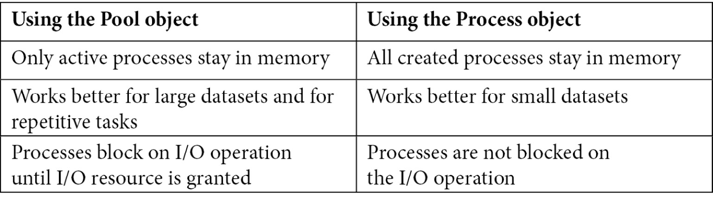

我们可以编写高效和优化的代码以加快执行速度，但是运行我们程序的进程可用的资源量总是有限的。但是，我们仍然可以通过在同一台机器上或跨不同机器并行执行某些任务来缩短应用程序的执行时间。本章将介绍 Python 中运行在单台机器上的应用程序的并行处理或并发。我们将在下一章介绍使用多台机器的并行处理。在本章中，我们重点介绍 Python 中可用于实现并行处理的内置支持。我们将从 Python 中的多线程开始，然后讨论多处理。之后，我们将讨论如何使用异步编程设计响应式系统。对于每种方法，我们将设计并讨论一个案例研究，该案例研究实现一个并发应用程序从 Google Drive 目录下载文件。
我们将在本章中讨论以下主题：

- 了解 Python 中的多线程及其局限性
- 超越单个 CPU – 实现多处理
- 在响应式系统中使用异步编程

完成本章后，您将了解使用内置 Python 库构建多线程或多处理应用程序的不同选项。这些技能不仅可以帮助您构建更高效的应用程序，还可以帮助您为大型用户构建应用程序。

## 技术要求

以下是本章的技术要求：

- Python 3（3.7 或更高版本）
- 一个 Google 云端硬盘帐户
- 为您的 Google Drive 帐户启用 API 密钥

本章的示例代码可以在 https://github.com/PacktPublishing/Python-for-Geeks/tree/master/Chapter07 找到。
我们将从 Python 中的多线程概念开始我们的讨论。

## 了解 Python 中的多线程及其局限性

线程是操作系统进程中的基本执行单元，它由自己的程序计数器、堆栈和一组寄存器组成。可以使用多个线程构建应用程序进程，这些线程可以同时运行并共享相同的内存。
对于程序中的多线程，进程的所有线程共享公共代码和其他资源，例如数据和系统文件。对于每个线程，它的所有相关信息都作为一个数据结构存储在操作系统内核内部，这个数据结构称为线程控制块（TCB）。 TCB 具有以下主要组成部分：
程序计数器（PC）：用于跟踪程序的执行流程。
系统寄存器 (REG)：这些寄存器用于保存可变数据。
堆栈：堆栈是管理执行历史的寄存器数组。
一根线的解剖结构如图 7.1 所示，有 3 根线。每个线程都有自己的 PC、堆栈和 REG，但与其他线程共享代码和其他资源：


TCB 还包含线程标识符、线程的状态（例如运行、等待或停止）以及指向它所属进程的指针。多线程是一个操作系统概念。它是通过系统内核提供的功能。操作系统有助于在同一进程上下文中并发执行多个线程，允许它们共享进程内存。这意味着操作系统可以完全控制激活哪个线程，而不是应用程序。我们需要强调这一点，以便稍后讨论比较不同的并发选项。
当线程在单 CPU 机器上运行时，操作系统实际上将 CPU 从一个线程切换到另一个线程，使得这些线程看起来是并发运行的。在单 CPU 机器上运行多个线程有什么好处吗？答案是肯定的和否定的，这取决于应用程序的性质。对于仅使用本地内存运行的应用程序，可能没有任何优势；事实上，由于在单个 CPU 上切换线程的开销，它很可能表现出较低的性能。但是对于依赖其他资源的应用程序，由于 CPU 的利用率更高，因此执行速度会更快：当一个线程正在等待另一个资源时，另一个线程可以使用 CPU。
在多处理器或多个 CPU 内核上执行多个线程时，可以同时执行它们。接下来，我们将讨论 Python 中多线程编程的局限性。

## 什么是 Python 盲点？

从编程的角度来看，多线程是一种同时运行应用程序不同部分的方法。 Python 使用多个可以运行 Python 用户线程的内核线程。但是 Python 实现 (CPython) 允许线程通过一个全局锁访问 Python 对象，这称为全局解释器锁 (GIL)。简单来说，GIL 是一个互斥锁，它一次只允许一个线程使用 Python 解释器并阻塞所有其他线程。这对于保护 Python 中为每个对象管理的引用计数免受垃圾收集是必要的。如果没有这样的保护，如果多个线程同时更新引用计数，它就会被破坏。此限制的原因是为了保护内部解释器数据结构和非线程安全的第三方 C 代码。

> 重要的提示
> 这种 GIL 限制在 Jython 和 IronPython 中不存在，它们是 Python 的其他实现。

这个 Python 限制可能会给我们一种印象，即用 Python 编写多线程程序没有任何优势。这不是真的。我们仍然可以用 Python 编写并发或并行运行的代码，我们将在案例研究中看到它。多线程在以下情况下很有用：

- I/O 绑定任务：当处理多个 I/O 操作时，通过使用多个线程运行任务总是有提高性能的空间。当一个线程正在等待来自 I/O 资源的响应时，它将释放 GIL 并让其他线程工作。一旦来自 I/O 资源的响应到达，原始线程将被唤醒。
- 响应式 GUI 应用程序：对于交互式 GUI 应用程序，需要有一种设计模式来显示在后台运行的任务的进度（例如，下载文件），并允许用户在一个或更多的任务在后台运行。通过为用户通过 GUI 启动的操作使用单独的线程，这一切都是可能的。
- 多用户应用程序：线程也是构建多用户应用程序的先决条件。 Web 服务器和文件服务器是此类应用程序的示例。一旦新请求到达此类应用程序的主线程，就会创建一个新线程来为该请求提供服务，而后面的主线程会侦听新请求。

在讨论多线程应用程序的案例研究之前，重要的是介绍 Python 中多线程编程的关键组件。

## 学习Python多线程编程的关键组件

Python 中的多线程允许我们同时运行程序的不同组件。要创建应用程序的多个线程，我们将使用 Python 线程模块，接下来介绍该模块的主要组件。
我们将首先讨论 Python 中的线程模块。
线程模块
线程模块作为标准模块提供，提供简单易用的方法来构建程序的多个线程。在幕后，该模块使用较低级别的 _thread 模块，这是 Python 早期版本中流行的多线程选择。
要创建一个新线程，我们将创建一个 Thread 类的对象，该对象可以将函数（要执行）名称作为目标属性，并将要传递给函数的参数作为 args 属性。线程可以被赋予一个名称，该名称可以在创建时使用带有构造函数的名称参数进行设置。
创建Thread类的对象后，我们需要使用start方法来启动线程。为了让主程序或线程等待新创建的线程对象完成，我们需要使用 join 方法。 join 方法确保主线程（调用线程）一直等到调用 join 方法的线程完成其执行。
为了解释线程的创建、启动和等待完成执行的过程，我们将创建一个具有三个线程的简单程序。此类程序的完整代码示例如下所示：

```python
# thread1.py to create simple threads with function
from threading import current_thread, Thread as Thread
from time import sleep
def print_hello():
    sleep(2)
    print("{}: Hello".format(current_thread().name))
def print_message(msg):
    sleep(1)
    print("{}: {}".format(current_thread().name, msg))
# create threads
t1 = Thread(target=print_hello, name="Th 1")
t2 = Thread(target=print_hello, name="Th 2")
t3 = Thread(target=print_message, args=["Good morning"],
        name="Th 3")
# start the threads
t1.start()
t2.start()
t3.start()
# wait till all are done
t1.join()
t2.join()
t3.join()
```

在这个程序中，我们实现了以下内容：

- 我们创建了两个简单的函数，print_hello 和 print_message，供线程使用。我们在两个函数中都使用了 time 模块中的 sleep 函数来确保两个函数在不同的时间完成它们的执行时间。
- 我们创建了三个 Thread 对象。三个对象中的两个将执行一个函数（print_hello）来说明线程的代码共享，第三个线程对象将使用第二个函数（print_message），该函数也带有一个参数。
- 我们使用 start 方法一一启动了所有三个线程。
- 我们使用 join 方法等待每个线程完成。

Thread 对象可以存储在列表中，以使用 for 循环简化启动和连接操作。该程序的控制台输出将如下所示：

```python
Th 3: Good morning
Th 2: Hello
Th 1: Hello
```

线程 1 和线程 2 的睡眠时间比线程 3 多，因此线程 3 总是先完成。线程 1 和线程 2 可以按任何顺序完成，具体取决于谁先获得处理器。

> 重要的提示
> 默认情况下，join 方法会无限期地阻塞调用者线程。但是我们可以使用超时（以秒为单位）作为 join 方法的参数。这将使调用者线程仅在超时期间阻塞。

在讨论更复杂的案例研究之前，我们将回顾更多的概念。

### 守护线程

在正常的应用程序中，我们的主程序会隐式地等待所有其他线程完成它们的执行。但是，有时我们需要在后台运行一些线程，以便它们运行时不会阻止主程序终止自身。这些线程称为守护线程。只要主程序（带有非守护线程）正在运行，这些线程就会保持活动状态，一旦非守护线程退出，就可以终止守护线程。如果线程在执行过程中死亡而不会丢失或损坏任何数据，那么守护线程的使用很流行。
可以使用以下两种方法之一将线程声明为守护线程：

- 使用构造函数传递设置为 True 的 daemon 属性（daemon = True）。
- 在线程实例上将 daemon 属性设置为 True (thread.daemon = True)。

如果一个线程被设置为守护线程，我们启动该线程并忘记它。当调用它的程序退出时，该线程将被自动杀死。
下一个代码显示了守护线程和非守护线程的使用：

```python
# thread2.py to create daemon and non-daemon threads
from threading import current_thread, Thread as Thread
from time import sleep
def daeom_func():
    # print(threading.current_thread().isDaemon())
    sleep(3)
    print("{}: Hello from daemon".format(current_thread().name))
def nondaeom_func():
    # print(threading.current_thread().isDaemon())
    sleep(1)
    print("{}: Hello from non-daemon".format(current_thread().name))
#creating threads
t1 = Thread(target=daeom_func, name="Daemon Thread", daemon=True)
t2 = Thread(target=nondaeom_func, name="Non-Daemon Thread")
# start the threads
t1.start()
t2.start()
print("Exiting the main program")
```

在此代码示例中，我们创建了一个守护进程和一个非守护进程线程。守护线程 (daeom_func) 正在执行睡眠时间为 3 秒的函数，而非守护线程正在执行睡眠时间为 1 秒的函数 (nondaeom_func)。这两个函数的睡眠时间设置为确保非守护线程首先完成其执行。该程序的控制台输出如下：

```bash
Exiting the main program
Non-Daemon Thread: Hello from non-daemon
```

由于我们没有在任何线程中使用 join 方法，因此主线程首先退出，然后非守护线程稍后结束并显示打印消息。但是没有来自守护线程的打印消息。这是因为一旦非守护线程完成其执行，守护线程就会终止。如果我们将 nondaeom_func 函数中的睡眠时间改为 5，控制台输出如下：

```bash
Exiting the main program
Daemon Thread: Hello from daemon
Non-Daemon Thread: Hello from non-daemon
```

通过延迟非守护线程的执行，我们确保守护线程完成其执行并且不会突然终止。

> 重要的提示
> 如果我们在守护线程上使用连接，主线程将被迫等待守护线程完成它的执行。

接下来，我们将研究如何在 Python 中同步线程。

### 同步线程

线程同步是一种确保两个或多个线程不会同时执行共享代码块的机制。通常访问共享数据或共享资源的代码块也称为临界区。这个概念可以通过下图更加清晰：


同时访问临界区的多个线程可能会尝试同时访问或更改数据，这可能会导致数据出现不可预测的结果。 这种情况称为竞争条件。
为了说明竞争条件的概念，我们将实现一个具有两个线程的简单程序，每个线程将共享变量递增 100 万次。 我们为增量选择了一个较大的数字，以确保我们可以观察到竞争条件的结果。 通过在较慢的 CPU 上使用较低的增量周期值，也可以观察到竞争条件。 在这个程序中，我们将创建两个使用相同函数（在本例中为 inc）作为目标的线程。 访问共享变量并加1的代码发生在临界区，两个线程在没有任何保护的情况下访问它。 完整的代码示例如下：

```python
# thread3a.py when no thread synchronization used
from threading import Thread as Thread
def inc():
    global x
    for _ in range(1000000):
        x+=1
#global variabale
x = 0
# creating threads
t1 = Thread(target=inc, name="Th 1")
t2 = Thread(target=inc, name="Th 2")
# start the threads
t1.start()
t2.start()
#wait for the threads
t1.join()
t2.join()
print("final value of x :", x)
```

执行结束时 x 的预期值为 2,000,000，在控制台输出中不会观察到。每次我们执行这个程序时，我们都会得到一个不同的 x 值，它远低于 2,000,000。这是因为两个线程之间的竞争条件。让我们看一下线程 Th 1 和 Th 2 同时运行临界区 (x+=1) 的场景。两个线程都会询问 x 的当前值。如果我们假设 x 的当前值为 100，那么两个线程都会将其读取为 100 并将其增加到新值 101。两个线程会将新值 101 写回内存。这是一次增加并且，实际上，两个线程应该相互独立地递增变量，并且 x 的最终值应该是 102。我们怎样才能做到这一点？这就是线程同步派上用场的地方。
线程同步可以通过使用线程模块中的 Lock 类来实现。锁是使用操作系统提供的信号量对象实现的。信号量是操作系统级别的同步对象，用于控制多个处理器和线程对资源和数据的访问。 Lock 类提供了两个方法，acquire 和 release，下面分别介绍：

- acquire方法用于获取锁。锁可以是阻塞的（默认）或非阻塞的。在阻塞锁的情况下，请求线程的执行被阻塞，直到当前获取线程释放锁。一旦当前获取线程释放锁（解锁），锁就会被提供给请求线程以继续。在非阻塞获取请求的情况下，线程执行不会被阻塞。如果锁可用（未锁定），则将锁提供（并锁定）给请求线程以继续进行，否则请求线程将获得 False 作为响应。
- release 方法用于释放锁，这意味着它将锁重置为解锁状态。如果有任何线程阻塞并等待锁定，它将允许其中一个线程继续进行。

thread3a.py 代码示例通过在共享变量 x 上的增量语句周围使用锁进行了修订。在这个修改后的示例中，我们在主线程级别创建了一个锁，然后将其传递给 inc 函数以获取和释放共享变量周围的锁。完整修改后的代码示例如下：

```python
# thread3b.py when thread synchronization is used
from threading import Lock, Thread as Thread
def inc_with_lock (lock):
    global x
    for _ in range(1000000):
        lock.acquire()
        x+=1
        lock.release()
x = 0
mylock = Lock()
# creating threads
t1 = Thread(target= inc_with_lock, args=(mylock,), name="Th     1")
t2 = Thread(target= inc_with_lock, args=(mylock,), name="Th     2")
# start the threads
t1.start()
t2.start()
#wait for the threads
t1.join()
t2.join()
print("final value of x :", x)
```

使用 Lock 对象后，x 的值始终为 2000000。Lock 对象确保一次只有一个线程递增共享变量。线程同步的优点是可以使用系统资源，性能增强，结果可预测。
但是，必须谨慎使用锁，因为锁的不当使用会导致死锁情况。假设一个线程获取了资源 A 的锁，正在等待获取资源 B 的锁。但是另一个线程已经持有资源 B 的锁，并且正在寻求获取锁资源 A。这两个线程将互相等待释放锁，但它永远不会发生。为避免死锁情况，多线程和多处理库提供了一些机制，例如为资源添加超时以持有锁，或使用上下文管理器获取锁。

### 使用同步队列

Python 中的 Queue 模块实现了多生产者和多消费者队列。当信息必须在不同线程之间安全交换时，队列在多线程应用程序中非常有用。同步队列的美妙之处在于它们带有所有必需的锁定机制，并且不需要使用额外的锁定语义。
Queue 模块中有三种类型的队列：

- FIFO：在 FIFO 队列中，最先添加的任务首先被检索。
- LIFO：在 LIFO 队列中，首先检索最后添加的任务。
- 优先队列：在这个队列中，条目被排序，具有最低值的条目首先被检索。

这些队列使用锁来保护竞争线程对队列条目的访问。使用代码示例最好地说明队列与多线程程序的使用。在下一个示例中，我们将创建一个包含虚拟任务的 FIFO 队列。为了处理队列中的任务，我们将通过继承 Thread 类来实现一个自定义线程类。这是实现线程的另一种方式。
要实现自定义线程类，我们需要覆盖 init 和 run 方法。在init方法中，需要调用超类（Thread类）的init方法。 run 方法是线程类的执行部分。完整的代码示例如下：

```python
# thread5.py with queue and custom Thread class
from queue import Queue
from threading import Thread as Thread
from time import sleep
class MyWorker (Thread):
   def __init__(self, name, q):
      threading.Thread.__init__(self)
      self.name = name
      self.queue = q
   def run(self):
      while True:
          item = self.queue.get()
          sleep(1)
          try:
              print ("{}: {}".format(self.name, item))
          finally:
            self.queue.task_done()
# filling the queue
myqueue = Queue()
for i in range (10):
    myqueue.put("Task {}".format(i+1))
# creating threads
for i in range (5):
    worker = MyWorker("Th {}".format(i+1), myqueue)
    worker.daemon = True
    worker.start()
myqueue.join()
```

在此代码示例中，我们使用自定义线程类 (MyThread) 创建了五个工作线程。这五个工作线程访问队列以从中获取任务项。线程获得任务项后，休眠1秒，然后打印线程名称和任务名称。对于队列中的一个项目的每次 get 调用，task_done() 的后续调用表明该任务的处理已经完成。
需要注意的是，我们在 myqueue 对象而不是线程上使用了 join 方法。队列上的 join 方法阻塞主线程，直到队列中的所有项目都已处理并完成（为它们调用 task_done）。当队列对象用于保存线程的任务数据时，这是阻塞主线程的推荐方法。
接下来，我们将使用 Thread 类、Queue 类和几个第三方库实现一个从 Google Drive 下载文件的应用程序。

## 案例研究——一个从 Google Drive 下载文件的多线程应用程序

我们在上一节中讨论过，当不同的线程处理输入和输出任务时，Python 中的多线程应用程序表现得很好。这就是我们选择实现一个从 Google Drive 的共享目录下载文件的应用程序的原因。要实现此应用程序，我们将需要以下内容：

- Google Drive：一个 Google Drive 帐户（免费的基本帐户就可以），其中一个目录标记为共享。
- API 密钥：需要一个 API 密钥来访问 Google API。需要启用 API 密钥才能使用适用于 Google Drive 的 Google API。可以按照 Google Developers 网站 (https://developers.google.com/drive/api/v3/enable-drive-api) 上的指南启用 API。
- getfilelistpy：这是一个第三方库，可从 Google Drive 共享目录中获取文件列表。可以使用 pip 工具安装此库。
- gdown：这是一个从 Google Drive 下载文件的第三方库。这个库也可以通过 pip 工具安装。还有其他可用的库提供相同的功能。我们选择 gdown 库是因为它易于使用。

要使用 getfilelistpy 模块，我们需要创建一个资源数据结构。此数据结构将包含一个文件夹标识符作为 id（在我们的例子中这将是 Google Drive 文件夹 ID）、用于访问 Google Drive 文件夹的 API 安全密钥 (api_key) 以及要在以下情况下获取的文件属性（字段）列表我们得到一个文件列表。我们构建资源数据结构如下：

```python
resource = {
    "api_key": "AIzaSyDYKmm85kebxddKrGns4z0",
    "id": "0B8TxHW2Ci6dbckVwTRtTl3RUU",
    "fields": "files(name, id, webContentLink)",
}
'''示例中使用的 API 密钥和 ID 不是原始的，因此应根据您的帐户和共享目录 ID 进行替换'''
```

我们将文件属性限制为文件 ID、名称及其 Web 链接 (URL)。接下来，我们需要将每个文件项作为线程的任务添加到队列中。该队列将被多个工作线程用于并行下载文件。
为了使应用程序在我们可以使用的工作线程数量方面更加灵活，我们构建了一个工作线程池。池的大小由在程序开始时设置的全局变量控制。我们根据线程池的大小创建了工作线程。池中的每个工作线程都可以访问具有文件列表的队列。与前面的代码示例一样，每个工作线程将一次从队列中取出一个文件项，下载文件，并使用 task_done 方法将文件项标记为完成。定义资源数据结构和为工作线程定义类的示例代码如下：

```python
#threads_casestudy.py
from queue import Queue
from threading import Thread
import time
from getfilelistpy import getfilelist
import gdown
THREAD_POOL_SIZE = 1
resource = {
    "api_key": "AIzaSyDYKmm85kea2bxddKrGns4z0",
    "id": "0B8TxHW2Ci6dbckVweTRtTl3RUU ",
    "fields": "files(name,id,webContentLink)",
}
class DownlaodWorker(Thread):
    def __init__(self, name, queue):
        Thread.__init__(self)
        self.name = name
        self.queue = queue
    def run(self):
        while True:
            # Get the file id and name from the queue
            item1 = self.queue.get()
            try:
                gdown.download( item1['webContentLink'],
                    './files/{}'.format(item1['name']),
                    quiet=False)
            finally:
                self.queue.task_done()
```

我们使用资源数据结构从 Google Drive 目录中获取文件的元数据，如下所示：

```python
def get_files(resource):
    #global files_list
    res = getfilelist.GetFileList(resource)
    files_list = res['fileList'][0]
    return files_list
```

在 main 函数中，我们创建了一个 Queue 对象来将文件元数据插入到队列中。 Queue 对象被移交给工作线程池以下载文件。 如前所述，工作线程将下载文件。 我们使用时间类来衡量完成从 Google Drive 目录下载所有文件所需的时间。 main函数的代码如下：

```python
def main():
    start_time = time.monotonic()
    files = get_files(resource)
    #add files info into the queue
    queue = Queue()
    for item in files['files']:
        queue.put(item)
    for i in range (THREAD_POOL_SIZE):
        worker = DownlaodWorker("Thread {}".format(i+1), queue)
        worker.daemon = True
        worker.start()
    queue.join()
    end_time = time.monotonic()
    print('Time taken to download: {} seconds'.format( end_time - start_time))

main()
```

对于此应用程序，我们在 Google Drive 目录中有 10 个文件，大小从 500 KB 到 3 MB 不等。我们使用 1、5 和 10 个工作线程运行应用程序。使用 1 个线程下载 10 个文件所花费的总时间约为 20 秒。这几乎相当于在没有任何线程的情况下编写代码。事实上，我们已经编写了一个无需任何线程即可下载相同文件的代码，并以本书的源代码为例。使用非线程应用程序下载 10 个文件所需的时间约为 19 秒。
当我们将工作线程的数量更改为 5 时，在我们的 MacBook 机器（具有 16 GB RAM 的英特尔酷睿 i5）上下载 10 个文件所花费的时间显着减少到大约 6 秒。如果你在电脑上运行同样的程序，时间可能会有所不同，但如果我们增加工作线程的数量，肯定会有所改善。对于 10 个线程，我们观察到执行时间约为 4 秒。这一观察结果表明，无论 GIL 有什么限制，使用多线程都可以缩短 I/O 绑定任务的执行时间。
我们对如何在 Python 中实现线程以及如何使用 Lock 类和 Queue 类从不同的锁定机制中获益的讨论到此结束。接下来，我们将讨论 Python 中的多处理编程。

## 超越单个 CPU – 实现多处理

我们已经看到了多线程编程的复杂性及其局限性。问题是多线程的复杂性是否值得付出努力。对于与 I/O 相关的任务而言，它可能是值得的，但对于一般应用程序用例则不然，尤其是当存在替代方法时。另一种方法是使用多处理，因为单独的 Python 进程不受 GIL 的约束，并且执行可以并行发生。当应用程序在多核处理器上运行并涉及对 CPU 要求很高的密集任务时，这尤其有益。实际上，使用多处理是 Python 内置库中利用多个处理器内核的唯一选择。
图形处理单元 (GPU) 提供的内核数量比常规 CPU 多，并且被认为更适合数据处理任务，尤其是在并行执行它们时。唯一需要注意的是，为了在 GPU 上执行数据处理程序，我们必须将数据从主内存传输到 GPU 的内存。当我们处理大型数据集时，将补偿这一额外的数据传输步骤。但是，如果我们的数据集很小，几乎没有好处。使用 GPU 进行大数据处理，尤其是训练机器学习模型，正成为一种流行的选择。英伟达推出了称为 CUDA 的用于并行处理的 GPU，它通过 Python 中的外部库得到了很好的支持。
每个进程在操作系统级别都有一个称为进程控制块 (PCB) 的数据结构。与 TCB 一样，PCB 有一个进程 ID (PID) 用于进程标识，存储进程的状态（例如运行或等待），并具有程序计数器、CPU 寄存器、CPU 调度信息和更多属性。
在 CPU 有多个进程的情况下，本机没有内存共享。这意味着数据损坏的可能性较低。如果两个进程要共享数据，就需要使用一些进程间通信机制。 Python 通过其原语支持进程间通信。在接下来的小节中，我们将首先讨论在 Python 中创建进程的基础知识，然后讨论如何实现进程间通信。

### 创建多个进程

对于多处理编程，Python 提供了一个与多线程包非常相似的多处理包。 multiprocessing 包包括两种实现多处理的方法，即使用 Process 对象和 Pool 对象。我们将一一讨论这些方法。
使用进程对象
可以通过创建 Process 对象，然后使用其 start 方法类似于启动 Thread 对象的 start 方法来生成进程。事实上，Process 对象提供与 Thread 对象相同的 API。创建多个子进程的简单代码示例如下：

```python
# process1.py to create simple processes with function
import os
from multiprocessing import Process, current_process as cp
from time import sleep
def print_hello():
    sleep(2)
    print("{}-{}: Hello".format(os.getpid(), cp().name))
def print_message(msg):
    sleep(1)
    print("{}-{}: {}".format(os.getpid(), cp().name, msg))
def main():
    processes = []
    # creating process
    processes.append(Process(target=print_hello, name="Process 1"))
    processes.append(Process(target=print_hello, name="Process 2"))
    processes.append(
        Process(
            target=print_message,
            args=["Good morning"],
            name="Process 3"
        )
    )
    # start the process
    for p in processes:
        p.start()
    # wait till all are done
    for p in processes:
        p.join()
    print("Exiting the main process")
if __name__ == '__main__':
    main()
```

如前所述，用于 Process 对象的方法与用于 Thread 对象的方法几乎相同。 此示例的解释与多线程代码示例中的示例代码相同。

### 使用 Pool 对象

Pool 对象提供了一种方便的方法（使用其 map 方法）来创建进程、为每个新进程分配功能以及在进程之间分配输入参数。 我们选择了池大小为 3 的代码示例，但提供了五个进程的输入参数。 将池大小设置为 3 的原因是为了确保一次最多三个子进程处于活动状态，而不管我们通过 Pool 对象的 map 方法传递了多少参数。 附加参数将在完成当前执行后立即移交给相同的子进程。 这是一个池大小为 3 的代码示例：

```python
# process2.py to create processes using a pool
import os
from multiprocessing import Process, Pool, current_process as cp
from time import sleep
def print_message(msg):
    sleep(1)
    print("{}-{}: {}".format(os.getpid(), cp().name, msg))
def main():
    # creating process from a pool
    with Pool(3) as proc:
        proc.map(print_message, ["Orange", "Apple", "Banana", "Grapes","Pears"])
    print("Exiting the main process")
if __name__ == '__main__':
    main()
```

将输入参数分配给绑定到一组池进程的函数的神奇之处在于 map 方法。 map 方法等待所有函数完成它们的执行，这就是为什么如果进程是使用 Pool 对象创建的，则不需要使用 join 方法。
下表显示了使用 Process 对象与 Pool 对象之间的一些差异：



接下来，我们将讨论如何在进程之间交换数据。

## 进程间共享数据

multiprocessing 包中有两种方法可以在进程之间共享数据。这些是共享内存和服务器进程。接下来将对其进行描述。
使用共享 ctype 对象（共享内存）
在这种情况下，创建了一个共享内存块，进程可以访问这个共享内存块。一旦我们启动 multiprocessing 包中可用的 ctype 数据类型之一，就会创建共享内存。数据类型是数组和值。 Array 数据类型是一个 ctype 数组，Value 数据类型是一个通用的 ctype 对象，两者都是从共享内存中分配的。要创建 ctype 数组，我们将使用如下语句：

```python
mylist = multiprocessing.Array('i', 5)
```

这将创建一个大小为 5 的整数数据类型数组。 i 是类型代码之一，它代表整数。我们可以将 d 类型代码用于浮点数据类型。我们还可以通过提供序列作为第二个参数（而不是大小）来初始化数组，如下所示：

```python
mylist = multiprocessing.Array('i', [1,2,3,4,5])
```

要创建 Value ctype 对象，我们将使用类似于以下的语句：

```python
obj = multiprocessing.Value('i')
```

这将创建一个整数数据类型的对象，因为类型代码设置为 i。可以使用 value 属性访问或设置此对象的值。
这两个 ctype 对象都有 Lock 作为可选参数，默认情况下设置为 True。此参数设置为 True 时用于创建新的递归锁定对象，该对象提供对对象值的同步访问。如果设置为 False，将没有保护，也不会是一个安全的过程。如果您的进程仅出于读取目的访问共享内存，则可以将 Lock 设置为 False。在接下来的代码示例中，我们将此 Lock 参数保留为默认值 (True)。
为了说明共享内存中这些 ctype 对象的使用，我们将创建一个包含三个数值的默认列表，一个大小为 3 的 ctype 数组来保存原始数组的递增值，以及一个 ctype 对象来保存递增数组。这些对象将由共享内存中的父进程创建，并由共享内存中的子进程访问和更新。这种父子进程与共享内存的交互如下图所示：


使用共享内存的完整代码示例如下所示：

```python
# process3.py to use shared memory ctype objects
import multiprocessing
from multiprocessing import Process, Pool, current_process   as cp
def inc_sum_list(list, inc_list, sum):
    sum.value = 0
    for index, num in enumerate(list):
        inc_list[index] = num + 1
        sum.value = sum.value + inc_list[index]
def main():
    mylist = [2, 5, 7]
    inc_list = multiprocessing.Array('i', 3)
    sum = multiprocessing.Value('i')
    p = Process(target=inc_sum_list, args=(mylist, inc_list, sum))
    p.start()
    p.join()
    print("incremented list: ", list(inc_list))
    print("sum of inc list: ", sum.value)
    print("Exiting the main process")
if __name__ == '__main__':
    main()
```

共享数据类型（在本例中为 inc_list 和 sum）由父进程和子进程访问。值得一提的是，使用共享内存不是推荐的选项，因为当多个进程访问相同的共享内存对象并且 Lock 参数设置为 False 时，它需要同步和锁定机制（类似于我们为多线程所做的） .
在进程之间共享数据的下一个方法是使用服务器进程。
使用服务器进程
在这种情况下，一旦 Python 程序启动，服务器进程就会启动。这个新进程用于创建和管理父进程请求的新子进程。此服务器进程可以保存其他进程可以使用代理访问的 Python 对象。
为了实现服务器进程并在进程之间共享对象，多处理包提供了一个管理器对象。 Manager 对象支持不同的数据类型，例如：

- Lists
- Dictionaries
- Locks
- Rlocks
- Queues
- Values
- Arrays

我们选择用于说明服务器进程的代码示例使用 Manager 对象创建一个字典对象，然后将字典对象传递给不同的子进程以插入更多数据并打印出字典内容。我们将为我们的示例创建三个子进程：两个用于将数据插入字典对象，一个用于获取字典内容作为控制台输出。父进程、服务器进程和三个子进程之间的交互如图7.4所示。一旦使用管理器上下文执行新的进程请求，父进程就会创建服务器进程。子进程由服务器进程创建和管理。共享数据在服务器进程中可用，并且可以被所有进程访问，包括父进程：


完整的代码示例如下所示：

```python
# process4.py to use shared memory using the server process
import multiprocessing
from multiprocessing import Process, Manager
def insert_data (dict1, code, subject):
    dict1[code] =  subject
def output(dict1):
    print("Dictionary data: ", dict1)
def main():
    with multiprocessing.Manager() as mgr:
        # create a dictionary in the server process
        mydict = mgr.dict({100: "Maths", 200: "Science"})
        p1 = Process(target=insert_data, args=(mydict, 300, "English"))
        p2 = Process(target=insert_data, args=(mydict, 400, "French"))
        p3 = Process(target=output, args=(mydict,))
        p1.start()
        p2.start()
        p1.join()
        p2.join()
        p3.start()
        p3.join()
    print("Exiting the main process")
if __name__ == '__main__':
    main()
```

服务器进程方法比共享内存方法提供更大的灵活性，因为它支持多种对象类型。但是，与共享内存方法相比，这是以性能降低为代价的。
在下一节中，我们将探讨进程之间直接通信的选项。

## 在进程之间交换对象

在上一节中，我们研究了如何通过外部存储块或新进程在进程之间共享数据。在本节中，我们将研究使用 Python 对象在进程之间交换数据。多处理模块为此提供了两个选项。这些使用 Queue 对象和 Pipe 对象。

### 使用队列对象

Queue 对象可从 multiprocessing 包中获得，它与我们用于多线程的同步队列对象 (queue.Queue) 几乎相同。这个 Queue 对象是进程安全的，不需要任何额外的保护。下面显示了一个代码示例，用于说明如何使用多处理队列对象进行数据交换：

```python
# process5.py to use queue to exchange data
import multiprocessing
from multiprocessing import Process, Queue
def copy_data (list, myqueue):
    for num in list:
        myqueue.put(num)
def output(myqueue):
    while not myqueue.empty():
        print(myqueue.get())
def main():
    mylist = [2, 5, 7]
    myqueue = Queue()
    p1 = Process(target=copy_data, args=(mylist, myqueue))
    p2 = Process(target=output, args=(myqueue,))
    p1.start()
    p1.join()
    p2.start()
    p2.join()
    print("Queue is empty: ",myqueue.empty())
    print("Exiting the main process")
if __name__ == '__main__':
    main()
```

在此代码示例中，我们创建了一个标准列表对象和一个多处理队列对象。 list 和 Queue 对象被传递到一个新进程，该进程附加到一个名为 copy_data 的函数。该函数会将数据从列表对象复制到队列对象。启动一个新进程来打印 Queue 对象的内容。请注意，Queue 对象中的数据是由前一个进程设置的，新进程可以使用这些数据。这是一种方便的数据交换方式，不会增加共享内存或服务器进程的复杂性。

### 使用管道对象

Pipe 对象就像是两个进程之间用于交换数据的管道。这就是为什么这个对象在需要双向通信时特别有用的原因。当我们创建一个 Pipe 对象时，它提供了两个连接对象，分别是 Pipe 对象的两端。每个连接对象都提供了一个 send 和一个 recv 方法来发送和接收数据。
为了说明 Pipe 对象的概念和使用，我们将创建两个将附加到两个独立进程的函数：
第一个函数用于通过管道对象连接发送消息。我们将发送一些数据消息并以 BYE 消息完成通信。
第二个功能是使用 Pipe 对象的另一个连接对象接收消息。此函数将无限循环运行，直到收到 BYE 消息。
这两个功能（或进程）由管道的两个连接对象提供。完整代码如下：

```python
# process6.py to use Pipe to exchange data
from multiprocessing import Process, Pipe
def mysender (s_conn):
    s_conn.send({100, "Maths"})
    s_conn.send({200, "Science"})
    s_conn.send("BYE")
def myreceiver(r_conn):
    while True:
        msg = r_conn.recv()
        if msg == "BYE":
            break
        print("Received message : ", msg)
def main():
    sender_conn, receiver_conn= Pipe()
    p1 = Process(target=mysender, args=(sender_conn, ))
    p2 = Process(target=myreceiver, args=(receiver_conn,))
    p1.start()
    p2.start()
    p1.join()
    p2.join()
    print("Exiting the main process")
if __name__ == '__main__':
    main()
```

值得一提的是，如果两个进程尝试同时使用同一个连接对象读取或写入管道对象，则管道对象中的数据很容易被破坏。这就是为什么多处理队列是首选选项：因为它们在进程之间提供适当的同步。

## 进程间同步

进程之间的同步确保两个或多个进程不会同时访问相同的资源或程序代码，这也称为临界区。这种情况会导致竞争条件，这可能会破坏数据。不同进程之间发生争用情况的几率不是很高，但如果它们使用共享内存或访问相同的资源，仍然有可能。这些情况可以通过使用具有内置同步的适当对象或使用 Lock 对象来避免，类似于我们在多线程情况下使用的对象。
我们说明了队列和 ctype 数据类型的使用，其中 Lock 设置为 True，这是进程安全的。在下一个代码示例中，我们将说明如何使用 Lock 对象来确保一个进程一次可以访问控制台输出。我们使用 Pool 对象创建进程并将相同的 Lock 对象传递给所有进程，我们使用了 Manager 对象中的 Lock 而不是 multiprocessing 包中的 Lock。我们还使用偏函数将 Lock 对象绑定到每个进程，以及要分发给每个进程函数的列表。这是完整的代码示例：

```python
# process7.py to show synchronization and locking
from functools import partial
from multiprocessing import Pool, Manager
def printme (lock, msg):
    lock.acquire()
    try:
        print(msg)
    finally:
        lock.release()
def main():
    with Pool(3) as proc:
        lock = Manager().Lock()
        func = partial(printme,lock)
        proc.map(func, ["Orange", "Apple", "Banana", "Grapes","Pears"])
    print("Exiting the main process")
if __name__ == '__main__':
    main()
```

如果我们不使用 Lock 对象，来自不同进程的输出可能会混淆。

## 案例研究——一个从 Google Drive 下载文件的多处理器应用程序

在本节中，我们将实施与案例研究中相同的案例研究——一个从 Google Drive 部分下载文件的多线程应用程序，但使用处理器。 先决条件和目标与多线程应用程序案例研究中描述的相同。
对于此应用程序，我们使用了为多线程应用程序构建的相同代码，不同之处在于我们使用进程而不是线程。 另一个区别是我们使用了多处理模块中的 JoinableQueue 对象来实现与我们从常规 Queue 对象中获得的功能相同的功能。 定义资源数据结构和从Google Drive下载文件的函数代码如下：

```python
#processes_casestudy.py
import time
from multiprocessing import Process, JoinableQueue
from getfilelistpy import getfilelist
import gdown
PROCESSES_POOL_SIZE = 5
resource = {
    "api_key": "AIzaSyDYKmm85keqnk4bF1Da2bxddKrGns4z0",
    "id": "0B8TxHW2Ci6dbckVwetTlV3RUU",
    "fields": "files(name,id,webContentLink)",
}
def mydownloader( queue):
    while True:
        # Get the file id and name from the queue
        item1 =  queue.get()
        try:
            gdown.download(
                item1['webContentLink'],
                './files/{}'.format(item1['name']),
                quiet=False
            )
        finally:
            queue.task_done()
```

我们使用资源数据结构从 Google Drive 目录中获取文件的元数据，例如名称和 HTTP 链接，如下所示：

```python
def get_files(resource):
    res = getfilelist.GetFileList(resource)
    files_list = res['fileList'][0]
    return files_list
```

在我们的主函数中，我们创建了一个 JoinableQueue 对象并将文件的元数据插入到队列中。 队列将被移交给一个进程池来下载文件。 这些进程将下载文件。 我们使用时间类来测量从 Google Drive 目录下载所有文件所需的时间。 main函数的代码如下：

```python
def main ():
    files = get_files(resource)
    #add files info into the queue
    myqueue = JoinableQueue()
    for item in files['files']:
        myqueue.put(item)
    processes = []
    for id in range(PROCESSES_POOL_SIZE):
        p = Process(target=mydownloader, args=(myqueue,))
        p.daemon = True
        p.start()
    start_time = time.monotonic()
    myqueue.join()
    total_exec_time = time.monotonic() - start_time
    print(f'Time taken to download: {total_exec_time:.2f} seconds')
if __name__ == '__main__':
    main()
```

我们通过改变不同数量的进程（例如 3、5、7 和 10）来运行此应用程序。我们发现下载相同文件所花费的时间（对于多线程案例研究）比使用多线程应用程序。执行时间因机器而异，但在我们的机器上（MacBook Pro：Intel Core i5，16 GB RAM），5 个进程大约需要 5 秒，10 个进程并行运行需要 3 秒。与多线程应用程序相比，这种 1 秒的改进符合预期结果，因为多处理提供了真正的并发性。

## 在响应式系统中使用异步编程

对于多处理和多线程编程，我们主要处理同步编程，在这种情况下，我们请求某些内容并等待收到响应，然后再转到下一个代码块。如果应用了任何上下文切换，则由操作系统提供。 Python中异步编程的不同主要有以下两个方面：

- 任务是为异步执行而创建的。这意味着父调用者不必等待来自另一个进程的响应。一旦完成执行，进程将响应调用者。
- 操作系统不再管理进程和线程之间的上下文切换。异步程序在一个进程中只会有一个线程，但我们可以用它做很多事情。在这种执行方式中，每个进程或任务在空闲或等待其他资源时都会主动释放控制权，以确保其他任务得到轮回。这个概念被称为协作多任务处理。

协同多任务是在应用层实现并发的有效工具。在协作多任务中，我们不构建进程或线程，而是构建任务，其中包括小任务、协程和/或绿色线程。这些任务由称为事件循环的单个函数协调。事件循环注册任务并处理任务之间的控制流。 Python 中事件循环的美妙之处在于它是使用生成器实现的，这些生成器可以执行一个函数并在特定点暂停它（使用 yield），同时在恢复之前保持对象堆栈处于控制之下。

对于基于协作多任务处理的系统，始终存在何时将控制权释放回调度程序或事件循环的问题。最常用的逻辑是使用 I/O 操作作为释放控制的事件，因为每当我们进行 I/O 操作时，总会涉及到等待时间。
但是等等，这不是我们用于多线程的逻辑吗？我们发现多线程在处理 I/O 操作时提高了应用程序性能。但这里有一个区别。在多线程的情况下，操作系统管理线程之间的上下文切换，它可以出于任何原因抢占任何正在运行的线程并将控制权交给另一个线程。但在异步编程或协作多任务中，任务或协程对操作系统是不可见的，不能被抢占。协程实际上不能被主事件循环抢占。但这并不意味着操作系统不能抢占整个 Python 进程。主要的 Python 进程仍在操作系统级别与其他应用程序和进程竞争资源。
在下一节中，我们将讨论 asyncio 模块提供的 Python 异步编程的一些构建块，并以一个全面的案例研究结束。

## 理解 asyncio 模块

asyncio 模块在 Python 3.5 或更高版本中可用，用于使用 async/await 语法编写并发程序。 但是建议使用 Python 3.7 或更高版本来构建任何严重的 asyncio 应用程序。 该库功能丰富，支持创建和运行 Python 协程、执行网络 I/O 操作、将任务分配到队列以及同步并发代码。
我们将从如何编写和执行协程和任务开始。

### 协程和任务

协程是要异步执行的函数。 使用协程将字符串发送到控制台输出的简单示例如下：

```python
#asyncio1.py to build a basic coroutine
import asyncio
import time
async def say(delay, msg):
    await asyncio.sleep(delay)
    print(msg)
print("Started at ", time.strftime("%X"))
asyncio.run(say(1,"Good"))
asyncio.run(say(2, "Morning"))
print("Stopped at ", time.strftime("%X"))
```

在此代码示例中，请务必注意以下几点：

- 协程采用 delay 和 msg 参数。 delay 参数用于在将 msg 字符串发送到控制台输出之前添加延迟。
- 我们使用了 asyncio.sleep 函数而不是传统的 time.sleep 函数。 如果使用 time.sleep 函数，控制将不会交还给事件循环。 这就是为什么使用兼容的 asyncio.sleep 函数很重要。
- 协程使用 run 方法使用两个不同的延迟参数值执行两次。 run 方法不会并发执行协程。

该程序的控制台输出如下。 这表明协程一个接一个地执行，因为添加的总延迟为 3 秒：

```bash
Started at 15:59:55
Good
Morning
Stopped at 15:59:58
```

要并行运行协程，我们需要使用 asyncio 模块中的 create_task 函数。 此函数创建一个任务，可用于安排协程并发运行。
下一个代码示例是 asyncio1.py 的修订版，其中我们使用 create_task 函数将协程（在我们的例子中）包装到一个任务中。 在这个修订版中，我们创建了两个任务来包装 say 协程。 我们使用 await 关键字等待两个任务完成：

```python
#asyncio2.py to build and run coroutines in parallel
import asyncio
import time
async def say(delay, msg):
    await asyncio.sleep(delay)
    print(msg)
async def main ():
    task1 = asyncio.create_task( say(1, 'Good'))
    task2 = asyncio.create_task( say(1, 'Morning'))
    print("Started at ", time.strftime("%X"))
    await task1
    await task2
    print("Stopped at ", time.strftime("%X"))
asyncio.run(main())
# The console output of this program is as follows:
# Started at 16:04:40
# Good
# Morning
# Stopped at  16:04:41
```

此控制台输出显示两个任务在 1 秒内完成，这证明任务是并行执行的。

### 使用等待对象

如果我们可以对其应用 await 语句，则对象是可等待的。其内部的大多数 asyncio 函数和模块旨在与可等待对象一起使用。但是大多数 Python 对象和第三方库并不是为异步编程而构建的。在构建异步应用程序时，选择提供可等待对象的兼容库非常重要。
Awaitable 对象主要分为三种类型：协程、任务和期货。我们已经讨论过协程和任务。 Future 是一个低级对象，类似于用于处理来自 async/await 的结果的回调机制。 Future 对象通常不会为用户级编程公开。

### 并发运行任务

如果我们必须并行运行多个任务，我们可以像在前面的示例中那样使用 await 关键字。但是有一种更好的方法可以通过使用 gather 函数来做到这一点。此函数将按提供的顺序运行可等待对象。如果任何可等待对象是协程，它将被安排为任务。我们将在下一节中通过代码示例看到 Gather 函数的使用。

## 使用队列分配任务

asyncio 包中的 Queue 对象类似于 Queue 模块，但它不是线程安全的。 aysncio 模块提供了多种队列实现，例如先进先出队列、优先级队列和后进先出队列。 asyncio 模块中的队列可用于将工作负载分配给任务。
为了说明队列与任务的使用，我们将编写一个小程序，通过随机休眠一段时间来模拟真实函数的执行时间。随机睡眠时间是为 10 次这样的执行计算的，并由主进程作为工作项添加到 Queue 对象中。 Queue 对象被传递到一个包含三个任务的池中。池中的每个任务执行分配的协程，它根据可用的队列条目消耗执行时间。完整代码如下所示：

```python
#asyncio3.py to distribute work via queue
import asyncio
import random
import time
async def executer(name, queue):
    while True:
        exec_time = await queue.get()
        await asyncio.sleep(exec_time)
        queue.task_done()
        #print(f'{name} has taken  {exec_time:.2f} seconds')
async def main ():
    myqueue = asyncio.Queue()
    calc_exuection_time = 0
    for _ in range(10):
        sleep_for = random.uniform(0.4, 0.8)
        calc_exuection_time += sleep_for
        myqueue.put_nowait(sleep_for)
    tasks = []
    for id in range(3):
        task = asyncio.create_task(executer(f'Task-{id+1}',                 myqueue))
        tasks.append(task)
    start_time = time.monotonic()
    await myqueue.join()
    total_exec_time = time.monotonic() - start_time
    for task in tasks:
        task.cancel()
    await asyncio.gather(*tasks, return_exceptions=True)
    print(f"Calculated execution time         {calc_exuection_time:0.2f}")
    print(f"Actual execution time {total_exec_time:0.2f}")
asyncio.run(main())
```

我们使用了 Queue 对象的 put_no_wait 函数，因为它是一个非阻塞操作。该程序的控制台输出如下：
计算执行时间 5.58
实际执行时间 2.05
这清楚地表明任务是并行执行的，执行效果比顺序执行任务好三倍。
到目前为止，我们已经介绍了 Python 中 asyncio 包的基本概念。在结束本主题之前，我们将通过使用 asyncio 任务实现多线程部分来重新审视我们为多线程部分所做的案例研究。
案例研究 – 从 Google Drive 下载文件的 asyncio 应用程序

我们将实现与案例研究中相同的案例研究——一个多线程应用程序，用于从 Google Drive 部分下载文件，但使用带有 async、await 和 async 队列的 asyncio 模块。除了我们使用 aiohttp 和 aiofiles 库而不是 gdown 库之外，此案例研究的先决条件是相同的。原因很简单：gdown 库不是作为异步模块构建的。将它与异步编程一起使用没有任何好处。 This is an important point to consider whenever selecting libraries to be used with async applications.
对于此应用程序，我们构建了一个协程 mydownloader，以使用 aiohttp 和 aiofiles 模块从 Google Drive 下载文件。这在下面的代码中显示，与之前的案例研究不同的代码被突出显示：

```python
#asyncio_casestudy.py
import asyncio
import time
import aiofiles, aiohttp
from getfilelistpy import getfilelist
TASK_POOL_SIZE = 5
resource = {
    "api_key": "AIzaSyDYKmm85keqnk4bF1DpYa2dKrGns4z0",
    "id": "0B8TxHW2Ci6dbckVwetTlV3RUU",
    "fields": "files(name, id, webContentLink)",
}
async def mydownloader(name, queue):
    while True:
        # Get the file id and name from the queue
        item = await queue.get()
        try:
            async with aiohttp.ClientSession() as sess:
                async with sess.get(item['webContentLink'])
                    as resp:
                    if resp.status == 200:
                       f = await aiofiles.open('./files/{}'.format(item['name']),mode='wb')
                        await f.write(await resp.read())
                        await f.close()
        finally:
            print(f"{name}: Download completed for ", item['name'])
            queue.task_done()
```

从共享的 Google Drive 文件夹获取文件列表的过程与我们在之前的多线程和多处理案例研究中使用的过程相同。 在本案例研究中，我们基于 mydownloader 协程创建了一个任务池（可配置）。 这些任务然后被安排一起运行，我们的父进程等待所有任务完成它们的执行。 从 Google Drive 获取文件列表然后使用 asyncio 任务下载文件的代码如下：

```python
def get_files(resource):
    res = getfilelist.GetFileList(resource)
    files_list = res['fileList'][0]
    return files_list
async def main ():
    files = get_files(resource)
    #add files info into the queue
    myqueue = asyncio.Queue()
    for item in files['files']:
        myqueue.put_nowait(item)
    tasks = []
    for id in range(TASK_POOL_SIZE):
        task = asyncio.create_task(
            mydownloader(f'Task-{id+1}', myqueue))
        tasks.append(task)
    start_time = time.monotonic()
    await myqueue.join()
    total_exec_time = time.monotonic() - start_time
    for task in tasks:
        task.cancel()
    await asyncio.gather(*tasks, return_exceptions=True)
    print(f'Time taken to download: {total_exec_time:.2f} seconds')
asyncio.run(main())
```

我们通过改变任务数量（例如 3、5、7 和 10）来运行此应用程序。我们发现使用 asyncio 任务下载文件所花费的时间比使用多线程方法下载相同文件时要少或多处理方法。使用多线程方法和多处理方法所用时间的确切详细信息可在案例研究 - 从 Google Drive 下载文件的多线程应用程序和案例研究 - 从 Google Drive 下载文件的多处理器应用程序部分中找到。
执行时间因机器而异，但在我们的机器上（MacBook Pro：Intel Core i5，16 GB RAM），5 个任务大约需要 4 秒，10 个任务并行运行大约需要 2 秒。与我们在多线程和多处理案例研究中观察到的数字相比，这是一个显着的改进。这符合预期的结果，因为 asyncio 在涉及 I/O 相关任务时提供了更好的并发框架，但必须使用正确的编程对象集来实现。
我们对异步编程的讨论到此结束。本节提供了使用 asyncio 包构建异步应用程序的所有核心要素。

## 概括

在本章中，我们讨论了使用标准库在 Python 中进行并发编程的不同选项。我们从多线程开始，介绍了并发编程的核心概念。我们介绍了多线程的挑战，例如 GIL，它一次只允许一个线程访问 Python 对象。通过 Python 代码的实际示例探索了锁定和同步的概念。我们还通过案例研究讨论了多线程编程更有效的任务类型。
我们研究了如何在 Python 中使用多个进程来实现并发。通过多处理编程，我们学习了如何使用共享内存和服务器进程在进程之间共享数据，以及如何使用 Queue 对象和 Pipe 对象在进程之间安全地交换对象。最后，我们构建了与多线程示例相同的案例研究，但使用了进程。然后，我们介绍了一种完全不同的通过异步编程实现并发的方法。这是一个概念上的彻底转变，我们从查看 async 和 await 关键字的高级概念以及如何使用 asyncio 包构建任务或协程开始。我们用与我们检查的多处理和多线程相同的案例研究来结束本章，但使用异步编程。
本章提供了很多关于如何在 Python 中实现并发应用程序的实践示例。这些知识对于想要使用 Python 中可用的标准库构建多线程或异步应用程序的任何人都很重要。
在下一章中，我们将探索使用第三方库在 Python 中构建并发应用程序。

## 问题

什么协调 Python 线程？它是一个 Python 解释器吗？
Python 中的 GIL 是什么？
什么时候应该使用守护线程？
对于内存有限的系统，我们应该使用 Process 对象还是 Pool 对象来创建进程？
asyncio 包中的期货是什么？
什么是异步编程中的事件循环？
你如何在 Python 中编写异步协程或函数？

## 进一步阅读

Elliot Forbes 在 Python 中学习并发
Michal Jaworski 和 Tarek Ziade 的 Python 编程专家
Python 3 面向对象编程，Dusty Phillips 第二版
Quan Nguyen 掌握 Python 中的并发
Python Concurrency with asyncio by Mathew Fowler

## 答案

线程和进程由操作系统内核协调。
Python 的 GIL 是 Python 使用的一种锁定机制，一次只允许一个线程执行。
当线程在主线程终止后终止不是问题时，使用守护线程。
Pool 对象只保留内存中的活动进程，因此它是一个更好的选择。
Futures 就像一种回调机制，用于处理来自 async/await 调用的结果。
事件循环对象跟踪任务并处理它们之间的控制流。
我们可以从 async def 开始编写一个异步协程。
