在前一章中，我们讨论了使用线程和进程的单机并行处理。在本章中，我们将对并行处理的讨论从单台机器扩展到集群中的多台机器。集群是一组计算设备，它们协同工作以执行计算密集型任务，例如数据处理。我们将特别研究 Python 在数据密集型计算领域的能力。数据密集型计算通常使用集群来并行处理大量数据。尽管有很多框架和工具可用于数据密集型计算，但我们将重点介绍 Apache Spark 作为数据处理引擎和 PySpark 作为 Python 库来构建此类应用程序。
如果使用 Python 正确配置和实施 Apache Spark，您的应用程序的性能可以提高许多倍并超越竞争对手平台，例如 Hadoop MapReduce。我们还将研究如何在集群环境中利用分布式数据集。本章将帮助您了解使用集群计算平台进行大规模数据处理以及如何使用 Python 实现数据处理应用程序。为了说明 Python 在具有集群计算需求的应用程序中的实际使用，我们将包括两个案例研究；第一个是计算 Pi (π) 的值，第二个是从数据文件生成词云。
我们将在本章中讨论以下主题：

- 了解并行处理的集群选项
- 介绍弹性分布式数据集 (RDD)
- 使用 PySpark 进行并行数据处理
- 使用 Apache Spark 和 PySpark 的案例研究

本章结束时，您将了解如何使用 Apache Spark 以及如何编写 Python 应用程序来处理数据，这些应用程序可以在 Apache Spark 集群的工作节点上执行。

## 技术要求

以下是本章的技术要求：
您的计算机上安装了 Python 3.7 或更高版本
Apache Spark 单节点集群
PySpark 安装在 Python 3.7 或更高版本之上，用于驱动程序开发

> 提示
> 与 Apache Spark 一起使用的 Python 版本必须与用于运行驱动程序的 Python 版本相匹配。

本章的示例代码可以在 https://github.com/PacktPublishing/Python-for-Geeks/tree/master/Chapter08 找到。
我们将通过查看一般可用于并行处理的集群选项来开始我们的讨论。

## 了解并行处理的集群选项

当我们有大量数据需要处理时，使用单机多核来高效处理数据效率不高，有时甚至不可行。这在处理实时流数据时尤其具有挑战性。对于这样的场景，我们需要多个系统可以分布式处理数据，并在多台机器上并行执行这些任务。使用多台机器以并行和分布式方式处理计算密集型任务称为集群计算。有几个大数据分布式框架可用于协调集群中作业的执行，但 Hadoop MapReduce 和 Apache Spark 是这场竞赛的主要竞争者。这两个框架都是来自 Apache 的开源项目。这两个平台有许多变体（例如 Databricks），具有附加功能和维护支持，但基本原理保持不变。
如果我们看一下市场，Hadoop MapReduce 部署的数量可能比 Apache Spark 更高，但随着其越来越受欢迎，Apache Spark 最终会扭转局面。由于 Hadoop MapReduce 由于其庞大的安装基础而仍然非常重要，因此讨论 Hadoop MapReduce 到底是什么以及 Apache Spark 如何成为更好的选择非常重要。让我们在接下来的小节中快速概述这两者。

## Hadoop MapReduce

Hadoop 是一个通用的分布式处理框架，可在 Hadoop 集群中的数百或数千个计算节点上执行大规模数据处理作业。 Hadoop的三个核心组件如下图所示：

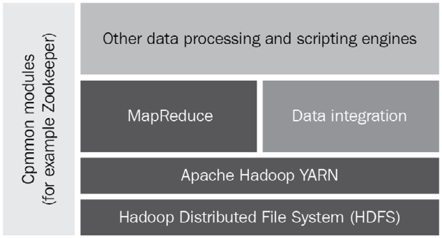

三个核心组件描述如下：

- Hadoop 分布式文件系统 (HDFS)：这是一个 Hadoop 原生文件系统，用于存储文件，以便这些文件可以跨集群并行化。
- Yet Another Resource Negotiator (YARN)：这是一个处理存储在 HDFS 中的数据并安排提交的作业（用于数据处理）由处理系统运行的系统。处理系统可用于图形处理、流处理或批处理。
- MapReduce：这是一个编程框架，它使我们能够通过将数据分布到几个小数据集来处理大数据集。 MapReduce 框架使用两种类型的函数处理数据：mapper 和 reducer。 mapper (map) 和 reducer (reduce) 函数的各个角色与我们在第 6 章 Python 中的高级技巧和窍门中讨论的相同。关键区别在于我们并行使用许多 map 和 reduce 函数来同时处理多个数据集。

将大数据集分解为小数据集后，我们可以将小数据集作为输入提供给许多映射器函数，以便在 Hadoop 集群的不同节点上进行处理。每个映射器函数将一组数据作为输入，根据程序员设定的目标处理数据，并以键值对的形式产生输出。一旦所有小数据集的输出都可用，一个或多个减速器函数将从映射器函数中获取输出，并根据减速器函数的目标聚合结果。
为了更详细地解释它，我们可以举一个例子来计算大量文本数据中的特定单词，例如攻击和武器。文本数据可以分成小数据集，例如八个数据集。我们可以有八个映射器函数来计算提供给它们的数据集中的两个单词。每个映射器函数都为我们提供了词攻击和武器的计数，作为提供给它的数据集的输出。在下一阶段，所有 mapper 函数的输出提供给两个 reducer 函数，每个单词一个。每个 reducer 函数聚合每个单词的计数，并提供聚合结果作为输出。下面展示了 MapReduce 框架对这个字数统计示例的操作。请注意，在 Python 编程中，mapper 函数通常作为 map 实现，reducer 函数作为 reduce 实现：

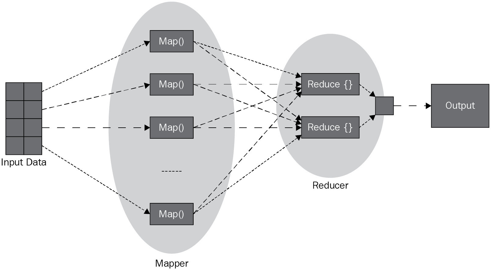

我们将跳过下一级别的 Hadoop 组件，因为它们与本章的讨论无关。 Hadoop 主要使用 Java 构建，但任何编程语言（例如 Python）都可用于为 MapReduce 模块编写自定义映射器和化简器组件。
Hadoop MapReduce 非常适合通过将大块数据分解成小块来处理大块数据。集群节点分别处理这些块，然后在发送给请求者之前聚合结果。 Hadoop MapReduce 处理来自文件系统的数据，因此在性能方面效率不高。但是，如果处理速度不是关键要求，例如，如果可以安排在夜间进行数据处理，则它会非常有效。

## Apache Spark

Apache Spark 是一个开源集群计算框架，用于实时和批量数据处理。 Apache Spark 的主要特点是它是一个内存中数据处理框架，这使得它在实现低延迟方面非常高效，并且由于以下附加因素使其适用于许多实际场景：
它可以快速获得任务关键型和时间敏感型应用程序的结果，例如实时或接近实时的场景。
由于内存处理，它非常适合以有效的方式重复或迭代地执行任务。
您可以使用开箱即用的机器学习算法。
您可以利用其他编程语言的支持，例如 Java、Python、Scala 和 R。
事实上，Apache Spark 涵盖了广泛的工作负载，包括批处理数据、迭代处理和流数据。 Apache Spark 的美妙之处在于它也可以使用 Hadoop（通过 YARN）作为部署集群，但它也有自己的集群管理器。
在较高的层次上，Apache Spark 的主要组件分为三层，如下图所示：

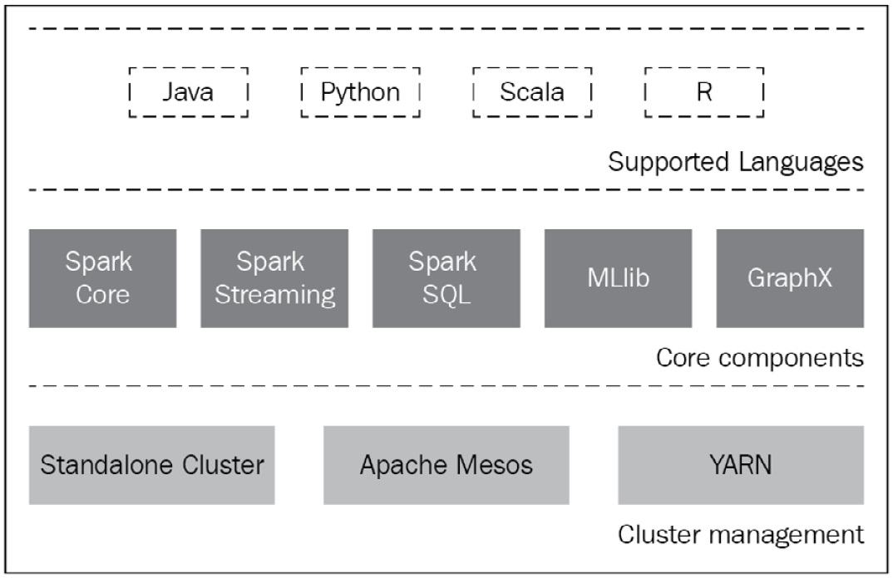

接下来将讨论这些层。

### 支持语言

Scala 是 Apache Spark 的原生语言，因此在开发中非常流行。 Apache Spark 还为 Java、Python 和 R 提供高级 API。在 Apache Spark 中，通过使用远程过程调用 (RPC) 接口提供多语言支持。 Scala 中为每种语言编写了一个 RPC 适配器，它将以不同语言编写的客户端请求转换为原生 Scala 请求。这使得它在整个开发社区中的采用变得更加容易。

### 核心组件

接下来讨论每个核心组件的简要概述：
Spark Core 和 RDDs：Spark Core 是 Spark 的核心引擎，负责为 RDDs 提供抽象，调度和分发作业到集群，与存储系统（如 HDFS、Amazon S3 或 RDBMS）交互，以及管理内存和故障恢复。 RDD 是一个弹性的分布式数据集，它是一个不可变和可分发的数据集合。 RDD 被分区以在集群的不同节点上执行。我们将在下一节中更详细地讨论 RDD。
Spark SQL：该模块用于使用抽象接口查询存储在 RDD 和外部数据源中的数据。使用这些通用接口，开发人员可以将 SQL 命令与给定应用程序的分析工具混合使用。
Spark Streaming：该模块用于处理实时数据，这对于分析低延迟的实时数据流至关重要。
MLlib：机器学习库 (MLlib) 用于在 Apache Spark 中应用机器学习算法。
GraphX：该模块为基于图的并行计算提供 API。该模块带有多种图形算法。请注意，图是一个基于顶点和边的数学概念，表示一组对象如何相互关联或依赖。对象由顶点表示，它们的关系由边表示。

### 集群管理

Apache Spark 支持一些集群管理器，例如 Standalone、Mesos、YARN 和 Kubernetes。集群管理器的关键功能是调度和执行集群节点上的作业，管理集群节点上的资源。但是为了与一个或多个集群管理器交互，在主程序或驱动程序中使用了一个称为 SparkSession 的特殊对象。在 2.0 版本之前，SparkContext 对象被认为是一个入口点，但它的 API 现在被包装为 SparkSession 对象的一部分。从概念上讲，下图显示了集群管理器、SparkSession (SparkContext) 和集群中的工作节点的交互：

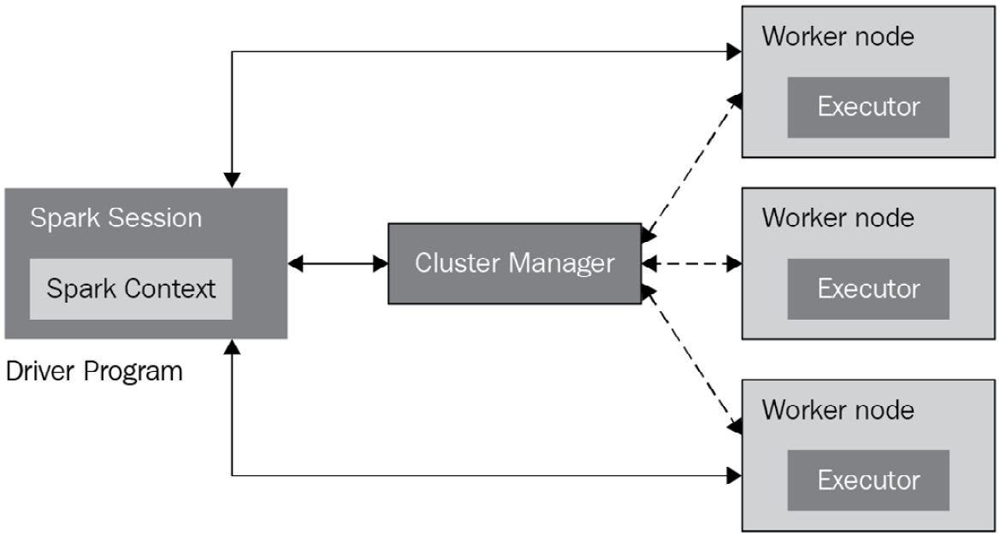

SparkSession 对象可以连接到不同类型的集群管理器。连接后，通过集群管理器在集群节点上获取执行器。执行器是运行作业并存储计算作业结果的 Spark 进程。主节点上的集群管理器负责将应用程序代码发送到工作节点上的执行程序进程。一旦应用程序代码和数据（如果适用）移动到工作节点，驱动程序中的 SparkSession 对象将直接与执行程序进程交互以执行任务。
根据 Apache Spark 3.1 版，支持以下集群管理器：

- 独立：这是一个简单的集群管理器，作为 Spark Core 引擎的一部分包含在内。独立集群基于主和工作（或从）进程。主进程基本上是一个集群管理器，而工作进程承载执行程序。尽管 master 和 worker 可以托管在一台机器上，但这并不是 Spark Standalone 集群的真正部署场景。建议将工人分配到不同的机器以获得最佳结果。独立集群易于设置并提供集群所需的大部分功能。
- Apache Mesos：这是另一个可以运行 Hadoop MapReduce 的通用集群管理器。对于大型集群环境，Apache Mesos 是首选。这个集群管理器的想法是它将物理资源聚合成一个单一的虚拟资源，作为一个集群并提供一个节点级的抽象。它是一个分布式集群管理器。
- Hadoop YARN：此集群管理器特定于 Hadoop。这本质上也是一个分布式框架。
- Kubernetes：这更多是在实验阶段。此集群管理器的目的是自动化容器化应用程序的部署和扩展。 Apache Spark 的最新版本包括 Kubernetes 调度程序。

在结束本节之前，值得一提的是另一个框架 Dask，它是一个用 Python 编写的用于并行计算的开源库。 Dask 框架直接与分布式硬件平台（如 Hadoop）配合使用。 Dask 框架利用经过行业验证的库和 Python 项目，例如 NumPy、pandas 和 scikit-learn。与 Apache Spark 相比，Dask 是一个小而轻的框架，可以处理中小型集群。相比较而言，Apache Spark 支持多种语言，是最适合大规模集群的选择。
在介绍了并行计算的集群选项后，我们将在下一节讨论 Apache Spark 的核心数据结构，即 RDD。

## 介绍 RDD
RDD 是 Apache Spark 中的核心数据结构。这种数据结构不仅是对象的分布式集合，而且还以这样的方式进行分区，即每个数据集都可以在集群的不同节点上进行处理和计算。这使得 RDD 成为分布式数据处理的核心元素。此外，RDD 对象具有弹性，因为它具有容错性，并且框架可以在发生故障时重建数据。当我们创建一个 RDD 对象时，master 节点会将 RDD 对象复制到多个 executor 或 worker 节点。如果任何 executor 进程或 worker 节点发生故障，主节点会检测到故障并启用另一个节点上的 executor 进程来接管执行。新的 executor 节点已经有了 RDD 对象的副本，它可以立即开始执行。原执行节点在失败前处理的任何数据都将丢失，新的执行节点将重新计算这些数据。
在接下来的小节中，我们将学习两个关键的 RDD 操作以及如何从不同的数据源创建 RDD 对象。
学习 RDD 操作

RDD 是一个不可变对象，这意味着它一旦被创建，就不能被更改。但是可以对 RDD 的数据执行两种类型的操作。这些是转变和行动。下面描述这些操作。
转型
这些操作应用于 RDD 对象并导致创建新的 RDD 对象。这种类型的操作将一个 RDD 作为输入，并产生一个或多个 RDD 作为输出。我们还需要记住，这些转换本质上是惰性的。这意味着只有在对它们触发操作时才会执行它们，这是另一种类型的操作。为了解释惰性求值的概念，我们可以假设我们正在通过从每个元素中减去 1，然后通过算术（动作）将所有元素添加到来自转换步骤的输出 RDD 来转换 RDD 中的数字数据。由于惰性求值，转换操作不会发生，直到我们调用动作操作（在本例中为加法）。
Apache Spark 有几个内置的转换函数可用。常用的变换函数如下：

- map：map 函数迭代 RDD 对象的每个元素或行，并为每个元素应用定义的 map 函数。
- filter：这个函数将过滤原始RDD中的数据，并提供一个带有过滤结果的新RDD。
- union：如果两个 RDD 类型相同，则此函数应用于两个 RDD，并导致生成另一个 RDD，该 RDD 是输入 RDD 的并集。

### Actions

Actions 是应用于 RDD 的计算操作，这些操作的结果将返回给驱动程序（例如 SparkSession）。 Apache Spark 有几个内置的操作函数可用。常用的动作函数如下：

- count：count 操作返回 RDD 中元素的数量。
- collect：这个动作将整个 RDD 返回给驱动程序。
- reduce：此操作将减少 RDD 中的元素。一个简单的例子是对 RDD 数据集的加法操作。

有关转换和操作函数的完整列表，我们建议您查看 Apache Spark 的官方文档。接下来，我们将研究如何创建 RDD。

## 创建 RDD 对象

创建 RDD 对象有三种主要方法，下面将对其进行描述。

### 并行化集合

这是 Apache Spark 中用于创建 RDD 的一种更简单的方法。在这种方法中，一个集合被创建或加载到程序中，然后传递给 SparkContext 对象的 parallelize 方法。除了开发和测试之外，不使用此方法。这是因为它需要在一台机器上提供整个数据集，这对于大量数据来说并不方便。

### 外部数据集

Apache Spark 支持来自本地文件系统、HDFS、HBase 甚至 Amazon S3 的分布式数据集。在这种创建 RDD 的方法中，数据是直接从外部数据源加载的。 SparkContext 对象提供了一些方便的方法，可用于将各种数据加载到 RDD 中。例如，textFile 方法可用于使用适当的 URL（例如，file://、hdfs:// 或 s3n://）从本地或远程资源加载文本数据。

### 从现有的 RDD

如前所述，可以使用转换操作创建 RDD。这是 Apache Spark 与 Hadoop MapReduce 的区别之一。输入的 RDD 没有改变，因为它是一个不可变的对象，但是可以从现有的 RDD 创建新的 RDD。我们已经看到了一些关于如何使用 map 和 filter 函数从现有 RDD 创建 RDD 的示例。
我们对 RDD 的介绍到此结束。在下一节中，我们将提供使用 PySpark 库的 Python 代码示例的更多详细信息。

## 使用 PySpark 进行并行数据处理
如前所述，Apache Spark 是用 Scala 语言编写的，这意味着没有对 Python 的本机支持。由于 Python 提供了丰富的库集，因此有大量数据科学家和分析专家更喜欢使用 Python 进行数据处理。因此，切换到使用另一种编程语言仅用于分布式数据处理是不方便的。因此，将 Python 与 Apache Spark 集成不仅对数据科学社区有益，而且还为许多其他希望采用 Apache Spark 而无需学习或切换到新编程语言的人打开了大门。
Apache Spark 社区构建了一个 Python 库 PySpark，以方便使用 Python 使用 Apache Spark。为了使 Python 代码与基于 Scala（和 Java）构建的 Apache Spark 一起工作，开发了一个 Java 库 Py4J。这个 Py4J 库与 PySpark 捆绑在一起，允许 Python 代码与 JVM 对象交互。这就是当我们安装 PySpark 时，我们需要先在我们的系统上安装 JVM 的原因。
PySpark 提供与 Apache Spark 几乎相同的功能和优势。其中包括内存计算、并行化工作负载的能力、惰性求值设计模式的使用以及对多个集群管理器（如 Spark、YARN 和 Mesos）的支持。
安装 PySpark（和 Apache Spark）超出了本章的范围。本章的重点是讨论如何使用 PySpark 来利用 Apache Spark 的强大功能，而不是如何安装 Apache Spark 和 PySpark。但值得一提的是一些安装选项和依赖项。
每个版本的 Apache Spark/PySpark 和各种目标平台（例如 Linux、macOS 和 Windows）都有许多在线安装指南。 PySpark 包含在 Apache Spark 的正式版本中，现在可以从 Apache Spark 网站 (https://spark.apache.org/) 下载。 PySpark 也可通过 PyPI 的 pip 实用程序获得，该实用程序可用于本地设置或连接到远程集群。安装 PySpark 时的另一个选择是使用 Anaconda，这是另一个流行的包和环境管理系统。如果我们将 PySpark 与 Apache Spark 一起安装，我们需要以下内容可用或安装在目标机器上：

- JVM
- Scala
- Apache Spark

对于稍后将讨论的代码示例，我们在 macOS 上安装了 Apache Spark 版本 3.1.1，其中包含 PySpark。 PySpark 带有 PySpark shell，它是 PySpark API 的 CLI。当 PySpark shell 启动时，它会自动初始化 SparkSession 和 SparkContext 对象，可用于与核心 Apache Spark 引擎进行交互。下图显示了 PySpark shell 的初始化：

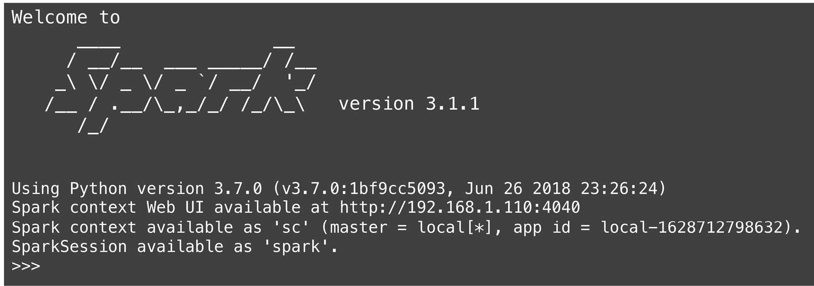

从 PySpark shell 的初始化步骤，我们可以观察到：

- SparkContext 对象已经创建，它的实例在 shell 中作为 sc 可用。
- 还创建了 SparkSession 对象，其实例可用作 spark。现在，SparkSession 是 PySpark 框架的入口点，用于动态创建 RDD 和 DataFrame 对象。 SparkSession 对象也可以通过编程方式创建，稍后我们将通过代码示例讨论这一点。
- Apache Spark 带有一个 web UI 和一个 web 服务器来托管 web UI，它是在 http://192.168.1.110:4040 启动的，用于我们的本地机器安装。请注意，此 URL 中提到的 IP 地址是特定于我们机器的私有地址。端口 4040 被 Apache Spark 选为默认端口。如果此端口正在使用中，Apache Spark 将尝试托管在下一个可用端口上，例如 4041 或 4042。

在接下来的小节中，我们将学习如何创建 SparkSession 对象，探索用于 RDD 操作的 PySpark，并学习如何使用 PySpark DataFrames 和 PySpark SQL。我们将从使用 Python 创建 Spark 会话开始。

## 创建 SparkSession 和 SparkContext 程序

在 Spark 2.0 版之前，SparkContext 被用作 PySpark 的入口点。自 Spark 2.0 版以来，SparkSession 已被引入作为 PySpark 底层框架的入口点，以与 RDD 和数据帧一起工作。 SparkSession 还包括 SparkContext、SQLContext、StreamingContext 和 HiveContext 中可用的所有 API。现在，还可以使用 SparkSession 类通过其 builder 方法创建 SparkSession，这在下一个代码示例中进行了说明：

```python
import pyspark
from pyspark.sql import SparkSession
spark1 = SparkSession.builder.master("local[2]").appName('New App').getOrCreate()
```

当我们在 PySpark shell 中运行此代码时，它已经有一个默认的 SparkSession 对象创建为 spark，它将返回与此构建器方法的输出相同的会话。 以下控制台输出显示了两个 SparkSession 对象（spark 和 spark1）的位置，这确认它们指向同一个 SparkSession 对象：

```python
>>> spark
<pyspark.sql.session.SparkSession object at 0x1091019e8>
>>> spark1
<pyspark.sql.session.SparkSession object at 0x1091019e8>
```

关于 builder 方法需要理解的几个关键概念如下：

- getOrCreate：在 PySpark shell 的情况下，此方法是我们将获得已创建会话的原因。如果没有会话存在，此方法将创建一个新会话；否则，它返回一个已经存在的会话。
- master：如果我们想创建一个连接到集群的会话，我们将提供master名称，可以是Spark的实例名，或者YARN，或者Mesos集群管理器。如果我们使用本地部署的 Apache Spark 选项，我们可以使用 local[n]，其中 n 是一个大于零的整数。 n 将决定要为 RDD 和 DataFrame 创建的分区数。对于本地设置，n 可以是系统上的 CPU 内核数。如果我们将其设置为 local[*]，这是一种常见的做法，这将创建与系统上的逻辑核心一样多的工作线程。

如果需要创建新的 SparkSession 对象，我们可以使用 newSession 方法，该方法在现有 SparkSession 对象的实例级别可用。创建新 SparkSession 对象的代码示例如下所示：

```python
import pyspark
from pyspark.sql import SparkSession
spark2 = spark.newSession()
The console output for the spark2 object confirms that this is a different session than the previously created SparkSession objects:
>>> spark2
<pyspark.sql.session.SparkSession object at 0x10910df98>
```

SparkContext 对象也可以通过编程方式创建。从 SparkSession 实例获取 SparkContext 对象的最简单方法是使用 sparkContext 属性。 PySpark 库中还有一个 SparkConext 类，它也可用于直接创建 SparkContext 对象，这是 Spark 2.0 版之前的常用方法。

> 提示
> 我们可以有多个 SparkSession 对象，但每个 JVM 只能有一个 SparkContext 对象。

SparkSession 类提供了一些更有用的方法和属性，总结如下：

- getActiveSession：该方法返回当前 Spark 线程下的一个活动 SparkSession。
- createDataFrame：此方法从 RDD、对象列表或 Pandas DataFrame 对象创建一个 DataFrame 对象。
- conf：此属性返回 Spark 会话的配置接口。
- catalog：该属性提供了一个接口来创建、更新或查询关联的数据库、函数和表。

可以使用位于 https://spark.apache.org/docs/latest/api/python/reference/api/ 的 SparkSession 类的 PySpark 文档探索方法和属性的完整列表。

## 探索 PySpark 的 RDD 操作

在介绍 RDD 部分，我们介绍了 RDD 的一些关键功能和操作。在本节中，我们将使用代码示例在 PySpark 的上下文中扩展讨论。

### 从 Python 集合和外部文件创建 RDD

我们在上一节中讨论了几种创建 RDD 的方法。在下面的代码示例中，我们将讨论如何从内存中的 Python 集合和外部文件资源创建 RDD。下面分别介绍这两种方法：

- 为了从 Python 数据集合创建 RDD，我们在 sparkContext 实例下有一个可用的 parallelize 方法。该方法分发集合以形成一个 RDD 对象。该方法将集合作为参数。可选的第二个参数可用于 parallelize 方法来设置要创建的分区数。默认情况下，此方法根据本地计算机上可用的内核数或创建 SparkSession 对象时设置的内核数创建分区。
- 要从外部文件创建 RDD，我们将使用 sparkContext 实例下可用的 textFile 方法。 textFile 方法可以从 HDFS 或本地文件系统（在所有集群节点上可用）加载文件作为 RDD。对于基于本地系统的部署，可以提供绝对和/或相对路径。可以使用此方法设置要为 RDD 创建的最小分区数。

下面显示了一些快速示例代码 (rddcreate.py)，以说明用于创建新 RDD 的 PySpark 语句的确切语法：

```python
data = [5, 4, 6, 3, 2, 8, 9, 2, 8, 7,
        8, 4, 4, 8, 2, 7, 8, 9, 6, 9]
rdd1 = spark.sparkContext.parallelize(data)
print(rdd1.getNumPartitions())
rdd2 = spark.sparkContext.textFile('sample.txt')
print(rdd2.getNumPartitions())
```

请注意，sample.txt 文件具有随机文本数据，其内容与此代码示例无关。

### 使用 PySpark 进行 RDD 转换操作

PySpark 提供了多种内置转换操作。 为了说明如何使用 PySpark 实现诸如 map 之类的转换操作，我们将以文本文件作为输入，并使用 RDD 提供的 map 函数将其转换为另一个 RDD。 示例代码 (rddtranform1.py) 如下所示：

```python
rdd1 = spark.sparkContext.textFile('sample.txt')
rdd2 = rdd1.map(lambda lines: lines.lower())
rdd3 = rdd1.map(lambda lines: lines.upper())
print(rdd2.collect())
print(rdd3.collect())
```

在此示例代码中，我们使用两个 lambda 函数和 map 操作将 RDD 中的文本转换为小写和大写。 最后，我们使用 collect 操作来获取 RDD 对象的内容。
另一种流行的转换操作是过滤器，它可以用来过滤掉一些数据条目。 下面显示了一些示例代码（rddtranform2.py），用于过滤 RDD 中的所有偶数：

```python
data = [5, 4, 6, 3, 2, 8, 9, 2, 8, 7,
        8, 4, 4, 8, 2, 7, 8, 9, 6, 9]
rdd1 = spark.sparkContext.parallelize(data)
rdd2 = rdd1.filter(lambda x: x % 2 !=0 )
print(rdd2.collect())
```

当您执行此代码时，它将提供带有 3、7、7 和 9 作为集合条目的控制台输出。 接下来，我们将探索一些使用 PySpark 的动作示例。

### 使用 PySpark 的 RDD 动作操作

为了说明动作操作的实现，我们将使用从 Python 集合创建的 RDD，然后应用 PySpark 库附带的一些内置动作操作。 示例代码 (rddaction1.py) 如下所示：

```python
data = [5, 4, 6, 3, 2, 8, 9, 2, 8, 7,
        8, 4, 4, 8, 2, 7, 8, 9, 6, 9]
rdd1 = spark.sparkContext.parallelize(data)
print("RDD contents with partitions:" + str(rdd1.glom().  collect()))
print("Count by values: " +str(rdd1.countByValue()))
print("reduce function: " + str(rdd1.glom().collect()))
print("Sum of RDD contents:"+str(rdd1.sum()))
print("top: " + str(rdd1.top(5)))
print("count: " + str(rdd1.count()))
print("max: "+ str(rdd1.max()))
print("min" + str(rdd1.min()))
time.sleep(60)
```

此代码示例中使用的一些操作操作是不言自明的和微不足道的（count、max、min、count 和 sum）。接下来解释其余的动作操作（非平凡的）：

- glom：这会产生一个 RDD，它是通过将每个分区的所有数据条目合并到一个列表中来创建的。
- collect：该方法以列表的形式返回 RDD 的所有元素。
- reduce：这是一个通用函数，应用于 RDD 以减少其中的元素数量。在我们的例子中，我们使用 lambda 函数将两个元素合二为一，依此类推。这导致添加 RDD 中的所有元素。
- top(x)：如果数组中的元素是有序的，则此操作返回数组中的前 x 个元素。

我们已经介绍了如何使用 PySpark 创建 RDD，以及如何在 RDD 上实现转换和操作操作。在下一节中，我们将介绍 PySpark DataFrame，这是另一种主要用于分析的流行数据结构。

## 了解 PySpark DataFrames

PySpark DataFrame 是一种由行和列组成的表格数据结构，就像我们在关系数据库中拥有的表一样，就像我们在第 6 章 Python 中的高级技巧和窍门中介绍的 pandas DataFrame。与 Pandas DataFrames 相比，主要区别在于 PySpark DataFrame 对象分布在集群中，这意味着数据存储在集群中的不同节点上。 DataFrame 的用途主要是以分布式方式处理大量结构化或非结构化数据，这些数据可能达到 PB。与 RDD 一样，PySpark DataFrames 是不可变的并且基于惰性求值，这意味着求值将被延迟到需要完成时。

我们可以在 DataFrame 中存储数字和字符串数据类型。 PySpark DataFrame 中的列不能为空；它们必须具有相同的数据类型并且必须具有相同的长度。 DataFrame 中的行可以包含不同数据类型的数据。 DataFrame 中的行名称必须是唯一的。
在接下来的小节中，我们将学习如何创建 DataFrame 并使用 PySpark 介绍 DataFrame 上的一些关键操作。

### 创建 DataFrame 对象

可以使用以下数据源之一创建 PySpark DataFrame：

- Python 集合，例如列表、元组和字典。
- 文件（CSV、XML、JSON、Parquet 等）。
- RDD，通过使用 PySpark 的 toDF 方法或 createDataFrame 方法。
- 可以使用 SparkSession 对象的 readStream 方法将 Apache Kafka 流消息转换为 PySpark DataFrame。
- 可以使用传统 SQL 命令查询数据库（例如 Hive 和 HBase）表，并将输出转换为 PySpark DataFrame。

我们将从 Python 集合开始创建一个 DataFrame，这是最简单的方法，但它更有助于说明目的。下面的示例代码向我们展示了如何从员工数据集合创建 PySpark DataFrame：

```python
data = [('James','','Bylsma','HR','M',40000),
  ('Kamal','Rahim','','HR','M',41000),
  ('Robert','','Zaine','Finance','M',35000),
  ('Sophia','Anne','Richer','Finance','F',47000),
  ('John','Will','Brown','Engineering','F',65000)
]
columns = ["firstname","middlename","lastname",
           "department","gender","salary"]
df = spark.createDataFrame(data=data, schema = columns)
print(df.printSchema())
print(df.show())
```

在此代码示例中，我们首先将行数据创建为员工列表，然后创建了具有列名称的架构。 当schema只是列名列表时，每列的数据类型由数据决定，每列默认标记为可空。 可以使用更高级的 API（StructType 或 StructField）手动定义 DataFrame 模式，包括设置数据类型和将列标记为可空或不可空。 此示例代码的控制台输出如下所示，首先显示架构，然后以表格形式显示 DataFrame 内容：

```
root
|-- firstname: string (nullable = true)
|-- middlename: string (nullable = true)
|-- lastname: string (nullable = true)
|-- department: string (nullable = true)
|-- gender: string (nullable = true)
|-- salary: long (nullable = true)
+---------+----------+--------+-----------+------+-------+
|firstname|middlename|lastname| department|gender|salary|
+---------+----------+--------+-----------+------+-------+
|    James|          |  Bylsma|         HR|     M|  40000|
|    Kamal|     Rahim|        |         HR|     M|  41000|
|   Robert|          |   Zaine|    Finance|     M|  35000|
|   Sophia|      Anne|  Richer|    Finance|     F|  47000|
|     John|      Will|   Brown|Engineering|     F|  65000|
+---------+----------+--------+-----------+------+-------+
```

在下一个代码示例中，我们将从 CSV 文件创建一个 DataFrame。 CSV 文件将具有与我们在前面的代码示例中使用的相同的条目。 在此示例代码 (dfcreate2.py) 中，我们还使用 StructType 和 StructField 对象手动定义了架构：

```python
schemas = StructType([
    StructField("firstname",StringType(),True),
    StructField("middlename",StringType(),True),
    StructField("lastname",StringType(),True),
    StructField("department", StringType(), True),
    StructField("gender", StringType(), True),
    StructField("salary", IntegerType(), True)
  ])
df = spark.read.csv('df2.csv', header=True, schema=schemas)
print(df.printSchema())
print(df.show())
```

此代码的控制台结果将与前一个代码示例中显示的相同。使用类似语法的 read 方法支持将 JSON、文本或 XML 文件导入到 DataFrame 中。其他数据源（例如 RDD 和数据库）的支持留给您作为练习来评估和实施。

### 处理 PySpark 数据帧

一旦我们从一些数据中创建了一个 DataFrame，无论数据的来源如何，我们都准备好对其进行分析、转换并对其采取一些行动，以从中获得有意义的结果。 PySpark DataFrame 支持的大部分操作类似于 RDDs 和 pandas DataFrames。出于说明目的，我们将与前面的代码示例中相同的数据加载到 DataFrame 对象中，然后执行以下操作：
使用 select 方法从 DataFrame 对象中选择一列或多列。
使用字典和 replace 方法替换列中的值。 PySpark 库中有更多选项可以替换列中的数据。
添加具有基于现有列数据的值的新列。
完整的示例代码 (dfoperations.py) 如下所示：

```python
data = [('James','','Bylsma','HR','M',40000),
  ('Kamal','Rahim','','HR','M',41000),
  ('Robert','','Zaine','Finance','M',35000),
  ('Sophia','Anne','Richer','Finance','F',47000),
  ('John','Will','Brown','Engineering','F',65000)
]
columns = ["firstname","middlename","lastname",
           "department","gender","salary"]
df = spark.createDataFrame(data=data, schema = columns)
#show two columns
print(df.select([df.firstname, df.salary]).show())
#replacing values of a column
myDict = {'F':'Female','M':'Male'}
df2 = df.replace(myDict, subset=['gender'])
#adding a new colum Pay Level based on an existing column   values
df3 = df2.withColumn("Pay Level",
      when((df2.salary < 40000), lit("10"))
     .when((df.salary >= 40000) & (df.salary <= 50000), lit("11"))
     .otherwise(lit("12"))
  )
print(df3.show())
```

以下是上述代码示例的输出：

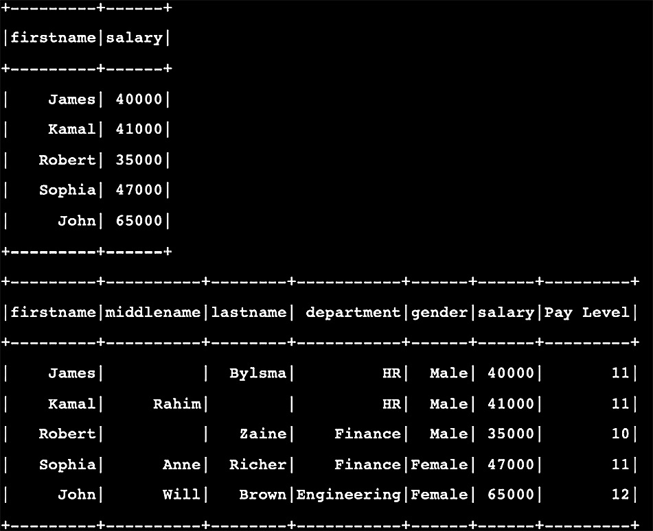

第一个表显示了选择操作的结果。下表显示了对性别列和新列 Pay Level 进行替换操作的结果。
有许多内置操作可用于 PySpark DataFrames，其中许多与我们讨论的 pandas DataFrames 相同。可以使用您拥有的软件版本的 Apache Spark 官方文档来探索这些操作的详细信息。
在这一点上，任何人都会问一个合理的问题，那就是，当我们已经拥有提供相同类型操作的 PySpark DataFrame 时，为什么还要使用 PySpark DataFrame？答案很简单。 PySpark 提供分布式 DataFrames，对此类 DataFrames 的操作旨在并行地在节点集群上执行。这使得 PySpark DataFrame 的性能明显优于 Pandas DataFrame。
到目前为止，我们已经看到，作为程序员，我们实际上不必编写任何关于如何将分布式 RDD 和数据帧委托给独立或分布式集群中的不同执行器的程序。我们只关注数据处理的编程方面。与本地或远程节点集群的协调和通信由 SparkSession 和 SparkContext 自动处理。这就是 Apache Spark 和 PySpark 的美妙之处：让程序员专注于解决真正的问题，而不是担心工作负载将如何执行。

## 介绍 PySpark SQL

Spark SQL 是 Apache Spark 的关键模块之一；它用于结构化数据处理并充当分布式 SQL 查询引擎。可以想象，Spark SQL 是高度可扩展的，是一个分布式处理引擎。通常，Spark SQL 的数据源是数据库，但 SQL 查询可以应用于临时视图，可以从 RDDs 和 DataFrames 构建。
为了演示将 PySpark 库与 Spark SQL 一起使用，我们将使用与之前示例代码中相同的 DataFrame，使用员工数据为 SQL 查询构建 TempView 实例。在我们的代码示例中，我们将执行以下操作：
我们将为 Python 集合中的员工数据创建一个 PySpark DataFrame，就像我们在前面的代码示例中所做的那样。
我们将使用 createOrReplaceTempView 方法从 PySpark DataFrame 创建一个 TempView 实例。
使用 Spark Session 对象的 sql 方法，我们将在 TempView 实例上执行常规的 SQL 查询，例如查询所有员工记录、查询薪水高于 45,000 的员工、查询每个性别类型的员工数、使用组通过针对性别列的 SQL 命令。
完整的代码示例（sql1.py）如下：

```python
data = [('James','','Bylsma','HR','M',40000),
  ('Kamal','Rahim','','HR','M',41000),
  ('Robert','','Zaine','Finance','M',35000),
  ('Sophia','Anne','Richer','Finance','F',47000),
  ('John','Will','Brown','Engineering','F',65000)
]
columns = ["firstname","middlename","lastname",
           "department","gender","salary"]
df = spark.createDataFrame(data=data, schema = columns)
df.createOrReplaceTempView("EMP_DATA")
df2 = spark.sql("SELECT * FROM EMP_DATA")
print(df2.show())
df3 = spark.sql("SELECT firstname,middlename,lastname,    salary FROM EMP_DATA WHERE SALARY > 45000")
print(df3.show())
df4 = spark.sql(("SELECT gender, count(*) from EMP_DATA     group by gender"))
print(df4.show())
```

控制台输出将显示三个 SQL 查询的结果：

```python
+---------+----------+--------+-----------+------+------+
|firstname|middlename|lastname| department|gender|salary|
+---------+----------+--------+-----------+------+------+
|    James|          |  Bylsma|         HR|     M| 40000|
|    Kamal|     Rahim|        |         HR|     M| 41000|
|   Robert|          |   Zaine|    Finance|     M| 35000|
|   Sophia|      Anne|  Richer|    Finance|     F| 47000|
|     John|      Will|   Brown|Engineering|     F| 65000|
+---------+----------+--------+-----------+------+------+
+---------+----------+--------+------+
|firstname|middlename|lastname|salary|
+---------+----------+--------+------+
|   Sophia|      Anne|  Richer| 47000|
|     John|      Will|   Brown| 65000|
+---------+----------+--------+------+
+------+--------+
|gender|count(1)|
+------+--------+
|     F|       2|
|     M|       3|
+------+--------+
```

Spark SQL 是 Apache Spark 中的一个大话题。我们只介绍了 Spark SQL，以展示在不知道数据来源的情况下在 Spark 数据结构之上使用 SQL 命令的威力。我们对使用 PySpark 进行数据处理和数据分析的讨论到此结束。在下一节中，我们将讨论几个案例研究来构建一些实际应用程序。
使用 Apache Spark 和 PySpark 的案例研究
在前面的部分中，我们介绍了 Apache Spark 和 PySpark 的基本概念和架构。在本节中，我们将讨论为 Apache Spark 实现两个有趣且流行的应用程序的两个案例研究。

## 案例研究 1 – Apache Spark 上的 Pi (π) 计算器

我们将使用在我们本地机器上运行的 Apache Spark 集群计算 Pi (π)。 Pi 是半径为 1 的圆的面积。 在讨论此应用程序的算法和驱动程序之前，重要的是介绍用于此案例研究的 Apache Spark 设置。
设置 Apache Spark 集群
在之前的所有代码示例中，我们使用了本地安装在我们机器上的 PySpark，没有集群。对于本案例研究，我们将使用多个虚拟机设置一个 Apache Spark 集群。有许多可用的虚拟化软件工具，例如 VirtualBox，这些软件工具中的任何一个都可以用于构建这种设置。
我们使用 Ubuntu Multipass (https://multipass.run/) 在 macOS 之上构建虚拟机。 Multipass 也适用于 Linux 和 Windows。 Multipass 是一个轻量级的虚拟化管理器，专为开发人员设计，可以使用单个命令创建虚拟机。 Multipass 的命令很少，这使得它更容易使用。如果您决定使用 Multipass，我们建议您使用官方文档进行安装和配置。在我们的虚拟机设置中，我们使用 Multipass 创建了以下虚拟机：

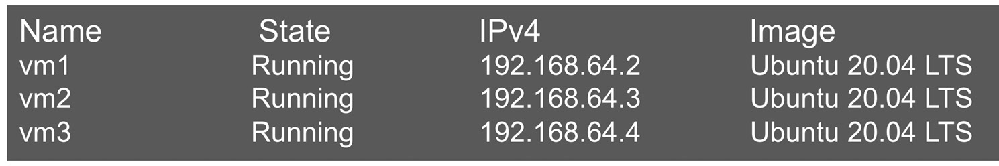

我们使用 apt-get 实用程序在每个虚拟机上安装了 Apache Spark 3.1.1。 我们在 vm1 上将 Apache Spark 作为主服务器启动，然后通过提供主 Spark URI（在我们的示例中为 Spark://192.168.64.2.7077）来启动 Apache Spark 作为 vm2 和 vm3 上的工作程序。 完整的 Spark 集群设置如下所示：

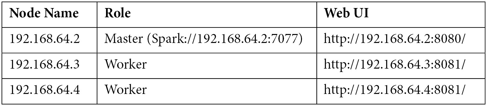

主 Spark 节点的 Web UI 如下所示：

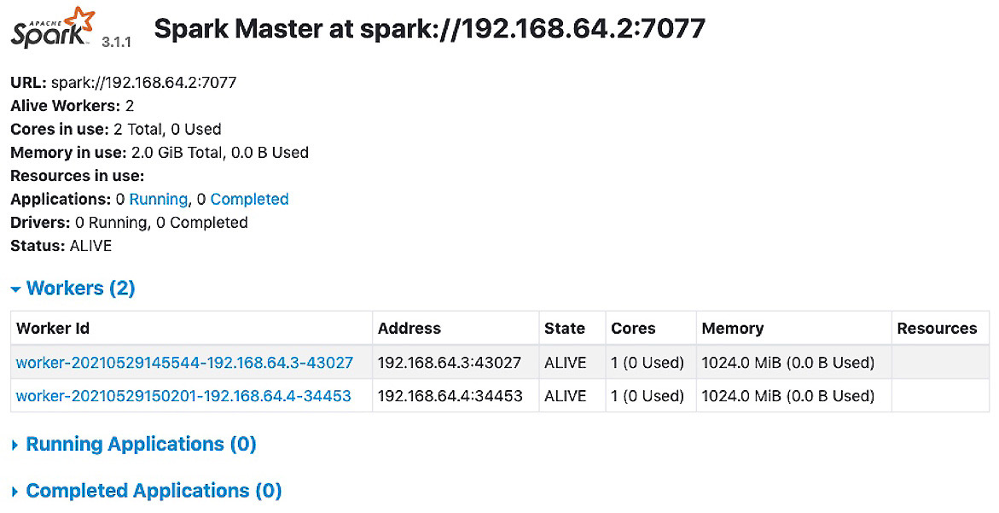

此处提供了主节点的 Web UI 摘要：
Web UI 提供节点名称和 Spark URL。 在我们的例子中，我们使用 IP 地址作为主机名，这就是我们在 URL 中包含 IP 地址的原因。
有工作节点的详细信息，在我们的例子中有两个。 每个工作节点使用 1 个 CPU 内核和 1 GB 内存。
Web UI 还提供正在运行和已完成的应用程序的详细信息。
工作节点的 Web UI 将如下所示：

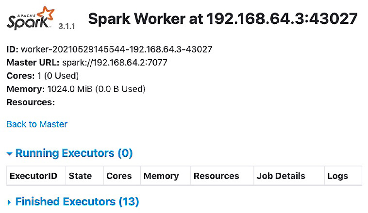

此处提供了工作节点的 Web UI 摘要：
Web UI 提供工作人员 ID 以及工作人员正在侦听请求的节点名称和端口。
Web UI 中还提供了主节点 URL。
还可以获得分配给工作节点的 CPU 内核和内存的详细信息。
Web UI 提供正在进行的作业（正在运行的执行程序）和已经完成的作业的详细信息。

### 为 Pi 计算编写驱动程序

为了计算 Pi，我们使用了一种常用的算法（蒙特卡罗算法），该算法假设一个面积等于 4 的正方形外接一个单位圆（半径值等于 1 的圆）。这个想法是在边长为 2 的正方形的域中生成大量随机数。我们可以假设正方形内部有一个圆，其直径值与正方形的边长相同。这意味着圆将内接在正方形内。 Pi 的值是通过计算位于圆内的点数与生成点总数的比率来估计的。
驱动程序的完整示例代码如下所示。在这个程序中，我们决定使用两个分区，因为我们有两个工作人员可用。我们为每个工人使用了 10,000,000 点。另一个需要注意的重要事项是，我们在创建 Apache Spark 会话时使用 Spark 主节点 URL 作为主属性：

```python
#casestudy1.py: Pi calculator
from operator import add
from random import random
from pyspark.sql import SparkSession
spark = SparkSession.builder.master(
    "spark://192.168.64.2:7077").appName("Pi claculator app").getOrCreate()
partitions = 2
n = 10000000 * partitions
def func(_):
    x = random() * 2 – 1
    y = random() * 2 – 1
    return 1 if x ** 2 + y ** 2 <= 1 else 0
count = spark.sparkContext.parallelize(range(1, n + 1),     partitions).map(func).reduce(add)
print("Pi is roughly %f" % (4.0 * count / n))
# The console output is as follows:
# Pi is roughly 3.141479
```

Spark Web UI 将在运行时甚至在完成执行后提供应用程序的状态。 在下面的屏幕截图中，我们可以看到有两个工人参与完成了这项工作：

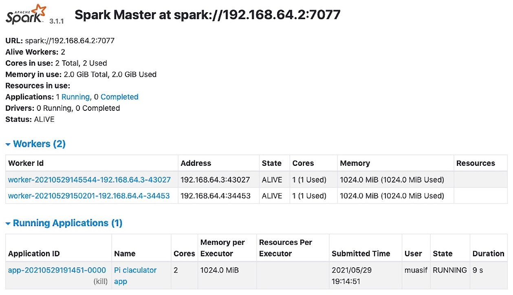

我们可以单击应用程序名称进入应用程序的下一级详细信息，如图 8.12 所示。 此屏幕截图显示了哪些工作人员参与完成任务以及正在使用哪些资源（如果事情仍在运行）：

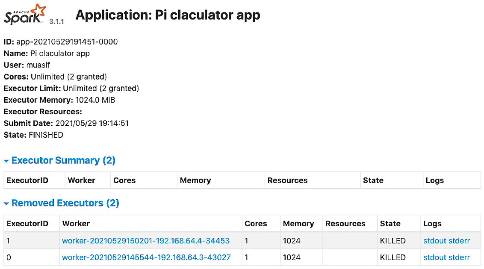

在本案例研究中，我们介绍了如何设置 Apache Spark 集群以进行测试和实验，以及如何使用 PySpark 库在 Python 中构建驱动程序以连接到 Apache Spark 并提交我们的作业以在两个不同的集群节点。
在下一个案例研究中，我们将使用 PySpark 库构建词云。

## 案例研究 2 – 使用 PySpark 的词云

词云是一些文本数据中出现的单词频率的可视化表示。简而言之，如果一个特定的词在文本中出现得更频繁，它在词云中就会显得更大更粗。这些也被称为标签云或文本云，是非常有用的工具，用于识别某些文本数据的哪些部分更重要。该工具的一个实际用例是分析社交媒体上的内容，社交媒体有许多用于营销、业务分析和安全的应用程序。
出于说明目的，我们构建了一个简单的词云应用程序，它从本地文件系统读取文本文件。文本文件被导入到一个 RDD 对象中，然后对其进行处理以计算每个单词出现的次数。我们进一步处理数据以过滤掉重复次数少于两次的词，并过滤掉长度小于四个字母的词。词频数据被馈送到 WordCloud 库对象。为了显示词云，我们使用了 matplotlib 库。完整的示例代码如下所示：

```python
#casestudy2.py: word count application
import matplotlib.pyplot as plt
from pyspark.sql import SparkSession
from wordcloud import WordCloud
spark = SparkSession.builder.master("local[*]")\
    .appName("word cloud app")\
    .getOrCreate()
wc_threshold = 1
wl_threshold = 3
textRDD = spark.sparkContext.textFile('wordcloud.txt',3)
flatRDD = textRDD.flatMap(lambda x: x.split(' '))
wcRDD = flatRDD.map(lambda word: (word, 1)).\
    reduceByKey(lambda v1, v2: v1 + v2)
# filter out words with fewer than threshold occurrences
filteredRDD = wcRDD.filter(lambda pair: pair[1] >=     wc_threshold)
filteredRDD2 = filteredRDD.filter(lambda pair:     len(pair[0]) > wl_threshold)
word_freq = dict(filteredRDD2.collect())
# Create the wordcloud object
wordcloud = WordCloud(width=480, height=480, margin=0).\
    generate_from_frequencies(word_freq)
# Display the generated cloud image
plt.imshow(wordcloud, interpolation='bilinear')
plt.axis("off")
plt.margins(x=0, y=0)
plt.show()
```

该程序的输出被绘制为一个窗口应用程序，输出将如下所示，基于提供给应用程序的示例文本 (wordcloud.txt)：

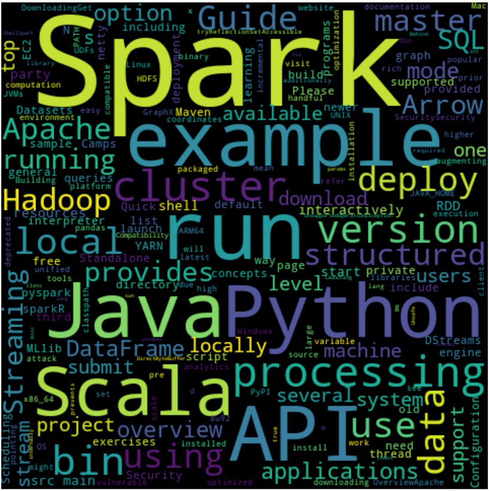

请注意，我们没有在此插图中使用非常大的文本数据样本。 在现实世界中，源数据可能非常大，这证明使用 Apache Spark 集群进行处理是合理的。

这两个案例研究为您提供了使用 Apache Spark 进行大规模数据处理的技巧。它们为那些对自然语言处理 (NLP)、文本分析和情感分析领域感兴趣的人提供了基础。如果您是一名数据科学家，并且您的日常工作需要进行数据处理以进行分析并为 NLP 构建算法，那么这些技能对您很重要。

## 概括

在本章中，我们探讨了如何在一组机器上执行数据密集型作业以实现并行处理。并行处理对于大规模数据很重要，也称为大数据。我们首先评估了可用于数据处理的不同集群选项。我们对 Hadoop MapReduce 和 Apache Spark 进行了比较分析，这两个主要的集群竞争平台。分析表明，Apache Spark 在支持的语言和集群管理系统方面具有更大的灵活性，并且由于其内存数据处理模型，它在实时数据处理方面优于 Hadoop MapReduce。
一旦我们确定 Apache Spark 是各种数据处理应用程序的最合适选择，我们就开始研究其基本数据结构，即 RDD。我们讨论了如何从不同的数据源创建 RDD，并介绍了两种类型的操作，转换和动作。
在本章的核心部分，我们探索了使用 PySpark 使用 Python 创建和管理 RDD。这包括转换和操作操作的几个代码示例。我们还引入了 PySpark DataFrames，以分布式方式进行下一级数据处理。我们通过介绍 PySpark SQL 和一些代码示例来结束该主题。
最后，我们查看了两个使用 Apache Spark 和 PySpark 的案例研究。这些案例研究包括计算 Pi 和从文本数据构建词云。我们还在案例研究中介绍了如何在本地机器上设置独立的 Apache Spark 实例以进行测试。
本章为您提供了在本地设置 Apache Spark 以及使用虚拟化设置 Apache Spark 集群的大量经验。本章提供了大量的代码示例，以提高您的实践技能。这对于想要使用集群来处理大数据问题以提高效率和规模的任何人来说都很重要。
在下一章中，我们将探索利用 Apache Beam 等框架的选项，并扩展我们对使用公共云进行数据处理的讨论。

## 问题

Apache Spark 与 Hadoop MapReduce 有何不同？
转换与 Apache Spark 中的操作有何不同？
什么是 Apache Spark 中的惰性求值？
什么是 SparkSession？
PySpark DataFrame 与 Pandas DataFrame 有何不同？

## 进一步阅读

让-乔治·佩兰着《行动中的火花》第二版
学习 PySpark 作者 Tomasz Drabas, Denny Lee
Raju Kumar Mishra 的 PySpark 食谱
您正在使用的版本的 Apache Spark 文档 (https://spark.apache.org/docs/rel#)
多通道文档可在 https://multipass.run/docs 获得

## 答案

Apache Spark 是一个内存数据处理引擎，而 Hadoop MapReduce 必须读取和写入文件系统。
转换用于将数据从一种形式转换或转换为另一种形式，结果保留在集群内。动作是应用于数据以获取返回给驱动程序的结果的函数。
延迟评估主要应用于转换操作，这意味着转换操作直到对数据对象触发操作时才会执行。
SparkSession 是 Spark 应用程序的入口点，用于连接到一个或多个集群管理器并与执行器一起工作以执行任务。
PySpark DataFrame 是分布式的，旨在在 Apache Spark 集群的多个节点上进行并行处理。
