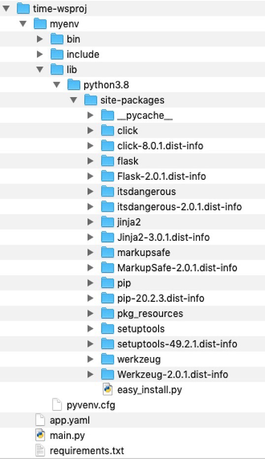
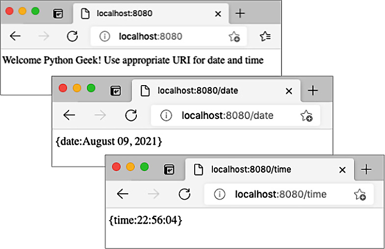
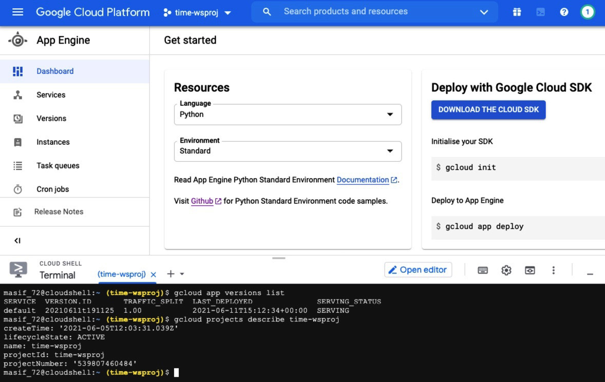
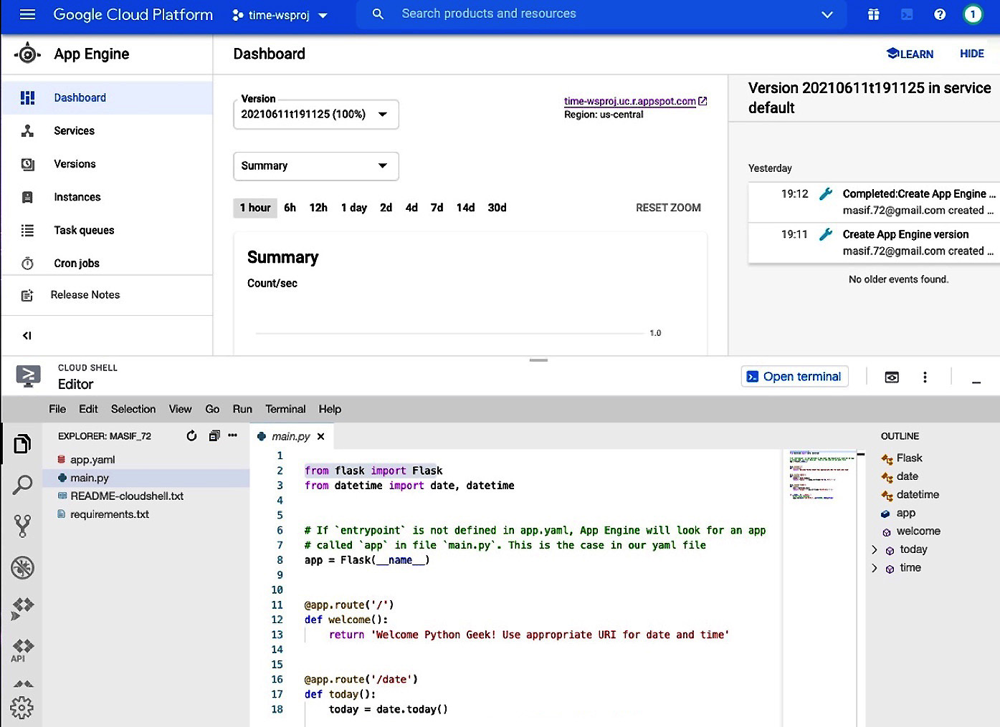
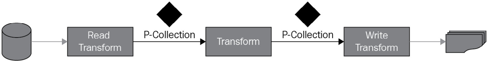
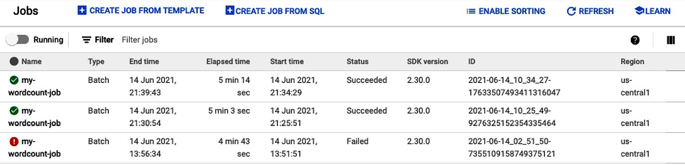
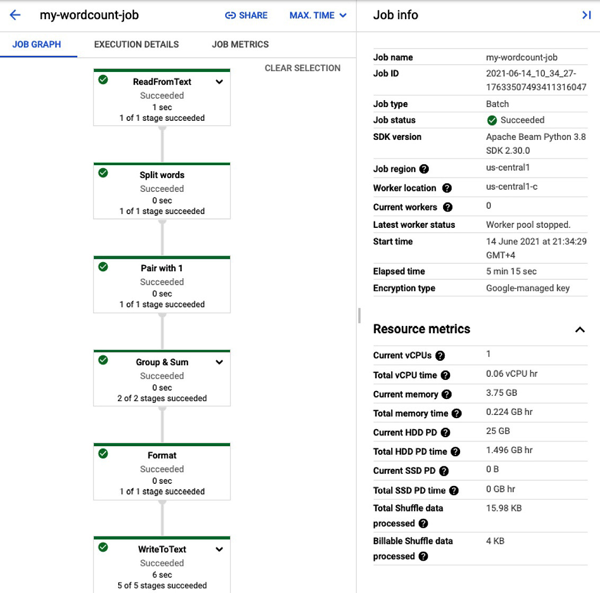

云计算是一个广泛的术语，用于各种用例。这些用例包括提供物理或虚拟计算平台、软件开发平台、大数据处理平台、存储、网络功能、软件服务等等。在本章中，我们将从两个相关的方面探索用于云计算的 Python。首先，我们将研究使用 Python 为云运行时构建应用程序的选项。然后，我们将扩展我们在第 8 章，使用集群扩展 Python，从集群到云环境中开始的对数据密集型处理的讨论。本章讨论的重点将主要集中在三个公共云平台上；即 Google Cloud Platform (GCP)、Amazon Web Services (AWS) 和 Microsoft Azure。
我们将在本章中讨论以下主题：

- 了解 Python 应用程序的云选项
- 为云部署构建 Python Web 服务
- 使用 Google Cloud Platform 进行数据处理

本章结束时，您将了解如何开发应用程序并将其部署到云平台，以及如何使用 Apache Beam 和 Google Cloud Platform。
## 技术要求
以下是本章的技术
要求：
您需要在您的计算机上安装 Python 3.7 或更高版本。
您将需要一个用于 Google Cloud Platform 的服务帐户。免费帐户将正常工作。
您需要在计算机上安装 Google Cloud SDK。
您需要在您的计算机上安装 Apache Beam。

本章的示例代码可以在 https://github.com/PacktPublishing/Python-for-Geeks/tree/master/Chapter09 找到。
我们将通过查看可用于开发云部署应用程序的云选项来开始我们的讨论。

## 了解 Python 应用程序的云选项

云计算是当今程序员的终极前沿领域。在本节中，我们将研究如何使用云开发环境或使用特定的软件开发工具包 (SDK) 来开发 Python 应用程序进行云部署，然后我们将如何在云环境中执行 Python 代码。我们还将研究有关数据密集型处理的选项，例如云上的 Apache Spark。我们将从基于云的开发环境开始。
## 介绍面向云的 Python 开发环境

在为三个主要公共云之一设置 Python 开发环境时，有两种类型的模型可用：

- 云原生集成开发环境 (IDE)
- 带有云集成选项的本地安装 IDE

接下来我们将讨论这两种模式。

### 云原生 IDE
通常有几种云原生开发环境可用，它们并未专门附属于三个公共云提供商。其中包括 PythonAnyWhere、Repl.it、Trinket 和 Codeanywhere。除了付费许可之外，这些云环境中的大多数还提供免费许可。这些公共云平台为开发环境提供了多种工具，如下所述：

- AWS：它以 AWS Cloud9 的形式提供了一个复杂的云 IDE，可以通过 Web 浏览器访问。此云 IDE 为开发人员提供了一组丰富的功能，并且可以选择支持多种编程语言，包括 Python。重要的是要了解 AWS Cloud9 作为托管在 Amazon EC2 实例（虚拟机）上的应用程序提供。使用 AWS Cloud9 没有直接费用，但是使用底层 Amazon EC2 实例和存储空间会产生费用，对于有限的使用来说是非常象征性的。 AWS 平台还提供用于构建和测试代码以实现持续集成 (CI) 和持续交付 (CD) 目标的工具。
    AWS CodeBuild 是另一项可用的服务，可以编译我们的源代码、运行测试和构建用于部署的软件包。它是一个类似于 Bamboo 的构建服务器。 AWS CodeStar 通常与 AWS Cloud9 一起使用，并提供基于项目的平台来帮助开发、构建和部署软件。 AWS CodeStar 提供预定义的项目模板来定义整个持续交付工具链，直到代码发布。
- Microsoft Azure：这随 Visual Studio IDE 一起提供，如果您是 Azure DevOps 平台的一部分，则可以在线使用（基于云）。对 Visual Studio IDE 的在线访问基于付费订阅。 Visual Studio IDE 以其为团队级协作提供环境的丰富特性和功能而闻名。 Microsoft Azure 提供 Azure Pipelines，用于构建、测试代码并将其部署到任何平台，例如 Azure、AWS 和 GCP。 Azure Pipelines 支持多种语言，例如 Node.js、Python、Java、PHP、Ruby、C/C++ 和 .NET，甚至是移动开发工具包。
- Google：Google 提供 Cloud Code 来编写、测试和部署可以通过浏览器（例如通过 ASW Cloud9）或使用您选择的本地 IDE 编写的代码。 Cloud Code 附带最流行的 IDE 插件，例如 IntelliJ IDE、Visual Studio Code 和 JetBrains PyCharm。 Google Cloud Code 是免费提供的，针对容器运行时环境。与 AWS CodeBuild 和 Azure Pipelines 一样，Google 提供了一种等效的服务，也称为 Cloud Build，用于在多个环境（例如虚拟机和容器）中持续构建、测试和部署软件。 Google 还提供远程提供 Jupyter Notebooks 的 Google Colaboratory 或 Google Colab。 Google Colab 选项在数据科学家中很受欢迎
    Google Cloud 还提供 Tekton 和 Jenkins 服务，用于构建 CI/CD 开发和交付模型。
    除了所有这些专用工具和服务之外，这些云平台还提供在线以及本地安装的 shell 环境。这些 shell 环境也是一种在有限容量内管理代码的快速方法。

接下来，我们将讨论将 Python 用于云的本地 IDE 选项。

### 用于云开发的本地 IDE

云原生开发环境是在云生态系统的其余部分拥有原生集成选项的绝佳工具。这使得实例化按需资源然后部署它们变得方便，并且不需要任何身份验证令牌。但这有一些警告。首先，虽然这些工具大多是免费的，但它们使用的底层资源却不是。第二个警告是这些云原生工具的离线可用性不是无缝的。开发人员喜欢在没有任何在线联系的情况下编写代码，以便他们可以在任何地方（例如在火车上或公园里）执行此操作。
由于这些注意事项，开发人员喜欢使用本地编辑器或 IDE 来开发和测试软件，然后再使用其他工具在其中一个云平台上进行部署。 Microsoft Azure IDE（例如 Visual Studio 和 Visual Studio Code）可用于本地计算机。 AWS 和 Google 平台提供自己的 SDK（类似 shell 的环境）和插件以与您选择的 IDE 集成。我们将在本章后面探讨这些发展模式。
接下来，我们将讨论公共云上可用的运行时环境。

## 介绍适用于 Python 的云运行时选项

获取 Python 运行时环境的最简单方法是获取安装了 Python 的 Linux 虚拟机或容器。一旦我们有了虚拟机或容器，我们还可以安装我们选择的 Python 版本。对于数据密集型工作负载，可以在云的计算节点上设置 Apache Spark 集群。但这需要我们拥有所有与平台相关的任务和维护，以防出现任何问题。几乎所有公共云平台都提供更优雅的解决方案来简化开发人员和 IT 管理员的生活。这些云提供商根据应用程序类型提供一个或多个预构建的运行时环境。我们将讨论三个公共云提供商（Amazon AWS、GCP 和 Microsoft Azure）提供的一些运行时环境。

> 什么是运行时环境？
> 运行时环境是运行 Python 代码的执行平台。

### Amazon AWS 提供的运行时选项

Amazon AWS 提供以下运行时选项：

- AWS Beanstalk：此平台即服务 (PAAS) 产品可用于部署使用 Java、.NET、PHP、Node.js、Python 等开发的 Web 应用程序。此服务还提供使用 Apache、Nginx、Passenger 或 IIS 作为 Web 服务器的选项。此服务提供了管理底层基础架构的灵活性，有时需要部署复杂的应用程序。
- AWS App Runner：此服务可用于通过 API 运行容器化 Web 应用程序和微服务。此服务是完全托管的，这意味着您没有管理责任，也无法访问底层基础架构。
- AWS Lambda：这是一个无服务器计算运行时，允许您运行代码而无需担心管理任何底层服务器。该服务器支持多种语言，包括 Python。虽然 Lambda 代码可以直接从应用程序执行，但这非常适合我们必须运行特定代码段的情况，以防其他 AWS 服务触发事件。
- AWS Batch：此选项用于以批处理的形式运行大量计算作业。这是来自 Amazon 的云选项，可替代 Apache Spark 和 Hadoop MapReduce 集群选项。
- AWS Kinesis：此服务也用于数据处理，但用于实时流数据。

### GCP 提供的运行时选项
以下是 GCP 提供的运行时选项：

- App Engine：这是 GCP 的 PaaS 选项，可用于大规模开发和托管 Web 应用程序。应用程序在 App Engine 上部署为容器，但您的源代码由部署工具打包到容器中。这种复杂性对开发人员是隐藏的。
- CloudRun：此选项用于托管任何已构建为容器的代码。容器应用程序必须具有要部署在 CloudRun 上的 HTTP 端点。与 App Engine 相比，将应用程序打包到容器是开发人员的责任。
- Cloud Function：这是一个事件驱动、无服务器和单一用途的解决方案，用于托管轻量级 Python 代码。托管代码通常通过侦听其他 GCP 服务上的事件或通过直接 HTTP 请求触发。这与 AWS Lambda 服务相当。
- 数据流：这是另一个无服务器选项，但主要用于延迟最小的数据处理。这通过消除底层处理平台的复杂性并提供基于 Apache Beam 的数据管道模型来简化数据科学家的生活。
- Dataproc：该服务提供了一个基于 Apache Spark、Apache Flink、Presto 和更多工具的计算机平台。该平台适用于那些拥有依赖于 Spark 或 Hadoop 生态系统的数据处理工作的人。此服务需要我们手动配置集群。

### Microsoft Azure 提供的运行时选项

Microsoft Azure 提供以下运行时环境：

- App Service：此服务用于大规模构建和部署 Web 应用。此 Web 应用程序可以部署为容器或在 Windows 或 Linux 上运行。
- Azure Functions：这是一个无服务器事件驱动的运行时环境，用于根据特定事件或直接请求执行代码。这与 AWS 
- Lambda 和 GCP CloudRun 相当。
- Batch：顾名思义，此服务用于运行需要数百或数千个虚拟机的云规模作业。
- Azure Databricks：Microsoft 与 Databricks 合作提供这个基于 Apache Spark 的平台，用于大规模数据处理。
- Azure 数据工厂：这是 Azure 的无服务器选项，可用于处理流数据并将数据转换为有意义的结果。

正如我们所见，三个主要的云提供商根据可用的应用程序和工作负载提供各种执行环境。以下用例可以部署在云平台上：
开发 Web 服务和 Web 应用程序
使用云运行时进行数据处理
使用 Python 的基于微服务的应用程序（容器）
面向云的无服务器功能或应用程序

我们将在本章接下来的部分中讨论前两个用例。其余用例将在接下来的章节中讨论，因为它们需要更广泛的讨论。在下一节中，我们将开始使用 Python 构建 Web 服务，并探索如何在 GCP App Engine 运行时环境中部署它。

## 为云部署构建 Python Web 服务
为云部署构建应用程序与为本地部署构建应用程序略有不同。在开发应用程序并将其部署到任何云时，我们必须考虑三个关键要求。这些要求如下：

- Web 界面：对于大多数云部署，具有图形用户界面 (GUI) 或应用程序编程接口 (API) 的应用程序是主要候选对象。基于命令行界面的应用程序将无法从云环境中获得可用性，除非它们部署在专用的虚拟机实例中，我们可以使用 SSH 或 Telnet 在 VM 实例上执行它们。这就是我们选择基于 Web 界面的应用程序进行讨论的原因。
- 环境设置：所有公有云平台都支持多种语言，以及一种语言的不同版本。例如，截至 2021 年 6 月，GCP App Engine 支持 Python 版本 3.7、3.8 和 3.9。有时，云服务也允许您自带版本进行部署。对于 Web 应用程序，设置用于访问代码和项目级设置的入口点也很重要。这些通常在单个文件中定义（在 GCP App Engine 应用程序的情况下为 YAML 文件）。
- 依赖管理：任何应用程序可移植性的主要挑战是它对第三方库的依赖。对于 GCP App Engine 应用程序，我们手动或使用 PIP 冻结命令在文本文件 (requirements.txt) 中记录所有依赖项。还有其他优雅的方法可以解决这个问题。一种这样的方法是将所有带有应用程序的第三方库打包到一个用于云部署的文件中，例如 Java Web 存档文件（.war 文件）。另一种方法是将包含应用程序代码和目标执行平台的所有依赖项捆绑到一个容器中，并将容器直接部署在容器托管平台上。我们将在第 11 章使用 Python 进行微服务开发中探索基于容器的部署选项。

在 GCP App Engine 上部署 Python Web 服务应用程序至少有以下三个选项：

- 通过 CLI 界面使用 Google Cloud SDK
- 使用 GCP 网络控制台（门户）和 Cloud Shell（CLI 界面）
- 使用第三方 IDE，例如 PyCharm

我们将详细讨论第一个选项，并总结我们对其他两个选项的经验。

> 重要的提示
> 在 AWS 和 Azure 中部署 Python 应用程序的过程步骤原则上相同，但细节不同，具体取决于每个云提供商提供的 SDK 和 API 支持。

## 使用 Google Cloud SDK

在本节中，我们将讨论如何使用 Google Cloud SDK（主要是 CLI 接口）来创建和部署示例应用程序。此示例应用程序将部署在 Google App Engine (GAE) 平台上。 GAE 是一个 PaaS 平台，最适合使用各种编程语言（包括 Python）部署 Web 应用程序。
要使用 Google Cloud SDK 进行 Python 应用程序部署，我们必须在本地机器上具备以下先决条件：

- 安装并初始化 Cloud SDK。安装后，您可以通过 CLI 界面访问它并使用以下命令检查其版本。请注意，几乎所有 Cloud SDK 命令都以 gcloud 开头：
    ```gcloud –version```
- 安装 Cloud SDK 组件以添加适用于 Python 3 的 App Engine 扩展。这可以使用以下命令完成：
    ```gcloud components install app-engine-python```
- 必须为 GCP 云项目启用 GCP CloudBuild API。
- 必须为 GCP 云项目启用云计费，即使您使用的是试用帐号，也必须通过将您的 GCP 计费帐号与项目相关联。
- 设置新 App Engine 应用程序和启用 API 服务的 GCP 用户权限应在所有者级别完成。

接下来，我们将描述如何设置 GCP 云项目、创建示例 Web 服务应用程序并将其部署到 GAE。

### 设置 GCP 云项目

GCP 云项目的概念与我们在大多数开发 IDE 中看到的相同。 GCP 云项目由一组项目级设置组成，用于管理我们的代码如何与 GCP 服务交互并跟踪项目使用的资源。 GCP 项目必须与结算帐号相关联。就计费而言，这是跟踪每个项目消耗了多少 GCP 服务和资源的先决条件。

接下来，我们将解释如何使用 Cloud SDK 设置项目：

1. 使用以下命令登录 Cloud SDK。这将带您进入网络浏览器，以便您可以登录，以防您尚未登录：
    ```gcloud init```

2. 创建一个名为 time-wsproj 的新项目。项目名称应简短，仅使用字母和数字。允许使用 - 以获得更好的可读性：
    ```gcloud projects create time-wsproj```

3. 使用以下命令将 Cloud SDK 的默认范围切换到新创建的项目（如果您尚未这样做）：
    ```gcloud config set project time-wsproj```
    这将使 Cloud SDK 能够将此项目用作我们通过 Cloud SDK CLI 推送的任何命令的默认项目。

4. 通过将 project 属性与以下命令之一结合使用，在默认项目下或为任何项目创建 App Engine 实例：

    ```gcloud app create #用于默认项目```
    ```gcloud app create --project=time-wsproj #for 特定项目```

    请注意，此命令将保留云资源（主要是计算和存储）并提示您选择一个区域和可用区来托管资源。您可以选择离您最近且从观众的角度来看也更合适的区域和区域。

5. 为当前项目启用 Cloud Build API 服务。正如我们已经讨论过的，Google Cloud Build 服务用于在将应用程序部署到 Google 运行时（例如 App Engine）之前构建应用程序。 Cloud Build API 服务通过 GCP 网络控制台更容易启用，因为它只需要点击几下。要使用 Cloud SDK 启用它，首先，我们需要知道服务的确切名称。我们可以使用 gcloud services list 命令获取可用 GCP 服务的列表。
    此命令将为您提供一长串 GCP 服务，以便您可以查找与 Cloud Build 相关的服务。您还可以使用任何命令属性的格式来美化 Cloud SDK 的输出。为了更方便，您可以使用 Linux grep 实用程序（如果您使用的是 Linux 或 macOS）和此命令来过滤结果，然后使用 enable 命令启用该服务：
    ```python
    gcloud services list --available | grep cloudbuild
    #output will be like: NAME: cloudbuild.googleapis.com
    #Cloud SDK command to enable this service
    gcloud services enable cloudbuild.googleapis.com
    ```
    
6. 要为我们的项目启用 Cloud Billing API 服务，首先，我们需要将一个计费帐号与我们的项目相关联。根据 Cloud SDK 版本 343.0.0，通用可用性 (GA) 尚未实现对 Cloud SDK 中计费帐户的支持。可以通过 GCP 网络控制台将结算帐号附加到项目。但也有可用的 Cloud SDK 命令的测试版，以便您可以实现相同的目标。第一步，我们需要知道将使用的结算帐户 ID。可以使用此处显示的 beta 命令检索与登录用户关联的计费帐户：
  ```bash
  gcloud beta billing accounts list
  #output will include following
  #billingAccounts/0140E8-51G144-2AB62E
  #enable billing on the current project using
  gcloud beta billing projects link time-wsproj --billing-account 0140E8-51G144-2AB62E
  ```
  请注意，如果您是第一次使用 beta 命令，系统会提示您安装 beta 组件。你应该继续安装它。如果您已经在使用包含 GA 计费组件的 Cloud SDK 版本，您可以根据 Cloud SDK 发布文档跳过使用 beta 关键字或使用适当的命令。
7. 按照启用 Cloud Build API 的相同步骤为当前项目启用 Cloud Billing API 服务。首先，我们必须找到 API 服务的名称，然后使用以下 Cloud SDK 命令集启用它：
    ```python
    gcloud services list --available | grep cloudbilling
    #output will be: NAME: cloudbilling.googleapis.com
    #command to enable this service
    gcloud services enable cloudbilling.googleapis.com
    ```
      对于有经验的云用户来说，设置云项目必须遵循的步骤很简单，不会超过几分钟。项目设置完成后，我们可以通过运行以下命令来获取项目配置详细信息：
      ```gcloud projects describe time-wsproj```
      此命令的输出将提供项目生命周期的状态、项目名称、项目 ID 和项目编号。以下是一些示例输出：
      ```bash
      createTime: '2021-06-05T12:03:31.039Z'
      lifecycleState: ACTIVE
      name: time-wsproj
      projectId: time-wsproj
      projectNumber: '539807460484'
      ```

现在项目已经建立，我们可以开始开发我们的 Python Web 应用程序。我们将在下一节中执行此操作。

### 构建 Python 应用程序
对于云部署，我们可以使用 IDE 或系统编辑器构建 Python 应用程序，然后使用 Cloud SDK 和 app-engine-python 组件在本地模拟 App Engine 运行时，我们已将其作为先决条件安装。例如，我们将构建一个基于 Web 服务的应用程序，该应用程序将通过 REST API 为我们提供日期和时间。该应用程序可以通过 API 客户端或使用 Web 浏览器触发。我们没有启用任何身份验证以保持部署简单。
为了构建 Python 应用程序，我们将使用 Python venv 包设置 Python 虚拟环境。使用 venv 包创建的虚拟环境将用于包装 Python 解释器、核心和第三方库和脚本，以将它们与系统 Python 环境和其他 Python 虚拟环境分开。从 v3.3 开始，Python 就支持使用 venv 包在 Python 中创建和管理虚拟环境。还有其他工具可用于创建虚拟环境，例如 virtualenv 和 pipenv。 PyPA 建议使用 venv 来创建虚拟环境，因此我们为本书中提供的大多数示例选择了它。
作为第一步，我们将创建一个名为 time-wsproj 的 Web 应用程序项目目录，其中包含以下文件：

- app.yaml
- main.py
- requirements.txt

为方便起见，我们对用于创建云项目的目录使用了相同的名称，但这不是必需的。让我们更详细地查看这些文件。

### YAML文件

此文件包含 App Engine 应用程序的部署和运行时设置，例如运行时版本号。对于 Python 3，app.yaml 文件必须至少有一个运行时参数（运行时：python38）。 Web 应用程序中的每个服务都可以有自己的 YAML 文件。为简单起见，我们将仅使用一个 YAML 文件。在我们的例子中，这个 YAML 文件将只包含运行时属性。出于说明目的，我们向示例 YAML 文件添加了更多属性：

```yaml
runtime: python38
main.py Python file
```

我们选择了 Flask 库来构建我们的示例应用程序。 Flask 是一个著名的 Web 开发库，主要是因为它提供了强大的功能，以及它的易用性。 我们将在下一章详细介绍 Flask。
这个 main.py Python 模块是我们应用程序的入口点。 应用程序的完整代码如下：

```python
from flask import Flask
from datetime import date, datetime
# If 'entrypoint' is not defined in app.yaml, App Engine will look #for an app variable. This is the case in our YAML file
app = Flask(__name__)
@app.route('/')
def welcome():
    return 'Welcome Python Geek! Use appropriate URI for date and time'
@app.route('/date')
def today():
    today = date.today()
    return "{date:" + today.strftime("%B %d, %Y") + '}'
@app.route('/time')
def time():
    now = datetime.now()
    return "{time:" + now.strftime("%H:%M:%S") + '}'
if __name__ == '__main__':
    # For local testing
    app.run(host='127.0.0.1', port=8080, debug=True)
```

该模块提供以下主要功能：

- 在此模块中定义了一个名为 app 的默认入口点。 app 变量用于重定向发送到此模块的请求。
- 使用 Flask 的注解，我们为三个 URL 定义了处理程序：
    - a) 根/URL 将触发一个名为welcome 的函数。欢迎函数以字符串形式返回问候消息。
    - b) /date URL 将触发 today 函数，该函数将以 JSON 格式返回今天的日期。
    - c) /time URL 将执行 time 函数，它将以 JSON 格式返回当前时间。
- 在模块的最后，我们添加了一个 __main__ 函数来启动一个 Flask 自带的本地 web 服务器，用于测试目的。

### Requirements file

此文件包含第三方库的项目依赖项列表。 App Engine 将使用此文件的内容为我们的应用程序提供所需的库。在我们的例子中，我们将需要 Flask 库来构建我们的示例 Web 应用程序。我们项目的这个文件的内容如下：
```Flask==2.0.1```
一旦我们创建了项目目录并制作了这些文件，我们必须在项目目录内部或外部创建一个虚拟环境并使用 source 命令激活它：

```bash
python -m venv myenv
source myenv/bin/activate
```

激活虚拟环境后，我们必须根据 requirements.txt 文件安装必要的依赖项。我们将使用来自 requirements.txt 文件所在目录的 pip 实用程序：
```pip install -r requirements.txt```
安装 Flask 库及其依赖项后，PyCharm IDE 中的目录结构将如下所示：



一旦设置了项目文件和依赖项，我们将使用以下命令在本地启动 Web 服务器：

```bash
python main.py
```

服务器将以以下调试消息开始，这清楚地表明此服务器选项仅用于测试目的，而不用于生产环境：

* Serving Flask app 'main' (lazy loading)
* Environment: production
   WARNING: This is a development server. Do not use it in a      production deployment.
   Use a production WSGI server instead.
* Debug mode: on
* Running on http://127.0.0.1:8080/ (Press CTRL+C to quit)
* Restarting with stat
* Debugger is active!
* Debugger PIN: 668-656-035

可以使用以下 URI 访问我们的 Web 服务应用程序：

- http://localhost:8080/
- http://localhost:8080/date
- http://localhost:8080/time

Web 服务器对这些 URI 的响应如下所示：



在我们进入下一阶段之前，Web 服务器将停止，即将此应用程序部署到 Google App Engine。

### 部署到 Google App Engine

要将我们的 Web 服务应用程序部署到 GAE，我们必须使用项目目录中的以下命令：
```gcloud app deploy```
Cloud SDK 将读取 app.yaml 文件，该文件提供用于为此应用创建 App Engine 实例的输入。在部署过程中，使用 Cloud Build 服务创建了一个容器镜像；然后，将此容器映像上传到 GCP 存储进行部署。成功部署后，我们可以使用以下命令访问 Web 服务：
```gcloud app browse```
此命令将使用您机器上的默认浏览器打开应用程序。托管应用程序的 URL 会有所不同，具体取决于在应用程序创建期间选择的区域和区域。
请务必了解，每次我们执行 deploy 命令时，都会在 App Engine 中创建一个新版本的应用程序，这意味着将消耗更多资源。我们可以使用以下命令检查已为 Web 应用程序安装的版本：
```gcloud app versions list```
旧版本的应用程序仍然可以处于服务状态，分配给它们的 URL 略有不同。可以使用 gcloud app versions Cloud SDK 命令和版本 ID 停止、启动或删除旧版本。可以使用停止或启动命令停止或启动应用程序，如下所示：

```bash
gcloud app versions stop <version id>
gcloud app versions start <version id>
gcloud app versions delete <version id>
```

当我们运行 gcloud app versions list 命令时，版本 ID 可用。我们对构建 Python 网络应用程序并将其部署到 GCP 的讨论到此结束。接下来，我们将总结如何利用 GCP 控制台部署相同的应用程序。

## 使用 GCP 网络控制台

GCP 控制台提供了一个易于使用的门户网站，用于访问和管理 GCP 项目，以及 Google Cloud Shell 的在线版本。该控制台还提供可自定义的仪表板、项目使用的云资源的可见性、计费详细信息、活动日志记录以及更多功能。在使用 GCP 控制台开发和部署 Web 应用程序时，由于 Web UI，我们可以使用一些功能，但大多数步骤都需要使用 Cloud Shell。这是一个 Cloud SDK，可通过任何浏览器在线访问。
Cloud Shell 在以下几个方面不仅仅是 Cloud SDK：

- 它提供对 gcloud CLI 以及 kubectl CLI 的访问。 kubectl 用于管理 GCP Kubernetes 引擎上的资源。
- 借助 Cloud Shell，我们可以使用 Cloud Shell Editor 开发、调试、构建和部署我们的应用程序。
- Cloud Shell 还提供了一个在线开发服务器，用于在将应用程序部署到 App Engine 之前对其进行测试。
- Cloud Shell 附带了用于在 Cloud Shell 平台和您的机器之间上传和下载文件的工具。
- Cloud Shell 能够在端口 8080 或您选择的端口上预览 Web 应用程序。

设置新项目、构建应用程序和部署到 App Engine 所需的 Cloud Shell 命令与我们针对 Cloud SDK 讨论的相同。这就是为什么我们将按照我们在上一节中描述的相同步骤将其留给您探索。请注意，可以使用 GCP 控制台设置项目。可以使用顶部菜单栏右侧的 Cloud Shell 图标启用 Cloud Shell 界面。启用 Cloud Shell 后，控制台网页底部将出现一个命令行界面。这显示在以下屏幕截图中：



正如我们之前提到的，Cloud Shell 附带了一个编辑器工具，可以使用打开编辑器按钮启动它。 以下屏幕截图显示了在 Cloud Shell Editor 中打开的 Python 文件：



构建和部署 Web 应用程序的另一个选择是使用带有 Google App Engine 插件的第三方 IDE。根据我们的经验，可用于 PyCharm 和 Eclipse 等常用 IDE 的插件大多是为 Python 2 和遗留 Web 应用程序库构建的。将 IDE 与 GCP 直接集成需要更多的工作和发展。在撰写本文时，最好的选择是直接将 Cloud SDK 或 Cloud Shell 与您选择的编辑器或 IDE 结合使用以进行应用程序开发。
在本节中，我们介绍了使用 Python 开发 Web 应用程序并将它们部署到 GCP App Engine 平台。 Amazon 为 Web 应用程序部署提供 AWS Beanstalk 服务。在 AWS Beanstalk 中部署 Web 应用程序的步骤与在 GCP App Engine 中部署的步骤几乎相同，只是 AWS Beanstalk 不需要将项目设置为先决条件。因此，我们可以在 AWS Beanstalk 中更快地部署应用程序。
要在 AWS Beanstalk 中部署我们的 Web 服务应用程序，我们必须使用 AWS 控制台或使用 AWS CLI 提供以下信息：

- Application name
- Platform (Python version 3.7 or 3.8, in our case)
- Source code version
- Source code, along with a requirements.txt file

我们建议将 AWS CLI 用于依赖第三方库的 Web 应用程序。我们可以将源代码以 ZIP 文件或 Web 档案（WAR 文件）的形式从本地计算机上传，或者从 Amazon S3 位置复制它们。
在 AWS Beanstalk 上部署 Web 应用程序的确切步骤可在 https://docs.aws.amazon.com/elasticbeanstalk/latest/dg/create-deploy-python-flask.html 获得。 Azure 提供用于构建和部署 Web 应用程序的应用服务。您可以在 https://docs.microsoft.com/en-us/azure/app-service/quickstart-python 上找到在 Azure 上创建和部署 Web 应用程序的步骤。
接下来，我们将探索使用云平台构建用于数据处理的驱动程序。

## 使用 Google Cloud Platform 进行数据处理
Google Cloud Platform 提供 Cloud Dataflow 作为数据处理服务，为批处理和实时数据流应用程序提供服务。此服务面向数据科学家和分析应用程序开发人员，以便他们可以为数据分析和数据处理设置处理管道。 Cloud Dataflow 在底层使用 Apache Beam。 Apache Beam 起源于 Google，但现在是 Apache 下的一个开源项目。该项目提供了一种使用管道构建数据处理的编程模型。此类管道可以使用 Apache Beam 创建，然后使用 Cloud Dataflow 服务执行。
Google Cloud Dataflow 服务类似于 Amazon Kinesis、Apache Storm、Apache Spark 和 Facebook Flux。在讨论如何通过 Python 使用 Google Dataflow 之前，我们将介绍 Apache Beam 及其管道概念。

## 学习 Apache Beam 的基础知识

在当前时代，数据就像许多组织的摇钱树。许多数据是由应用程序、设备以及人与系统的交互生成的。在使用数据之前，对其进行处理很重要。为数据处理定义的步骤在 Apache Beam 术语中通常称为管道。换句话说，数据管道是对来自不同来源的原始数据执行的一系列操作，然后将该数据移动到目的地以供分析或业务应用程序使用。
Apache Beam 用于将问题分解为可以并行处理的小数据包。 Apache Beam 的主要用例之一是提取、转换和加载 (ETL) 应用程序。每当我们必须将数据从原始形式移动到精炼形式以供数据消费时，这三个 ETL 步骤是管道的核心。
Apache Beam 的核心概念和组件如下：

- Pipeline：管道是一种将数据从一种形式转换为另一种形式的方案，作为数据处理的一部分。
- PCollection：Pcollection 或并行集合，类似于 Apache Spark 中的 RDD。它是一个分布式数据集，包含一个不可变且无序的元素包。数据集的大小可以是固定的或有界的，类似于批处理，我们知道一批要处理多少作业。根据不断更新和流式传输的数据源，大小也可以是灵活的或无限制的。
- PTransforms：这些是在管道中定义的用于转换数据的操作。这些操作是在 PCollection 对象上操作的。
- SDK：一种特定于语言的软件开发工具包，可用于 Java、Python 和 Go 来构建管道并将它们提交给运行器以执行。
- Runner：这是 Apache Beam 管道的执行平台。 Runner 软件必须实现一个名为 run (Pipeline) 的方法，该方法默认是异步的。一些可用的运行器是 Apache Flink、Apache Spark 和 Google Cloud Dataflow。
- 用户定义函数 (ParDo/DoFn)：Apache Beam 提供了多种类型的用户定义函数 (UDF)。最常用的函数是 DoFn，它在每个元素的基础上运行。提供的 DoFn 实现包装在 ParDo 对象中，该对象专为并行执行而设计。

一个简单的管道如下所示：



要设计管道，我们通常必须考虑三个要素：

- 首先，我们需要了解数据的来源。它是存储在文件中还是数据库中，还是以流的形式出现？基于此，我们将确定我们必须实现哪种类型的读取转换操作。作为读取操作的一部分或单独的操作，我们还需要了解数据格式或结构。
- 下一步是定义和设计如何处理这些数据。这是我们的主要变换操作。我们可以对同一数据以串行方式或并行方式一个接一个地进行多个变换操作。 Apache Beam SDK 提供了几个可以使用的预构建转换。它还允许我们使用 ParDo/DoFn 函数编写我们自己的转换。
- 最后，我们需要知道管道的输出是什么以及输出结果的存储位置。这在上图中显示为写入转换。

在本节中，我们讨论了一个简单的管道结构来解释与 Apache Beam 和管道相关的不同概念。在实践中，管道可能相对复杂。一个管道可以有多个输入数据源和多个输出接收器。 PTransforms 操作可能会导致多个 PCollection 对象，这需要 PTransform 操作并行运行。
在接下来的几节中，我们将学习如何使用 Apache Beam runner 或 Cloud Dataflow runner 创建新管道并执行管道。

### Apache Beam 管道简介

在本节中，我们将讨论如何创建 Apache Beam 管道。正如我们已经讨论过的，管道是一组为实现某些数据处理目标而编排的动作或操作。管道需要一个输入数据源，该数据源可以包含内存数据、本地或远程文件或流数据。典型管道的伪代码如下所示：
[最终 PColletcion] = ([初始输入 PCollection] | [第一个 PTransform] | [第二个 PTransform] | [第三个 PTransform])
初始 PCollection 用作 First PTransform 操作的输入。 First PTransform 的输出 PCollection 将用作 Second PTransform 的输入，依此类推。最后一个 PTransform 的 PCollection 的最终输出将被捕获为 Final PCollection 对象，并用于将结果导出到目标目的地。
为了说明这个概念，我们将构建几个不同复杂度级别的示例管道。这些示例旨在展示用于构建和执行管道的不同 Apache 组件和库的角色。最后，我们将为一个著名的字数统计应用程序构建一个管道，Apache Beam 和 GCP Dataflow 文档中也引用了该应用程序。需要强调的是，我们必须使用 pip 实用程序为本节中的所有代码示例安装 apache-beam Python 库。

#### 示例 1 – 使用内存中的字符串数据创建管道

在这个例子中，我们将从内存中的字符串集合创建一个输入 PCollection，应用几个转换操作，然后将结果打印到输出控制台。以下是完整的示例代码：

```python
#pipeline1.py: Separate strings from a PCollection
import apache_beam as beam
with beam.Pipeline() as pipeline:
  subjects = (
      pipeline
      | 'Subjects' >> beam.Create([
          'English Maths Science French Arts', ])
      | 'Split subjects' >> beam.FlatMap(str.split)
      | beam.Map(print))
```

对于这个例子，强调几点很重要：
我们使用了 |在管道中编写不同的 PTransform 操作。这是一个重载运算符，更像是将 PTransform 应用于 PCollection 以生成另一个 PCollection。
我们使用 >> 操作符来命名每个 PTransform 操作以用于记录和跟踪目的。 | 之间的字符串和 >> 用于显示和记录目的。
我们使用了三个变换操作；所有这些都是 Apache Beam 库的一部分：
a) 第一个变换操作用于创建一个 PCollection 对象，它是一个包含五个主题名称的字符串。
b) 第二个变换操作用于使用内置的String对象方法（split）将字符串数据拆分为新的PCollection。
c) 第三个变换操作用于将 PCollection 中的每个条目打印到控制台输出。
控制台的输出将显示一个主题名称列表，一个名称在一行中。

#### 示例 2 – 使用内存中的元组数据创建和处理管道

在此代码示例中，我们将创建元组的 PCollection。每个元组都有一个主题名称和一个与之相关的等级。该流水线的核心 PTransform 操作是将主题及其等级与数据分离。示例代码如下：

```python
#pipeline2.py: Separate subjects with grade from a PCollection
import apache_beam as beam
def my_format(sub, marks):
    yield '{}\t{}'.format(sub,marks)
with beam.Pipeline() as pipeline:
  plants = (
      pipeline
      | 'Subjects' >> beam.Create([
      ('English','A'),
      ('Maths', 'B+'),
      ('Science', 'A-'),
      ('French', 'A'),
      ('Arts', 'A+'),
      ])
      | 'Format subjects with marks' >> beam.FlatMapTuple(my_        format)
      | beam.Map(print))
```

与第一个示例相比，我们使用 FlatMapTuple 转换操作和自定义函数来格式化元组数据。 控制台输出将在单独的行中显示每个科目的名称及其成绩。

#### 示例 3 – 使用文本文件中的数据创建管道

在前两个示例中，我们专注于构建一个简单的管道来解析大字符串中的字符串数据并从元组的 PCollection 中拆分元组。 在实践中，我们正在处理从文件或存储系统加载或来自流源的大量数据。 在此示例中，我们将从本地文本文件读取数据以构建初始 PCollection 对象，并将最终结果输出到输出文件。 完整的代码示例如下：

```python
#pipeline3.py: Read data from a file and give results back to another file
import apache_beam as beam
from apache_beam.io import WriteToText, ReadFromText
with beam.Pipeline() as pipeline:
    lines = pipeline | ReadFromText('sample1.txt')
    subjects = (
      lines
      | 'Subjects' >> beam.FlatMap(str.split))
    subjects | WriteToText(file_path_prefix='subjects',
                           file_name_suffix='.txt',
                           shard_name_template='')
```

在此代码示例中，我们在应用任何与数据处理相关的 PTransform 之前应用了 PTransform 操作从文件中读取文本数据。最后，我们应用 PTransform 操作将数据写入输出文件。我们在此代码示例中使用了两个名为 ReadFromText 和 WriteToText 的新函数，如下所述：

- ReadFromText：此函数是 Apache Beam I/O 模块的一部分，用于将文本文件中的数据读取到字符串的 PCollection 中。文件路径或文件模式可以作为从本地路径读取的输入参数提供。我们还可以使用 gs:// 访问 GCS 存储位置中的任何文件。
- WriteToText：此函数用于将 PCollection 数据写入文本文件。这至少需要 file_path_prefix 参数。我们还可以提供 file_path_suffix 参数来设置文件扩展名。 shard_name_template 设置为空以使用前缀和后缀参数创建具有名称的文件。 Apache Beam 支持分片名称模板，用于基于模板定义文件名。

当这个管道在本地执行时，它会根据 PTransform 操作创建一个名为 subject.txt 的文件，其中包含主题名称。

#### 示例 4 – 使用参数为 Apache Beam 运行器创建管道

到目前为止，我们已经学习了如何创建一个简单的管道，如何从文本文件构建 PCollection 对象，以及如何将结果写回文件。除了这些核心步骤之外，我们还需要执行更多步骤，以确保我们的驱动程序已准备好将作业提交给 GCP Dataflow 运行器或任何其他云运行器。这些附加步骤如下：

- 在前面的示例中，我们提供了在驱动程序中设置的输入文件和输出文件模式的名称。在实践中，我们应该期望通过命令行参数提供这些参数。我们将使用 argparse 库来解析和管理命令行参数。
- 我们将添加扩展参数，例如设置跑步者。此参数将用于使用 DirectRunner 或 GCP Dataflow 运行器设置管道的目标运行器。请注意，DirectRunner 是本地计算机的管道运行时。它确保这些管道尽可能地遵循 Apache Beam 模型。
- 我们还将实现和使用 ParDo 函数，该函数将利用我们定制的函数从文本数据中解析字符串。我们可以使用 String 函数来实现这一点，但这里添加它是为了说明如何将 ParDo 和 DoFn 与 PTransform 一起使用。

以下是步骤：

1. 首先，我们将构建参数解析器并定义我们期望从命令行获得的参数。我们将为这些参数设置默认值，并设置额外的帮助文本以在命令行上使用帮助开关显示。 dest 属性很重要，因为它用于标识要在编程语句中使用的任何参数。我们还将定义 ParDo 函数，该函数将用于执行管道。此处提供了一些示例代码：
    ```python
    #pipeline4.py(part 1): Using argument for a pipeline
    import re, argparse, apache_beam as beam
    from apache_beam.io import WriteToText, ReadFromText
    from apache_beam.options.pipeline_options import PipelineOptions
    class WordParsingDoFn(beam.DoFn):
      def process(self, element):
        return re.findall(r'[\w\']+', element, re.UNICODE)
    def run(argv=None):
        parser = argparse.ArgumentParser()
        parser.add_argument(
            '--input',
            dest='input',
            default='sample1.txt',
            help='Input file to process.')
        parser.add_argument(
            '--output',
            dest='output',
            default='subjects',
            help='Output file to write results to.')
        parser.add_argument(
            '--extension',
            dest='ext',
            default='.txt',
            help='Output file extension to use.')
        known_args, pipeline_args = parser.parse_known_args(argv)
    ```

2. 现在，我们将 DirectRunner 设置为我们的管道运行时并命名要执行的作业。 此步骤的示例代码如下：
    ```python
    #pipeline4.py(part 2): under the run method
        pipeline_args.extend([
            '--runner=DirectRunner',
            '--job_name=demo-local-job',
        ])
        pipeline_options = PipelineOptions(pipeline_args)
    ```

3. 最后，我们将使用我们在上一步中创建的 pipeline_options 对象创建一个管道。 管道将从输入文本文件中读取数据，根据我们的 ParDo 函数转换数据，然后将结果保存为输出：
    ```python
    #pipeline4.py(part 3): under the run method
    
        with beam.Pipeline(options=pipeline_options) as pipeline:
            lines = pipeline | ReadFromText(known_args.input)
            subjects = (
                    lines
                    | 'Subjects' >> beam.ParDo(WordParsingDoFn()).
                    with_output_types(str))
            subjects | WriteToText(known_args.output, known_args.ext)
    ```
    当我们使用参数的默认值直接通过 IDE 执行此程序或使用以下命令从命令行界面启动它时，我们将获得相同的输出：
    python pipeline4.py --input sample1.txt --output myoutput --extension .txt
    输入文本文件 (sample1.txt) 中的单词被解析并作为一个单词放在输出文件的一行中。

Apache Beam 是一个庞大的主题，因此不写几章就不可能涵盖它的所有功能。但是，我们通过提供代码示例涵盖了基础知识，这些示例将使我们能够开始编写可以在 GCP Cloud Dataflow 上部署的简单管道。我们将在下一节中介绍这一点。

## 为 Cloud Dataflow 构建流水线

到目前为止，我们讨论的代码示例侧重于构建简单的管道并使用 DirectRunner 执行它们。在本节中，我们将构建一个驱动程序，以在 Google Cloud Dataflow 上部署字数数据处理管道。此驱动程序对于 Cloud Dataflow 部署很重要，因为我们将在程序中设置所有与云相关的参数。因此，无需使用 Cloud SDK 或 Cloud Shell 来执行其他命令。
字数统计管道将是我们的 pipeline4.py 示例的扩展版本。此处总结了部署字数统计管道所需的其他组件和步骤：

1. 首先，我们将使用类似于我们为 App Engine 部署的 Web 服务应用程序所遵循的步骤创建一个新的 GCP 云项目。我们可以使用 Cloud SDK、Cloud Shell 或 GCP 控制台来执行此任务。
2. 我们将为新项目启用 Dataflow Engine API。
3. 接下来，我们将创建一个存储桶来存储输入和输出文件，并为 Cloud Dataflow 提供临时和暂存目录。我们可以通过使用 GCP 控制台、Cloud Shell 或 Cloud SDK 来实现这一点。如果我们使用 Cloud Shell 或 Cloud SDK 创建新存储桶，则可以使用以下命令：
    ```gsutil mb gs://<bucket name>```
4. 如果新创建的存储桶与数据流管道作业不在同一个项目下，您可能需要将服务帐户与新创建的存储区相关联，并选择存储对象管理员角色进行访问控制。
5. 我们必须使用必要的 gcp 库安装 Apache Beam。这可以通过使用 pip 实用程序来实现，如下所示：
    ```pip install apache-beam[gcp]```
6. 我们必须为用于 GCP 云项目的 GCP 服务帐户创建一个用于身份验证的密钥。如果我们将从 GCP 平台（例如 Cloud Shell）运行驱动程序，则不需要这样做。必须在本地计算机上下载服务帐户密钥。为了使密钥可用于 Apache Beam SDK，我们需要将密钥文件（一个 JSON 文件）的路径设置为名为 GOOGLE_APPLICATION_CREDENTIALS 的环境变量。

在讨论如何在 Cloud Dataflow 上执行管道之前，我们将快速浏览一下本练习的示例字数统计驱动程序。在这个驱动程序中，我们将定义命令行参数，与我们在前面的代码示例 (pipeline4.py) 中所做的非常相似，除了我们将执行以下操作：

- 我们将使用我们的驱动程序设置它，而不是通过操作系统设置 GOOGLE_APPLICATION_CREDENTIALS 环境变量，以便于测试目的的执行。
- 我们将把 sample.txt 文件上传到 Google 存储，在我们的例子中是 gs//muasif/input 目录。 我们将使用此 Google 存储的路径作为输入参数的默认值。

完整的示例代码如下：

```python
# wordcount.py(part 1): count words in a text file
import argparse, os, re, apache_beam as beam
from apache_beam.io import ReadFromText, WriteToText
from apache_beam.options.pipeline_options import PipelineOptions
from apache_beam.options.pipeline_options import SetupOptions
def run(argv=None, save_main_session=True):
  os.environ["GOOGLE_APPLICATION_CREDENTIALS"] = "some folder key.json"
  parser = argparse.ArgumentParser()
  parser.add_argument(
      '--input',
      dest='input',
      default='gs://muasif/input/sample.txt',
      help='Input file to process.')
  parser.add_argument(
      '--output',
      dest='output',
      default='gs://muasif/input/result',
      help='Output file to write results to.')
  known_args, pipeline_args = parser.parse_known_args(argv)
```

在下一步中，我们将为管道选项设置扩展参数，以在 Cloud Dataflow 运行时上执行我们的管道。 这些论点如下：

- 用于管道执行的运行时平台（运行器）（在本例中为 DataflowRunner）
- GCP 云项目 ID
- GCP区域
- 用于存储输入、输出和临时文件的 Google 存储桶路径
- 用于跟踪目的的作业名称

基于这些参数，我们将创建一个用于管道执行的管道选项对象。 这些任务的示例代码如下：

```python
# wordcount.py (part 2): under the run method
  pipeline_args.extend([
      '--runner=DataflowRunner',
      '--project=word-count-316612',
      '--region=us-central1',
      '--staging_location=gs://muasif/staging',
      '--temp_location=gs://muasif/temp',
      '--job_name=my-wordcount-job',
  ])
  pipeline_options = PipelineOptions(pipeline_args)
  pipeline_options.view_as(SetupOptions).save_main_session = save_main_session
```

最后，我们将使用已经定义的管道选项实现一个管道，并添加我们的 PTransform 操作。 对于这个代码示例，我们添加了一个额外的 PTransform 操作来构建一个每个单词为 1 的对。在后续的 PTransform 操作中，我们将这些对分组并应用求和操作来计算它们的频率。 这为我们提供了输入文本文件中每个单词的计数：

```python
# wordcount.py (part 3): under the run method
  with beam.Pipeline(options=pipeline_options) as p:
    lines = p | ReadFromText(known_args.input)
    # Count the occurrences of each word.
    counts = (
        lines
        | 'Split words' >> (
            beam.FlatMap(
                lambda x: re.findall(r'[A-Za-z\']+', x)).
                with_output_types(str))
        | 'Pair with 1' >> beam.Map(lambda x: (x, 1))
        | 'Group & Sum' >> beam.CombinePerKey(sum))
    def format_result(word_count):
      (word, count) = word_count
      return '%s: %s' % (word, count)
    output = counts | 'Format' >> beam.Map(format_result)
    output | WriteToText(known_args.output)
```

我们为驱动程序中的每个参数设置默认值。 这意味着我们可以直接使用 python wordcount.py 命令执行程序，或者我们可以使用以下命令通过 CLI 传递参数：

```bash
python wordcount.py \
--project word-count-316612 \
--region us-central1 \
--input gs://muasif/input/sample.txt \
--output gs://muasif/output/results \
--runner DataflowRunner \
--temp_location gs://muasif/temp \
--staging_location gs://muasif/staging
```

输出文件将包含结果以及文件中每个单词的计数。 GCP Cloud Dataflow 提供了额外的工具，用于监控提交作业的进度和了解执行作业的资源利用率。 以下 GCP 控制台屏幕截图显示了已提交到 Cloud Dataflow 的作业列表。 摘要视图显示了它们的状态和一些关键指标：



我们可以导航到详细的作业视图（通过单击任何作业名称），如下面的屏幕截图所示。 此视图在右侧显示作业和环境详细信息，以及我们为管道定义的不同 PTransform 的进度摘要。 当作业运行时，每个 PTransform 操作的状态都会实时更新，如下所示：



需要注意的一个非常重要的一点是，不同的 PTransform 操作是根据我们与 >> 运算符一起使用的字符串命名的。这有助于方便地可视化操作。我们对为 Google Dataflow 构建和部署管道的讨论到此结束。与 Apache Spark 相比，Apache Beam 为并行和分布式数据处理提供了更大的灵活性。随着云数据处理选项的可用性，我们可以完全专注于对管道进行建模，而将执行管道的工作留给云提供商。
正如我们之前提到的，亚马逊提供了类似的服务 (AWS Kinesis) 来部署和执行管道。 AWS Kinesis 更专注于实时数据的数据流。与 AWS Beanstalk 一样，AWS Kinesis 不需要我们设置项目作为先决条件。使用 AWS Kinesis 处理数据的用户指南可从 https://docs.aws.amazon.com/kinesis/ 获得。

## 概括

在本章中，我们总体上讨论了 Python 在开发云部署应用程序方面的作用，以及使用 Apache Beam 和 Python 在 Google Cloud Dataflow 上部署数据处理管道。我们通过比较三个主要公共云提供商在开发、构建和部署不同类型的应用程序方面提供的内容来开始本章。我们还比较了每个云提供商为运行时环境提供的选项。我们了解到，每个云提供商都提供基于应用程序或程序的各种运行时引擎。例如，我们为经典 Web 应用程序、基于容器的应用程序和无服务器功能提供单独的运行时引擎。为了探索 Python 在云原生 Web 应用程序中的有效性，我们构建了一个示例应用程序并学习了如何使用 Cloud SDK 在 Google App Engine 上部署此类应用程序。在上一节中，我们扩展了对数据过程的讨论，这是我们在上一章开始的。我们为使用 Apache Beam 的数据处理（管道）引入了一种新的建模方法。在通过一些代码示例了解如何构建管道后，我们将讨论扩展到如何为 Cloud Dataflow 部署构建管道。
本章提供了公共云服务产品的比较分析。随后是为云构建 Web 应用程序和数据处理应用程序的实践知识。本章中包含的代码示例将使您能够开始创建云项目并为 Apache Beam 编写代码。对于想要使用基于云的数据处理服务解决大数据问题的任何人来说，这些知识都很重要。
在下一章中，我们将探索 Python 在使用 Flask 和 Django 框架开发 Web 应用程序方面的强大功能。

## 问题

AWS Beanstalk 与 AWS App Runner 有何不同？
什么是 GCP Cloud Function 服务？
GCP 的哪些服务可用于数据处理？
什么是 Apache Beam 管道？
PCollection 在数据处理管道中的作用是什么？

## 进一步阅读

Flask Web 开发，作者 Miguel Grinberg。
Python 3 编程高级指南，作者：John Hunt。
Apache Beam：完整指南，作者 Gerardus Blokdyk。
Google Cloud Platform for Developers，作者：Ted Hunter、Steven Porter。
Google Cloud Dataflow 文档可从 https://cloud.google.com/dataflow/docs 获得。
AWS Elastic Beanstalk 文档可从 https://docs.aws.amazon.com/elastic-beanstalk 获得。
Azure 应用服务文档位于 https://docs.microsoft.com/en-us/azure/app-service/。
AWS Kinesis 文档可从 https://docs.aws.amazon.com/kinesis/ 获得。

## 答案

AWS Beanstalk 是用于部署 Web 应用程序的通用 PaaS 产品，而 AWS App Runner 是用于部署基于容器的 Web 应用程序的完全托管服务。
GCP Cloud Function 是一种用于执行程序的无服务器、事件驱动的服务。指定的事件可以从另一个 GCP 服务或通过 HTTP 请求触发。
Cloud Dataflow 和 Cloud Dataproc 是 GCP 提供的两种流行的数据处理服务。
Apache Beam 管道是一组已定义的操作，用于加载数据、将数据从一种形式转换为另一种形式并将数据写入目的地。
PCollection 就像 Apache Spark 中保存数据元素的 RDD。在流水线数据处理中，典型的 PTransform 操作将一个或多个 PCollection 对象作为输入，并将结果作为一个或多个 PCollection 对象产生。