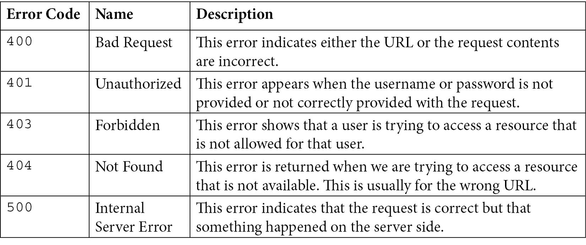
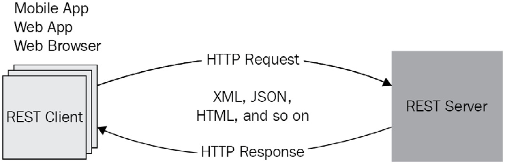
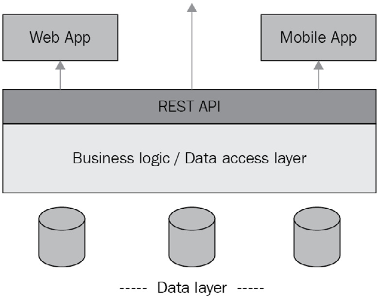
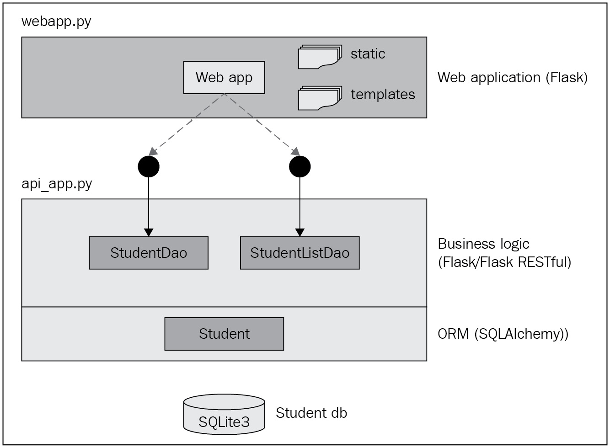
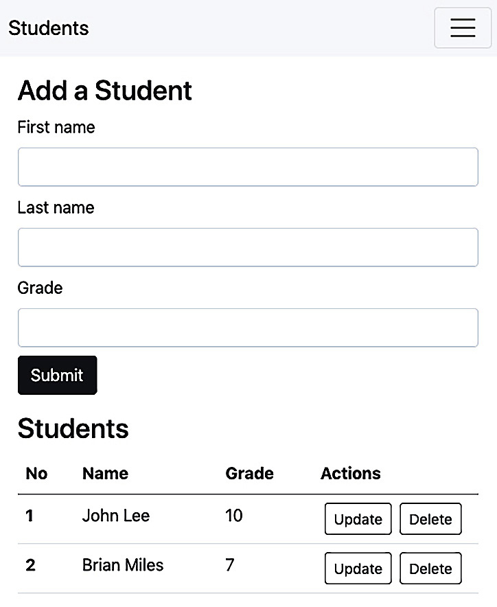
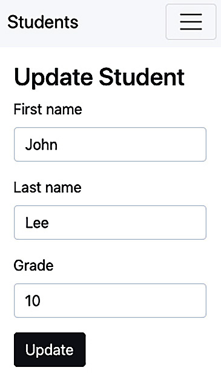

Web 应用程序是一种应用程序，由 Intranet 内或 Internet 上的 Web 服务器托管和运行，并通过客户端设备上的 Web 浏览器访问。使用 Web 浏览器作为客户端界面使用户可以方便地从任何地方访问应用程序，而无需在本地计算机上安装任何其他软件。二十多年来，这种易于访问的特性促成了 Web 应用程序的成功和流行。 Web 应用程序的使用多种多样，从提供静态和动态内容（如维基百科和报纸、电子商务、在线游戏、社交网络、培训、多媒体内容、调查和博客）到复杂的企业资源规划 (ERP) 应用程序。
Web 应用程序本质上是多层的，通常是三层应用程序。这三层是 UI、业务逻辑和数据库访问。因此，开发 Web 应用程序涉及与用于 UI 的 Web 服务器、用于业务逻辑的应用程序服务器以及用于持久化数据的数据库系统进行交互。在移动应用时代，UI 可能是一个移动应用，需要通过 REST API 访问业务逻辑层。 REST API 或任何类型的 Web 服务接口的可用性已成为 Web 应用程序的基本要求。本章讨论如何使用 Python 构建多层 Web 应用程序。 Python 中有多种框架可用于开发 Web 应用程序，但我们选择 Flask 进行本章讨论，因为它功能丰富且轻量级。 Web 应用程序也称为 Web 应用程序，以区别于针对小型设备的移动应用程序。
我们将在本章中讨论以下主题：

- Web开发的学习要求
- Flask 框架介绍
- 使用 Python 与数据库交互
- 使用 Python 构建 REST API
- 案例研究：使用 REST API 构建 Web 应用程序

在本章结束时，您将能够使用 Flask 框架来开发 Web 应用程序、与数据库交互以及构建 REST API 或 Web 服务。

## 技术要求

以下是本章的技术要求：

- 您需要在您的计算机上安装 Python 3.7 或更高版本。
- Python Flask 库 2.x 及其扩展安装在 Python 3.7 或更高版本之上。

本章的示例代码可以在 https://github.com/PacktPublishing/Python-for-Geeks/tree/master/Chapter10 找到。
我们将从开发 Web 应用程序和 REST API 的关键要求开始我们的讨论。

## Web开发的学习要求

开发 Web 应用程序包括构建 UI、将用户请求或用户操作路由到应用程序端点、转换用户输入数据、为用户请求编写业务逻辑、与数据层交互以读取或写入数据，并将结果返回给用户。所有这些开发组件可能需要不同的平台，有时甚至使用不同的编程语言来实现。在本节中，我们将从 Web 应用程序框架或 Web 框架开始，了解 Web 开发所需的组件和工具。

## 网络框架

从头开始开发 Web 应用程序既耗时又乏味。为了方便 Web 开发人员，在 Web 开发的早期就引入了 Web 应用程序框架。 Web 框架提供了一组库、目录结构、可重用组件和部署工具。 Web 框架通常遵循一种架构，使开发人员能够在更短的时间内以优化的方式构建复杂的应用程序。
有几个适用于 Python 的 Web 框架：Flask 和 Django 是最受欢迎的。这两个框架都是免费和开源的。 Flask 是一个轻量级框架，具有构建 Web 应用程序所需的标准功能，但它还允许在需要时使用其他库或扩展。另一方面，Django 是一个完整的堆栈框架，具有开箱即用的所有功能，无需额外的库。这两种方法都有优点和缺点，但最终，我们可以使用这些框架中的任何一个开发任何 Web 应用程序。
如果您希望通过选择使用适合的外部库来完全控制您的应用程序，则 Flask 被认为是更好的选择。当项目需求变化非常频繁时，Flask 也是一个很好的选择。如果您希望所有工具和库开箱即用，并且只想专注于实现业务逻辑，那么 Django 是合适的。 Django 是大型项目的不错选择，但对于简单的项目可能有点过头了。 Django 的学习曲线很陡峭，需要有 Web 开发方面的经验。如果您是第一次使用 Python 进行 Web 开发，那么 Flask 是您的最佳选择。一旦你学会了 Flask，就很容易在 Web 项目的下一级采用 Django 框架。
在构建 Web 应用程序或任何 UI 应用程序时，我们经常会遇到术语模型视图控制器 (MVC) 设计模式。这是一种架构设计模式，将应用程序分为三层：

- 模型：模型层表示通常存储在数据库中的数据。
- 视图：这一层是用户与之交互的 UI。
- 控制器：控制器层旨在提供一种逻辑来处理用户通过 UI 与应用程序的交互。例如，用户可能想要创建新对象或更新现有对象。对于有或没有模型（数据）的创建或更新请求，向用户呈现哪个 UI（视图）的逻辑都在控制器层中实现。

Flask 不提供对 MVC 设计模式的直接支持，但可以通过编程实现。 Django 为 MVC 提供了足够接近的实现，但不完全。 Django 框架中的控制器由 Django 自己管理，无法在其中编写我们自己的代码。 Django 和许多其他用于 Python 的 Web 框架遵循模型视图模板 (MVT) 设计模式，除了模板层之外，它类似于 MVC。 MVT 中的模板层提供了特殊格式的模板，以生成具有在 HTML 中插入动态内容的能力的预期 UI。

## 用户界面

UI 是应用程序的表示层，有时它作为 Web 框架的一部分包含在内。但我们在这里单独讨论它，以突出可用于该层的关键技术和选择。首先，用户通过浏览器以超文本标记语言 (HTML) 和级联样式表 (CSS) 进行交互。我们可以通过直接编写 HTML 和 CSS 来构建我们的界面，但它很乏味，并且无法及时交付动态内容。在构建 UI 时，有一些技术可以使我们的生活更轻松：

- UI 框架：这些主要是 HTML 和 CSS 库，为构建 UI 提供不同的类（样式）。我们仍然需要编写或生成 UI 的核心 HTML 部分，但不必担心如何美化我们的网页。 UI 框架的一个流行示例是 bootstrap，它构建在 CSS 之上。它由 Twitter 引入供内部使用，但后来开源供任何人使用。 ReactJS 是另一个流行的选择，但它更像是一个库而不是一个框架，是由 Facebook 引入的。
- 模板引擎：模板引擎是另一种流行的动态生成 Web 内容的机制。模板更像是所需输出的定义，其中包含静态数据以及动态内容的占位符。占位符是标记化的字符串，在运行时由值替换。输出可以是任何格式，例如 HTML、XML、JSON 或 PDF。 Jinja2 是与 Python 一起使用的最流行的模板引擎之一，也包含在 Flask 框架中。 Django 自带模板引擎。
- 客户端脚本：客户端脚本是从 Web 服务器下载并由客户端 Web 浏览器执行的程序。 JavaScript 是最流行的客户端脚本语言。有许多 JavaScript 库可用于简化 Web 开发。

我们可以使用不止一种技术来开发 Web 界面。在典型的 Web 项目中，所有这三个都以不同的方式使用。

## 网络服务器/应用服务器

Web 服务器是通过 HTTP 侦听客户端请求并根据请求类型提供内容（例如网页、脚本、图像）的软件。 Web 服务器的基本工作是仅提供静态资源，不能执行代码。
应用程序服务器更特定于一种编程语言。应用服务器的主要工作是提供对使用 Python 等编程语言编写的业务逻辑实现的访问。对于许多生产环境，Web 服务器和应用程序服务器捆绑为一个软件，以便于部署。 Flask 带有自己的内置 Web 服务器，名为 Werkzeug，用于开发阶段，但不建议在生产中使用。对于生产，我们必须使用其他选项，例如 Gunicorn、uWSGI 和 GCP 运行时引擎。

## 数据库

这不是必需的组件，但它对于任何交互式 Web 应用程序几乎都是必不可少的。 Python 提供了多个库来访问常用的数据库系统，例如 MySQL、MariaDB、PostgreSQL 和 Oracle。 Python 还配备了轻量级数据库服务器 SQLite。

## 安全

安全性是 Web 应用程序的基础，主要是因为目标受众通常是互联网用户，而数据隐私是此类环境中的最高要求。安全套接字层 (SSL) 和最近引入的传输层安全性 (TLS) 是确保客户端和服务器之间数据传输安全的最低可接受安全标准。传输级别的安全要求通常在 Web 服务器或有时在代理服务器级别处理。用户级安全是下一个基本要求，用户名和密码要求最低。用户安全是应用级安全，开发者主要负责设计和实现。

## 应用程序接口

Web 应用程序中的业务逻辑层可以被其他客户端使用。例如，移动应用程序可以对有限或相同的一组功能使用相同的业务逻辑。对于企业对企业 (B2B) 应用程序，远程应用程序可以直接向业务逻辑层提交请求。如果我们为业务逻辑层公开标准接口（例如 REST API），这一切都是可能的。在当前时代，通过 API 访问业务逻辑层是从一开始就准备好 API 的最佳实践。

## 文档

文档与编写编程代码一样重要。对于 API 来说尤其如此。当我们说我们的应用程序有 API 时，API 消费者的第一个问题是您是否可以与我们共享 API 文档。拥有 API 文档的最佳方法是使用内置工具，这些工具可能与我们的 Web 框架集成。 Swagger 是一种流行的工具，用于根据编码时添加的注释自动生成文档。
既然我们已经讨论了 Web 开发的关键要求，我们将在下一节深入探讨如何使用 Flask 开发 Web 应用程序。

## Flask 框架介绍
Flask 是 Python 的微型 Web 开发框架。术语 micro 表示 Flask 的核心是轻量级的，但具有可扩展的灵活性。一个简单的例子是与数据库系统交互。 Django 带有与最常见数据库交互所需的库。另一方面，Flask 允许根据数据库类型或根据集成方法使用扩展来实现相同的目标。 Flask 的另一个理念是使用约定优于配置，这意味着如果我们遵循 Web 开发的标准约定，我们必须做更少的配置。这使得 Flask 成为初学者学习使用 Python 进行 Web 开发的最佳选择。我们选择 Flask 进行 Web 开发，不仅是因为它的易用性，还因为它允许我们以逐步的方式引入不同的概念。
在本节中，我们将学习使用 Flask 的 Web 应用程序的以下方面：

- 使用路由构建基本的 Web 应用程序
- 处理具有不同 HTTP 方法类型的请求
- 使用 Jinja2 渲染静态和动态内容
- 从 HTTP 请求中提取参数
- 与数据库系统交互
- 处理错误和异常

在我们开始使用下一节中使用的代码示例之前，需要在我们的虚拟环境中安装 Flask 2.x。我们将从使用 Flask 的基本 Web 应用程序开始。

### 使用路由构建基本应用程序

在上一章 Python Programming for the Cloud 中，我们已经使用 Flask 为 GCP App Engine 部署构建了一个示例应用程序。我们将更新使用 Flask 开发简单 Web 应用程序的知识。我们将从一个代码示例开始，以了解 Web 应用程序是如何构建的以及路由在其中是如何工作的。完整的代码示例如下：

```python
#app1.py: routing in a Flask application
from flask import Flask
app = Flask(__name__)
@app.route('/')
def hello():
    return 'Hello World!'
@app.route('/greeting')
def greeting():
    return 'Greetings from Flask web app!'
if __name__ == '__main__':
    app.run()
```

让我们一步一步地分析这个代码示例：

- 初始化：作为第一步，Flask 应用程序必须创建一个应用程序实例（在我们的例子中是应用程序）。 Web 服务器将使用称为 Web 服务器网关接口 (WSGI) 的协议将来自客户端的所有请求传递到此应用程序实例。应用程序实例是通过使用语句 app = Flask(__name__) 创建的。
    将模块名称作为参数传递给 Flask 构造函数很重要。 Flask 使用此参数来了解应用程序的位置，该位置成为确定其他文件（例如静态资源、模板和图像）位置的输入。使用 __name__ 是传递给 Flask 构造函数的约定（过度配置），其余的由 Flask 处理。

- 路由：一旦请求到达 Flask 应用程序实例，现在该实例负责执行一段代码来处理请求。这段代码通常是一个 Python 函数，称为处理程序。好消息是每个请求通常（并非总是）与单个 URL 相关联，这使得定义 URL 和 Python 函数之间的映射成为可能。这个映射到 Python 函数的 URL 称为路由。在我们的代码示例中，我们选择了一种简单的方法来使用路由装饰器来定义此映射。例如，/hello URL 映射到hello 函数，/greeting URL 映射到greeting 函数。如果我们更喜欢在一个地方定义所有路由，我们可以将 add_url_rule 与应用程序实例一起用于所有路由定义。

- 处理函数：处理请求后的处理函数必须将响应发送回客户端。响应可以是带有或不带有 HTML 的简单字符串，也可以是基于模板的静态或动态的复杂网页。在我们的代码示例中，为了说明目的，我们返回了一个简单的字符串。

- Web 服务器：Flask 应用程序带有一个开发服务器，可以使用 app.run() 方法启动，或在 shell 中使用 flask run 命令启动。当我们启动这个 web 服务器时，它默认查找 app.py 或 wsgi.py 模块，如果我们使用 app.py 名称作为我们的模块文件，它将被服务器自动加载（同样，约定优于配置） .但是如果我们为我们的模块使用不同的名称（这是我们的情况），我们必须设置一个环境变量 FLASK_APP = <module name>，Web 服务器将使用它来加载模块。
    如果您使用 PyCharm Pro 等 IDE 创建了 Flask 项目，则环境变量将作为项目设置的一部分为您设置。如果您使用的是命令行 shell，则可以根据您的操作系统使用以下命令设置环境变量：

    ```python
    export FLASK_APP= app1.py.   #for macOS and Linux
    set FLASK_APP = app1.py.     #for MS windows
    ```

    当服务器启动时，它会在 URL http://localhost:5000/ 上侦听客户端请求，并且默认情况下只能在您的本地计算机上访问它。如果我们想使用不同的主机名和端口启动服务器，我们可以使用以下命令（或等效的 Python 语句）：
    ```Flask run --host <ip_address> --port <port_num>```
- Web 客户端：我们可以通过浏览器通过在地址栏中输入 URL 或使用 curl 实用程序来测试简单的 HTTP 请求来测试我们的应用程序。对于我们的示例，我们可以使用以下 curl 命令测试我们的应用程序：
  
    - curl -X GET http://localhost:5000/
    - curl -X GET http://localhost:5000/greeting

现在我们已经完成了对 Flask 应用程序基础知识的讨论，我们将开始探索与使用请求和将动态响应发送回客户端相关的主题。

### 处理具有不同 HTTP 方法类型的请求

HTTP 基于客户端和服务器之间的请求-响应模型。客户端（例如，Web 浏览器）可以发送不同的动词，或者更合适地调用方法来识别服务器的请求类型。这些方法包括 GET、POST、PUT、DELETE、HEAD、PATCH 和 OPTIONS。 GET 和 POST 是最常用的 HTTP 方法，因此我们将仅介绍这些方法来说明我们的 Web 开发概念。
但是在讨论这两种方法之前，了解 HTTP 的两个关键组件，即 HTTP 请求和 HTTP 响应也很重要。一个 HTTP 请求分为三个部分：

- Request line: 这一行包括要使用的 HTTP 方法、请求的 URI 和要使用的 HTTP 协议（版本）：
    获取 /home HTTP/1.1
- Header fields: 标头是提供与请求有关的信息的元数据。每个标头条目都作为键值对提供，以冒号 (:) 分隔
- Body (optional): 这是一个占位符，我们可以在其中添加其他数据。对于 Web 应用程序，我们可以在 HTTP 请求正文中发送带有 POST 请求的表单数据。对于 REST API，我们可以在正文中发送 PUT 或 POST 请求的数据。

当我们向 Web 服务器发送 HTTP 请求时，我们将收到 HTTP 响应作为结果。 HTTP 响应将具有与 HTTP 请求相似的部分：

- Status line：此行指示响应是成功还是出现错误。错误代码在状态行中突出显示：
    HTTP/1.1 200 正常
    状态代码 200 或 200-299 范围内的某些内容表示成功。客户端错误的错误代码在 400-499 的范围内，服务器端错误的错误代码在 500-599 的范围内。
- Header：标头字段类似于 HTTP 请求标头字段。
- Body (optional)：虽然可选，但这是 HTTP 响应的关键部分。这可以包括 Web 应用程序的 HTML 页面或任何其他格式的数据。

GET 用于发送对 URL 中标识的特定资源的请求，并可选择添加查询字符串作为 URL 的一部分。这 ？添加到 URL 中以保持查询字符串与基本 URL 分开。例如，如果我们在谷歌上搜索 Python 这个词，我们会在浏览器中看到如下所示的 URL：
https://www.google.com/search?q=Python
在这个 URL 中，q=Python 是一个查询字符串。查询字符串用于以键值对的形式携带数据。这种访问资源的方法因其简单性而广受欢迎，但也有其局限性。查询字符串中的数据在 URL 中可见，这意味着我们不能将用户名和密码等敏感信息作为查询字符串发送。查询字符串的长度不能超过 255 个字符。但是，为了简单起见，GET 方法用于搜索诸如 Google 和 YAHOO 之类的网站。对于POST方法，数据是通过HTTP请求体发送的，这就消除了GET方法的局限性。数据不会作为 URL 的一部分出现，并且我们可以发送到 HTTP 服务器的数据没有限制。使用 POST 方法支持的数据类型也没有限制。
Flask 提供了一些方便的方法来识别请求是使用 GET 或 POST 发送的还是使用任何其他方法发送的。在我们的下一个代码示例中，我们说明了两种方法；第一种方法使用路由装饰器，带有预期的方法类型的精确列表，第二种方法是使用特定于 HTTP 方法类型的装饰器，例如 get 装饰器和 post 装饰器。下一个代码示例说明了这两种方法的使用，然后进行了详细分析：

```python
#app2.py: map request with method type
from flask import Flask, request
app = Flask(__name__)
@app.route('/submit', methods=['GET'])
def req_with_get():
    return "Received a get request"
@app.post('/submit')
def req_with_post():
    return "Received a post request"
@app.route('/submit2', methods = ['GET', 'POST'])
def both_get_post():
    if request.method == 'POST':
        return "Received a post request 2"
    else:
        return "Received a get request 2"
```

下面我们来一一讨论我们示例代码中的三个路由定义和对应的函数：

- 在第一个路由定义 (@app.route('/submit', methods=['GET'])) 中，我们使用路由装饰器来映射 URL，将 GET 类型的请求映射到 Python 函数。使用此装饰器设置，我们的 Python 函数将使用仅针对 /submit URL 的 GET 方法处理请求。
- 在第二个路由定义（@app.post('/submit')）中，我们使用了 post 装饰器，并且只用它来指定请求 URL。这是使用 POST 方法将请求映射到 Python 函数的简化版本。这个新设置相当于第一个路由定义，但具有简化形式的 POST 方法类型。我们可以通过使用 get 装饰器为 GET 方法实现相同的效果。
- 在第三个路由定义（@app.route('/submit2', methods = ['GET', 'POST'])）中，我们使用 POST 和 GET 方法将带有请求的单个 URL 映射到单个 Python 函数。当我们希望使用单个处理程序（Python 函数）处理任何请求方法时，这是一种方便的方法。在 Python 函数内部，我们使用请求对象的 method 属性来识别请求是 GET 还是 POST 类型。请注意，一旦我们将请求包导入到我们的程序中，请求对象就会由 Web 服务器提供给我们的 Flask 应用程序。这种方法为客户端提供了使用相同 URL 使用两种方法中的任何一种提交请求的灵活性，作为开发人员，我们将它们映射到单个 Python 函数。

我们可以通过 curl 实用程序更方便地测试此代码示例，因为在不定义 HTML 表单的情况下提交 POST 请求并不容易。以下 curl 命令可用于向我们的 Web 应用程序发送 HTTP 请求：
curl -X GET http://localhost:5000/submit
curl -X POST http://localhost:5000/submit
curl -X GET http://localhost:5000/submit2
curl -X POST http://localhost:5000/submit2
接下来，我们将讨论如何从静态页面和模板呈现响应。

### 呈现静态和动态内容

静态内容对于 Web 应用程序很重要，因为它们包括 CSS 和 JavaScript 文件。静态文件可以直接由 Web 服务器提供。如果我们在项目中创建一个名为 static 的目录并将客户端重定向到静态文件位置，Flask 也可以实现这一点。
可以使用 Python 创建动态内容，但它很乏味，并且需要相当努力才能在 Python 中维护这样的代码。推荐的方法是使用模板引擎，例如 Jinja2。 Flask 自带了一个 Jinja2 库，所以不需要安装额外的库，我们也不需要添加任何额外的配置来设置 Jinja2。一个包含两个函数的示例代码，一个处理静态内容的请求，另一个处理动态内容的请求，如下所示：

```python
#app3.py: rendering static and dynamic contents
from flask import Flask, render_template, url_for, redirect
app = Flask(__name__)
@app.route('/hello')
def hello():
    hello_url = url_for ('static', filename='app3_s.html')
    return redirect(hello_url)
@app.route('/greeting')
def greeting():
    msg = "Hello from Python"
    return render_template('app3_d.html', greeting=msg)
```

为了更好地理解此示例代码，我们将重点介绍以下要点：

- 我们从 Flask 导入其他模块，例如 url_for、redirect 和 render_template。
- 对于 /hello 路由，我们使用 url_for 函数构建一个 URL，其中包含静态目录和 HTML 文件的名称作为参数。 我们发送响应，这是对浏览器的指令，将客户端重定向到静态文件位置的 URL。 重定向指令通过使用 300-399 范围内的状态码向 Web 浏览器指示，这是我们使用重定向功能时 Flask 自动设置的。
- 对于 /gtreeting 路由，我们使用 render_template 函数渲染 Jinja 模板 app3_d.html。 我们还将问候消息字符串作
- 为值传递给模板的变量。 问候变量将可用于 Jinja 模板，如 app3_d.html 文件中的以下模板摘录所示：

```jinja2
<!DOCTYPE html>
<body>

  <h1> {{greeting}}!</h1>

</body>
</html>
```

这是最简单的 Jinja 模板，其中 if 语句用 <% %> 括起来，Python 变量使用两个大括号 {{}} 格式包含在内。我们不会详细介绍 Jinja2 模板，但我们强烈建议您通过他们的在线文档 (https://jinja.palletsprojects.com/) 熟悉 Jinja2 模板。
可以使用 Web 浏览器和 curl 实用程序访问此示例 Web 应用程序。在下一节中，我们将讨论如何从不同类型的请求中提取参数。

### 从 HTTP 请求中提取参数

Web 应用程序与网站不同，因为它们与用户进行交互，如果客户端和服务器之间不交换数据，这是不可能的。在本节中，我们将讨论如何从请求中提取数据。根据所使用的 HTTP 方法的类型，我们将采用不同的方法。我们将涵盖以下三种类型的请求：

- 作为请求 URL 一部分的参数
- 参数作为带有 GET 请求的查询字符串
- 参数作为带有 POST 请求的 HTML 表单数据

包含三种不同路由以覆盖上述三种请求类型的示例代码如下。我们正在渲染一个 Jinja 模板（app4.html），它与我们用于 app3_d.html 文件的相同，除了变量名称是 name 而不是 greeting ：

```python
#app4.py: extracting parameters from different requests
from flask import Flask, request, render_template
app = Flask(__name__)
@app.route('/hello')
@app.route('/hello/<fname> <lname>')
def hello_user(fname=None, lastname=None):
    return render_template('app4.html', name=f"{fname}{lname}")
@app.get('/submit')
def process_get_request_data():
    fname = request.args['fname']
    lname = request.args.get('lname', '')
    return render_template('app4.html', name=f"{fname}{lname}")
@app.post('/submit')
def process_post_request_data():
    fname = request.form['fname']
    lname = request.form.get('lname','']
    return render_template('app4.html', name=f"{fname}{lname}")
```

接下来，我们将讨论每种情况的参数提取方法：

- 对于第一组路由 (app.route)，我们定义了一个路由，即 /hello/ 之后的任何文本都被视为请求的参数。我们可以设置零个或一个或两个参数，我们的 Python 函数能够处理任何组合并将名称（可以为空）作为响应返回给模板。这种方法适用于向服务器程序传递参数的简单情况。这是 REST API 开发中访问单个资源实例的流行选择。
- 对于第二个路由 (app.get)，我们从 args 字典对象中提取查询字符串参数。我们可以通过使用其名称作为字典键或使用 GET 方法将第二个参数作为默认值来获取参数值。我们使用空字符串作为 GET 方法的默认值。我们展示了这两个选项，但如果您想在请求中不存在参数时设置默认值，我们建议使用 GET 方法。
- 对于第三个路由 (app.post)，参数作为表单数据作为 HTTP 请求正文的一部分出现，我们将使用表单字典对象来提取这些参数。同样，我们使用参数名称作为字典键，并使用 GET 方法进行说明。

要测试这些场景，我们建议使用 curl 实用程序，尤其是对于 POST 请求。我们使用以下命令测试了该应用程序：
curl -X GET http://localhost:5000/hello
curl -X GET http://localhost:5000/hello/jo%20so
curl -X GET 'http://localhost:5000/submit?fname=jo&lname=so'
curl -d "fname=jo&lname=so" -X POST http://localhost:5000/submit
在下一节中，我们将讨论如何在 Python 中与数据库进行交互。

### 与数据库系统交互

全栈 Web 应用程序需要结构化数据的持久性，因此使用数据库的知识和经验是 Web 开发的先决条件。 Python 和 Flask 可以与大多数 SQL 或非 SQL 数据库系统集成。 Python 本身带有一个轻量级的 SQLite 数据库，模块名为 sqlite3。我们将使用 SQLite，因为它不需要设置单独的数据库服务器，并且非常适合小型应用程序。对于生产环境，我们必须使用其他数据库系统，例如 MySQL 或 MariaDB，或 PostgreSQL。为了访问数据库系统并与之交互，我们将使用 Flask 扩展之一 Flask-SQLAlchemy。 Flask-SQLAlchemy 扩展基于 Python 的 SQLAlchemy 库，并使该库可用于我们的 Web 应用程序。 SQLAlchemy 库提供了一个对象关系映射器 (ORM)，这意味着它将我们的数据库表映射到 Python 对象。使用 ORM 库不仅可以加快开发周期，还可以灵活地切换底层数据库系统，而无需更改我们的代码。因此，我们将推荐使用 SQLAlchemy 或类似的库来处理数据库系统。
要从我们的应用程序与任何数据库系统进行交互，我们需要像往常一样创建我们的 Flask 应用程序实例。下一步是使用我们的数据库位置的 URL（在 SQLite3 的情况下为文件）配置应用程序实例。创建应用程序实例后，我们将通过将其传递给应用程序实例来创建 SQLAlchemy 实例。在使用 SQLite 等数据库时，我们只需要在第一次初始化数据库。它可以从 Python 程序启动，但我们不赞成这种方法，以避免每次启动应用程序时都重置数据库。建议仅使用 SQLAlchemy 实例从命令行初始化数据库一次。我们将在我们的代码示例之后讨论初始化数据库的确切步骤。
为了说明 SQLAlchemy 库在我们的网络应用程序中的使用，我们将创建一个简单的应用程序来添加、列出和删除数据库表中的学生对象。以下是初始化 Flask 应用程序和数据库实例（SQLAlchemy 实例）以及创建 Student 类的 Model 对象的应用程序示例代码：

```python
#app5.py (part1): interacting with db for create, delete   and list objects
from flask import Flask, request, render_template, redirect
from flask_sqlalchemy import SQLAlchemy
app = Flask(__name__)
app.config['SQLALCHEMY_DATABASE_URI'] = 'sqlite:///student.db'
app.config['SQLALCHEMY_TRACK_MODIFICATIONS'] = False
db = SQLAlchemy(app)
class Student(db.Model):
    id = db.Column(db.Integer, primary_key=True)
    name = db.Column(db.String(80), nullable=False)
    grade = db.Column(db.String(20), nullable=True)
   
    def __repr__(self):
        return '<Student %r>' % self.name
```

一旦我们创建了 SQLAlchemy 实例 db，我们就可以使用数据库对象了。诸如 SQLAlchemy 之类的 ORM 库的美妙之处在于，我们可以在 Python 中将数据库架构定义为 Python 类，在 ORM 术语中称为模型。对于我们的代码示例，我们创建了一个类 Student，它继承自基类 db.Model。在这个模型类中，我们定义了 id、name 和 Grade 属性，这些属性将对应于 SQLite3 数据库实例中的数据库表 Student 中的三列。对于每个属性，我们定义了它的最大长度的数据类型，是否有主键，是否可以为空。这些附加属性定义对于以优化方式配置数据库表很重要。
在下面的代码片段中，我们将说明一个 Python 函数 list_students，用于从数据库中获取学生对象列表。此函数映射到我们示例 Web 应用程序的 /list URL，它通过使用查询实例（数据库实例的一个属性）上的 all 方法从数据库表中返回所有 Student 对象。请注意，查询实例及其方法可从基类 db.Model 中获得：

```python
#app5.py (part 2)
@app.get('/list')
def list_students():
    student_list = Student.query.all()
    return render_template('app5.html', students=student_list)
```

在下一个代码片段中，我们将编写一个函数 (add_student) 将学生添加到数据库表中。 此函数映射到 /add URL 并期望使用 GET 方法将学生的姓名和成绩作为请求参数传递。 要将新对象添加到数据库，我们将使用必要的属性值创建 Student 类的新实例，然后使用 db.Session 实例通过 add 函数添加到 ORM 层。 add 函数不会自行将实例添加到数据库中。 我们将使用 commit 方法将其推送到数据库表。 将新学生添加到我们的数据库表后，我们将控制重定向到 /list URL。 我们使用重定向到此 URL 的原因是我们希望在添加新学生后返回最新的学生列表，并重用我们已经实现的 list_students 函数。 add_student 函数的完整代码如下：

```python
#app5.py(part 3)
@app.get('/add')
def add_student():
    fname = request.args['fname']
    lname = request.args.get('lname', '')
    grade = request.args.get('grade','')
    student = Student(name=f"{fname} {lname}", grade=grade)
    db.session.add(student)
    db.session.commit()
    return redirect("/list")
```

在这个代码示例的最后一部分，我们将编写一个 Python 函数（delete_student）从数据库表中删除一个学生。 此函数映射到 /delete<int:id> URL。 请注意，我们希望客户端发送学生 ID（我们使用列表请求将学生 ID 与学生列表一起发送）。 要删除学生，首先，我们使用学生 ID 查询确切的学生实例。 这是通过在查询实例上使用 filter_by 方法来实现的。 一旦我们有了确切的 Student 实例，我们就使用 db.Session 实例的 delete 方法，然后提交更改。 与 add_student 函数一样，我们将客户端重定向到 /list URL 以将最新的学生列表返回到我们的 Jinja 模板：

```python
#app5.py (part 4)
@app.get('/delete/<int:id>')
def del_student(id):
    todelete = Student.query.filter_by(id=id).first()
    db.session.delete(todelete)
    db.session.commit()
    return redirect("/list")
```

为了在浏览器中显示学生列表，我们创建了一个简单的 Jinja 模板 (app5.html)。 app5.html 模板文件将以表格格式提供学生列表。 需要注意的是，我们使用 Jinja for 循环动态构建 HTML 表格行，如以下 Jinja 模板所示：

```jinja2
<!DOCTYPE html>
<body>
<h2>Students</h2>
    
        <table>
            <thead>
              <tr>
                <th scope="col">SNo</th>
                <th scope="col">name</th>
                <th scope="col">grade</th>
               </tr>
            </thead>
            <tbody>
              
                <tr>
                    <th scope="row">{{student.id}}</th>
                    <td>{{student.name}}</td>
                    <td>{{student.grade}}</td>
                </tr>
              
            </tbody>
        </table>
    
</body>
</html>
```

在启动此应用程序之前，我们应该将数据库架构初始化为一次性步骤。 这可以通过使用 Python 程序来完成，但我们必须确保代码只执行一次或仅在数据库尚未初始化时执行。 推荐的方法是使用 Python shell 手动执行此步骤。 在 Python shell 中，我们可以从我们的应用程序模块中导入 db 实例，然后使用 db.create_all 方法根据我们程序中定义的模型类来初始化数据库。 以下是用于我们的数据库初始化应用程序的示例命令：

```python
>>> from app5 import db
>>> db.create_all()
```

这些命令将在我们的程序所在的同一目录中创建一个 student.db 文件。要重置数据库，我们可以删除 student.db 文件并重新运行初始化命令，也可以使用 Python shell 中的 db.drop_all 方法。
我们可以使用 curl 实用程序或通过浏览器使用以下 URL 来测试应用程序：
http://localhost:5000/list
http://localhost:5000/add?fname=John&Lee=asif&grade=9
http://localhost:5000/delete/\<id\>
接下来，我们将讨论如何处理基于 Flask 的 Web 应用程序中的错误。

### 处理 Web 应用程序中的错误和异常

在我们所有的代码示例中，我们没有注意如何处理用户在浏览器中输入错误 URL 或向我们的应用程序发送错误参数集的情况。这不是设计意图，而是首先关注 Web 应用程序的关键组件。 Web 框架的美妙之处在于它们通常默认支持错误处理。如果发生任何错误，则会自动返回适当的状态代码。错误代码被很好地定义为 HTTP 协议的一部分。例如，400 到 499 的错误代码表示客户端请求出错，而 500 到 599 的错误代码表示服务器在执行请求时出现问题。下面总结了一些常见的错误：



https://httpstatuses.com/ 上提供了 HTTP 状态代码和错误的完整列表。
Flask 框架还带有一个错误处理框架。在处理客户端请求时，如果我们的程序中断，默认返回 500 Internal Server Error。如果客户端请求的 URL 未映射到任何 Python 函数，Flask 将向客户端返回 404 Not Found 错误。这些不同的错误类型是作为 HTTPException 类的子类实现的，它是 Flask 库的一部分。
如果我们想用自定义行为或自定义消息处理这些错误或异常，我们可以向 Flask 应用程序注册我们的处理程序。请注意，错误处理程序是 Flask 中的一个函数，仅在发生错误时触发，我们可以将特定错误或通用异常与我们的处理程序相关联。我们构建了一个示例代码来在高层次上说明这个概念。首先，我们将演示一个简单的 Web 应用程序，它有两个函数（hello 和 greeting）来处理两个 URL，如以下示例代码所示：

```python
#app6.py(part 1): error and exception handling
import json
from flask import Flask, render_template, abort
from werkzeug.exceptions import HTTPException
app = Flask(__name__)
@app.route('/')
def hello():
    return 'Hello World!'
@app.route('/greeting')
def greeting():
    x = 10/0
    return 'Greetings from Flask web app!'
```

为了处理错误，我们将使用 errorHandler 装饰器针对应用程序实例注册我们的处理程序。 对于我们的示例代码（如下所示），我们针对 Flask 应用程序的错误代码 404 注册了 page_not_found 处理程序。 对于错误代码 500，我们注册了一个 internal_error 函数作为错误处理程序。 最后，我们为 HTTPException 类注册了 generic_handler。 此通用处理程序将捕获除 404 和 500 之外的错误或异常。接下来显示了包含所有三个处理程序的示例代码：

```python
#app6.py(part 2)
@app.errorhandler(404)
def page_not_found(error):
    return render_template('error404.html'), 404
@app.errorhandler(500)
def internal_error(error):
    return render_template('error500.html'), 500
@app.errorhandler(HTTPException)
def generic_handler(error):
    error_detail = json.dumps({
        "code": error.code,
        "name": error.name,
        "description": error.description,
    })
    return render_template('error.html',
        err_msg=error_detail), error.code
```

出于说明目的，我们还编写了带有自定义消息的基本 Jinja 模板； error404.html、error500.html 和 error.html。 error404.html 和 error500.html 模板使用硬编码在模板中的消息。但是，error.html 模板需要来自 Web 服务器的自定义消息。为了测试这些示例应用程序，我们将通过浏览器或 curl 实用程序请求以下内容：

- GET http://localhost:5000/：在这种情况下，我们会期待正常的响应。
- GET http://localhost:5000/hello：我们预计会出现 404 错误，因为没有映射到此 URL 的 Python 函数，并且 Flask 应用程序将呈现一个 error404.html 模板。
- GET http://localhost:5000/greeting：我们将预期 500 错误，因为我们尝试将数字除以零以引发 ZeroDivisionError 错误。由于这是一个服务器端错误 (500)，它将触发我们的内部 l_error 处理程序，它呈现一个通用的 error500.html 模板。
- POST http://localhost:5000/：为了模拟通用处理程序的角色，我们将发送一个请求来触发除 404 和 500 之外的错误代码。这很容易通过发送一个 POST 请求来获取一个预期的 URL在这种情况下（对于不受支持的 HTTP 方法），GET 请求和服务器将引发 405 错误。我们的应用程序中没有特定于错误代码 405 的错误处理程序，但我们已使用 HTTPException 注册了一个通用处理程序。此通用处理程序将处理此错误并呈现通用 error.html 模板。

我们对使用 Flask 框架进行 Web 应用程序开发的讨论到此结束。接下来，我们将探索使用 Flask 扩展构建 REST API。

## 构建 REST API
REST 或 ReST 是 Representational State Transfer 的首字母缩写词，它是客户端计算机请求有关远程计算机上存在的资源的信息的体系结构。 API 代表应用程序编程接口，它是一组规则和协议，用于与运行在不同机器上的应用程序软件进行交互。不同软件实体的交互并不是一个新的要求。在过去的几十年里，已经提出和发明了许多技术来使软件级交互无缝和方便。一些值得注意的技术包括远程过程调用 (RPC)、远程方法调用 (RMI)、CORBA 和 SOAP Web 服务。这些技术在绑定到某种编程语言（例如，RMI）或绑定到专有传输机制或仅使用某种类型的数据格式方面存在局限性。 RESTful API（通常称为 REST API）几乎完全消除了这些限制。
HTTP 协议的灵活性和简单性使其非常适合用作 REST API 的传输机制。使用 HTTP 的另一个优点是它允许多种数据格式进行数据交换（例如文本、XML 和 JSON），并且不受限于一种格式，例如 XML 是基于 SOAP 的 API 的唯一格式。 REST API 不依赖于任何一种特定语言，这使其成为构建用于 Web 交互的 API 的事实上的选择。下面显示了使用 HTTP 从 REST 客户端到 REST 服务器的 REST API 调用的架构视图：



REST API 依赖于 HTTP 请求并使用其本机方法，例如 GET、PUT、POST 和 DELETE。从 API 设计的角度来看，HTTP 方法的使用简化了客户端和服务器端软件的实现。 REST API 是在牢记 CRUD 操作概念的情况下开发的。 CRUD 代表创建、读取、更新和删除。这就是 HTTP 方法发现自己与 CRUD 操作一对一对齐的地方，例如，GET 用于读取、POST 用于创建、PUT 用于更新和 DELETE 用于删除操作。
在使用 HTTP 方法构建 REST API 时，我们必须谨慎地根据其幂等能力选择正确的方法。如果运算即使重复多次也能给出相同的结果，则该运算在数学上被认为是幂等的。从其余 API 设计的角度来看，POST 方法不是幂等的，这意味着我们必须确保 API 客户端不会为同一组数据多次发起 POST 请求。 GET、PUT 和 DELETE 方法是幂等的，但如果我们第二次尝试删除相同的资源，很可能会得到 404 错误代码。但是，从幂等性的角度来看，这是可以接受的行为。

### 将 Flask 用于 REST API

可以使用不同的库和框架构建 Python 中的 REST API。构建 REST API 最流行的框架是 Django、Flask（使用 Flask-RESTful 扩展）和 FastAPI。这些框架中的每一个都有优点和缺点。如果 Web 应用程序也是使用 Django 构建的，那么 Django 是构建 REST API 的合适选择。但是，仅将 Django 用于 API 开发是过大的。 Flask-RESTful 扩展与 Flask Web 应用程序无缝协作。 Django 和 Flask 都有强大的社区支持，这有时是选择库或框架时的一个重要因素。 FastAPI 被认为是性能最好的，如果目标只是为您的应用程序构建 REST API，它是一个不错的选择。但是，社区对 FastAPI 的支持与我们对 Django 和 Flask 的支持不同。
我们选择了用于 REST API 开发的 Flask RESTful 扩展，以继续我们为 Web 应用程序开发开始的讨论。请注意，我们可以仅使用 Flask 构建一个简单的 Web API，我们在前一章为 Google Cloud 部署开发基于 Web 服务的示例应用程序时已经完成了此操作。在本节中，我们将重点介绍在构建 API 时使用 REST 架构风格。这意味着我们将使用 HTTP 方法对将由 Python 对象表示的资源执行操作。

> 重要的
> Flask-RESTful 支持的独特之处在于它提供了一种方便的方法来将响应代码和响应标头设置为返回语句的一部分。

要使用 Flask 和 Flask-RESTful 扩展，我们需要安装 Flask-RESTful 扩展。我们可以使用以下 pip 命令将其安装在我们的虚拟环境中：
```pip install Flask-RESTful```
在讨论如何实现 REST API 之前，熟悉一些与 API 相关的术语和概念是有益的。

### 资源
资源是 REST API 的关键元素，它由 Flask-RESTful 扩展提供支持。资源对象是通过从基础 Resource 类扩展我们的类来定义的，该类可从 Flask-RESTful 扩展库中获得。基本 Resource 类提供了几个神奇的函数来辅助 API 开发，并自动将 HTTP 方法与我们的资源对象中定义的 Python 方法相关联。

### API 端点

API 端点是在客户端软件和服务器软件之间建立通信的入口点。简单来说，API 端点是程序正在侦听 API 请求的服务器或服务 URL 的替代术语。使用 Flask-RESTful 扩展，我们通过将某个 URL（或多个 URL）与资源对象相关联来定义 API 端点。在 Flask 实现中，我们通过从基础 Resource 类扩展来实现一个资源对象。

### 路由

API 路由的概念类似于 Flask 中的 Web 应用程序路由，唯一的区别是在 API 的情况下，我们需要将一个 Resource 对象映射到一个或多个端点 URL。

### 参数解析

通过使用查询字符串或 HTML 表单编码数据，可以解析 API 的请求参数。但是，这不是首选方法，因为查询字符串或 HTML 表单均不打算或设计为与 API 一起使用。推荐的方法是直接从 HTTP 请求中提取参数。为了促进这一点，Flask-RESTful 扩展提供了一个特殊的类，reqparse。这个 reqparse 类类似于 argparse，它是解析命令行参数的流行选择。
接下来，我们将学习如何构建用于从数据库系统访问数据的 REST API。

## 为数据库访问开发 REST API

为了说明如何使用 Flask 和 Flask-RESTful 扩展来构建 REST API，我们将修改我们的 Web 应用程序 (app5.py)，并将使用 REST 架构风格提供对 Student 对象（一个资源对象）的访问。我们期望为请求正文中的 PUT 和 POST 方法发送参数，API 将以 JSON 格式发回响应。带有 REST API 接口的 app5.py 修改后的代码如下所示：

```python
#api_app.py: REST API application for student resource
from flask_sqlalchemy import SQLAlchemy
from flask import Flask
from flask_restful import Resource, Api, reqparse
app = Flask(__name__)
api = Api(app)
app.config['SQLALCHEMY_DATABASE_URI'] = 'sqlite:///student.db'
app.config['SQLALCHEMY_TRACK_MODIFICATIONS'] = False
db = SQLAlchemy(app)
```

在前面的代码片段中，我们从 Flask 应用程序和数据库实例的初始化开始。 下一步，我们使用 Flask 实例创建了一个 API 实例。 我们通过 api = Api(app) 语句实现了这一点。 这个 API 实例是开发其余 API 应用程序的关键，我们将使用它。
接下来，我们需要通过注册我们期望从 HTTP 请求中解析的参数来配置 reqparse 实例。 在我们的代码示例中，我们注册了两个字符串类型的参数，名称和等级，如以下代码片段所示：

```python
parser = reqparse.RequestParser()
parser.add_argument('name', type=str)
parser.add_argument('grade', type=str)
```

下一步是创建一个 Student 模型对象，这与我们在 app5.py 中所做的大致相同，只是我们将添加一个 serialize 方法将我们的对象转换为 JSON 格式。 这是在将 JSON 响应发送回 API 客户端之前序列化 JSON 响应的重要步骤。 还有其他解决方案可用于实现相同的目的，但我们出于简单原因选择了此选项。 创建 Student 对象的精确示例代码如下：

```python
class Student(db.Model):
    id = db.Column(db.Integer, primary_key=True)
    name = db.Column(db.String(80), nullable=False)
    grade = db.Column(db.String(20), nullable=True)
    def serialize(self):
        return {
            'id': self.id,
            'name': self.name,
            'grade': self.grade
        }
```

接下来，我们创建了两个 Resource 类来访问学生数据库对象。 它们是 StudentDao 和 StudentListDao。 下面对这些进行描述：

- StudentDao 在单个资源实例上提供了 get 和 delete 等方法，这些方法被映射到 HTTP 协议的 GET 和 DELETE 方法。
- StudentListDao 提供了 get 和 post 等方法。 添加 GET 方法以使用 GET HTTP 方法提供 Student 类型的所有资源的列表，并包含 POST 方法以使用 POST HTTP 方法添加新的资源对象。 这是用于为 Web 资源实现 CRUD 功能的典型设计模式。

至于为 StudentDao 和 StudentListDao 类实现的方法，我们在一条语句中返回了状态代码和对象本身。 这是 Flask-RESTful 扩展提供的便利。
StudentDao 类的示例代码如下所示：

```python
class StudentDao(Resource):
    def get(self, student_id):
        student = Student.query.filter_by(
            id=student_id
        ).first_or_404(
            description='Record with id={} is not available'.format(student_id)
        )
        return student.serialize()
    def delete(self, student_id):
        student = Student.query.filter_by(
            id=student_id
        ).first_or_404(
            description='Record with id={} is not available'.format(student_id)
        )
        db.session.delete(student)
        db.session.commit()
        return '', 204
# A sample code for the StudentListDao class is as follows:
class StudentListDao(Resource):
    def get(self):
        students = Student.query.all()
        return [Student.serialize(student) for student in students]
    def post(self):
        args = parser.parse_args()
        name = args['name']
        grade = args['grade']
        student = Student(name=name, grade=grade)
        db.session.add(student)
        db.session.commit()
        return student, 200
```

对于 StudentListDao 类的 post 方法，我们使用 reqparse 解析器从请求中提取名称和成绩参数。 POST 方法中的其余实现与我们在 app5.py 示例中所做的相同。
在示例 API 应用程序的接下来两行中，我们将 URL 映射到我们的 Resource 对象。所有对 /students/<student_id> 的请求都将被重定向到 StudentDao 资源类。任何针对 /students 的请求都将被重定向到 StudentListDao 资源类：

```python
api.add_resource(StudentDao, '/students/<student_id>')
api.add_resource(StudentListDao, '/students')
```

请注意，我们从 StudentDao 类中跳过了 PUT 方法的实现，但为了完整起见，它可以与本章提供的源代码一起使用。对于此代码示例，我们没有添加错误和异常处理以保持我们讨论的代码简洁，但强烈建议将其包含在我们的最终实现中。
在本节中，我们介绍了开发 REST API 的基本概念和实现原则，这些 API 足以让任何人开始构建 REST API。在下一节中，我们将扩展我们的知识以构建基于 REST API 的完整 Web 应用程序。

## 案例研究 - 使用 REST API 构建 Web 应用程序

在本章中，我们学习了如何使用 Flask 构建一个简单的 Web 应用程序，以及如何使用 Flask 扩展将 REST API 添加到业务逻辑层。在现实世界中，Web 应用程序通常分为三层：Web 层、业务逻辑层和数据访问层。随着移动应用程序的普及，该架构已经演变为将 REST API 作为业务层的构建块。这提供了使用相同业务逻辑层构建 Web 应用程序和移动应用程序的自由。此外，相同的 API 可用于与其他供应商的 B2B 交互。这种类型的架构如图 10.2 所示：



在我们的案例研究中，我们将在为前面代码示例中的 Student 模型对象开发的 REST API 应用程序之上开发一个 Web 应用程序。 在高层次上，我们将在我们的应用程序中拥有如下所示的组件：



我们已经开发了业务逻辑层和数据访问层 (ORM)，并通过两个 API 端点公开了功能。将 Flask 用于 REST API 部分对此进行了讨论。我们将开发用于 Web 访问的 Web 应用程序部分，并使用业务逻辑提供的 API。
webapp.py Web 应用程序将基于 Flask。 webapp.py 应用程序（称为向前移动的 webapp）将独立于 api_app.py 应用程序（称为向前移动的 apiapp），因为这两个应用程序将作为两个 Flask 实例单独运行，理想情况下在两个独立的 Flask 实例上运行机器。但是如果我们在同一台机器上运行两个 Flask 实例进行测试，就必须使用不同的端口，并使用本地机器的 IP 地址作为主机。 Flask 使用 127.0.0.1 地址作为主机运行其内置的 web 服务器，可能不允许运行两个实例。这两个应用程序将仅通过 REST API 相互通信。此外，我们将开发一些 Jinja 模板来提交创建、更新和删除操作的请求。我们将按原样重用 api_py.py 应用程序代码，但我们将开发具有列出学生、添加新学生、删除学生和更新学生数据等功能的 webapp.py 应用程序。我们将为每个特性一一添加 Python 函数：

1. 我们将从 Flask 实例的初始化开始，就像我们在前面的代码示例中所做的那样。示例代码如下：
    ```python
    #webapp.py: interacting with business latyer via REST API
    # for create, delete and list objects
    from flask import Flask, render_template, redirect,   request
    import requests, json
    app = Flask(__name__)
    ```
2. 接下来，我们将添加一个列表函数来处理带有 / URL 的请求，如下所示：
    ```python
    @app.get('/')
    def list():
        response = requests.get('http://localhost:8080         /students')
        data = json.loads(response.text)
        return render_template('main.html', students=data)
    ```
    在我们所有的 Python 函数中，我们都使用 requests 库将 REST API 请求发送到托管在我们测试环境中同一台机器上的 apiapp 应用程序。

3. 接下来，我们将实现一个添加函数来处理向数据库添加新学生的请求。 只有具有 POST 方法类型的请求才会映射到此 Python 函数。 示例代码如下：
    ```python
    @app.post('/')
    def add():
        fname = request.form['fname']
        lname = request.form['lname']
        grade = request.form['grade']
        payload = {'name': f"{fname} {lname}", 'grade':         grade}
        respone = requests.post('http://localhost:8080/students', data=payload)
        return redirect("/")
    ```
    请注意，对于对我们的 apiapp 应用程序的 post API 调用，我们构建了有效负载对象并将其作为数据属性传递给请求模块的 POST 方法。
4. 接下来，我们将添加一个 DELETE 函数来处理删除现有学生的请求。映射到此方法的请求类型应提供学生 ID 作为 URL 的一部分。
    ```python
    @app.get('/delete/<int:id>')
    def delete(id):
        response = requests.delete('http://localhost:8080/students/'+str(id))
        return redirect("/")
    ```
5. 接下来，我们将添加两个函数来处理更新功能。一个函数（更新）用于以与 post 函数相同的方式更新学生的数据。但是在触发更新功能之前，我们的 webapp 应用程序将向用户提供一个包含学生对象当前数据的表单。第二个函数 (load_student_for_update) 将获取一个学生对象并将其发送到 Jinja 模板供用户编辑。两个函数的代码如下：
    ```python
    @app.post('/update/<int:id>')
    def update(id):
        fname = request.form['fname']
        lname = request.form['lname']
        grade = request.form['grade']
        payload = {'name' : f"{fname} {lname}",'grade':grade}
        respone = requests.put('http://localhost:8080/students/' + str(id), data = payload)
        return redirect("/")
    
    @app.get('/update/<int:id>')
    def load_student_for_update(id):
        response = requests.get('http://localhost:8080/students/'+str(id))
        student = json.loads(response.text)
        fname = student['name'].split()[0]
        lname = student['name'].split()[1]
        return render_template('update.html', fname=fname, lname=lname, student= student)
    ```

这些函数中的代码与我们在前面的示例中已经讨论过的代码没有什么不同。因此，我们不会详细介绍每一行代码，但我们将重点介绍此 Web 应用程序的关键点及其与 REST API 应用程序的交互：

- 对于我们的 Web 应用程序，我们使用了两个 Jinja 模板（main.html 和 update.html）。我们还使用了两个模板通用的模板（我们称之为 base.html）。 base.html 模板主要是使用 bootstrap UI 框架构建的。我们不会讨论 Jinja 模板和引导程序的细节，但我们鼓励您使用本章末尾提供的参考资料熟悉这两者。带有引导代码的示例 Jinja 模板可与本章的源代码一起使用。
- 我们的 Web 应用程序的根 / URL 将启动主页 (main.html)，这允许我们添加新学生并提供现有学生的列表。以下屏幕截图显示了主页面的屏幕截图，它将使用我们的 main.html 模板呈现：



- 如果我们添加一个学生的名字和姓氏并点击提交按钮，这将触发一个带有这三个输入字段数据的 POST 请求。我们的 webapp 应用程序会将这个请求委托给 add 函数。 add 函数将使用 apiapp 应用程序的相应 REST API 来添加新学生，并且 add 函数将使用更新的学生列表（包括新学生）再次呈现主页。
- 在主 webapp 页面 (main.html) 上，我们为每个学生记录添加了两个按钮（更新和删除）。单击“删除”按钮后，浏览器将使用 /delete/<id> URL 触发 GET 请求。此请求将委托给删除功能。删除函数将使用 apiapp 应用程序的 REST API 从 SQLite3 数据库中删除学生，并将使用更新的学生列表再次呈现主页。
- 单击“更新”按钮后，浏览器将使用 /update/<id> URL 触发 GET 请求。此请求将委托给 load_student_for_update 函数。此函数将首先使用 apiapp 应用程序的 REST API 加载学生数据，在响应中设置数据，并呈现 update.html 模板。 update.html 模板将向用户显示一个填充了学生数据的 HTML 表单以允许编辑。我们为更新场景开发的表单如下所示：



更改后，如果用户通过单击更新按钮提交表单，浏览器将触发带有 /update/<id> URL 的 POST 请求。我们已经为这个请求注册了更新功能。更新函数将从请求中提取数据并将其传递给 apiapp 应用程序的 REST API。更新学生信息后，我们将使用更新的学生列表再次呈现 main.html 页面。
在本章中，我们一般省略了 HTML、Jinja、CSS 和 UI 框架等纯 Web 技术的细节。 Web 框架的美妙之处在于它们允许将任何 Web 技术用于客户界面，尤其是当我们使用 REST API 构建应用程序时。
我们对使用 Flask 及其扩展构建 Web 应用程序和开发 REST API 的讨论到此结束。 Web 开发不限于一种语言或一种框架。核心原则和架构在不同的 Web 框架和语言中保持不变。您在此处学到的 Web 开发原则将帮助您理解 Python 或任何其他语言的任何其他 Web 框架。

## 概括

在本章中，我们讨论了如何使用 Python 和 Web 框架（例如 Flask）来开发 Web 应用程序和 REST API。我们通过分析 Web 开发的需求开始本章，其中包括 Web 框架、UI 框架、Web 服务器、数据库系统、API 支持、安全性和文档。后面我们通过几个代码示例介绍了如何使用 Flask 框架构建 Web 应用程序。我们讨论了不同 HTTP 方法的不同请求类型以及如何通过相关代码示例解析请求数据。我们还学习了使用 Flask 与使用 ORM 库（如 SQLAlchemey）的数据库系统进行交互。在本章的后半部分，我们介绍了 Web API 在 Web 应用程序、移动应用程序和企业对企业应用程序中的作用。我们通过使用示例 API 应用程序研究了 Flask 扩展来开发 REST API，并进行了详细分析。在上一节中，我们讨论了开发学生 Web 应用程序的案例研究。 Web 应用程序是使用两个独立的应用程序构建的，它们都作为 Flask 应用程序运行。一个应用程序为数据库系统之上的业务逻辑层提供了 REST API。另一个应用程序为用户提供一个 Web 界面，并使用第一个应用程序的 REST API 界面来提供对学生资源对象的访问。
本章提供了使用 Flask 构建 Web 应用程序和 REST API 的广泛实践知识。本章中包含的代码示例将使您能够开始创建 Web 应用程序并编写 REST API。这些知识对于正在寻求 Web 开发职业并致力于构建 REST API 的任何人来说都是至关重要的。
在下一章中，我们将探讨如何使用 Python 开发微服务，这是一种新的软件开发范式。

## 问题

TLS 的目的是什么？
什么时候 Flask 比 Django 框架更好？
常用的HTTP方法有哪些？
什么是 CRUD，它与 REST API 有什么关系？
REST API 是否仅使用 JSON 作为数据格式？

## 进一步阅读

Flask Web 开发，作者 Miguel Grinberg
Python 3 编程高级指南，作者：John Hunt
带有 Flask 和 Python 的 REST API，作者 Jason Myers 和 Rick Copeland
Essential SQLAlchemy，第 2 版，作者 Jose Salvatierra
Bootstrap 4 快速入门，作者 Jacob Lett
Jinja 在线文档，可在 https://jinja.palletsprojects.com/ 获得

## 答案

TLS 的主要目的是为 Internet 上两个系统之间交换的数据提供加密。
Flask 是中小型应用程序的更好选择，尤其是当项目需求预计会经常变化时。
获取和发布。
CRUD 代表软件开发中的创建、读取、更新和删除操作。从 API 的角度来看，每个 CRUD 操作都映射到 HTTP 方法之一（GET、POST、PUT 和 DELETE）。
REST API 可以支持任何基于字符串的格式，例如 JSON、XML 或 HTML。数据格式支持更多地与 HTTP 将数据作为 HTTP 正文元素的一部分进行传输的能力有关。