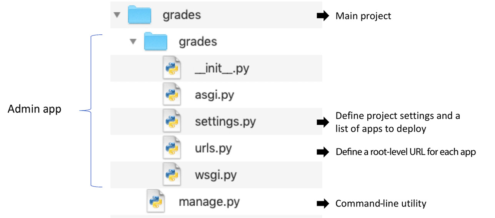
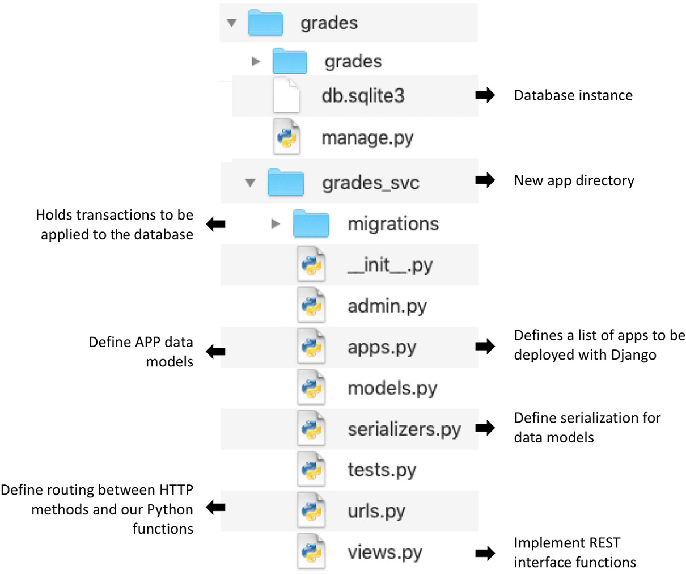

多年来，构建为单层软件的单体应用程序一直是开发应用程序的流行选择。然而，在资源的预留和利用方面，在云平台上部署单体应用效率不高。这甚至适用于在物理机上部署大规模单体应用程序。此类应用程序的维护和开发成本总是很高。多层应用程序通过将应用程序分解为若干层，在一定程度上解决了 Web 应用程序的这个问题。
为了满足动态资源需求并降低开发/维护成本，真正的救星是微服务架构。这种新架构鼓励应用程序构建在松散耦合的服务上，并部署在容器等动态可扩展平台上。亚马逊、Netflix 和 Facebook 等组织已经从单体模型转向基于微服务的架构。如果没有这种变化，这些组织就无法为大量客户提供服务。
我们将在本章中讨论以下主题：

- 介绍微服务
- 学习微服务最佳实践
- 构建基于微服务的应用程序

完成本章后，您将了解微服务，并能够基于微服务构建应用程序。

## 技术要求

以下是本章的技术要求：

- 您需要在您的计算机上安装 Python 3.7 或更高版本。
- 带有 RESTful 扩展的 Python Flask 库安装在 Python 3.7 或更高版本之上。
- Python Django 与 Django Rest Framework 库位于 Python 3.7 或更高版本之上。
- 您需要有一个 Docker 注册表帐户并在您的机器上安装 Docker Engine 和 Docker Compose。
- 要在 GCP Cloud Run 中部署微服务，您需要一个 GCP 帐户（免费试用即可）。

本章的示例代码可以在 https://github.com/PacktPublishing/Python-for-Geeks/tree/master/Chapter11 找到。
我们将从引入微服务开始我们的讨论。

## 介绍微服务

微服务是一个独立的软件实体，必须具有以下特征：

- 与其他服务松散耦合，不依赖其他软件组件
- 小团队易于开发和维护，无需依赖其他团队
- 可作为独立实体独立安装，最好在容器中
- 使用同步协议（如 REST API）或异步协议（如 Kafka 或 RabbitMQ）提供易于使用的接口

被称为微服务的软件方面的关键字是可独立部署、松散耦合且易于维护的。每个微服务都可以拥有自己的数据库服务器，以避免与其他微服务共享资源。这将确保消除微服务之间的依赖关系。
微服务架构风格是一种软件开发范式，用于开发使用纯微服务的应用程序。这种架构甚至包括应用程序的主要接口实体，例如 Web 应用程序。下面是一个基于微服务的应用程序示例：


在这个示例应用程序中，我们有单独的微服务，例如授权服务、产品目录服务和产品库存服务。我们构建了一个 Web 应用程序，也是一个微服务，它通过 REST API 使用三个单独的微服务。对于移动客户端，可以通过 API 网关使用相同的单个微服务构建移动应用程序。我们可以看到微服务架构的一个直接优势，即可重用性。使用微服务的其他一些优势如下：

- 在选择适合任何个人微服务要求的任何技术和任何编程语言时，我们都很灵活。如果我们可以使用 API 接口公开它，我们甚至可以重用用任何语言编写的遗留代码。
- 我们可以由小型独立团队开发、测试和维护单个微服务。拥有独立自主的小团队对于开发大规模应用至关重要。
- 单体应用程序的挑战之一是管理冲突的库版本，由于单个应用程序中捆绑了不同的功能，我们被迫将其包含在内。使用微服务，这些库的版本发生冲突的可能性被最小化。
- 我们可以独立部署和修补各个微服务。这使我们能够将持续集成/持续交付 (CI/CD) 用于复杂的应用程序。当我们需要应用补丁或升级应用程序的一项功能时，这也很重要。对于单体应用程序，我们将重新部署整个应用程序，这意味着有机会破坏应用程序的其他部分。使用微服务，只会重新部署一两个服务，而不会破坏其他微服务中的任何其他内容。
- 我们可以在微服务级别而不是应用程序级别隔离故障和故障。如果一项服务出现故障或故障，我们可以对其进行调试、修复、修补或停止以进行维护，而不会影响应用程序的其余功能。在单体应用程序的情况下，一个组件中的问题可能会导致整个应用程序崩溃。

尽管有几个优点，但使用微服务架构风格也有一些缺点：

- 首先是创建基于微服务的应用程序的复杂性增加。复杂性主要源于这样一个事实，即每个微服务都必须公开一个 API，而消费者服务或程序必须使用 API 与微服务进行交互。每个微服务基础上的安全性是造成复杂性的另一个因素。
- 第二个缺点是与单体应用程序相比增加了资源需求。每个微服务都需要额外的内存来独立托管在容器或虚拟机中，即使它是 Java 虚拟机 (JVM)。
- 第三个缺点是需要额外的努力来调试和排除可能部署在不同容器或系统中的不同微服务之间的问题。
    接下来，我们将研究构建微服务的最佳实践。

## 学习微服务最佳实践

在启动一个新应用程序时，我们应该问自己的首要问题是微服务架构是否合适。首先是对应用程序需求的分析以及将需求划分为独立组件的能力。如果您发现您的组件经常相互依赖，这表明组件的隔离可能需要重新工作，或者该应用程序可能不适合微服务架构。
在应用程序的早期阶段做出是否使用微服务的决定很重要。有一种学派认为最好开始使用单体架构构建应用程序，以避免一开始微服务的额外成本。然而，这不是一种可取的方法。一旦我们构建了单体应用程序，就很难将其转换为微服务架构，特别是如果应用程序已经投入生产。亚马逊和 Netflix 等公司已经做到了，但他们将其作为技术发展的一部分，当然，他们拥有进行这种转型的人力和技术资源。
一旦我们决定使用微服务构建下一个应用程序，以下最佳实践将指导您做出设计和部署决策：
- 独立且松散耦合：这些需求是微服务定义的一部分。每个微服务都应该独立于其他微服务构建，并尽可能松散耦合。
- 领域驱动设计（DDD）：微服务架构的目的不是拥有尽可能多的小型微服务。我们需要始终记住，每个微服务都有其开销成本。我们应该根据业务或领域的需要构建尽可能多的微服务。我们建议考虑 Eric Evans 在 2004 年引入的 DDD。
如果我们尝试将 DDD 应用于微服务，建议首先进行战略设计，通过组合相关业务领域及其子领域来定义不同的上下文。战略设计之后可以进行战术设计，重点是将核心领域分解为细粒度的构建块和实体。此细分将提供明确的指导方针，将需求映射到可能的微服务。
- 通信接口：我们应该使用定义良好的微服务接口，最好是 REST API 或事件驱动的 API，用于通信。微服务应避免直接相互调用。
- 使用 API 网关：微服务及其消费者应用程序应使用 API 网关与各个微服务进行交互。 API 网关可以开箱即用地处理安全方面，例如身份验证和负载平衡。此外，对于新版本的微服务，我们可以使用 API 网关将客户端请求重定向到新版本，而不会影响客户端软件。
- 限制技术栈：虽然微服务架构允许在每个服务的基础上使用任何编程语言和框架，但在没有任何业务或可重用性原因的情况下，不建议使用不同的技术开发微服务。出于学术原因，多样化的技术堆栈可能很有吸引力，但它会给应用程序的维护和故障排除带来操作复杂性。
- 部署模型：在容器中部署微服务不是强制性的，但建议这样做。容器带来了许多内置功能，例如自动化部署、跨平台支持和互操作性。此外，通过使用容器，我们可以根据服务的要求将资源分配给服务，并确保资源在不同微服务之间的公平分配。
- 版本控制：我们应该为每个微服务使用单独的版本控制系统。
- 团队组织：微服务架构提供了在每个微服务的基础上拥有专门团队的机会。在为大型项目组织团队时，我们应该牢记这一原则。团队的规模应该基于两个比萨饼的理念，即我们应该建立一个团队，其中的工程师数量应该能被两个大比萨饼养活。一个团队可以根据其复杂性拥有一个或多个微服务。
- 集中日志记录/监控：如前所述，对微服务架构风格的应用程序中的问题进行故障排除可能非常耗时，尤其是当微服务在容器中运行时。我们应该使用开源或专业工具来监控和排除微服务故障，以降低此类运营成本。此类工具的一些示例是 Splunk、Grafana、Elk 和 App Dynamics。

既然我们已经介绍了微服务的介绍和最佳实践，接下来，我们将深入学习如何使用微服务构建应用程序。

## 构建基于微服务的应用程序
在进入微服务的实现细节之前，分析几个微服务框架和部署选项很重要。我们将从 Python 中可用的微服务框架开始。

### 在 Python 中学习微服务开发选项

在 Python 中，我们有大量可用于微服务开发的框架和库。我们无法列举所有可用的选项，但值得强调的是最受欢迎的选项和具有不同功能集的选项。这些选项如下所述：

- Flask：这是一个轻量级框架，可用于构建基于 Web 服务网关接口 (WSGI) 的微服务。请注意，WSGI 基于请求-响应同步设计模式。在第 10 章，使用 Python 进行 Web 开发和 REST API 中，我们已经使用 Flask 及其 RESTful 扩展来构建 REST API 应用程序。由于 Flask 是一种流行的 Web 和 API 开发框架，因此对于许多已经在使用 Flask 的开发人员来说，它是一个易于采用的选择。
- Django：Django 是另一个流行的 Web 框架，拥有庞大的开发人员社区。借助其 Django Rest Framework (DRF)，我们可以使用 REST API 接口构建微服务。 Django 提供基于 WSGI 和异步服务网关接口 (ASGI) 的微服务。 ASGI 被认为是 WSGI 接口的继承者。如果您对基于 Asyncio 开发应用程序感兴趣，ASGI 是一个很好的选择，我们在第 7 章多处理、多线程和异步编程中详细讨论了这个主题。
- Falcon：这也是继 Flask 和 Django 之后流行的 Web 框架。它没有内置 Web 服务器，但它针对微服务进行了很好的优化。与 Django 一样，它同时支持 ASGI 和 WSGI。
- Nameko：这个框架是专门为 Python 中的微服务开发而设计的，并不是一个 Web 应用程序框架。 Nameko 内置了对远程过程调用 (RPC)、异步事件和基于 WebSocket 的 RPC 的支持。如果您的应用程序需要任何这些通信接口，您应该考虑 Nameko。
- Bottle：这是一个基于 WSGI 的超轻量级微服务框架。整个框架基于单个文件，并且仅利用 Python 标准库进行操作。
- Tornado：它基于非阻塞网络 I/O。 Tornado 可以以极低的开销处理高流量。这也是长轮询和基于 WebSocket 的连接的合适选择。

对于示例微服务的开发，我们可以使用前面提到的任何框架。但是我们将使用 Flask 和 Django 有两个原因。首先，这两个最常用于开发 Web 应用程序和微服务。其次，我们将重用我们在前一章中开发的示例 API 应用程序。将使用 Django 开发一个新的微服务，它将说明如何使用 Django 进行 Web 和 API 开发。
接下来，我们将讨论微服务部署选项。

### 介绍微服务的部署选项

一旦我们编写了微服务，下一个问题就是如何将它们部署为一个孤立的独立实体。为便于讨论，我们假设微服务是使用 HTTP/REST 接口构建的。我们可以将所有微服务与不同的 Web 应用程序部署在同一 Web 服务器上，或者为一项微服务托管一台 Web 服务器。单独 Web 服务器中的一个微服务可以部署在一台机器（物理或虚拟）或单独的机器上，甚至单独的容器上。我们在下图中总结了所有这些不同的部署模型：


图 11.2 所示的四种部署模型描述如下：

- 模型 A：在这个模型中，我们在同一个 Web 服务器上部署了四个不同的微服务。在这种情况下，微服务很有可能在单个 Web 服务器上共享库。这可能会导致库冲突，并且不是部署微服务的推荐模型。
- 模型 B：对于这个模型，我们在一台机器上部署了四个微服务，但每个 Web 服务器使用一个微服务，使它们独立。此模型适用于开发环境，但可能不适用于生产规模。
- 模型 C：该模型使用四个虚拟机来托管四个不同的微服务。每台机器仅托管一个带有 Web 服务器的微服务。如果无法使用容器，此模型适用于生产。此模型的主要警告是由于每个虚拟机将带来的资源开销而产生的额外成本。
- 模型 D：在这个模型中，我们将每个微服务作为一个容器部署在一台机器上或跨多台机器上。这不仅具有成本效益，而且还提供了一种符合微服务规范的简单方法。只要可行，这是推荐的模型。

我们分析了不同的部署模型，以了解哪个选项比其他选项更合适。为了开发基于微服务的示例应用程序，我们将混合使用基于容器的微服务和仅托管在 Web 服务器上的微服务。这种混合模型说明我们可以在技术上使用任何选项，尽管基于容器的部署是推荐的。稍后，我们将把我们的一个微服务带到云端来演示微服务的可移植性。
在讨论了微服务的开发和部署选项之后，是时候开始使用下一节中的两个微服务构建应用程序了。

### 开发一个基于微服务的示例应用程序

对于示例应用程序，我们将使用 Flask 和 Django 框架开发两个微服务和一个 Web 应用程序。我们的示例应用程序将是对在上一章中作为案例研究开发的 Student Web 应用程序的扩展。应用程序架构将如下所示：


为了开发这个示例应用程序，我们将开发以下组件：

- 使用 Django 框架构建一个新的 Grades 微服务，并使用 Docker 引擎进行部署。 Docker Engine 是一个开源软件，用于容器化我们的应用程序。 Grades 微服务将提供有关每个年级的附加信息，例如建筑物名称和班级教师姓名，并且这些属性不会与 Students 微服务下的 Student 模型一起存储。
- 重用上一章中的 apiapp 应用程序。对于此示例应用程序，它被命名为 Students 微服务。此应用程序/模块的代码不会有任何变化。
- 我们将更新上一章案例研究中的 webapp 应用程序，以使用 Grades 微服务并为每个 Student 对象添加额外的 Grade 属性。这也需要对 Jinja 模板进行小幅更新。

我们将从使用 Django 构建 Grades 微服务开始。

### 创建成绩微服务

要使用 Django 开发微服务，我们将使用 Django Rest Framework (DRF)。 Django 使用其 Web 框架中的各种组件来构建 REST API 和微服务。因此，本开发练习还将为您提供有关使用 Django 开发 Web 应用程序的高级概念。
由于我们从 Flask 开始，并且已经熟悉了 Web 开发的核心 Web 概念，因此我们开始使用 Django 将是一个方便的过渡。现在让我们了解所涉及的步骤：

1. 首先，我们将创建一个项目目录或在我们最喜欢的具有虚拟环境的 IDE 中创建一个新项目。如果您没有使用 IDE，您可以使用以下命令在您的项目目录下创建并激活一个虚拟环境：
    ```python
    python -m venv myenv
    source myenv/bin/activate
    ```
    对于任何 Web 应用程序，为每个应用程序创建一个虚拟环境至关重要。对库依赖项使用全局环境可能会导致此类错误难以排除。
    
2. 要构建 Django 应用程序，我们至少需要两个可以使用以下 pip 命令安装的库：
    ```python
    pip install django
    pip install django-rest-framework
    ```
    
3. 一旦我们安装了 Django，我们就可以使用 django-admin 命令行实用程序来创建一个 Django 项目。接下来显示的命令将为我们的微服务创建一个 Django 成绩项目：
    ```python
    django-admin startproject grades
    ```
    此命令将在 grades 目录下创建一个管理 web 应用程序，并将一个 manage.py 文件添加到我们的项目中。管理 Web 应用程序包括内置 Web 服务器启动脚本、设置文件和 URL 路由文件。 manage.py 也是一个命令行实用程序，就像 django-admin，它提供了类似的功能，但在 Django 项目的上下文中。当我们新建一个 Django 项目时，项目目录的文件结构将如下所示：
    
    如图 11.4 所示，settings.py 文件包含一个项目级别的设置，其中包括要与 Web 服务器一起部署的应用程序列表。 urls.py 文件包含不同部署应用程序的路由信息。目前，此文件中仅包含管理应用程序。 asgi.py 和 wsgi.py 可用于启动 ASGI 或 WSGI Web 服务器，使用哪个选项在 settings.py 文件中设置。

4. 下一步是在主成绩项目目录下使用以下命令创建一个新的 Django 应用程序（我们的成绩微服务）：
    ```python3 manage.py startapp grades_svc```
    这个命令将在一个单独的目录中创建一个新的应用程序（带有 web 组件），与我们给这个命令的名字相同，grades_svc。这还将创建一个默认的 SQLite3 数据库实例。 settings.py 文件中提供了使用默认 SQLite3 数据库的选项，但如果我们决定使用任何其他数据库，则可以更改它。
    
5. 除了在grades_svc 目录中自动创建的文件之外，我们还将添加另外两个文件——urls.py 和serializers.py。带有两个附加文件的完整项目目录结构如图 11.5 所示。与我们的项目相关的不同文件的作用也在此图中详细说明：
    
    
6. 接下来，我们将在这些文件中一一添加我们的微服务所需的代码。我们将通过扩展 Django 数据库模型包中的 Model 类来定义我们的 Grade 模型类。 models.py文件的完整代码如下：
    ```python
    from django.db import models
    class Grade(models.Model):
        grade_id = models.CharField(max_length=20)
        building = models.CharField(max_length=200)
        teacher = models.CharField(max_length=200)
        def __str__(self):
            return self.grade_id
    ```
    
7. 为了使我们的模型在管理应用仪表板中可见，我们需要在 admin.py 文件中注册我们的模型 Grade 类，如下所示：
    ```python
    from django.contrib import admin
    from .models import Grade
    admin.site.register(Grade)
    ```
    
8. 接下来，我们将实现一个从数据库中检索 Grade 对象列表的方法。我们将通过在 views.py 文件中扩展 ViewSet 添加一个 GradeViewSet 类，如下所示：
   
    ```python
    from rest_framework import viewsets, status
    from rest_framework.response import Response
    from .models import Grade
    from .serializers import GradeSerializer
    class GradeViewSet(viewsets.ViewSet):
        def list(self, request):
            grades_list = Grade.objects.all()
            serializer = GradeSerializer(grades_list, many=True)
            return Response(serializer.data)
         def create(self, request):
             pass:
         def retrieve(self, request, id=None):
             pass:
    ```

请注意，为了我们微服务的完整性，我们还在实际实现中添加了添加新 Grade 对象和根据其 ID 获取 Grade 对象的方法。我们仅显示列表方法，因为这是与我们的示例应用程序相关的唯一方法。同样重要的是要强调视图对象应该作为类来实现，我们应该避免将应用程序逻辑放在视图对象中。

一旦我们在 grades_svc 应用程序下实现了我们的核心方法，我们就会将我们的应用程序添加到 Django 项目中进行部署，并在应用程序和 API 级别添加路由：

1. 首先，我们将我们的 grades_svc 应用程序和 rest-framework 添加到 settings.py 文件中的 INSTALLED_APPS 列表中，如下所示：
    ```python
    INSTALLED_APPS = [
        'django.contrib.admin',
        'django.contrib.auth',
        'django.contrib.contenttypes',
        'django.contrib.sessions',
        'django.contrib.messages',
        'django.contrib.staticfiles',
        'grades_svc',
        'rest_framework',
    ]
    ```
    开发人员常犯的一个错误是不断将新组件添加到单个设置文件中，这对于大型项目来说很难维护。 最佳做法是将文件拆分为多个文件并在主设置文件中加载它们。
2. 这也将确保我们的应用程序在管理应用程序中可见。 下一步是在管理应用程序级别添加 URL 配置，然后在应用程序级别添加。 首先，我们将在管理应用程序下的 urls.py 文件中为我们的应用程序添加 URL，如下所示：
    ```python
    urlpatterns = [
        path('admin/', admin.site.urls),
        path('', include('grades_svc.urls')),
    ]
    ```
    在管理应用程序的 urls.py 文件中，我们将每个请求重定向到我们的微服务，除了 admin/ URL 附带的请求。
3. 下一步是根据不同的 HTTP 方法在我们的应用程序中设置路由。 这需要我们使用以下路由定义将 urls.py 文件添加到我们的 grades_svc 目录中：
    ```python
    from django.urls import path
    from .views import GradeViewSet
    urlpatterns = [
        path(grades/', GradeViewSet.as_view({
            'get':'list', #relevant for our sample application
            'post':'create'
            })),
        path('grades/<str:id>', GradeViewSet.as_view({
            'get': 'retrieve'
        }))
    ]
    ```
在此文件中，我们将带有成绩/ URL 的 HTTP 请求的 GET 和 POST 方法附加到列表中，并创建我们之前在 views.py 文件中实现的 GradeViewSet 类的方法。 类似地，我们将带有 Grades/<str:id> URL 的 GET 请求附加到 GradeViewSet 类的检索方法。 通过使用此文件，我们可以向 Python 函数/方法添加额外的 URL 映射。
我们的 Grades 微服务的实现到此结束。 下一步是在 Django Web 服务器下运行此服务进行验证。 但是在运行服务之前，我们将确保将模型对象传输到数据库。 这相当于在 Flask 的情况下初始化数据库。 在 Django 的情况下，我们运行以下两个命令来准备更改然后执行它们：
```python
python3 manage.py makemigrations
python3 manage.py migrate
```
通常，开发人员会错过这一重要步骤并在尝试启动应用程序时出错。 因此，请确保在使用以下命令启动 Web 服务器之前执行所有更改：
```python
python3 manage.py runserver
```
这将在我们本地主机上的默认端口 8000 上启动 Web 服务器。 请注意，可以在 settings.py 文件中更改默认设置，包括具有主机和端口属性的数据库和 Web 服务器。 此外，我们建议使用以下命令为管理应用程序设置用户帐户：
```python
python3 manage.py createsuperuser
```
此命令将提示您为管理员帐户选择用户名、电子邮件地址和密码。一旦我们的微服务按预期执行功能，就可以将其捆绑在容器中并将其作为容器应用程序运行。这将在下一节中解释。

### 容器化微服务

容器化是一种操作系统虚拟化，其中应用程序在其独立的用户空间中运行，但共享相同的操作系统。这个单独的用户空间称为容器。 Docker 是最流行的平台，用于创建、管理和运行作为容器的应用程序。 Docker 仍然占有 80% 以上的市场份额，但还有其他容器运行时，如 CoreOS rkt、Mesos、lxc 和 containerd。在使用 Docker 容器化我们的微服务之前，我们将快速回顾一下 Docker 平台的主要组件：
- Docker Engine：这是用于构建、打包和运行基于容器的应用程序的核心 Docker 应用程序。
- Docker 镜像：Docker 镜像是用于在容器环境中运行应用程序的文件。使用 Docker Engine 开发的应用程序存储为 
- Docker 镜像，这些镜像是应用程序代码、库、资源文件以及应用程序执行所需的任何其他依赖项的集合。
- Docker Hub：这是一个 Docker 镜像的在线存储库，用于在您的团队内以及与社区共享。 Docker Registry 是在同一上

下文中使用的另一个术语。 Docker Hub 是管理 Docker 镜像存储库的 Docker 注册中心的正式名称。
Docker Compose：这是一个使用基于 YAML 的文件而不是使用 Docker 引擎的 CLI 命令来构建和运行容器应用程序的工具。 Docker Compose 提供了一种简单的方法来部署和运行具有配置属性和依赖项的多个容器。因此，我们将推荐使用 Docker Compose 或类似技术来构建和运行您的容器。
要使用 Docker Engine 和 Docker Compose，您需要在 Docker 注册表中拥有一个帐户。此外，在开始以下步骤之前，您必须在您的机器上下载并安装 Docker Engine 和 Docker Compose：

1. 作为第一步，我们将使用 pip freeze 命令文件创建我们的项目依赖项列表，如下所示：
    ```python
    pip freeze -> requirements.txt
    ```
    此命令将创建依赖项列表并将它们导出到 requirements.txt 文件。 Docker 引擎将使用此文件在 Python 解释器之上的容器内下载这些库。 我们项目中这个文件的内容如下：
    ```bash
    asgiref==3.4.1
    Django==3.2.5
    django-rest-framework==0.1.0
    djangorestframework==3.12.4
    pytz==2021.1
    sqlparse==0.4.1
    ```
2. 在下一步中，我们将构建 Dockerfile。 Docker 引擎也将使用此文件来创建容器的新映像。 在我们的例子中，我们将以下行添加到这个文件中：
    ```dockerfile
    FROM python:3.8-slim
    ENV PYTHONUNBUFFERED 1
    WORKDIR /app
    COPY requirements.txt /app/requirements.txt
    RUN pip install -r requirements.txt
    COPY . /app
    CMD python manage.py runserver 0.0.0.0:8000
    ```
    这个文件的第一行是为这个容器设置基础镜像，我们将它设置为 Python:3.8-slim，它已经在 Docker 存储库中可用。 文件中的第二行是设置环境变量以更好地记录日志。 其余的行是不言自明的，因为它们主要是 Unix 命令。
3. 下一步，我们将创建一个 Docker Compose 文件 (docker-compose.yml)，如下所示：
    ```dockerfile
    version: '3.7'
    services:
      gradesms:
        build:
          context: .
          dockerfile: Dockerfile
        ports:
          - 8000:8000
        volumes:
         - .:/app
    ```
    这是一个 YAML 文件，我们将容器定义为其中的服务。 由于我们只有一个容器，因此我们定义了 gradesms 服务。 请注意，构建指向我们刚刚创建的 Dockerfile，并假设它与这个 docker-compose.yml 文件位于同一目录中。 容器端口 8000 映射到 Web 服务器端口 8000。这是允许从容器到容器内应用程序的流量的重要步骤。
4. 作为最后一步，我们将当前目录 (.) 挂载到容器内的 /app 目录。 这将允许在我们的系统上所做的更改反映在容器中，反之亦然。 如果您在开发周期中创建容器，则此步骤很重要。
我们可以使用以下 Docker Compose 命令来启动我们的容器：
    ```
    docker-compose up
    ```
这是第一次，它将构建一个新的容器镜像，并且需要访问互联网才能从 Docker 注册表下载基本容器镜像。创建容器镜像后，会自动启动容器。
Docker Engine 和 Docker Compose 如何工作的详细信息超出了本书的范围，但我们建议您通过他们的在线文档 (https://docs.docker.com/) 熟悉容器技术，例如 Docker。

### 重用我们的学生 API 应用程序

我们将重用我们在上一章中开发的学生 API 应用程序。此应用程序将以其内置服务器启动，我们将其命名为我们示例应用程序的 Students 微服务。此应用程序不会有任何更改。

### 更新我们的学生网络应用程序

我们在上一章中为案例研究开发的 webapp 应用程序仅通过 REST API 使用 apiapp。在此 Web 应用程序的修订版中，我们将使用 Grades 微服务和 Students 微服务来获取 Grade 对象列表和 Student 对象列表。我们的 web 应用程序中的 list 函数将组合两个对象列表，为 web 客户端提供额外的信息。 webapp.py 文件中更新后的列表函数如下：

```python
STUDENTS_MS = http://localhost:8080/students
GRADES_MS   = "http://localhost:8000/grades"
@app.get('/')
def list():
    student_svc_resp = requests.get(STUDENTS_MS)
    students = json.loads(student_svc_resp.text)
    grades_svc_resp = requests.get(GRADES_MS)
    grades_list = json.loads(grades_svc_resp.text)
    grades_dict = {cls_item['grade']: cls_item for cls_item in grades_list}
    for student in students:
        student['building'] = grades_dict[student['grade']]['building']
        student['teacher'] = grades_dict[student['grade']]['teacher']
    return render_template('main.html', students=students)
```

在这个修订后的代码中，我们使用来自 Grades 对象列表的字典理解创建了一个成绩字典。 该字典将用于在 Student 对象中插入成绩属性，然后将它们发送到 Jinja 模板进行渲染。 在我们的主要 Jinja 模板 (main.html) 中，我们向学生表中添加了两个额外的列 Building 和 Teacher，如下所示：


在本节中，我们介绍了创建微服务、将其部署为 Docker 容器以及 Web 服务器上的 Web 应用程序，以及将两个微服务的结果组合为 Web 应用程序。

### 将学生微服务部署到 GCP Cloud Run

到目前为止，我们已经将 Students 微服务用作 Web 应用程序，并在 Flask 开发服务器中托管了 REST API。 现在是将其容器化并将其部署到 Google Cloud Platform (GCP) 的时候了。 GCP 有一个运行时引擎 (Cloud Run)，用于部署容器并将它们作为服务（微服务）运行。 以下是涉及的步骤：

1. 要将我们的 Students 微服务的应用程序代码打包到一个容器中，我们将首先确定一个依赖项列表并将它们导出到一个 requirements.txt 文件中。 我们将从 Students 微服务项目的虚拟环境中运行以下命令：
    ```
    pip freeze -> requirements.txt
    ```
2. 下一步是在项目的根目录中构建一个 Dockerfile，就像我们为 Grades 微服务准备的那个。Dockerfile 的内容如下：
    ```dockerfile
    FROM python:3.8-slim
    ENV PYTHONUNBUFFERED True
    WORKDIR /app
    COPY . ./
    #Install production dependencies.
    RUN pip install -r requirements.txt
    RUN pip install Flask gunicorn
    # Run the web service on container startup. we will use
    # gunicorn and bind our api_app as the main application
    CMD exec gunicorn --bind:$PORT --workers 1 --threads 8 api_app:app
    ```
    要在 GCP Cloud Run 上部署我们的应用程序，Dockerfile 就足够了。 但首先，我们需要使用 GCP Cloud SDK 构建容器映像。 这将要求我们使用 Cloud SDK 或 GCP Console 创建 GCP 项目。 我们在前面的章节中解释了创建 GCP 项目并将结算帐号与其关联的步骤。 我们假设您已经在 GCP 上创建了一个名为 Students-run 的项目。
3. 项目准备就绪后，我们可以使用以下命令构建学生 API 应用程序的容器映像：
    ```gcloud builds submit --tag gcr.io/students-run/students```
    请注意，gcr 代表 Google Container Registry。
4. 要创建图像，我们必须以以下格式提供标签属性：
```<hostname>/<Project ID>/<Image name>```
5. 在我们的例子中，主机名是 gcr.io，它位于美国。 我们也可以使用本地创建的图像，但我们必须首先按照上述格式设置标签属性，然后将其推送到 Google 注册表。 这可以通过以下 Docker 命令来实现：
    ```
    docker tag SOURCE_IMAGE <hostname>/<Project ID>/<Image name>:tagid
    docker push <hostname>/<Project ID>/<Image name>
    #or if we want to push a specific tag
    docker push <hostname>/<Project ID>/<Image name>:tag
    ```
    可以看到，gcloud build 命令可以在一个命令中实现两步。
6. 下一步是运行上传的图像。我们可以使用以下 Cloud SDK 命令运行我们的容器映像：
    ```gcloud run deploy --image gcr.io/students-run/students```
    我们的图像的执行也可以从 GCP 控制台触发。成功部署并运行容器后，此命令（或 GCP 控制台上）的输出将包含我们微服务的 URL。

为了从 GCP Cloud Run 使用这个新版本的 Students 微服务，我们将更新我们的 Web 应用程序以切换到使用 GCP Cloud Run 中这个新部署的服务的 URL。如果我们使用本地部署的 Grades 微服务和远程部署的 Students 微服务测试我们的 Web 应用程序，我们将获得与前面图 11.6 所示相同的结果，并且可以像在本地部署 Students 微服务时一样执行所有操作。
我们对使用不同 Python 框架构建微服务、在本地和云中部署它们以及从 Web 应用程序使用它们的讨论到此结束。

## 概括

在本章中，我们介绍了微服务架构并讨论了它的优缺点。我们介绍了构建、部署和操作微服务的几个最佳实践。我们还分析了 Python 中可用于构建微服务的开发选项，包括 Flask、Django、Falcon、Nameko、Bottle 和 Tornado。我们选择了 Flask 和 Django 来构建示例微服务。为了实现新的微服务，我们使用了 Django 及其 REST 框架 (DRF)。此微服务实现还向您介绍了 Django 框架的一般工作方式。稍后，我们提供了有关如何使用 Docker Engine 和 Docker Compose 容器化新创建的微服务的详细信息。最后，我们将我们的 Students API 应用程序转换为 Docker 映像并将其部署在 GCP Cloud Run 上。我们更新了 Students Web 应用程序以使用部署在世界不同地区的两个微服务。
本章包含的代码示例将为您提供针对不同环境构建和部署微服务的实践经验。这些知识对于希望在下一个项目中构建微服务的任何人都是有益的。在下一章中，我们将探讨如何使用 Python 开发无服务器功能，这是云软件开发的另一种新范式。

## 问题

我们可以在没有容器的情况下部署微服务吗？
两个微服务共享一个数据库但具有不同的架构是否合适？
什么是 Docker Compose，它如何帮助部署微服务？
REST 是微服务数据交换的唯一格式吗？

## 进一步阅读

用于使用 Python 的微服务 Docker 实践，作者：Jaime Buelta
Python 微服务开发，作者 Tarek Ziade
领域驱动设计：解决软件核心的复杂性，作者 Eric Evans
用于构建和部署微服务的 Google Cloud Run 快速入门教程，可从 https://cloud.google.com/run/docs/quickstarts/ 获取

## 答案

可以，但建议部署在容器中。
从技术上讲，这是可行的，但不是最佳实践。数据库故障会导致两个微服务宕机。
Docker Compose 是一种使用 YAML 文件部署和运行容器应用程序的工具。它提供了一种简单的格式来定义具有部署和运行时属性的不同服务（容器）。
REST API 是最流行的微服务数据交换接口，但不是唯一的接口。微服务还可以使用 RPC 和基于事件的协议进行数据交换。
