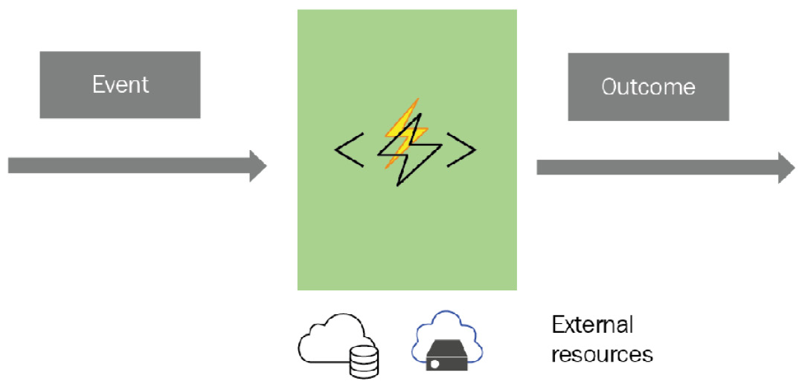
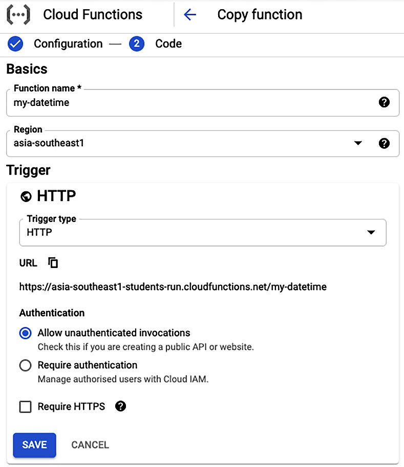
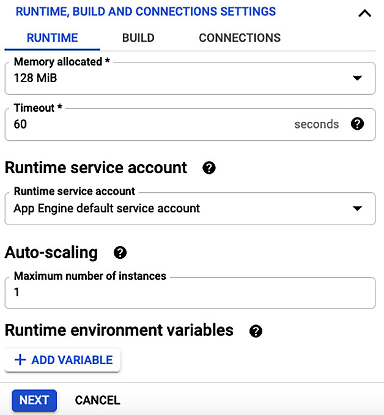
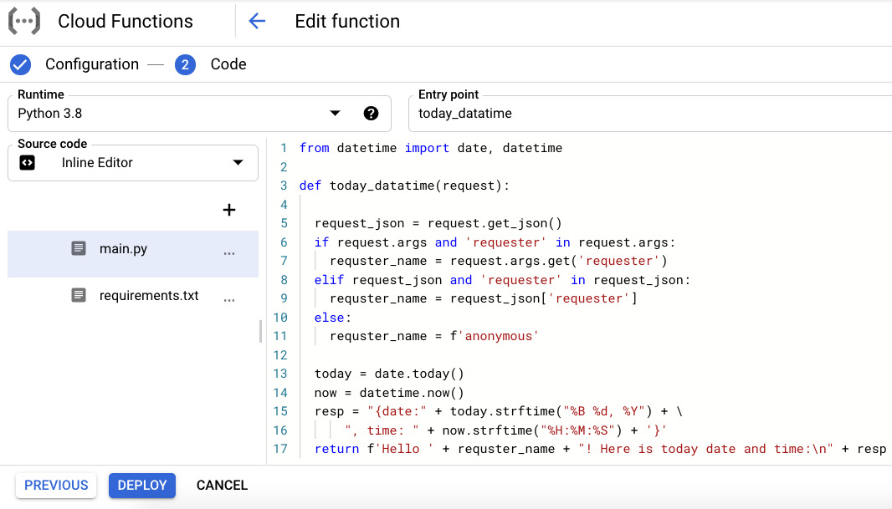
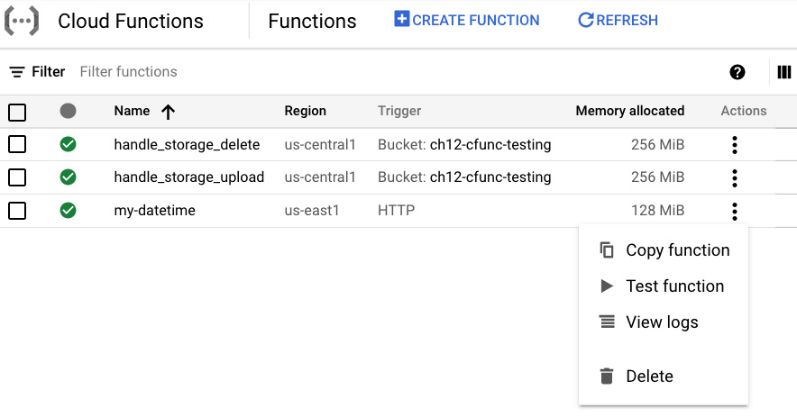
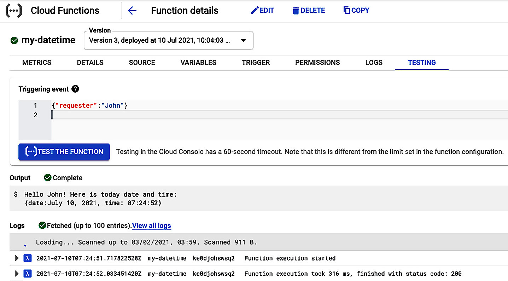
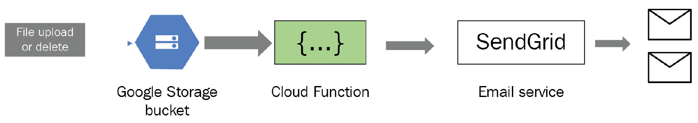

无服务器计算是一种新的云计算模型，它将物理或虚拟服务器和基础设施级软件（例如数据库系统）的管理与应用程序本身分开。该模型允许开发人员专注于应用程序开发，并允许其他人管理底层基础设施资源。云提供商是采用此模型的最佳选择。容器不仅适用于复杂的部署，而且还是无服务器计算时代的突破性技术。除了容器之外，还有另一种形式的无服务器计算，称为功能即服务 (FaaS)。在这种新范式中，云提供商提供了一个平台来开发和运行应用程序功能或无服务器功能，通常是为了响应事件或直接调用这些功能。所有公共云提供商，例如 Amazon、Google、Microsoft、IBM 和 Oracle，都提供此服务。本章的重点是使用 Python 理解和构建无服务器函数。
在本章中，我们将涵盖以下主题：

- 介绍无服务器功能
- 了解无服务器功能的部署选项
- 通过案例研究学习如何构建无服务器功能

完成本章后，您应该清楚了解无服务器函数在云计算中的作用以及如何使用 Python 构建它们。

## 技术要求

以下是本章的技术要求列表：

- 您需要在计算机上安装 Python 3.7 或更高版本。
- 要在 Google Cloud Platform (GCP) Cloud Functions 中部署无服务器函数，您需要一个 GCP 帐户（免费试用版可以正常工作）。
- 您需要一个 SendGrid 帐户（即免费帐户）来发送电子邮件。

本章的示例代码可以在 https://github.com/PacktPublishing/Python-for-Geeks/tree/master/Chapter12 找到。
让我们从无服务器功能的介绍开始。

## 介绍无服务器功能

无服务器功能是一种模型，可用于开发和执行软件组件或模块，而无需了解或担心底层托管平台。这些软件模块或组件在公共云提供商的产品中称为 Lambda 函数或云函数。亚马逊是第一家在其 AWS 平台上提供诸如 AWS Lambda 之类的无服务器功能的供应商。紧随其后的是分别提供 Google Cloud Functions 和 Azure Functions 的 Google 和 Microsoft。
通常，无服务器功能有四个组件，如下所示：



下面对这四个组件进行说明：
功能代码：这是一个编程单元，根据功能的业务或功能目标执行某些任务。例如，我们可以编写一个无服务器函数来处理输入的数据流，或者编写一个计划活动来检查某些数据资源以进行监控。
事件：无服务器功能并不意味着像微服务一样使用。相反，它们旨在基于可由发布/订阅系统中的事件启动的触发器使用，或者它们可以作为基于现场外部事件（例如来自现场传感器的事件）的 HTTP 调用来使用。
结果：当无服务器功能被触发以执行一项工作时，该功能会产生一个输出，它可以是对调用者的简单响应，也可以触发下一个操作以减轻事件的影响。无服务器功能的结果的一个示例是触发另一种云服务，例如数据库服务或向订阅方发送电子邮件。
资源：有时，功能代码必须使用额外的资源来完成其工作，例如，数据库服务或云存储来访问或推送文件。

## 好处

无服务器功能带来了无服务器计算的所有好处，如下所示：

- 易于开发：无服务器功能消除了开发人员的基础设施复杂性，使他们可以专注于程序的功能方面。
- 内置可扩展性：无服务器功能具有内置可扩展性，可随时处理任何流量增长。
- 成本效率：Serverless 功能不仅可以降低开发成本，还可以提供优化的部署和操作模式。通常，这是一种按使用量付费的模式，这意味着您只需为函数执行期间的时间付费。
- 技术不可知：无服务器功能与技术无关。这意味着您可以使用各种不同的云资源以多种编程语言构建它们。

请注意，无服务器功能有一些限制；例如，在构建此类功能时，我们将拥有较少的系统级控制，如果没有系统级访问权限，故障排除可能会很棘手。

## 用例

无服务器功能有多种可能的用途。例如，如果我们在云存储中收到文件上传事件，或者如果我们通过实时流传输数据，我们可以使用此类函数进行数据处理。特别是，无服务器功能可以与物联网 (IoT) 传感器集成。通常，物联网传感器的数量为数千。无服务器功能能够以可扩展的方式处理来自如此大量传感器的请求。移动应用程序可以使用后端服务等功能来执行某些任务或处理数据，而不会危及移动设备资源。无服务器功能在现实生活中的一种实际用途是 Amazon Alexa 产品。不可能将所有技能或智能都放在 Alexa 设备本身中。相反，它使用 Amazon Lambda 函数来完成这些技能。 Alexa 使用 Amazon Lambda 函数的另一个原因是能够根据需求扩展它们。例如，某些功能可能比其他功能更频繁地使用，例如天气查询。
在下一节中，我们将研究用于实现和执行无服务器功能的各种部署选项。

## 了解无服务器功能的部署选项
将公共云上的虚拟机或其他运行时资源用于偶尔访问的应用程序可能不是一个具有商业吸引力的解决方案。在这种情况下，无服务器功能就派上用场了。在这里，云提供商为您的应用程序提供动态管理的资源，并且仅在您的应用程序响应特定事件而执行时向您收费。换句话说，无服务器功能是一种后端计算方法，它是一种按需和即用即付的服务，仅在公共云上提供。我们将介绍在公共云中部署无服务器功能的几个选项，如下所示：

- AWS Lambda：这被认为是任何公共云提供商提供的首批服务之一。 AWS Lambda 函数可以用 Python、Node.js、Java、PowerShell、Ruby、Java、C# 和 Go 编写。可以执行 AWS Lambda 函数以响应事件，例如文件上传到 Amazon S3、来自 Amazon SNS 的通知或直接 API 调用。 AWS Lambda 函数是无状态的。
- Azure Functions：在 AWS Lambda 函数推出近两年后，微软推出了 Azure Functions。这些功能可以附加到云基础设施内的事件。 Microsoft 支持使用 Visual Studio、Visual Studio Code、IntelliJ 和 Eclipse 来构建和调试这些函数。 Azure Functions 可以用 C#、F#、Node.js、PowerShell、PHP 和 Python 编写。此外，Microsoft 提供了 Durable Functions，允许我们在无服务器环境中编写有状态的函数。
- Google Cloud Functions：GCP 提供 Google Cloud Functions 作为无服务器功能。 Google Cloud Functions 可以用 Python、Node.js、Go、.NET、Ruby 和 PHP 编写。与其竞争对手 AWS Lambda 和 Azure Functions 一样，Google Cloud Functions 可以由 HTTP 请求或来自 Google Cloud 基础设施的事件触发。 Google 允许您使用 Cloud Build 来自动测试和部署 Cloud Functions。

除了前三大公共云提供商之外，还有一些其他云提供商提供的产品。例如，IBM 提供基于开源 Apache OpenWhisk 项目的 Cloud Functions。 Oracle 提供基于开源 Fn 项目的无服务器计算平台。使用这些开源项目的美妙之处在于您可以在本地开发和测试您的代码。此外，这些项目允许您将代码从一个云移植到另一个云，甚至无需任何更改即可移植到本地环境部署。
值得一提的是，在无服务器计算中还有一个众所周知的框架，叫做无服务器框架。这不是一个部署平台，而是一个软件工具，可以在本地使用它来构建和打包用于无服务器部署的代码，然后用于将包部署到您最喜欢的公共云之一。无服务器框架支持多种编程语言，例如 Python、Java、Node.js、Go、C#、Ruby 和 PHP。
在下一节中，我们将使用 Python 构建几个无服务器函数。

## 学习如何构建无服务器功能
在本节中，我们将研究如何为公共云提供商之一构建无服务器功能。尽管 Amazon AWS 在 2014 年通过提供 AWS Lambda 函数开创了无服务器函数的先河，但我们将使用 Google Cloud Functions 平台作为示例函数。这样做的原因是我们在前面的章节中已经非常详细地介绍了 GCP，您可以利用相同的 GCP 帐户来部署这些示例功能。但是，我们强烈建议您使用其他平台，特别是如果您打算将来使用它们的无服务器功能。在各种云平台上构建和部署这些功能的核心原则是相同的。
GCP Cloud Functions 提供了多种开发和部署无服务器功能的方法（未来，我们将在 GCP 的上下文中将它们称为 Cloud Functions）。我们将在示例 Cloud Functions 中探索两种类型的事件，其描述如下：
第一个云功能将使用 GCP 控制台从头到尾构建和部署。此云功能将根据 HTTP 调用（或事件）触发。
第二个云功能将作为案例研究的一部分，以构建一个应用程序，该应用程序侦听云基础架构中的事件并采取诸如发送电子邮件之类的操作作为对该事件的响应。本案例研究中使用的云功能将使用云软件开发工具包 (SDK) 构建和部署。
我们将首先使用 GCP Console 构建云函数。

## 使用 GCP Console 构建基于 HTTP 的云函数

让我们从 Google Cloud Function 开发过程开始。我们将构建一个非常简单的 Cloud Functions 函数，它为 HTTP 触发器提供今天的日期和当前时间。请注意，HTTP 触发器是调用 Cloud Function 的最简单方法。首先，我们需要一个 GCP 项目。您可以使用 GCP Console 为此 Cloud Function 或现有 GCP 项目创建新的 GCP 项目。有关如何创建 GCP 项目并将计费帐户与其关联的步骤在第 9 章，面向云的 Python 编程中讨论。准备好 GCP 项目后，构建新的 Cloud Function 的过程分为三个步骤。我们将在以下小节中解释这些步骤。

### 配置 Cloud Function 属性

当我们从 GCP Console 启动 Create Function 工作流时，系统会提示我们提供 Cloud Function 定义，如下所示：



Cloud Function 定义的高级摘要如下所示：

1. 我们提供函数名称（在我们的例子中，这是 my-datetime）并选择 GCP 区域来托管此函数。
2. 我们选择 HTTP 作为我们函数的触发器类型。 为您的函数选择触发器是最重要的一步。 还有其他可用的触发器，例如 Cloud Pub/Sub 和 Cloud Storage。 在撰写本书时，GCP 已添加了一些用于评估目的的触发器。
3. 为简单起见，我们将允许对我们的函数进行未经身份验证的访问。

点击 Save 按钮后，会提示我们输入 RUNTIME, BUILD AND CONNECTIONS SETTINGS，如下图所示：



我们可以提供运行时、构建和连接设置如下：

1. 我们可以保留运行时属性的默认设置，但我们会将为我们的函数分配的内存减少到 128 MiB。我们已将默认服务帐户作为运行时服务帐户与此功能相关联。我们将自动缩放保留为其默认设置，但这可以设置为我们函数的最大实例数。
2. 如果我们有这样的要求，我们可以在 RUNTIME 选项卡下添加运行时环境变量。我们不会为我们的 Cloud Function 添加任何环境变量。
3. 在 BUILD 选项卡下方，有一个选项可以添加 Build 环境变量。我们不会为我们的 Cloud Function 添加任何变量。
4. 在 CONNECTIONS 选项卡下，我们可以保留默认设置，并允许所有流量访问我们的云功能。

设置 Cloud Function 的运行时、构建和连接设置后，下一步将是添加此 Cloud Function 的实现代码。

### 将 Python 代码添加到 Cloud 函数

单击 Next 按钮后，如图 12.3 所示，GCP Console 将为我们提供一个视图来定义或添加函数实现细节，如下面的屏幕截图所示：



可用于添加 Python 代码的选项如下：

- 我们可以选择多个运行时选项，例如 Java、PHP、Node.js 或各种 Python 版本。我们选择 Python 3.8 作为 Cloud Function 的运行时。
- 入口点属性必须是我们代码中函数的名称。 Google Cloud Function 将根据此入口点属性调用我们代码中的函数。
    可以使用右侧的内联编辑器内联添加 Python 源代码；或者，它可以使用本地计算机甚至云存储中的 ZIP 文件上传。我们还可以提供源代码的 GCP Cloud Source 存储库位置。在这里，我们选择使用内联编辑器工具来实现我们的功能。
- 对于 Python，GCP Cloud Functions 平台会自动创建两个文件：main.py 和 requirements.txt。 main.py 文件将包含我们的代码实现，而 requirements.txt 文件应包含我们对第三方库的依赖。
- 内联编辑器工具中显示的示例代码首先检查调用者是否在 HTTP 请求中发送了请求者属性。根据请求者属性值，我们将发送带有今天日期和时间的欢迎消息。我们在第 9 章中使用 Flask Web 应用程序通过两个单独的 Web API 实现了一个类似的代码示例，用于云的 Python 编程，以演示 GCP App Engine 的功能。

一旦我们对 Python 代码感到满意，我们将在 Google Cloud Functions 平台上部署该函数。

### 部署云函数

下一步是使用屏幕底部的部署按钮部署此功能，如图 12.4 所示。 GCP 将立即开始部署该功能，完成此活动可能需要几分钟时间。重要的是要了解 Google Cloud Functions 是使用容器部署的，就像 GCP Cloud Run 上的微服务一样。主要区别在于它们可以使用不同类型的事件调用，并且它们使用即用即付定价模型。
部署函数后，我们可以复制、测试它或从 Cloud Functions 列表中删除它，如下面的屏幕截图所示：



现在，我们将快速向您展示使用 GCP Console 测试和排查我们的云功能是多么方便。一旦我们为新部署的 Cloud Function 选择了 Test function 选项，GCP Console 将为我们提供一个测试页面，类似于图 12.6 中所示的页面，位于 TESTING 选项卡下方。为了测试我们部署的 Cloud Function，我们可以以 JSON 格式传递 requester 属性，如下所示：
```{"requester":"John"}```
点击[…]TEST THE FUNCTION后，我们可以在屏幕底部的Output部分下查看结果和Logs部分下的日志详细信息，如图12.6所示。因为我们为 Cloud Functions 使用 HTTP 触发器，所以我们还可以使用网络浏览器或 CURL 实用程序从互联网上的任何地方对其进行测试。但是，我们必须确保我们的 Cloud Functions 包含 allUsers 作为其具有 Cloud Functions Invoker 角色的成员。这可以在 PERMISSIONS 选项卡下设置。但是，我们不建议在没有为您的 Cloud Function 设置身份验证机制的情况下这样做：



使用 GCP Console 构建简单的 Cloud Function 是一个简单的过程。 接下来，我们将探索 Cloud Functions 实际应用的案例研究。

## 案例研究 - 为云存储事件构建通知应用程序

在本案例研究中，我们将开发一个针对 Google Storage 存储分区上的事件触发的云函数。 收到此类事件后，我们的云功能将向预定义的电子邮件地址列表发送电子邮件作为通知。 此带有 Cloud Function 的通知应用程序的流程如下所示：



请注意，我们可以将 Cloud Function 设置为侦听一个或多个 Google Storage 事件。 Google Cloud Functions 支持以下 Google Storage 事件：

- finalize：在存储桶中添加或替换新文件时创建此事件。
- delete：此事件表示从存储桶中删除文件。这适用于非版本控制存储桶。请注意，实际上并不会删除文件，但如果将存储桶设置为使用版本控制，则会对其进行存档。
- 归档：归档文件时引发此事件。当使用版本控制的存储桶删除或覆盖文件时，会触发存档操作。
- 元数据更新：如果文件的元数据有任何更新，则创建此事件。

从 Google Storage 存储桶接收事件后，Cloud Function 将从作为参数传递给 Cloud Function 的上下文和事件对象中提取属性。然后，云功能将使用第三方电子邮件服务（例如 Twilio 的 SendGrid）发送通知。
作为先决条件，您必须使用 SendGrid (https://sendgrid.com/) 创建一个免费帐户。创建帐户后，您需要在 SendGrid 帐户中至少创建一个发件人用户。此外，您需要在 SendGrid 帐户内设置一个秘密 API 密钥，该密钥可与 Cloud Function 一起使用以发送电子邮件。 Twilio SendGrid 每天免费提供 100 封电子邮件，这对于测试来说已经足够了。
对于本案例研究，我们将在本地为 Cloud Function 编写 Python 代码，然后使用 Cloud SDK 将其部署到 Google Cloud Functions 平台。我们将逐步实现此通知应用程序，如下所示：
我们将创建一个存储桶来附加到我们的 Cloud Function，我们将从这个桶上传或删除文件来模拟我们的 Cloud Function 的事件。我们可以使用以下 Cloud SDK 命令来创建一个新的存储桶：

1. 我们将创建一个存储桶来附加到我们的 Cloud Function，我们将从这个桶上传或删除文件来模拟我们的 Cloud Function 的事件。我们可以使用以下 Cloud SDK 命令来创建一个新的存储桶：
    ```bash
    gsutil mb gs://<bucket name>
    gsutil mb gs://muasif-testcloudfn    #Example bucket   created
    ```
    为了简化这些事件的生成，我们将使用以下 Cloud SDK 命令关闭存储桶上的版本控制：
    ```gsutil versioning set off gs://muasif-testcloudfn```
2. 一旦存储桶准备好，我们将创建一个本地项目目录并使用以下命令设置一个虚拟环境：
    ```bash
    python -m venv myenv
    source myenv/bin/activate
    ```
3. 接下来，我们将使用 pip 实用程序安装 sendgrid Python 包，如下所示：
    ```pip install sendgrid```
4. 一旦我们的第三方库安装完毕，我们将需要创建 requirements.txt 依赖文件，如下所示：
    ```pip freeze -> requirements.txt```
5. 接下来，我们将创建一个新的 Python 文件 (main.py)，其中包含一个 handle_storage_event 函数。此函数将是我们的 Cloud Functions 函数的入口点。此入口点函数的示例代码如下：
    ```python
    #main.py
    from sendgrid import SendGridAPIClient
    from sendgrid.helpers.mail import Mail, Email, To,   Content
    def handle_storage_event(event, context):
      from_email = Email("abc@domain1.com")
      to_emails = To("zyz@domain2.com")
      subject = "Your Storage Bucket Notification"
      content = f"Bucket Impacted:{event['bucket']} \n" + \
                 f"File Impacted: {event['name']} \n " + \
                 f"Event Time: {event['timeCreated']} \n" + \
                 f"Event ID: {context.event_id} \n" + \
                 f"Event Type: {context.event_type}"
      mail = Mail(from_email, to_emails, subject, content)
      sg = SendGridAPIClient()
      response = sg.send(mail)
      print(response.status_code) # for logging purpose
      print(response.headers)
    ```
    在前面的 Python 代码示例中，我们的 handle_storage_event 函数应该接收事件和上下文对象作为输入参数。事件对象是一个包含事件数据的字典。我们可以使用诸如bucket（即bucket名称）、name（即文件名）和timeCreated（即创建时间）等键来访问该对象中的事件数据。上下文对象提供事件的上下文，例如 event_id 和 event_type。此外，我们使用 sendgrid 库准备电子邮件内容，然后将带有事件信息的电子邮件发送到目标电子邮件列表。
6. 一旦我们准备好 Python 代码文件（在我们的例子中，这是 main.py）和 requirements.txt 文件，我们就可以使用以下 Cloud SDK 命令触发部署操作：
    ```python
    gcloud functions deploy handle_storage_create \
    --entry-point handle_storage_event --runtime python38 \
    --trigger-resource gs://muasif-testcloudfn/\
    --trigger-event google.storage.object.finalize
    --set-env-vars SENDGRID_API_KEY=<Your SEND-GRID KEY>
    ```
    我们应该在启用了计费的 GCP 项目下运行此命令，如上一节所述。我们为我们的云函数提供了名称为 handle_storage_create，并且入口点属性设置为 Python 代码中的 handle_storage_event 函数。我们将 trigger-event 设置为 finalize 事件。通过使用 set-env-vars，我们为 SendGrid 服务设置了 SENDGRID_API_KEY。
    deploy 命令将从当前目录打包 Python 代码，根据 requirements.txt 文件准备目标平台，然后将我们的 Python 代码部署到 GCP Cloud Functions 平台。在我们的例子中，我们可以创建一个 .gcloudignore 文件来排除文件和目录，以便 Cloud SDK deploy 命令可以忽略它们。
7. 一旦我们部署了我们的 Cloud Function，我们就可以通过使用 Cloud SDK 命令将本地文件上传到我们的存储桶来测试它，如下所示：
    ```gsutil cp test1.txt gs://muasif-testcloudfn```
    一旦文件复制操作（上传）完成，finalize 事件将触发我们的 Cloud Function 的执行。因此，我们将收到一封包含活动详情的电子邮件。我们还可以使用以下命令检查 Cloud Functions 的日志：
    ```gcloud functions logs read --limit 50```

对于此通知应用程序，我们仅将 Cloud Function 附加到 Finalize 事件。但是，如果还想附加另一种事件类型（例如删除事件）怎么办？好吧，只有一个 Cloud Function 可以附加到一个触发事件。但是请稍等，Cloud Function 是一个部署实体，而不是实际的程序代码。这意味着我们不需要编写或复制我们的 Python 代码来处理另一种类型的事件。我们可以使用相同的 Python 代码创建一个新的 Cloud Function，但对于 Delete 事件，如下所示：
```bash
gcloud functions deploy handle_storage_delete \
--entry-point handle_storage_event --runtime python38 \
--trigger-resource gs://muasif-testcloudfn/ \
--trigger-event google.storage.object.delete
--set-env-vars SENDGRID_API_KEY=<Your SEND-GRID KEY>
```
如果您注意到此版本的 deploy 命令，我们所做的唯一更改是 Cloud Function 的名称和触发器事件的类型。此部署命令将创建一个新的 Cloud Functions 函数，并将与早期的 Cloud Functions 函数并行工作，但将根据不同的事件触发（在这种情况下，这是删除）。
要使用我们新添加的 Cloud Functions 测试删除事件，我们可以使用以下 Cloud SDK 命令从存储桶中删除已上传的文件（或任何文件）：
```gsutil rm gs://muasif-testcloudfn/test1.txt```
我们可以使用相同的 Python 代码为其他存储事件创建更多 Cloud Functions。我们对如何使用 Cloud SDK 为存储事件构建 Cloud Functions 的讨论到此结束。使用 Cloud SDK 讨论的所有步骤也可以使用 GCP Console 实现。

## 概括

在本章中，我们介绍了无服务器计算和 FaaS，然后分析了无服务器功能的主要组成部分。接下来，我们讨论了无服务器功能的主要优势及其缺陷。此外，我们分析了几个可用于构建和部署无服务器函数的部署选项，这些选项包括 AWS Lambda、Azure Functions、Google Cloud Functions、Oracle Fn 和 IBM Cloud Functions。在本章的最后一部分，我们使用 GCP Console 基于 HTTP 触发器构建了一个简单的 Google Cloud Function。然后，我们使用 Cloud SDK 基于 Google 存储事件和 Google Cloud Function 构建了一个通知应用程序。这些无服务器功能是使用 Google Cloud Functions 平台部署的。
本章中包含的代码示例应该为您提供如何使用 GCP Console 和 Cloud SDK 构建和部署 Cloud Functions 的一些经验。这些实践知识对任何希望在无服务器计算领域建立职业生涯的人都有益。
在下一章中，我们将探讨如何将 Python 与机器学习结合使用。

## 问题

无服务器功能与微服务有何不同？
无服务器函数在实际示例中的实际用途是什么？
什么是 Durable 功能，谁提供这些功能？
一个 Cloud Functions 函数可以附加到多个触发器。这是对还是错？

## 进一步阅读

Richard Rose 使用 Google Cloud 进行无服务器计算
Yohan Wadia 掌握 AWS Lambda
Lorenzo Barbieri 和 Massimo Bonanni 掌握 Azure 无服务器计算
用于构建和部署 Cloud Functions 的 Google Cloud Functions 快速入门教程，可从 https://cloud.google.com/functions/docs/quickstarts 获得

## 答案

两者都是无服务器计算的两种不同产品。通常，无服务器功能由事件触发，并基于即用即付模型。相比之下，微服务通常通过 API 调用来使用，而不是基于即用即付模型。
Amazon Alexa 使用 AWS Lambda 函数为其用户提供情报和其他技能。
持久函数是 Microsoft Azure Functions 的扩展，它在无服务器环境中提供有状态的功能。
错误的。一个 Cloud Function 只能附加到一个触发器。
