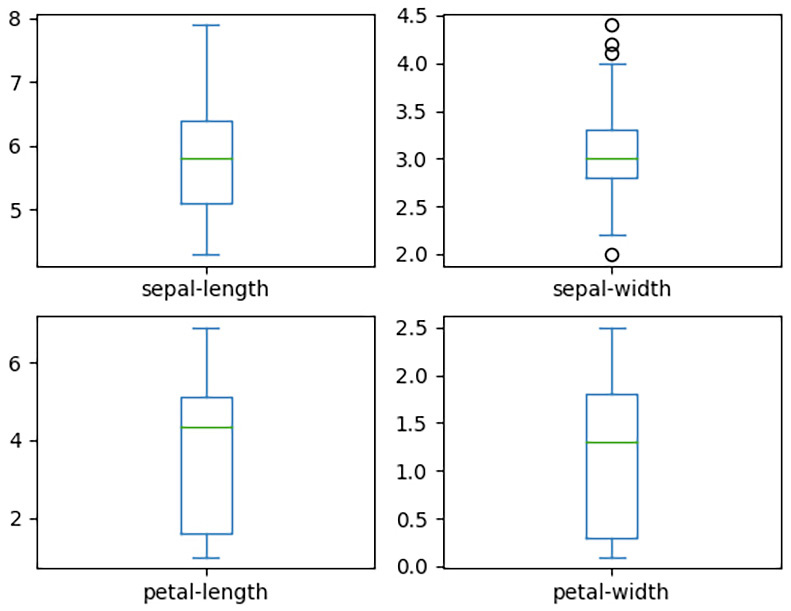

机器学习 (ML) 是人工智能 (AI) 的一个分支，它基于通过从数据中学习模式然后使用这些模型进行预测来构建模型。它是最流行的人工智能技术之一，可以在许多方面帮助人类和企业。例如，它被用于医疗诊断、图像处理、语音识别、预测威胁、数据挖掘、分类以及更多场景。我们都明白机器学习在我们生活中的重要性和用处。 Python 是一种简洁但功能强大的语言，被广泛用于实现机器学习模型。 Python 使用 NumPy、pandas 和 PySpark 等库处理和准备数据的能力使其成为开发人员构建和训练 ML 模型的首选。
在本章中，我们将讨论以优化的方式使用 Python 进行机器学习任务。这一点尤其重要，因为训练 ML 模型是一项计算密集型任务，并且在使用 Python 进行机器学习时优化代码是基础。
我们将在本章中讨论以下主题：

- 介绍机器学习
- 使用 Python 进行机器学习
- 测试和评估机器学习模型
- 在云端部署机器学习模型

完成本章后，您将了解如何使用 Python 构建、训练和评估机器学习模型，以及如何将它们部署在云中并使用它们进行预测。

## 技术要求

以下是本章的技术要求：
您需要在您的计算机上安装 Python 3.7 或更高版本。
您需要为机器学习安装额外的库，例如 SciPy、NumPy、pandas 和 scikit-learn。
要在 GCP 的 AI 平台上部署 ML 模型，您需要一个 GCP 帐户（免费试用即可）。
本章的示例代码可以在 https://github.com/PacktPublishing/Python-for-Geeks/tree/master/Chapter13 找到。
我们将从介绍机器学习开始我们的讨论。

## 介绍机器学习

在传统的编程中，我们提供数据和一些规则作为我们程序的输入以获得所需的输出。机器学习是一种完全不同的编程方法，其中数据和预期输出作为输入提供以生成一组规则。这在机器学习术语中称为模型。这个概念如下图所示：


要了解机器学习的工作原理，我们需要熟悉其核心组件或元素：

- 数据集：没有好的数据集，机器学习就无从谈起。好的数据是机器学习的真正力量。它必须从不同环境中收集并涵盖各种情况，以表示接近现实世界过程或系统的模型。对数据的另一个要求是它必须很大，我们所说的大是指数千条记录。此外，数据应尽可能准确并包含有意义的信息。数据用于训练系统并评估其准确性。我们可以从许多来源收集数据，但大多数情况下，它是原始格式。正如我们在前几章中讨论的那样，我们可以通过利用诸如 pandas 之类的库来使用数据处理技术。
- 特征提取：在使用任何数据构建模型之前，我们需要了解我们拥有什么类型的数据以及它是如何构建的。一旦我们理解了这一点，我们就可以选择 ML 算法可以使用数据的哪些特征来构建模型。我们还可以根据原始特征集计算附加特征。例如，如果我们有像素形式的原始图像数据，这本身可能对训练模型没有用，我们可以使用图像内部形状的长度或宽度作为特征来为我们的模型构建规则。
- 算法：这是一个用于从可用数据构建 ML 模型的程序。用数学术语来说，机器学习算法试图学习一个目标函数 f(X)，它可以将输入数据 X 映射到输出 y，如下所示：
```y = f(x)```
有多种算法可用于不同类型的问题和情况，因为没有一种算法可以解决所有问题。一些流行的算法是线性回归、分类和回归树以及支持向量分类器 (SVC)。这些算法如何工作的数学细节超出了本书的范围。我们建议查看进一步阅读部分中提供的其他链接，以了解有关这些算法的详细信息。
- 模型：我们经常在机器学习中听到术语模型。模型是我们日常生活中发生的过程的数学或计算表示。从机器学习的角度来看，当我们将其应用于我们的数据集时，它是机器学习算法的输出。此输出（模型）可以是一组规则或某些特定的数据结构，可用于在用于任何真实世界数据时进行预测。
- 训练：这不是机器学习中的新组件或步骤。当我们说训练模型时，这意味着将 ML 算法应用于数据集以生成 ML 模型。我们作为输出得到的模型据说是在某个数据集上训练的。训练模型的三种不同方式：
    - a) 监督学习：这包括提供所需的输出以及我们的数据记录。这里的目标是学习如何使用可用数据将输入 (X) 映射到输出 (Y)。这种学习方法用于分类和回归问题。图像分类和预测房价（回归）是监督学习的几个现实例子。在图像处理的情况下，我们可以训练一个模型，根据图像的形状、长度和宽度来识别图像中的动物类型，例如猫或狗。为了训练我们的图像分类模型，我们将用动物的名字标记训练数据集中的每个图像。为了预测房价，我们必须提供有关我们正在查看的位置的房屋的数据，例如它们所在的区域、房间和浴室的数量等等。
    - b) 无监督学习：在这种情况下，我们在不知道所需输出的情况下训练模型。无监督学习通常应用于聚类和关联用例。这种类型的学习主要是基于观察和寻找数据点的组或集群，使一组或集群中的数据点具有相似的特征。这种类型的学习方法被亚马逊等在线零售商店广泛使用，以根据他们的购物行为找到不同的客户群体（聚类）并为他们提供他们感兴趣的商品。在线商店也试图找到不同购买之间的关联，例如购买物品 A 的人也想购买物品 B 的可能性有多大。
    - c) 强化学习：在强化学习的情况下，模型因在特定情况下做出适当的决定而获得奖励。在这种情况下，根本没有可用的训练数据，但模型必须从经验中学习。自动驾驶汽车是强化学习的一个流行例子。
        测试：我们需要在不用于训练模型的数据集上测试我们的模型。传统的方法是使用三分之二的数据集训练我们的模型，并使用剩余的三分之一来测试模型。

除了我们讨论的三种学习方法之外，我们还有深度学习。这是一种基于人脑如何使用神经网络算法获得某种类型知识的高级机器学习类型。在本章中，我们将使用监督学习来构建我们的样本模型。
在下一节中，我们将探索 Python 中可用于机器学习的选项。

## 使用 Python 进行机器学习
Python 因其简单性、跨平台兼容性以及通过其库对数据分析和数据处理的丰富支持而成为数据科学家社区中的流行语言。机器学习的关键步骤之一是为构建 ML 模型准备数据，而 Python 是这方面的自然赢家。使用 Python 的唯一挑战是它是一种解释型语言，因此与 C 等语言相比，执行代码的速度很慢。但这不是主要问题，因为有可用的库可以通过使用多核来最大限度地提高 Python 的速度中央处理单元 (CPU) 或图形处理单元 (GPU) 并行。
在下一小节中，我们将介绍一些用于机器学习的 Python 库。
在 Python 中引入机器学习库

Python 附带了几个机器学习库。我们已经提到了支持库，例如 NumPy、SciPy 和 pandas，它们是数据细化、数据分析和数据操作的基础。在本节中，我们将简要讨论用于构建机器学习模型的最流行的 Python 库。

### scikit-learn

这个库是一个流行的选择，因为它有大量的内置 ML 算法和工具来评估这些 ML 算法的性能。这些算法包括用于监督学习的分类和回归算法以及用于无监督学习的聚类和关联算法。 scikit-learn 主要是用 Python 编写的，并且许多操作都依赖于 NumPy 库。对于初学者，我们建议从 scikit-learn 库开始，然后转向更高级别的库，例如 TensorFlow。我们将使用 scikit-learn 来说明构建、训练和评估 ML 模型的概念。
scikit-learn 还提供梯度提升算法。这些算法基于梯度的数学概念，即函数的斜率。它衡量 ML 上下文中错误的变化。基于梯度的算法的思想是迭代地微调参数以找到函数的局部最小值（最小化 ML 模型的错误）。梯度提升算法使用相同的策略通过考虑先前模型的性能，通过微调新模型的参数，以及设置目标以接受新模型（如果新模型的误差最小）来迭代改进模型比以前的模型。

### XGBoost

XGBoost 或 eXtreme Gradient Boosting，是一个依赖于梯度提升决策树的算法库。这个库很受欢迎，因为它速度非常快，与梯度提升算法的其他实现以及传统的机器学习算法相比，它提供了最好的性能。 scikit-learn 还提供梯度提升算法，它们与 XGBoost 基本相同，但 XGBoost 速度非常快。主要原因是在单个机器的不同内核或分布式节点集群中最大限度地利用并行性。 XGBoost 还可以对决策树进行正则化，以避免模型过度拟合数据。 XGBoost 不是机器学习的完整框架，但主要提供算法（模型）。要使用 XGBoost，我们必须将 scikit-learn 用于其余的实用功能和工具，例如数据分析和数据准备。

### TensorFlow
TensorFlow 是另一个非常流行的机器学习开源库，由 Google Brain 团队开发，用于高性能计算。 TensorFlow 对于训练和运行深度神经网络特别有用，是深度学习领域的热门选择。

### Keras

这是一个用于 Python 神经网络深度学习的开源 API。 Keras 更像是 TensorFlow 之上的高级 API。 对于开发者来说，使用 Keras 比直接使用 TensorFlow 更方便，所以如果你开始用 Python 开发深度学习模型，建议使用 Keras。 Keras 可以与 CPU 和 GPU 一起使用。

### PyTorch

PyTorch 是另一个开源机器学习库，它是流行的 Torch 库在 C 中的 Python 实现。
在下一节中，我们将简要讨论使用 Python 进行机器学习的最佳实践。

## 使用 Python 训练数据的最佳实践

我们已经强调了数据在训练机器学习模型时的重要性。在本节中，我们将重点介绍准备和使用数据来训练 ML 模型时的一些最佳实践和建议。这些如下：

- 正如我们之前提到的，收集大量数据至关重要（几千条数据记录或至少几百条）。数据规模越大，ML 模型就越准确。
- 在开始任何培训之前清理和优化您的数据。这意味着数据中不应有任何缺失字段或误导性字段。 Pandas 等 Python 库对于此类任务非常方便。
- 在不损害数据隐私和安全的情况下使用数据集很重要。您需要确保没有在未经适当批准的情况下使用其他组织的数据。
- GPU 可以很好地处理数据密集型应用程序。我们鼓励您使用 GPU 来训练您的算法以获得更快的结果。 XGBoost、TensorFlow 和 Keras 等库以使用 GPU 进行训练而闻名。
- 在处理大量训练数据时，有效利用系统内存非常重要。我们应该将数据分块加载到内存中，或者利用分布式集群来处理数据。我们鼓励您尽可能多地使用生成器功能。
- 在数据密集型任务期间（例如，在训练模型时）观察内存使用情况并通过强制垃圾收集释放未引用的对象来定期释放内存也是一种很好的做法。

既然我们已经介绍了可用的 Python 库和使用 Python 进行机器学习的最佳实践，现在是时候开始使用真实的代码示例了。

### 构建和评估机器学习模型

在开始编写 Python 程序之前，我们将评估构建机器学习模型的过程。

### 了解 ML 模型构建过程

我们在机器学习介绍部分讨论了机器学习的不同组成部分。机器学习过程使用这些元素作为输入来训练模型。这个过程遵循一个包含三个主要阶段的过程，每个阶段都有几个步骤。这些阶段如下所示：


此处描述了每个阶段及其详细步骤：

- 数据分析：在此阶段，我们收集原始数据并将其转换为可分析的形式，然后用于训练和测试模型。我们可能会丢弃一些数据，例如带有空值的记录。通过数据分析，我们尝试选择可用于识别数据模式的特征（属性）。提取特征是非常重要的一步，在构建成功的模型时，很大程度上取决于这些特征。在许多情况下，我们必须在测试阶段之后对特征进行微调，以确保我们拥有正确的数据特征集。通常，我们将数据分成两组；一部分用于在建模阶段训练模型，而另一部分用于在测试阶段测试训练模型的准确性。如果我们使用其他方法（例如交叉验证）评估模型，我们可以跳过测试阶段。我们建议在您的 ML 构建过程中有一个测试阶段，并为测试阶段保留一些数据（模型不可见），如上图所示。
- 建模：这个阶段是基于我们在上一阶段提取的训练数据和特征来训练我们的模型。在传统的 ML 方法中，我们可以按原样使用训练数据来训练我们的模型。但是为了确保我们的模型具有更好的准确性，我们可以使用以下附加技术：
    - a) 我们可以将我们的训练数据分成切片，并使用一个切片来评估我们的模型，并使用剩余的切片来训练模型。我们对训练切片和评估切片的不同组合重复此操作。这种评估方法称为交叉验证。
    - b) ML 算法带有几个参数，可用于微调模型以最适合数据。微调这些参数，也称为超参数，通常在建模阶段与交叉验证一起完成。
- 数据中的特征值可能使用不同的度量尺度，这使得构建具有这些特征组合的规则变得困难。在这种情况下，我们可以将数据（特征值）转换为通用尺度或归一化尺度（例如 0 到 1）。此步骤称为缩放数据或归一化。所有这些扩展和评估步骤（或其中的一些）都可以添加到管道（例如 Apache Beam 管道）中，并且可以一起执行以评估不同的组合以选择最佳模型。此阶段的输出是一个候选 ML 模型，如上图所示。
- 测试：在测试阶段，我们使用我们预留的数据来测试我们在上一阶段构建的候选 ML 模型的准确性。这一阶段的输出可用于添加或删除一些特征，并对模型进行微调，直到我们得到一个具有可接受精度的特征。
一旦我们对模型的准确性感到满意，我们就可以实现它以根据来自现实世界的数据进行预测。
## 构建示例 ML 模型

在本节中，我们将使用 Python 构建一个示例 ML 模型，它将识别三种类型的鸢尾植物。为了构建这个模型，我们将使用一个包含四个特征（萼片和花瓣的长度和宽度）和三种鸢尾植物的常用数据集。
对于此代码练习，我们将使用以下组件：

- 我们将使用 UC Irvine Machine Learning Repository (http://archive.ics.uci.edu/ml/) 提供的 Iris 数据集。该数据集包含 150 条记录和三个需要识别的预期模式。这是一个精炼的数据集，带有已经确定的必要特征。
- 我们将使用各种 Python 库，如下所示：
    a) pandas 和 matplotlib 库，用于数据分析
    b) scikit-learn 库，用于训练和测试我们的 ML 模型

首先，我们将编写一个 Python 程序来分析 Iris 数据集。

### 分析鸢尾花数据集

为了便于编程，我们从 https://archive.ics.uci.edu/ml/machine-learning-databases/iris/ 下载了 Iris 数据集的两个文件（iris.data 和 iris.names）。
我们可以通过 Python 直接访问这个存储库中的数据文件。但在我们的示例程序中，我们将使用文件的本地副本。 scikit-learn 库还提供了多个数据集作为库的一部分，可直接用于评估目的。我们决定使用实际文件，因为这将接近真实世界的场景，您自己收集数据然后在您的程序中使用它。
Iris 数据文件包含 150 条记录，这些记录根据预期的输出进行排序。在数据文件中，提供了四个不同特征的值。这四个特征在 iris.names 文件中被描述为 sepal-length、sepal-width、petal-length 和 petal-width。根据数据文件，Iris 植物的预期输出类型是 Iris-setosa、Iris-versicolor 和 Iris-virginica。我们将数据加载到 Pandas DataFrame 中，然后针对不同的感兴趣属性对其进行分析。一些用于分析 Iris 数据的示例代码如下：

```python
#iris_data_analysis.py
from pandas import read_csv
from matplotlib import pyplot
data_file = "iris/iris.data"
iris_names = ['sepal-length', 'sepal-width', 'petal-  length', 'petal-width', 'class']
df = read_csv(data_file, names=iris_names)
print(df.shape)
print(df.head(20))
print(df.describe())
print(df.groupby('class').size())
# box and whisker plots
df.plot(kind='box', subplots=True, layout=(3,3),   sharex=False, sharey=False)
pyplot.show()
# check the histograms
df.hist()
pyplot.show()
```

在数据分析的第一部分，我们使用pandas库函数检查了一些关于数据的指标，如下：
我们使用 shape 方法来获取 DataFrame 的维度。 对于 Iris 数据集，这应该是 [150, 5]，因为我们有 150 条记录和五列（四列用于特征，一列用于预期输出）。 这一步确保所有数据都正确加载到我们的 DataFrame 中。
我们使用 head 或 tail 方法检查了实际数据。 这只是为了直观地查看数据，特别是如果我们还没有看到数据文件中的内容。
describe 方法为我们提供了可用于数据的不同统计 KPI。 该方法的结果如下：

sepal-length  sepal-width  petal-length  petal-width
count    150.000000   150.000000    150.000000   150.000000
mean       5.843333     3.054000      3.758667     1.198667
std        0.828066     0.433594      1.764420     0.763161
min        4.300000     2.000000      1.000000     0.100000
25%        5.100000     2.800000      1.600000     0.300000
50%        5.800000     3.000000      4.350000     1.300000
75%        6.400000     3.300000      5.100000     1.800000
max        7.900000     4.400000      6.900000     2.500000

这些 KPI 可以帮助我们为数据集选择正确的算法。
groupby 方法用于识别每个类的记录数（预期输出的列名）。 输出将表明每种鸢尾植物有 50 条记录：
鸢尾花 50
鸢尾花 50
鸢尾花 50
在分析的第二部分，我们尝试使用箱线图（也称为箱线图）和直方图。 箱线图是使用描述方法（最小值、第一个四分位数、第二个四分位数（中位数）、第三个四分位数和最大值）显示我们收到的 KPI 的直观方式。 该图将告诉您数据是对称分布还是在特定范围内分组，或者有多少数据偏向分布的一侧。 对于我们的 Iris 数据集，我们将获得四个特征的箱线图，如下所示：



从这些图中，我们可以看到花瓣长度和花瓣宽度数据在第一个四分位数和第三个四分位数之间的分组最多。 我们可以通过使用直方图分析数据分布来确认这一点，如下所示：


在分析数据并选择要使用的正确类型的算法（模型）之后，我们将继续下一步，即训练我们的模型。
训练和测试示例 ML 模型
要训练和测试 ML 算法（模型），我们必须遵循以下步骤：
作为第一步，我们将原始数据集分为两组：训练数据和测试数据。 这种拆分数据的方法称为 Holdout 方法。 scikit-learn 库提供了 train_test_split 函数来方便这种拆分：

```python
#iris_build_svm_model.py (#1)
# Split the dataset
X = df.drop('class', axis = 1))
y = df['class']
X_train, X_test, y_train, y_test = train_test_split(X,  y, test_size=0.20, random_state=1, shuffle=True)
```

在调用 train_test_split 函数之前，我们将完整数据集拆分为特征数据集（通常称为 X，在机器学习术语中应为大写）和预期输出数据集（称为 y，在机器学习术语中应为小写）。 这两个数据集（X 和 y）由 train_test_split 函数根据我们的 test_size（在我们的示例中为 20%）进行拆分。 我们还允许在拆分数据之前对数据进行混洗。 此操作的输出将为我们提供四个数据集（X_train、y_train、X_test 和 y_test），用于训练和测试目的。
在下一步中，我们将创建一个模型并提供训练数据（X_train 和 y_train）来训练这个模型。 ML 算法的选择对于本练习来说并不重要。 对于 Iris 数据集，我们将使用带有默认参数的 SVC 算法。 一些示例 Python 代码如下：

```python
#iris_build_svm_model.py (#2)
# make predictions
model = SVC(gamma='auto')
model.fit(X_train, y_train)
predictions = model.predict(X_test)
```

为了训练我们的模型，我们使用了拟合方法。 在下一个语句中，我们根据测试数据 (X_test) 进行了预测。 这些预测将用于评估我们训练模型的性能。
最后，将根据测试数据 (y_test)，使用 scikit-learn 库的accuracy_score 和classification_report 函数，使用预期结果对预测进行评估，如下所示：

```python
#iris_build_svm_model.py (#3)
# predictions evaluation
print(accuracy_score(y_test, predictions))
print(classification_report(y_test, predictions))
```

该程序的控制台输出如下：
0.9666666
    Iris-setosa       1.00      1.00      1.00        11
Iris-versicolor       1.00      0.92      0.96        13
Iris-virginica       0.86      1.00      0.92         6
       accuracy                           0.97        30
      macro avg       0.95      0.97      0.96        30
   weighted avg       0.97      0.97      0.97        30
准确率范围非常高（0.966），这表明该模型可以对测试数据以接近96%的准确率预测鸢尾植物。该模型在 Iris-setosa 和 Iris-versicolor 方面做得很好，但在 Iris-virginica 的情况下只能做得不错（86% 的精确度）。有几种方法可以提高我们模型的性能，我们将在下一节中讨论所有这些方法。

## 使用交叉验证和微调超参数评估模型

对于之前的示例模型，为了学习构建 ML 模型的核心步骤，我们使训练过程保持简单。对于生产部署，我们不能依赖仅包含 150 条记录的数据集。此外，我们必须使用以下技术评估模型以获得最佳预测：
k 折交叉验证：在之前的模型中，我们在使用 Holdout 方法将数据拆分为训练和测试数据集之前对数据进行了混洗。因此，模型每次训练都会给我们不同的结果，从而导致模型不稳定。从包含 150 条记录的小数据集中选择训练数据并非易事，因为在我们的案例中，它可以真正代表真实世界系统或环境的数据。为了使我们之前的模型在小数据集上更加稳定，推荐使用 k 折交叉验证。这种方法基于将我们的数据集划分为 k 个折叠或切片。这个想法是使用 k-1 个切片进行训练，并使用第 k 个切片进行评估或测试。重复此过程，直到我们将每个数据切片都用于测试目的。这相当于使用不同的数据切片重复保持方法 k 次进行测试。
为了进一步详细说明，我们必须将整个数据集或训练数据集拆分为五个切片，例如 k=5，以进行 5 折交叉验证。在第一次迭代中，我们可以使用第一个切片 (20%) 进行测试，使用剩余的四个切片 (80%) 进行训练。在第二次迭代中，我们可以使用第二个切片进行测试，使用剩余的四个切片进行训练，以此类推。我们可以评估所有五个可能的训练数据集的模型，并最终选择最佳模型。用于训练和测试的数据选择方案如下所示：


交叉验证精度是通过根据 k 值取我们在每次迭代中构建的每个模型的平均精度来计算的。
优化超参数：在前面的代码示例中，我们使用了具有默认参数的机器学习算法。每个机器学习算法都带有许多超参数，可以根据数据集对这些超参数进行微调以自定义模型。统计人员可能可以通过分析数据分布来手动设置一些参数，但是分析这些参数组合的影响是很乏味的。需要通过使用这些超参数的不同值来评估我们的模型，这可以帮助我们最终选择最佳的超参数组合。这种技术称为微调或优化超参数。
即使通过编程，交叉验证和微调超参数的实现也很乏味。好消息是 scikit-learn 库附带了一些工具，可以在几行 Python 代码中实现这些评估。 scikit-learn 库为此评估提供了两种类型的工具：GridSearchCV 和 RandomizedSearchCV。接下来我们将讨论这些工具中的每一个。
网格搜索CV
GridSearchCV 工具通过对为超参数提供的所有可能值组合使用交叉验证方法来评估任何给定模型。将通过对数据集切片使用交叉验证来评估超参数值的每个组合。
在以下代码示例中，我们将使用 scikit-learn 库中的 GridSearchCV 类来评估 SVC 模型的 C 和 gamma 参数组合。 C 参数是一个正则化参数，用于在低训练错误与低测试错误之间进行权衡。较高的 C 值意味着我们可以接受更多的错误。我们将使用 0.001、0.01、1、5、10 和 100 作为 C 的值。伽马参数用于定义分类的非线性超平面或非线性线。伽马值越高，模型可以通过向超平面或直线添加更多曲率或曲线来尝试拟合更多数据。我们还将对伽马使用 0.001、0.01、1、5、10 和 100 等值。 GridSearchCV 的完整代码如下：

```python
#iris_eval_svc_model.py (part 1 of 2)
from sklearn.model_selection import train_test_split
from sklearn.model_selection import   GridSearchCV,RandomizedSearchCV
from sklearn.datasets import load_iris
from sklearn.svm import SVC
iris= load_iris()
X = iris.data
y = iris.target
X_train, X_test, y_train, y_test=train_test_split   (X,y,test_size=0.2)
params = {"C":[0.001, 0.01, 1, 5, 10, 100],              "gamma": [0.001, 0.01, 0.1, 1, 10, 100]}
model=SVC()
grid_cv=GridSearchCV(model, params,  cv=5)
grid_cv.fit(X_train,y_train)
print(f"GridSearch- best parameter:{grid_cv.best_params_}")
print(f"GridSearch- accuracy: {grid_cv.best_score_}")
print(classification_report(y_test,   grid_cv.best_estimator_.predict( X_test)))
```

在此代码示例中，需要突出显示以下几点：
出于说明目的，我们直接从 scikit-learn 库加载数据。您也可以使用前面的代码从本地文件加载数据。
作为第一步，定义用于微调超参数的 params 字典很重要。我们在此字典中设置 C 和 gamma 参数的值。
我们设置 cv=5。这将通过跨五个切片使用交叉验证来评估每个参数组合。
该程序的输出将为我们提供 C 和 gamma 的最佳组合以及具有交叉验证的模型的准确性。最佳参数和最佳模型精度的控制台输出如下：

```bash
GridSearch- best parameter: {'C': 5, 'gamma': 0.1}
GridSearch- accuracy: 0.9833333333333334
```

通过评估不同的参数组合并使用 GridSearchCV 进行交叉验证，与我们在没有交叉验证和超参数微调的情况下观察到的结果相比，模型的整体准确率从 96% 提高到 98%。分类报告（未显示在程序输出中）显示，对于我们的测试数据，三种植物类型的精度为 100%。然而，当我们有大量参数值和大数据集时，这个工具是不可行的。

### 随机搜索CV

在 RandomizedSearchCV 工具的情况下，我们只评估随机选择的超参数值的模型，而不是所有不同的组合。我们可以提供参数值和随机迭代次数作为输入。 RandomizedSearchCV 工具将根据提供的迭代次数随机选择参数组合。当我们处理大型数据集以及可能存在多种参数/值组合时，此工具非常有用。评估大型数据集的所有可能组合可能是一个非常漫长的过程，需要大量的计算资源。
使用 RandomizedSearchCV 的 Python 代码与使用 GridSearchCV 工具的 Python 代码相同，除了以下额外的代码行：

```python
#iris_eval_svc_model.py (part 2 of 2)
rand_cv=RandomizedSearchCV(model, params, n_iter = 5, cv=5)
rand_cv.fit(x_train,y_train)
print(f" RandomizedSearch - best parameter:   {rand_cv.best_params_}")
print(f" RandomizedSearch - accuracy:   {rand_cv.best_score_}")
```

由于我们定义了 n_iter=5，RandomizedSearchCV 将仅选择 C 和 gamma 参数的五种组合并相应地评估模型。
当执行这部分程序时，我们将得到类似于以下内容的输出：
RandomizedSearch- 最佳参数：{'gamma': 10, 'C': 5}
RandomizedSearch- 准确度：0.93333333333333333
请注意，您可能会得到不同的输出，因为此工具可能会为评估选择不同的参数值。如果我们增加 RandomizedSearchCV 对象的迭代次数 (n_iter)，我们将在输出中观察到更高的准确性。如果我们不设置 n_iter，我们将对所有组合运行评估，这意味着我们将获得与 GridSearchCV 提供的相同输出。
正如我们所见，GridSearchCV 工具选择的最佳参数组合与 RandomizedSearchCV 工具选择的参数组合不同。这是意料之中的，因为我们运行这两个工具的迭代次数不同。
我们对使用 scikit-learn 库构建示例 ML 模型的讨论到此结束。我们介绍了构建和评估此类模型所需的核心步骤和概念。在实践中，我们还缩放数据以进行标准化。这种缩放可以通过使用 scikit-learn 库中的内置缩放器类（例如 StandardScaler）或通过构建我们自己的缩放器类来实现。缩放操作是一种数据转换操作，可以在单个管道下与模型训练任务结合。 scikit-learn 支持使用 Pipeline 类将多个操作或任务组合为管道。 Pipeline 类也可以直接与 RandomizedSearchCV 或 GridSearchCV 工具一起使用。您可以通过阅读 scikit-learn 库的在线文档 (https://scikit-learn.org/stable/user_guide.html) 来了解有关如何在 scikit-learn 库中使用缩放器和管道的更多信息。
在下一节中，我们将讨论如何将模型保存到文件以及从文件中恢复模型。

## 将 ML 模型保存到文件

当我们评估了一个模型并根据我们的数据集选择了最好的模型后，下一步是实施该模型以进行未来的预测。该模型可以作为任何 Python 应用程序（例如 Web 应用程序、Flask 或 Django）的一部分来实现，也可以用作微服务甚至云功能。真正的问题是如何将模型对象从一个程序转移到另一个程序。有几个库，例如 pickle 和 joblib，可用于将模型序列化为文件。然后可以在任何应用程序中使用该文件在 Python 中再次加载模型并使用模型对象的 predict 方法进行预测。
为了说明这个概念，我们将在前面的代码示例之一中创建的 ML 模型（例如，iris_build_svm_model.py 程序中的模型对象）保存到名为 model.pkl 的文件中。在下一步中，我们将使用 pickle 库从该文件加载模型，并使用新数据进行预测以模拟模型在任何应用程序中的使用。完整的示例代码如下：

```python
#iris_save_load_predict_model.py
#model is creating using the code in #iris_build_svm_model.py
#saving the model to a file
with open("model.pkl", 'wb') as file:
   pickle.dump(model, file)
#loading the model from a file (in another application
with open("model.pkl", 'rb') as file:
   loaded_model = pickle.load(file)
   x_new = [[5.6, 2.6, 3.9, 1.2]]
   y_new = loaded_model.predict(x_new)
   print("X=%s, Predicted=%s" % (x_new[0], y_new[0]))
```

joblib 库的使用比 pickle 库简单，但如果它没有作为 scikit-learn 的依赖项安装，则可能需要您安装该库。 以下示例代码显示了使用 joblib 库保存我们最好的模型，根据我们在上一节中对 GridSearchCV 工具的评估，然后从文件中加载模型：

```python
#iris_save_load_predict_gridmodel.py
#grid_cv is created and trained using the code in the
  #iris_eval_svm_model.py
joblib.dump(grid_cv.best_estimator_, "model.joblib")
loaded_model = joblib.load("model.joblib")
x_new = [[5.6, 2.5, 3.9, 1.1]]
y_new = loaded_model.predict(x_new)
print("X=%s, Predicted=%s" % (x_new[0], y_new[0]))
```

joblib 库的代码简洁明了。示例代码的预测部分与前面的pickle 库代码示例相同。
既然我们已经了解了如何将模型保存在文件中，我们就可以将模型带到任何应用程序进行部署，甚至可以部署到云平台，例如 GCP AI Platform。我们将在下一节讨论如何在 GCP 平台上部署我们的 ML 模型。

### 在 GCP Cloud 上部署和预测 ML 模型

公共云提供商提供了多个 AI 平台，用于训练内置模型以及您的自定义模型，用于部署模型进行预测。 Google 为 ML 用例提供 Vertex AI 平台，而 Amazon 和 Azure 分别提供 Amazon SageMaker 和 Azure ML 服务。我们选择 Google 是因为我们假设您已经在 GCP 上设置了一个帐户，并且您已经熟悉 GCP 的核心概念。 GCP 提供其 AI 平台，它是 Vertex AI 平台的一部分，用于大规模训练和部署您的 ML 模型。 GCP AI Platform 支持 scikit-learn、TensorFlow 和 XGBoost 等库。在本节中，我们将探索如何在 GCP 上部署我们已经训练好的模型，然后基于该模型预测结果。
Google AI Platform 通过全局端点 (ml.googleapis.com) 或区域端点 (<region>-ml.googleapis.com) 提供其预测服务器（计算节点）。建议将全局 API 端点用于批量预测，可用于 Google AI Platform 上的 TensorFlow。区域端点提供额外的保护以防止其他区域的中断。我们将使用区域端点来部署我们的示例 ML 模型。
在我们开始在 GCP 中部署模型之前，我们需要有一个 GCP 项目。我们可以创建一个新的 GCP 项目或使用我们为之前的练习创建的现有 GCP 项目。创建 GCP 项目并将结算帐号与其关联的步骤在第 9 章，面向云的 Python 编程中进行了讨论。一旦我们准备好 GCP 项目，我们就可以部署我们在上一节中创建的 model.joblib 模型。部署我们的模型的步骤如下：
作为第一步，我们将创建一个存储桶，用于存储我们的模型文件。我们可以使用以下 Cloud SDK 命令来创建一个新的存储桶：

```
gsutil mb gs://<bucket name>
gsutil mb gs://muasif-svc-model #Example bucket created
```

存储桶准备就绪后，我们可以使用以下 Cloud SDK 命令将模型文件 (model.joblib) 上传到此存储桶：
```gsutil cp model.joblib gs://muasif-svc-model```
请注意，模型的文件名应为 model.*。这意味着文件名必须是带有扩展名的模型，例如 pkl、joblib 或 bst，具体取决于我们用于打包模型的库。
我们现在可以使用以下命令启动工作流以在 AI Platform 上创建模型对象。请注意，模型名称必须仅包含字母数字和下划线字符：
```gcloud ai-platform models create my_iris_model – region=us-central1```

现在，我们可以使用以下命令为我们的模型创建一个版本：

```python
gcloud ai-platform versions create v1 \
  --model=my_iris_model\
  --origin=gs://muasif-svc-model \
  --framework=scikit-learn \
  --runtime-version=2.4 \
  --python-version=3.7 \
  --region=us-central1 \
  --machine-type=n1-standard-2
```

该命令的不同属性如下：
a) 模型属性将指向我们在上一步中创建的模型的名称。
b) origin 属性将指向模型文件所在的存储桶位置。我们将只提供目录的位置，而不是文件的路径。
c) framework 属性用于选择要使用的 ML 库。 GCP 提供 scikit-learn、TensorFlow 和 XGBoost。
d) 在我们的例子中，runtime-version 用于 scikit-learn 库。
e) python-version 选择为 3.7，这是编写本书时 GCP AI Platform 提供的最高版本。
f) 根据为模型选择的区域设置区域属性。
g) machine-type 属性是可选的，用于指示用于模型部署的计算节点类型。如果未提供，则使用 n1-standard-2 机器类型。
版本创建命令可能需要几分钟来部署新版本。完成后，我们将得到类似于以下内容的输出：
使用端点 [https://us-central1- ml.googleapis.com/]
创建版本（这可能需要几分钟）......完成。
要检查我们的模型和版本是否已正确部署，我们可以在版本上下文中使用 describe 命令，如下所示：
gcloud ai-platform 版本描述 v1 – model=my_iris_model
一旦我们的模型与其版本一起部署，我们就可以使用我们在 Google AI Platform 上部署的模型使用新数据来预测结果。为了测试，我们在 JSON 文件 (input.json) 中添加了一些与原始数据集不同的数据记录，如下所示：
[5.6, 2.5, 3.9, 1.1]
[3.2, 1.4, 3.0, 1.8]
我们可以使用以下 Cloud SDK 命令根据 input.json 文件中的记录预测结果，如下所示：
gcloud ai-platform predict --model my_iris_model --version v1 --json-instances input.json
控制台输出将显示每条记录的预测类别，以及以下内容：
使用端点 [https://us-central1-ml.googleapis.com/]
['鸢尾花'，'鸢尾花']
要在我们的应用程序（本地或云端）中使用已部署的模型，我们可以使用 Cloud SDK 或 Cloud Shell，但推荐的方法是使用 Google AI API 进行任何预测。
至此，我们已经介绍了使用 Google AI Platform 的 ML 模型的云部署和预测选项。但是，您也可以将 ML 模型带到其他平台，例如 Amazon SageMaker 和 Azure ML 以进行部署和预测。您可以在 https://docs.aws.amazon.com/sagemaker/ 上找到有关 Amazon SageMaker 平台的更多详细信息，并在 https://docs.microsoft.com/en-us/azure/machine- 上找到有关 Azure ML 的更多详细信息学习/。

## 概括
在本章中，我们介绍了机器学习及其主要组件，例如数据集、算法和模型，以及训练和测试模型。在此介绍之后，讨论了可用于 Python 的流行机器学习框架和库。其中包括 scikit-learn、TensorFlow、PyTorch 和 BGBoost。我们还讨论了优化和管理用于训练 ML 模型的数据的最佳实践。为了熟悉 scikit-learn 库，我们使用 SVC 算法构建了一个示例 ML 模型。我们训练模型并使用 k 折交叉验证和微调超参数等技术对其进行评估。我们还学习了如何将经过训练的模型存储在文件中，然后将该模型加载到任何程序中以进行预测。最后，我们演示了如何使用 Google AI Platform 和一些 GCP Cloud SDK 命令部署我们的 ML 模型并预测结果。
本章中包含的概念和动手练习足以帮助构建使用 Python 进行机器学习项目的基础。这种理论和实践知识对于那些希望开始使用 Python 进行机器学习的人来说是有益的。
在下一章中，我们将探讨如何使用 Python 进行网络自动化。

## 问题

什么是监督学习和无监督学习？
什么是 k 折交叉验证以及如何使用它来评估模型？
什么是 RandomizedSearchCV，它与 GridSearchCV 有何不同？
我们可以使用哪些库将模型保存在文件中？
为什么区域端点比全球端点更适合 Google AI Platform？

## 进一步阅读

机器学习算法，作者：Giuseppe Bonaccorso
每个程序员都应该知道的 40 种算法，作者：Imran Ahmad
使用 scikit-learn 掌握机器学习，作者：Gavin Hackeling
Python 机器学习：Sebastian Raschka 和 Vahid Mirjalili 使用 Python、scikit-learn 和 TensorFlow 2 进行机器学习和深度学习
scikit-learn 用户指南，可在 https://scikit-learn.org/stable/user_guide.html 获得
用于训练和部署 ML 模型的 Google AI Platform 指南可在 https://cloud.google.com/ai-platform/docs 获得

## 答案

在监督学习中，我们通过训练数据提供所需的输出。所需的输出不作为无监督学习的训练数据的一部分。
交叉验证是一种统计技术，用于衡量 ML 模型的性能。在 k 折交叉验证中，我们将数据分成 k 折或切片。我们使用数据集的 k-1 个切片训练我们的模型，并使用第 k 个切片测试模型的准确性。我们重复这个过程，直到每个第 k 个切片都用作测试数据。模型的交叉验证精度是通过取我们通过 k 次迭代构建的所有模型的精度的平均值来计算的。
RandomizedSearchCV 是一种可与 scikit-learn 一起使用的工具，用于将交叉验证功能应用于随机选择的超参数的 ML 模型。 GridSearchCV 提供与 RandomizedSearchCV 类似的功能，除了它验证模型的所有超参数值组合作为输入。
Pickle 和 Joblib。
区域端点为其他区域的任何中断提供额外保护，并且计算资源的可用性更多地适用于区域端点而不是全球端点。
